# Alibaba Canal 源码架构与 Binlog 监听原理深度分析

> 基于 canal **1.1.9-SNAPSHOT** 源码梳理，面向需要深入理解实现细节的开发者。  
> 本文已合并原 `CLIENT_ADAPTER_SOURCE_ANALYSIS.md` 全文，并持续补充 Spring 装配、事务缓冲/Sink/Store、MQ 模式、Meta、RDB/ES Adapter、通信协议等模块源码剖析。

---

## 目录

1. [项目定位与核心思想](#1-项目定位与核心思想)
2. [Maven 模块架构](#2-maven-模块架构)
3. [整体运行时架构](#3-整体运行时架构)
4. [启动与生命周期](#4-启动与生命周期)
5. [核心数据流水线](#5-核心数据流水线)
6. [Binlog 监听底层原理（重点）](#6-binlog-监听底层原理重点)
7. [Binlog 二进制解析（dbsync）](#7-binlog-二进制解析dbsync)
8. [业务语义转换（LogEventConvert）](#8-业务语义转换logeventconvert)
9. [位点与 Meta 双轨管理](#9-位点与-meta-双轨管理)
10. [高可用与容错设计](#10-高可用与容错设计)
11. [技术亮点与设计亮点](#11-技术亮点与设计亮点)
12. [关键类索引](#12-关键类索引)
13. [client-adapter 源码剖析](#13-client-adapter-源码剖析)
14. [Deployer 与 CanalController](#14-deployer-与-canalcontroller)
15. [Server 消费 API 与 Netty](#15-server-消费-api-与-netty)
16. [Sink 与 Store 源码](#16-sink-与-store-源码)
17. [位点管理器与 Meta 实现](#17-位点管理器与-meta-实现)
18. [过滤与表结构 TSDB](#18-过滤与表结构-tsdb)
19. [MQ 投递（CanalMQStarter）](#19-mq-投递canalmqstarter)
20. [HA 控制器源码](#20-ha-控制器源码)
21. [Canal Java Client 源码](#21-canal-java-client-源码)
22. [Canal Admin 与配置下发](#22-canal-admin-与配置下发)
23. [Prometheus 监控](#23-prometheus-监控)
24. [MysqlEventParser 位点查找](#24-mysqleventparser-位点查找)
25. [Meta 模块实现（ZK）](#25-meta-模块实现zk)
26. [TableMeta TSDB](#26-tablemeta-tsdb)
27. [Connector 生产端与 example](#27-connector-生产端与-example)
28. [Instance 生成：Spring 与 Manager 模式](#28-instance-生成spring-与-manager-模式)
29. [本地 conf 热加载：SpringInstanceConfigMonitor](#29-本地-conf-热加载springinstanceconfigmonitor)
30. [Admin Netty 管控协议](#30-admin-netty-管控协议)
31. [Kafka Producer 发送链路](#31-kafka-producer-发送链路)
32. [admin-ui 前端架构](#32-admin-ui-前端架构)
33. [多流解析与 RDS 场景](#33-多流解析与-rds-场景)
34. [PlainCanalConfigClient HTTP 轮询 API](#34-plaincanalconfigclient-http-轮询-api)
35. [Manager 配置监听与 Client/MQ 补充](#35-manager-配置监听与-clientmq-补充)
36. [Canal 通信架构总览](#36-canal-通信架构总览)
37. [TCP 数据协议详解（CanalProtocol）](#37-tcp-数据协议详解canalprotocol)
38. [认证机制：MySQL 风格 scramble](#38-认证机制mysql-风格-scramble)
39. [Admin 管控协议（AdminProtocol）](#39-admin-管控协议adminprotocol)
40. [Admin Manager 节点注册与配置分配](#40-admin-manager-节点注册与配置分配)
41. [ZooKeeper 路径与 Server/Client 选主](#41-zookeeper-路径与-serverclient-选主)
42. [CanalMessageSerializerUtil 序列化](#42-canalmessageserializerutil-序列化)
43. [RabbitMQ / Pulsar Producer](#43-rabbitmq--pulsar-producer)
44. [client-adapter MQ 消费全链路](#44-client-adapter-mq-消费全链路)
45. [FlatMessage 与 CommonMessage 数据模型](#45-flatmessage-与-commonmessage-数据模型)
46. [CanalEntry 协议结构](#46-canalentry-协议结构)
47. [ClusterCanalConnector 集群消费与 Failover](#47-clustercanalconnector-集群消费与-failover)
48. [ClientRunningMonitor 消费端 HA](#48-clientrunningmonitor-消费端-ha)
49. [CanalConnectors 连接工厂](#49-canalconnectors-连接工厂)
50. [MysqlMultiStageCoprocessor 并行解析](#50-mysqlmultistagecoprocessor-并行解析)
51. [AbstractCanalInstance 组件装配与生命周期](#51-abstractcanalinstance-组件装配与生命周期)
52. [MySQL 复制命令包补充（GTID / Semi-sync）](#52-mysql-复制命令包补充gtid--semi-sync)
53. [Spring 装配：default-instance.xml 全图](#53-spring-装配default-instancexml-全图)
54. [EventTransactionBuffer 与事务切分](#54-eventtransactionbuffer-与事务切分)
55. [EntryEventSink 事务过滤与空事务策略](#55-entryeventsink-事务过滤与空事务策略)
56. [Store 批次组装与 ddlIsolation](#56-store-批次组装与-ddlisolation)
57. [CanalMQConfig 与 CanalMQStarter](#57-canalmqconfig-与-canalmqstarter)
58. [CanalStarter：tcp 与 MQ 模式切换](#58-canalstartertcp-与-mq-模式切换)
59. [PeriodMixedMetaManager 元数据刷新](#59-periodmixedmetamanager-元数据刷新)
60. [RDB Adapter：SQL 生成与批量写入](#60-rdb-adaptersql-生成与批量写入)
61. [ES Adapter：ESSyncService 同步策略](#61-es-adapteressyncservice-同步策略)
62. [LogEventConvert：LogEvent → Entry](#62-logeventconvertlogevent--entry)
63. [AviaterRegexFilter 表级与列级过滤](#63-aviaterregexfilter-表级与列级过滤)
64. [RDB 镜像库：RdbMirrorDbSyncService](#64-rdb-镜像库rdbmirrordbsyncservice)
65. [example 模块示例对照](#65-example-模块示例对照)
66. [CanalLauncher 进程启动全链路](#66-canallauncher-进程启动全链路)
67. [MysqlConnector 连接阶段协议](#67-mysqlconnector-连接阶段协议)

---

## 1. 项目定位与核心思想

Canal 是阿里巴巴开源的 **MySQL 增量日志解析与订阅** 中间件。其本质不是“侵入式监听数据库”，而是 **完整模拟 MySQL 主从复制中的 Slave 角色**：

1. 通过 MySQL Client/Server 协议与 Master 建立 TCP 连接并完成认证；
2. 发送 `COM_REGISTER_SLAVE` 注册复制身份；
3. 发送 `COM_BINLOG_DUMP`（或 GTID 变体）请求 Master 从指定位点开始推送 binlog 字节流；
4. 在本地按 MySQL binlog 格式解码事件，再转换为 Canal 统一的 `CanalEntry`（Protobuf）供下游消费。

这与 README 中的描述一致：Canal 伪装成 Slave，Master 主动推送 binary log，Canal 负责解析 byte 流。

---

## 2. Maven 模块架构

根 POM：`pom.xml`，版本 `1.1.9-SNAPSHOT`。

### 2.1 核心链路模块（按依赖顺序）

| 模块 | 路径 | 职责 |
|------|------|------|
| **common** | `common/` | ZK 客户端、JSON、地址工具、`ServerRunningMonitor`（Server 级 HA） |
| **protocol** | `protocol/` | Protobuf 协议、`Entry`、`Message`、位点 `EntryPosition`/`LogPosition` |
| **driver** | `driver/` | MySQL 原生协议：握手、认证、命令包、SocketChannel |
| **dbsync** | `dbsync/` | 从 TDDL 演化来的 **binlog 二进制解码器**（`LogDecoder`、`LogEvent`） |
| **filter** | `filter/` | Aviator 正则表/库过滤 |
| **parse** | `parse/` | 连接 MySQL、dump binlog、解析、位点管理、Parser HA |
| **sink** | `sink/` | Parser → Store 桥接（`EntryEventSink`） |
| **store** | `store/` | 内存环形队列 `MemoryEventStoreWithBuffer` |
| **meta** | `meta/` | 客户端订阅、游标、batch 未 ack 管理 |
| **instance** | `instance/` | 将 parser/sink/store/meta 组装为 `CanalInstance` |
| **server** | `server/` | Embedded + Netty 对外服务 |
| **deployer** | `deployer/` | 可运行入口 `CanalLauncher` |
| **client** | `client/` | Java 消费端 |

### 2.2 扩展生态模块

| 模块 | 职责 |
|------|------|
| **connector** | Kafka / RocketMQ / RabbitMQ / Pulsar / TCP 投递 |
| **client-adapter** | 同步到 ES、HBase、RDB、ClickHouse 等 |
| **admin** | WebUI 动态配置与运维 |
| **prometheus** | 监控指标 |
| **example** | 示例客户端 |

### 2.3 依赖关系（简化）

```
driver ──► (被 parse 使用)
dbsync ──► (被 parse 使用)
parse  ──► common, protocol, meta, sink, filter, driver
instance/core ──► parse, sink, store, meta
server ──► instance, protocol, store, meta
deployer ──► server, connector(可选), prometheus
```

**设计要点**：将 **网络协议（driver）**、**二进制解码（dbsync）**、**业务解析（parse）**、**投递存储（sink/store）**、**对外服务（server/client）** 严格分层，便于替换数据源（历史上还有 Oracle 解析抽象）和多语言 Client。

---

## 3. 整体运行时架构

### 3.1 逻辑分层图

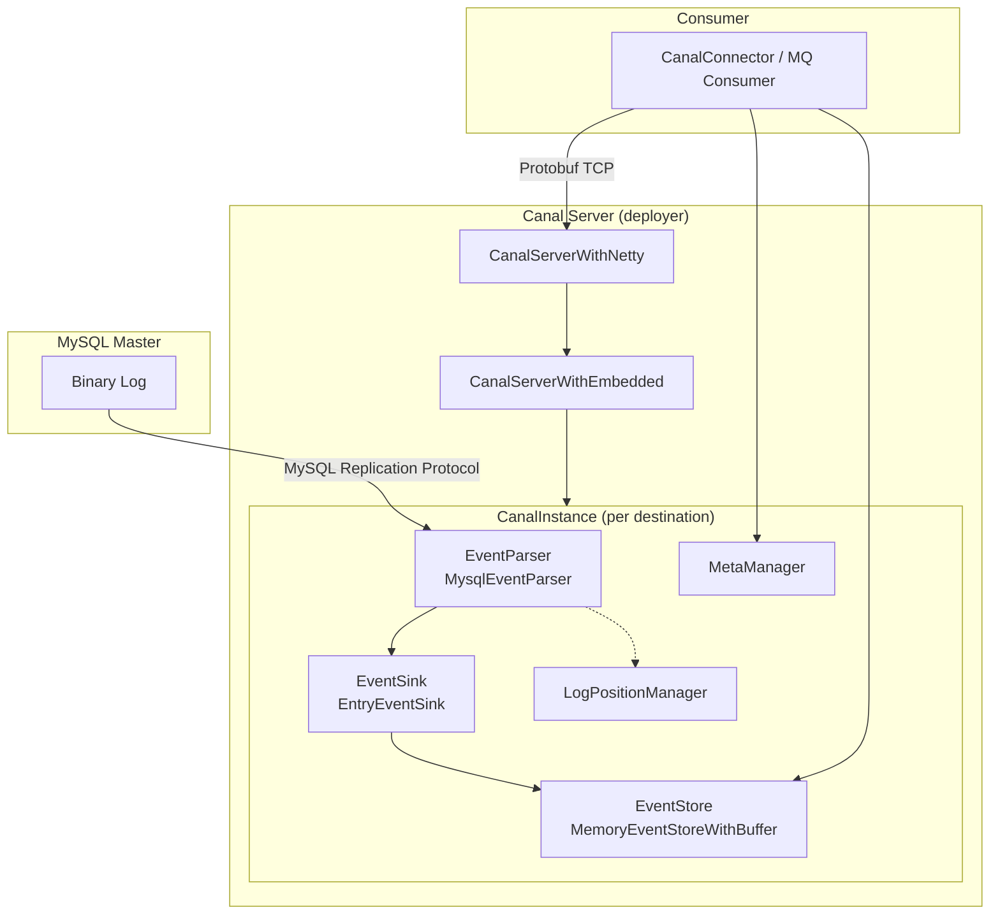

### 3.2 两个“位点”概念（极易混淆）

| 类型 | 接口 | 含义 | 典型实现 |
|------|------|------|----------|
| **解析位点** | `CanalLogPositionManager` | Parser 下次从 MySQL 哪个 binlog 位置继续 dump | `FailbackLogPositionManager`（Memory + Meta 兜底） |
| **消费位点** | `CanalMetaManager` | 各 Client 已 subscribe/ack 到哪里 | `PeriodMixedMetaManager`（内存 + ZK 周期刷盘） |

Parser 在 **事务结束** 时持久化解析位点；Client **ack** 时更新消费游标并释放 Store 环形缓冲区槽位。

### 3.3 Instance 内组件装配

Spring 配置：`deployer/src/main/resources/spring/default-instance.xml`

```xml
CanalInstanceWithSpring
  ├── eventParser  → MysqlEventParser (parent: baseEventParser)
  ├── eventSink    → EntryEventSink → eventStore
  ├── eventStore   → MemoryEventStoreWithBuffer
  └── metaManager  → PeriodMixedMetaManager → ZooKeeperMetaManager
```

---

## 4. 启动与生命周期

### 4.1 Server 启动链

| 步骤 | 类 | 文件 |
|------|-----|------|
| main | `CanalLauncher` | `deployer/.../CanalLauncher.java` |
| 编排 | `CanalStarter` | `deployer/.../CanalStarter.java` |
| 核心 | `CanalController` | `deployer/.../CanalController.java` |

`CanalController` 主要动作：

1. 创建 `CanalServerWithEmbedded`（逻辑服务）与 `CanalServerWithNetty`（网络层，可由 `canal.without.netty` 关闭）；
2. 若配置 `canal.zkServers`，为每个 **destination** 注册 `ServerRunningMonitor`（ZK 选主，保证同一 destination 只有一个活跃 Server）；
3. `embeddedCanalServer.start()` + `canalServer.start()` 绑定端口。

**Instance 懒加载**：`CanalServerWithEmbedded` 使用 `ComputingMap`，首次访问某 destination 时通过 `CanalInstanceGenerator`（Spring/Plain）生成 `CanalInstanceWithSpring`。

### 4.2 Instance 组件启动顺序

`AbstractCanalInstance.start()`（`instance/core/.../AbstractCanalInstance.java`）：

```
metaManager → alarmHandler → eventStore → eventSink → eventParser
```

Parser 启动前会执行 `beforeStartEventParser`：启动 `CanalLogPositionManager`、绑定 `HeartBeatHAController` 与 `MysqlEventParser` 并启动 HA 控制器。

**设计原因**：Store/Sink 必须先就绪，否则 Parser 线程 dump 出的数据无处存放；Meta 需先于 Client 订阅存在。

---

## 5. 核心数据流水线

### 5.1 端到端流程

```
MySQL binlog 字节流
    → DirectLogFetcher.fetch()          // 读 MySQL 协议包
    → LogDecoder.decode()               // 二进制 → LogEvent
    → LogEventConvert.parse()           // LogEvent → CanalEntry.Entry
    → EventTransactionBuffer.add()      // 按事务攒批
    → [flush] EntryEventSink.sink()     // 写入 Store
    → MemoryEventStoreWithBuffer.put()  // 环形缓冲
    → CanalServerWithEmbedded.getWithoutAck()
    → Client ack → metaManager + eventStore.ack()
```

### 5.2 事务边界缓冲：`EventTransactionBuffer`

文件：`parse/.../EventTransactionBuffer.java`

- `TRANSACTIONBEGIN`：先 flush 上一事务，再写入；
- `ROWDATA`：累积行变更；
- `TRANSACTIONEND`：写入后 **flush**，触发 `TransactionFlushCallback`；
- `HEARTBEAT`：立即 flush（表示 master 暂时无新事件，idle）。

`AbstractEventParser` 构造时注册的 callback：

```java
transactionBuffer = new EventTransactionBuffer(transaction -> {
    consumeTheEventAndProfilingIfNecessary(transaction);  // → eventSink.sink()
    logPositionManager.persistLogPosition(destination, position);  // 事务级位点
});
```

**设计亮点**：下游消费以 **事务** 为原子单元，避免半事务被消费；解析位点在事务提交时推进，与 binlog 语义一致。

### 5.3 Sink：`EntryEventSink`

将 `List<Entry>` 包装为 `Event`，调用 `eventStore.tryPut()`；Store 满时自旋等待。支持 `HeartBeatEntryEventHandler` 等扩展。

### 5.4 Store：环形缓冲区

`MemoryEventStoreWithBuffer`（`store/.../MemoryEventStoreWithBuffer.java`）：

- `bufferSize` 必须为 2 的幂（默认 16384）；
- 维护 `putSequence` / `getSequence` / `ackSequence`；
- 支持 `BatchMode.ITEMSIZE` 与 `MEMSIZE` 两种批量获取模式；
- `ddlIsolation`：DDL 单独成批，避免与 DML 混批。

### 5.5 并行解析管线（1.1.x 性能核心）

`MysqlMultiStageCoprocessor` 注释（`parse/.../MysqlMultiStageCoprocessor.java`）：

```
1. 网络接收 (单线程)     — dump 循环读 socket
2. 事件基本解析 (单线程)  — 类型、TableMeta、位点
3. 事件深度解析 (多线程)  — DML 行数据完整解析
4. 投递 store (单线程)   — transactionBuffer → sink
```

基于 **LMAX Disruptor** `RingBuffer` 串联各 Stage，将最耗 CPU 的 DML 反序列化并行化，网络 IO 与解析解耦。

配置项（`default-instance.xml`）：

- `canal.instance.parser.parallel`（默认 true）
- `canal.instance.parser.parallelThreadSize`
- `canal.instance.parser.parallelBufferSize`（默认 256，须为 2 的幂）

---

## 6. Binlog 监听底层原理（重点）

本章从 **TCP 连接** 到 **事件回调** 按调用栈展开，这是 Canal 最核心的技术路径。

### 6.1 与 MySQL 复制的关系

MySQL 原生复制流程：

1. Slave IO 线程连接 Master，注册 slave，`COM_BINLOG_DUMP` 指定 binlog 文件与 position；
2. Master 将 binlog 事件封装为 **MySQL 协议包**（4 字节头 + payload）连续发送；
3. Slave 解析 binlog event，写入 relay log，SQL 线程重放。

Canal **只实现 IO 线程侧的逻辑**（拉取 + 解析），不重放 SQL；解析结果进入内存 Store 而非 relay log。

### 6.2 第一层：MySQL 协议连接 `MysqlConnector`

文件：`driver/.../MysqlConnector.java`

**connect() 流程**：

```java
channel = SocketChannelPool.open(address);
negotiate(channel);  // 握手 → 可选 SSL → 认证
```

**negotiate()** 遵循 MySQL Connection Phase：

1. 读 `HandshakeInitializationPacket`（协议版本、serverId、认证插件、capabilities）；
2. 发 `ClientAuthenticationPacket`（用户名、密码 scramble，支持 `caching_sha2_password` 等）；
3. 可能多轮 `AuthSwitchRequest`；
4. 记录 `connectionId`、`serverVersion`。

**dump 断开特殊处理**：`disconnect()` 时若 `dumping==true`，会 `fork()` 新连接执行 `KILL CONNECTION {connectionId}`，避免 Master 侧悬挂的 dump 连接占用 `slaveId`。

**fork()**：复制连接参数创建新 connector，用于：

- 心跳检测 SQL（与 dump 连接分离）；
- `metaConnection` 查询表结构；
- 杀 dump 连接。

### 6.3 第二层：复制会话 `MysqlConnection`

文件：`parse/.../MysqlConnection.java`，实现 `ErosaConnection`。

#### 6.3.1 标准 dump 入口 `dump(file, position, sink)`

```java
updateSettings();        // 会话变量
loadBinlogChecksum();  // CRC32 or OFF
loadVersionComment();  // Percona/MariaDB 兼容
sendRegisterSlave();   // COM_REGISTER_SLAVE (0x15)
sendBinlogDump(...);   // COM_BINLOG_DUMP (0x12)
DirectLogFetcher fetcher = new DirectLogFetcher(bufferSize);
fetcher.start(connector.getChannel());
LogDecoder decoder = new LogDecoder(UNKNOWN_EVENT, ENUM_END_EVENT);
while (fetcher.fetch()) {
    LogEvent event = decoder.decode(fetcher, context);
    func.sink(event);
    if (event.getSemival() == 1) sendSemiAck(...);  // 半同步复制
}
```

**seek()** 变体：为加速位点查找，只 decode `ROTATE/FORMAT_DESCRIPTION/QUERY/XID` 等少量事件类型。

#### 6.3.2 会话准备 `updateSettings()`

向 Master 发送一系列 `SET`（失败多数只 warn，不中断）：

| SQL | 目的 |
|-----|------|
| `set wait_timeout=9999999` | 防连接被服务端断开 |
| `set net_read/write_timeout=7200` | 大事务/慢网络 |
| `set names 'binary'` | 结果集不做字符集转换，按二进制解析 |
| `set @master_binlog_checksum=@@global.binlog_checksum` | 与 Master checksum 对齐，避免 Rotate 乱码 |
| `set @slave_uuid=uuid()` | MySQL 5.6+ 防止重复 slave 被 kill |
| `SET @master_heartbeat_period={nano}` | 请求 Master 定期发 **Heartbeat binlog event**（空闲时） |

Heartbeat 周期常量：`DirectLogFetcher.MASTER_HEARTBEAT_PERIOD_SECONDS = 15`，读超时 `READ_TIMEOUT = (15+10)*1000` ms，保证大于心跳间隔。

#### 6.3.3 `COM_REGISTER_SLAVE` 包结构

类：`RegisterSlaveCommandPacket`（command = **0x15**）

字段：`serverId`、`reportHost`、`reportUser`、`reportPasswd`、`reportPort` 等，按 MySQL Internals 小端编码。

Canal 将 **本地 socket 的 host:port** 填入 report 字段，使 Master 的 `SHOW SLAVE HOSTS` 可识别该“伪 Slave”。

#### 6.3.4 `COM_BINLOG_DUMP` 包结构

类：`BinlogDumpCommandPacket`（command = **0x12**）

`toBytes()` 布局（与 MySQL 文档一致）：

```
1  byte   command (0x12)
4  bytes  binlog position (little endian)
2  bytes  flags — 设置 BINLOG_SEND_ANNOTATE_ROWS_EVENT
4  bytes  slave server id
n  bytes  binlog filename (可选，空则从当前位点)
```

发送后 `connector.setDumping(true)`，标记进入流式 binlog 模式。

**slaveId** 来源：配置 `canal.instance.mysql.slaveId`，必须在集群内 **唯一**；重复会导致 EOF 或连接被踢（`DirectLogFetcher` 对 mark=254 的 warn）。

#### 6.3.5 GTID 模式

**MySQL**：`BinlogDumpGTIDCommandPacket` → `COM_BINLOG_DUMP_GTID`，携带 `GTIDSet`。

**MariaDB**：先 `SET @slave_connect_state='...'`，再 `sendRegisterSlave` + `sendBinlogDump("", 0)`。

`LogContext.setGtidSet(gtidSet)` 供 decoder 维护 GTID 状态；支持 `processIterateDecode` 处理压缩事务 payload。

### 6.4 第三层：从 Socket 读 replication 流 `DirectLogFetcher`

文件：`parse/.../mysql/dbsync/DirectLogFetcher.java`（继承 `dbsync` 的 `LogFetcher`）

#### 6.4.1 MySQL 协议包在 dump 阶段的形态

dump 建立后，Master 发送的每个 **MySQL Packet**：

```
3 bytes  payload length (little endian)
1 byte   sequence id
n bytes  payload
```

对 **正常 binlog 数据包**，payload 第一个字节 `mark = 0`，后续为 **原始 binlog event 字节**（可能多个 event 拼在一个 packet，或一个 event 拆成多个 16MB 大包）。

#### 6.4.2 `fetch()` 核心逻辑

```java
fetch0(0, 4);                           // 读 4 字节头
netlen = getUint24(0); netnum = getUint8(3);
fetch0(4, netlen);                      // 读 body
mark = getUint8(4);
if (mark == 255) → ErrorPacket (含 binlog purged 检测 → ServerLogPurgedException)
if (mark == 254) → EOF，Master 断开
while (netlen == MAX_PACKET_LENGTH)     // 16MB-1 分包拼接
    继续读下一个 packet 追加到 buffer
origin = NET_HEADER_SIZE + 1;           // 跳过 mark，指向 binlog event 起始
position = origin;
limit -= origin;
```

**半同步**（`db.semi=1`）：payload 前 3 字节为 semi 标记，`origin` 再后移 2 字节；`semival==1` 时 `MysqlConnection` 发 `SemiAck`。

#### 6.4.3 IO 模型

`channel.read(buffer, off, len, READ_TIMEOUT_MILLISECONDS)` — **阻塞 NIO** 读满指定长度；超时抛 `SocketTimeoutException` 并 close。

**设计取舍**：dump 是长连接单消费者，阻塞读简化协议处理；并行模式下仅 **stage1 单线程** 读 socket，避免多线程抢 channel。

### 6.5 第四层：二进制事件解码 `LogDecoder`

文件：`dbsync/.../LogDecoder.java`

```java
LogHeader header = new LogHeader(buffer, context.getFormatDescription());
int len = header.getEventLen();
if (handleSet.get(header.getType()))
    event = decode(buffer, header, context);  // 按类型分发
else
    event = new UnknownLogEvent(header);
buffer.consume(len);
```

- 首次遇到 `FORMAT_DESCRIPTION_EVENT` 会更新 `LogContext.formatDescription`（含 checksum 算法）；
- `ROTATE_EVENT` 切换 `logFileName`；
- `TABLE_MAP_EVENT` 必须在 ROWS 事件之前出现，供行解析查表结构；
- MySQL 8.0+ 支持 `TRANSACTION_PAYLOAD_EVENT` + zstd 压缩，通过 `processIterateDecode` 解压后再迭代 decode。

### 6.6 第五层：Parser 主循环 `AbstractEventParser`

`start()` 创建 **单线程** `parseThread`，核心循环（简化）：

```
while (running) {
    erosaConnection = buildErosaConnection();
    startHeartBeat();
    preDump();
    connect();
    position = findStartPosition();   // 可能很耗时（时间戳/GTID/文件）
    processTableMeta(position);
    reconnect();                        // 清状态后正式 dump
    if (parallel)
        erosaConnection.dump(..., multiStageCoprocessor);
    else
        erosaConnection.dump(..., sinkHandler);
    // 异常：sleep 10-20s 重试，reset transactionBuffer/binlogParser
}
```

`sinkHandler` 对每条 `LogEvent` 调用 `parseAndProfilingIfNecessary` → `transactionBuffer.add(entry)`。

### 6.7 位点查找 `findStartPosition`（启动 dump 前）

`MysqlEventParser.findStartPositionInternal()` 优先级大致为：

1. `logPositionManager.getLatestIndexBy(destination)` — 上次持久化的解析位点；
2. 配置 `masterPosition` / `standbyPosition`；
3. 按 **时间戳** 在 binlog 中 seek（`MysqlConnection.seek`）；
4. HA 切换、serverId 变化时的 **fallback 时间回退**（`fallbackIntervalInSeconds`）；
5. binlog 被 purge：`ServerLogPurgedException` → 时间戳兜底或 `autoResetLatestPosMode`。

### 6.8 完整时序图（文件 + 位点模式）

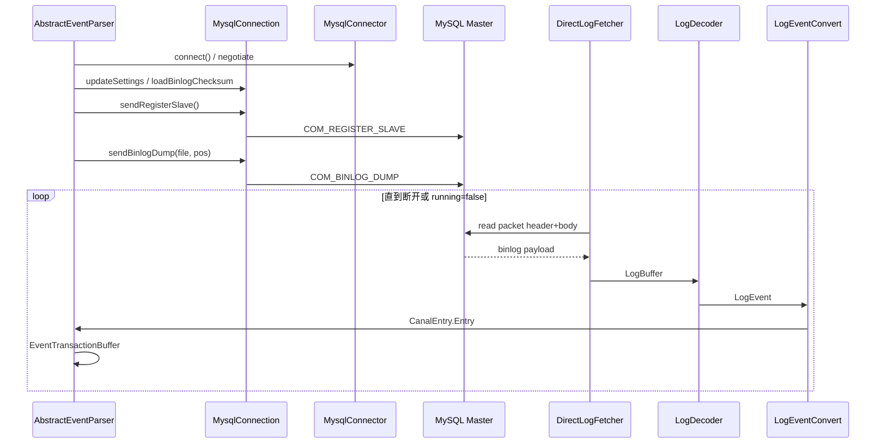

### 6.9 本地文件模式（补充）

除在线 dump 外，还有：

- `LocalBinLogConnection` + `LocalBinlogEventParser`：读取本地 binlog 文件目录（RDS OSS 离线场景）；
- `RdsBinlogEventParserProxy`：通过阿里云 API 拉取 binlog。

在线原理相同，只是 `LogFetcher` 从文件而非 socket 读取。

---

## 7. Binlog 二进制解析（dbsync）

模块 `dbsync` 源自淘宝 TDDL 的 binlog 解析库，被 Canal 直接依赖。

### 7.1 核心类型

| 类 | 作用 |
|----|------|
| `LogFetcher` / `DirectLogFetcher` | 累积字节缓冲，提供 `fetch()` |
| `LogBuffer` | 可 `consume`、`duplicate` 的读缓冲区 |
| `LogContext` | 当前文件、位点、GTID、FormatDescription、TableMap 缓存 |
| `LogHeader` | event header（timestamp、type、serverId、eventLen、logPos） |
| `LogEvent` | 各事件类型常量与基类 |
| `*LogEvent` | `QueryLogEvent`、`WriteRowsLogEvent`、`RotateLogEvent`、`GtidLogEvent` 等 |

### 7.2 常见事件类型（节选）

定义于 `LogEvent.java`：

| 常量 | 值 | 含义 |
|------|-----|------|
| `QUERY_EVENT` | 2 | DDL、BEGIN 等文本 SQL |
| `ROTATE_EVENT` | 4 | 切换到新 binlog 文件 |
| `TABLE_MAP_EVENT` | 19 | 表结构映射（ROW 模式必需） |
| `WRITE_ROWS_EVENT` | 30 | 插入行图像 |
| `UPDATE_ROWS_EVENT` | 31 | 更新前后图像 |
| `DELETE_ROWS_EVENT` | 32 | 删除行图像 |
| `XID_EVENT` | 16 | InnoDB 事务提交 |
| `GTID_LOG_EVENT` | - | GTID 事务边界 |

### 7.3 Checksum

MySQL 5.6+ 可在 binlog 尾追加 CRC32。Canal 通过 `loadBinlogChecksum()` 与 `set @master_binlog_checksum` 对齐；`FormatDescriptionLogEvent` 携带算法，decoder 在读取 event body 时校验/剥离。

---

## 8. 业务语义转换（LogEventConvert）

文件：`parse/.../LogEventConvert.java`

`parse(LogEvent)` 按 `eventType` switch：

| Binlog 事件 | Canal Entry |
|-------------|-------------|
| `QUERY_EVENT` | DDL / BEGIN（事务开始） |
| `XID_EVENT` | TRANSACTIONEND |
| `WRITE/UPDATE/DELETE_ROWS_*` | ROWDATA（含 before/after 列） |
| `TABLE_MAP_EVENT` | 更新 `TableMetaCache`，不一定产出 Entry |
| GTID 相关 | 维护 gtid 元数据 |

依赖 **TableMetaTSDB**（`enableTsdb`）或内存 `TableMetaCache` 解析列类型、变长字段、JSON 等。

过滤在解析阶段完成：`AviaterRegexFilter` 对 schema.table 匹配；支持 field 级黑白名单。

---

## 9. 位点与 Meta 双轨管理

### 9.1 解析位点 `CanalLogPositionManager`

默认（`default-instance.xml`）：

```xml
FailbackLogPositionManager(
  MemoryLogPositionManager,           <!-- 主：快，重启丢失 -->
  MetaLogPositionManager(metaManager) <!-- 备：取客户端最小未消费位点 -->
)
```

**写入时机**：`EventTransactionBuffer` 在 `TRANSACTIONEND` flush 后。

**读取时机**：`MysqlEventParser.findStartPositionInternal()` 启动 dump 前。

### 9.2 消费 Meta `CanalMetaManager`

- `subscribe(clientIdentity, filter)`：注册过滤规则；
- `addBatch` / `removeBatch`：getWithoutAck 时创建 batch，ack 时删除；
- `updateCursor`：ack 后推进消费位点。

`CanalServerWithEmbedded.getWithoutAck()`：

1. 从 `eventStore.tryGet` 取事件；
2. `metaManager.addBatch` 记录 `[startPosition, endPosition]`；
3. Client `ack(batchId)` → `eventStore.ack` 释放 ring buffer。

---

## 10. 高可用与容错设计

### 10.1 Server 级 HA（Canal 集群）

`ServerRunningMonitor`（`common/.../ServerRunningMonitor.java`）：

- ZK **临时节点** `/otter/canal/destinations/{destination}/running`；
- 创建成功者 `processActiveEnter` → `embeddedCanalServer.start(destination)`；
- 节点丢失后延迟重试选主。

无 ZK 时单机直接 `processActiveEnter`。

### 10.2 MySQL 主备 HA（Parser 级）

`HeartBeatHAController` + `MysqlDetectingTimeTask`：

- 定时执行 `detectingSQL`；
- 连续失败超过 `detectingRetryTimes` → `MysqlEventParser.doSwitch()` 交换 `masterInfo`/`standbyInfo`，`stop()` 后 `start()` 重连新库。

### 10.3 Dump 异常恢复

| 异常 | 处理 |
|------|------|
| 网络中断 | parseThread catch，sleep 10-20s，`reconnect` 重试 |
| binlog purge | `ServerLogPurgedException`，按时间戳或最新位点重置 |
| `TableIdNotFoundException` | 可能起始位点在事务中间，设置 `needTransactionPosition` 重找 |
| duplicate slaveId | EOF packet，检查实例 slaveId 配置 |

### 10.4 心跳与空闲检测

- **Binlog Heartbeat Event**：Master 在无变更时按 `@master_heartbeat_period` 发送，Canal flush 心跳 Entry，用于延迟监控；
- **SQL 心跳**：独立连接执行 `detectingSQL`，用于 HA 与存活性，不干扰 dump 连接。

---

## 11. 技术亮点与设计亮点

### 11.1 技术亮点

1. **协议级 Slave 仿真**：非 JDBC 轮询，无侵入，延迟接近原生复制 IO 线程。
2. **自研二进制解码栈（dbsync）**：零拷贝倾向的 `LogBuffer`、按类型 BitSet 过滤 decode，seek 模式极速扫 binlog。
3. **多阶段 Disruptor 并行解析**：网络、轻量解析、重量 DML 解析、store 投递流水线，显著提升吞吐（官方称 1.1.x 约 150% 提升）。
4. **事务缓冲与位点绑定**：`EventTransactionBuffer` 保证事务原子投递，解析位点仅在事务结束推进。
5. **GTID / MariaDB / Percona / MySQL 8.4+ 兼容**：独立分支处理认证、GTID dump、checksum、压缩事务。
6. **半同步复制 ACK**：可选 `db.semi=1` + `SemiAck`，适配半同步主库环境。
7. **双轨位点 + Failback**：重启后优先内存位点，否则回退到客户端最小 cursor，减少重复消费窗口。
8. **环形 Store + batch ack**：背压控制（Store 满则 Parser 侧 sink 阻塞），多客户端独立 cursor。
9. **可插拔投递**：TCP Protobuf、Kafka/RocketMQ Connector、client-adapter 异构同步。
10. **TableMeta TSDB**：DDL 历史版本化，解决 binlog 行事件只有 table_id 的问题。

### 11.2 设计亮点（架构层面）

1. **ErosaConnection 抽象**：`MysqlConnection` / `LocalBinLogConnection` 统一 `dump`/`seek` 接口，Parser 与数据源解耦。
2. **Instance = 独立管道**：每个 destination 一组 parser/store/meta，多租户隔离。
3. **Embedded + Netty 分离**：核心逻辑可嵌入式测试，Netty 仅作协议适配。
4. **Client-Server + Protobuf**：多语言客户端只需实现协议，不必理解 binlog。
5. **过滤双阶段**：Parser 端表过滤 + 支持 Sink 端路由扩展（为多下游预留）。
6. **fork 连接模型**：dump、心跳、元数据、KILL 互不阻塞，避免长事务占用心跳连接。
7. **配置驱动 Spring 组装**：`default-instance.xml` 可替换 Memory/ZK/File 等实现，运维友好。

---

## 12. 关键类索引

| 领域 | 类 | 路径 |
|------|-----|------|
| 启动 | `CanalLauncher`, `CanalController` | `deployer/...` |
| 实例 | `AbstractCanalInstance`, `CanalInstanceWithSpring` | `instance/...` |
| 服务 | `CanalServerWithEmbedded`, `CanalServerWithNetty` | `server/...` |
| 协议连接 | `MysqlConnector` | `driver/.../MysqlConnector.java` |
| Binlog 连接 | `MysqlConnection` | `parse/.../MysqlConnection.java` |
| 读包 | `DirectLogFetcher` | `parse/.../dbsync/DirectLogFetcher.java` |
| 解码 | `LogDecoder` | `dbsync/.../LogDecoder.java` |
| 转换 | `LogEventConvert` | `parse/.../LogEventConvert.java` |
| 主循环 | `AbstractEventParser`, `MysqlEventParser` | `parse/.../inbound/` |
| 并行 | `MysqlMultiStageCoprocessor` | `parse/.../MysqlMultiStageCoprocessor.java` |
| 事务缓冲 | `EventTransactionBuffer` | `parse/.../EventTransactionBuffer.java` |
| 存储 | `MemoryEventStoreWithBuffer` | `store/.../` |
| 投递 | `EntryEventSink` | `sink/.../` |
| Dump 命令 | `BinlogDumpCommandPacket` | `driver/.../BinlogDumpCommandPacket.java` |
| 注册 Slave | `RegisterSlaveCommandPacket` | `driver/.../RegisterSlaveCommandPacket.java` |
| Server HA | `ServerRunningMonitor` | `common/.../ServerRunningMonitor.java` |
| DB HA | `HeartBeatHAController` | `parse/.../ha/HeartBeatHAController.java` |
| 配置 | `default-instance.xml` | `deployer/src/main/resources/spring/` |
| Adapter 启动 | `CanalAdapterService`, `CanalAdapterLoader`, `AdapterProcessor` | `client-adapter/launcher/...` |
| Adapter SPI | `ExtensionLoader`, `OuterAdapter`, `ProxyOuterAdapter` | `client-adapter/common/...` |
| TCP 消费端 | `CanalTCPConsumer` | `connector/tcp-connector/...` |
| Java Client | `SimpleCanalConnector`, `ClusterCanalConnector` | `client/...` |
| Client HA | `ClientRunningMonitor` | `client/.../running/` |
| Admin 管控 | `CanalAdminController`, `CanalInstanceServiceImpl` | `deployer/.../admin/`, `admin/admin-web/...` |
| 配置轮询 | `PlainCanalConfigClient`, `PollingConfigServiceImpl` | `instance/manager/...`, `admin/...` |
| Prometheus | `PrometheusService`, `CanalInstanceExports`, `StoreCollector` | `prometheus/...` |
| 位点查找 | `MysqlEventParser.findStartPositionInternal` | `parse/.../MysqlEventParser.java` |
| Meta ZK | `ZooKeeperMetaManager` | `meta/...` |
| Parser 位点兜底 | `MetaLogPositionManager` | `parse/.../index/` |
| TSDB | `DatabaseTableMeta`, `TableMetaTSDBFactory` | `parse/.../tsdb/` |
| Instance 生成 | `SpringCanalInstanceGenerator`, `PlainCanalInstanceGenerator` | `instance/spring/...`, `instance/manager/...` |
| 配置热加载 | `SpringInstanceConfigMonitor`, `ManagerInstanceConfigMonitor` | `deployer/.../monitor/` |
| Admin Netty | `CanalAdminWithNetty`, admin `SessionHandler` | `server/.../admin/` |
| MQ Producer | `CanalKafkaProducer`, `CanalRocketMQProducer` | `connector/kafka-connector/...`, `rocketmq-connector/...` |
| 多流 / RDS | `GroupEventParser`, `RdsBinlogEventParserProxy` | `parse/.../group/`, `parse/.../rds/` |
| Client 反序列化 | `CanalMessageDeserializer` | `client/.../CanalMessageDeserializer.java` |
| Adapter HBase | `HbaseAdapter`, `HbaseSyncService` | `client-adapter/hbase/...` |
| 协议定义 | `CanalProtocol.proto`, `AdminProtocol.proto` | `protocol/...` |
| 帧解码 | `FixedHeaderFrameDecoder`, `NettyUtils` | `server/.../netty/` |
| MQ 消费 SPI | `CanalMsgConsumer`, `CanalKafkaConsumer`, `CanalTCPConsumer` | `connector/*/consumer/` |
| MQ 序列化 | `CanalMessageSerializerUtil` | `connector/core/.../util/` |
| 认证 | `SecurityUtil.scramble411` | `protocol/.../SecurityUtil.java` |
| 扁平消息 | `FlatMessage`, `CommonMessage`, `MQMessageUtils` | `protocol/...`, `connector/core/...` |
| 实例核心 | `AbstractCanalInstance`, `CanalInstanceWithSpring` | `instance/core/...`, `instance/spring/...` |
| 连接工厂 | `CanalConnectors` | `client/.../CanalConnectors.java` |
| Spring 装配 | `default-instance.xml`, `base-instance.xml` | `deployer/src/main/resources/spring/` |
| 事务缓冲 | `EventTransactionBuffer` | `parse/.../EventTransactionBuffer.java` |
| MQ 运行 | `CanalMQStarter`, `CanalStarter` | `server/...`, `deployer/...` |
| RDB 落地 | `RdbAdapter`, `RdbSyncService`, `BatchExecutor` | `client-adapter/rdb/...` |
| ES 落地 | `ESAdapter`, `ESSyncService` | `client-adapter/escore/...` |
| 行转换 | `LogEventConvert` | `parse/.../dbsync/LogEventConvert.java` |
| 表过滤 | `AviaterRegexFilter`, `RegexFunction` | `filter/.../aviater/` |
| 镜像库 | `RdbMirrorDbSyncService` | `client-adapter/rdb/...` |
| 示例 | `example` 模块各 Test/Example | `example/src/main/java/...` |
| 进程入口 | `CanalLauncher` | `deployer/.../CanalLauncher.java` |

---

## 13. client-adapter 源码剖析

> 独立落地进程：Spring Boot 启动器 + SPI 适配器 fat jar，从 Canal Server / MQ 拉取变更并写入异构存储。

### 13.1 架构：启动器 vs 适配器

| 组件 | 模块 | 职责 |
|------|------|------|
| 启动器 | `client-adapter/launcher` | `CanalAdapterService` 启动、`AdapterProcessor` 消费循环、REST |
| 公共 | `client-adapter/common` | `OuterAdapter`、`Dml`、`ExtensionLoader` |
| 适配器 | `rdb`/`escore`/`hbase`/… | `@SPI("rdb")` 等，jar 放 `plugin/` |

### 13.2 启动链

`CanalAdapterService` 在 Spring `@PostConstruct` 中：

```50:61:client-adapter/launcher/src/main/java/com/alibaba/otter/canal/adapter/launcher/loader/CanalAdapterService.java
    @PostConstruct
    public synchronized void init() {
        if (running) {
            return;
        }
        try {
            syncSwitch.refresh();
            adapterLoader = new CanalAdapterLoader(adapterCanalConfig);
            adapterLoader.init();
            running = true;
```

`CanalAdapterLoader.init()` 对每个 `canalAdapters[].instance` × `groups[]`：

1. `ExtensionLoader.getExtension(name, key)` 加载 `OuterAdapter`（`ProxyOuterAdapter` 切换 ClassLoader）。
2. **校验**：`canalOuterAdapters.size() == outerAdapters 配置数`，否则抛异常，防止只消费不写入。
3. `new AdapterProcessor(...).start()` 启动消费线程。

```76:87:client-adapter/launcher/src/main/java/com/alibaba/otter/canal/adapter/launcher/loader/CanalAdapterLoader.java
                if(CollectionUtils.isEmpty(canalOuterAdapters) || canalOuterAdapters.size() != group.getOuterAdapters().size() ){
                    String msg = String.format("instance=%s,groupId=%s Load OuterAdapters is Empty，pls check rdb.yml",
                                canalAdapter.getInstance(),group.getGroupId());
                        throw new RuntimeException(msg);
                 }
                AdapterProcessor adapterProcessor = canalAdapterProcessors.computeIfAbsent(
                    canalAdapter.getInstance() + "|" + StringUtils.trimToEmpty(group.getGroupId()),
                    f -> new AdapterProcessor(canalClientConfig,
                        canalAdapter.getInstance(),
                        group.getGroupId(),
                        canalOuterAdapterGroups));
                adapterProcessor.start();
```

### 13.3 SPI：从 `plugin/` 加载 fat jar

适配器 **不** 从 classpath 加载，只扫描 `lib/plugin/*.jar`：

```265:306:client-adapter/common/src/main/java/com/alibaba/otter/canal/client/adapter/support/ExtensionLoader.java
        String dir = File.separator + this.getJarDirectoryPath() + File.separator + "plugin";
        // ...
                    localClassLoader = new URLClassExtensionLoader(new URL[] { url });
                    loadFile(extensionClasses, CANAL_DIRECTORY, localClassLoader);
```

`META-INF/canal/com.alibaba.otter.canal.client.adapter.OuterAdapter` 示例：`rdb=com.alibaba.otter.canal.client.adapter.rdb.RdbAdapter`。

`getExtension("rdb", "oracle1")` 缓存键 `rdb-oracle1`，同一类可 **多实例** 对应多套 JDBC。

### 13.4 AdapterProcessor 消费循环

构造时加载 **connector** 模块的 `CanalMsgConsumer`（与 adapter 的 ExtensionLoader 不同）：

```66:79:client-adapter/launcher/src/main/java/com/alibaba/otter/canal/adapter/launcher/loader/AdapterProcessor.java
        ExtensionLoader<CanalMsgConsumer> loader = new ExtensionLoader<>(CanalMsgConsumer.class);
        String key = destination + "_" + groupId;
        canalMsgConsumer = new ProxyCanalMsgConsumer(loader.getExtension(canalClientConfig.getMode().toLowerCase(),
            key,
            CONNECTOR_SPI_DIR,
            CONNECTOR_STANDBY_SPI_DIR));
        canalMsgConsumer.init(properties, canalDestination, groupId);
```

主循环（节选）：

```184:213:client-adapter/launcher/src/main/java/com/alibaba/otter/canal/adapter/launcher/loader/AdapterProcessor.java
        while (running) {
            try {
                syncSwitch.get(canalDestination);
                canalMsgConsumer.connect();
                out: while (running) {
                    syncSwitch.get(canalDestination, 1L, TimeUnit.MINUTES);
                    for (int i = 0; i < retry; i++) {
                        try {
                            List<CommonMessage> commonMessages = canalMsgConsumer
                                .getMessage(this.canalClientConfig.getTimeout(), TimeUnit.MILLISECONDS);
                            writeOut(commonMessages);
                            canalMsgConsumer.ack();
                            break;
                        } catch (Exception e) {
                            // 失败 rollback；重试耗尽可 syncSwitch.off(destination)
```

`writeOut`：`MessageUtil.flatMessage2Dml` → 组间并行、组内 **串行** `adapter.sync`；成功才 `ack`。

### 13.5 TCP 消费：`CanalTCPConsumer`

```62:98:connector/tcp-connector/src/main/java/com/alibaba/otter/canal/connector/tcp/consumer/CanalTCPConsumer.java
    public void connect() {
        canalConnector.connect();
        canalConnector.subscribe();
    }

    public List<CommonMessage> getMessage(Long timeout, TimeUnit unit) {
        Message message = canalConnector.getWithoutAck(batchSize, timeout, unit);
        currentBatchId = message.getId();
        if (batchId == -1 || size == 0) {
            return null;
        } else {
            return MessageUtil.convert(message);
        }
    }

    public void disconnect() {
        // 避免 unsubscribe 导致 server 清 cursor
        canalConnector.disconnect();
    }
```

### 13.6 RDB 落地（示例）

`RdbAdapter.init` → `ConfigLoader.load("rdb")` 读 `conf/rdb/*.yml`，`match(outerAdapterKey)` 过滤配置。

`RdbSyncService.sync`：按 `destination[_groupId]_db-table` 查映射；`concurrent=true` 时 `pkHash` 分区到多 `BatchExecutor` 线程提交 JDBC batch。

```154:184:client-adapter/rdb/src/main/java/com/alibaba/otter/canal/client/adapter/rdb/service/RdbSyncService.java
    public void sync(Map<String, Map<String, MappingConfig>> mappingConfig, List<Dml> dmls, Properties envProperties) {
        sync(dmls, dml -> {
            if (dml.getIsDdl() != null && dml.getIsDdl()) {
                columnsTypeCache.remove(...);
                return false;
            }
            configMap = mappingConfig.get(destination + "_" + database + "-" + table);
            for (MappingConfig config : configMap.values()) {
                appendDmlPartition(config, dml);
            }
            return true;
        });
    }
```

### 13.7 ES 落地（与 RDB 差异）

```76:87:client-adapter/escore/src/main/java/com/alibaba/otter/canal/client/adapter/es/core/ESAdapter.java
    public void sync(List<Dml> dmls) {
        for (Dml dml : dmls) {
            if (!dml.getIsDdl()) {
                sync(dml);
            }
        }
        esSyncService.commit();
    }
```

跳过 DDL；多表 JOIN 场景在 `ESSyncService.insert` 中按主表/从表回查源库 SQL 组文档后批量写 ES。

### 13.8 SyncSwitch 与 REST

`SyncSwitch.off(destination)` 使 `BooleanMutex` 为 false，`AdapterProcessor` 在 `get()` 阻塞暂停同步；ZK 模式写 `/sync-switch/{destination}`。

`CommonRest` ETL：`syncSwitch.off` → `adapter.etl()` → `on`，并用 ZK 锁防并发。

---

## 14. Deployer 与 CanalController

入口：`deployer/.../CanalLauncher.main()` → `CanalStarter` → `CanalController`。

### 14.1 构造阶段：组装 Server 与 Instance 生成器

```108:116:deployer/src/main/java/com/alibaba/otter/canal/deployer/CanalController.java
        embeddedCanalServer = CanalServerWithEmbedded.instance();
        embeddedCanalServer.setCanalInstanceGenerator(instanceGenerator);
        int metricsPort = Integer.valueOf(getProperty(properties, CanalConstants.CANAL_METRICS_PULL_PORT, "11112"));
        embeddedCanalServer.setMetricsPort(metricsPort);
```

- `instanceGenerator`：按 `canal.instance.global.mode` 选 `SpringCanalInstanceGenerator` 或 `PlainCanalInstanceGenerator`（Manager 远程配置）。
- `embeddedCanalServer`：真正持有 `CanalInstance` 与 `getWithoutAck/ack` 逻辑。
- `canalServer`（Netty）：对外 Protobuf，内部委托 `embeddedCanalServer`。

### 14.2 ZK 选主：按 destination 启停 Instance

```156:184:deployer/src/main/java/com/alibaba/otter/canal/deployer/CanalController.java
        ServerRunningMonitors.setRunningMonitors(MigrateMap.makeComputingMap((Function<String, ServerRunningMonitor>) destination -> {
            ServerRunningMonitor runningMonitor = new ServerRunningMonitor(serverData);
            runningMonitor.setDestination(destination);
            runningMonitor.setListener(new ServerRunningListener() {

                public void processActiveEnter() {
                    embeddedCanalServer.start(destination);
                    if (canalMQStarter != null) {
                        canalMQStarter.startDestination(destination);
                    }
                }

                public void processActiveExit() {
                    if (canalMQStarter != null) {
                        canalMQStarter.stopDestination(destination);
                    }
                    embeddedCanalServer.stop(destination);
                }
```

**解读**：集群下每个 `destination` 只有一个 Canal 节点跑 Parser；抢到 ZK 临时节点才 `start(destination)`，丢失则 `stop` 并停 MQ 投递线程。

### 14.3 Instance 懒加载

`CanalServerWithEmbedded` 用 `ComputingMap`：首次访问某 destination 时 `instanceGenerator.generate(destination)` 加载 Spring XML（`default-instance.xml`）得到 `CanalInstanceWithSpring`。

---

## 15. Server 消费 API 与 Netty

### 15.1 getWithoutAck：Meta + Store 协同（同步块）

```318:367:server/src/main/java/com/alibaba/otter/canal/server/embedded/CanalServerWithEmbedded.java
    public Message getWithoutAck(ClientIdentity clientIdentity, int batchSize, Long timeout, TimeUnit unit)
                                                                                                           throws CanalServerException {
        CanalInstance canalInstance = canalInstances.get(clientIdentity.getDestination());
        synchronized (canalInstance) {
            PositionRange<LogPosition> positionRanges = canalInstance.getMetaManager().getLastestBatch(clientIdentity);

            Events<Event> events = null;
            if (positionRanges != null) { // 存在未 ack 的 batch，从上次 end 继续拉
                events = getEvents(canalInstance.getEventStore(), positionRanges.getStart(), batchSize, timeout, unit);
            } else {
                Position start = canalInstance.getMetaManager().getCursor(clientIdentity);
                if (start == null) {
                    start = canalInstance.getEventStore().getFirstPosition();
                }
                events = getEvents(canalInstance.getEventStore(), start, batchSize, timeout, unit);
            }

            if (CollectionUtils.isEmpty(events.getEvents())) {
                return new Message(-1, true, new ArrayList());
            } else {
                Long batchId = canalInstance.getMetaManager().addBatch(clientIdentity, events.getPositionRange());
                // raw 模式返回 Event.rawEntry，否则 Entry
                return new Message(batchId, raw, entrys);
            }
        }
    }
```

要点：

- **`synchronized (canalInstance)`**：保证 meta（batch/cursor）与 store 读取顺序一致，避免 batchId 与数据错位。
- **未 ack 的 batch**：`getLastestBatch` 非空则从上次 batch 的 `start` 继续读（支持重复 get 补数据）。
- **batchId = -1**：空包，客户端不应 ack。

### 15.2 ack：更新 cursor 并释放 Store

```396:437:server/src/main/java/com/alibaba/otter/canal/server/embedded/CanalServerWithEmbedded.java
    public void ack(ClientIdentity clientIdentity, long batchId) throws CanalServerException {
        CanalInstance canalInstance = canalInstances.get(clientIdentity.getDestination());
        positionRanges = canalInstance.getMetaManager().removeBatch(clientIdentity, batchId);
        if (positionRanges == null) {
            throw new CanalServerException(String.format("ack error , clientId:%s batchId:%d is not exist", ...));
        }
        if (positionRanges.getAck() != null) {
            canalInstance.getMetaManager().updateCursor(clientIdentity, positionRanges.getAck());
        }
        canalInstance.getEventStore().ack(positionRanges.getEnd(), positionRanges.getEndSeq());
    }
```

`eventStore.ack` 推进 `ackSequence`，环形缓冲区槽位可被 Parser 覆盖（背压释放）。

### 15.3 Netty：`SessionHandler` 协议分发

```47:62:server/src/main/java/com/alibaba/otter/canal/server/netty/handler/SessionHandler.java
            switch (packet.getType()) {
                case SUBSCRIPTION:
                    Sub sub = Sub.parseFrom(packet.getBody());
                    ClientIdentity clientIdentity = new ClientIdentity(sub.getDestination(), Short.parseShort(sub.getClientId()), sub.getFilter());
                    if (!embeddedServer.isStart(clientIdentity.getDestination())) {
                        ServerRunningMonitor runningMonitor = ServerRunningMonitors.getRunningMonitor(clientIdentity.getDestination());
                        if (!runningMonitor.isStart()) {
                            runningMonitor.start();
                        }
                    }
                    embeddedServer.subscribe(clientIdentity);
```

- `SUBSCRIPTION`：可触发 `ServerRunningMonitor.start()`（无 ZK 单机场景）。
- `GET`：调用 `embeddedServer.getWithoutAck`。
- `CLIENTACK` / `CLIENTROLLBACK`：对应 ack/rollback。

Netty 层无业务状态，全部是 **Protobuf Packet → Embedded API** 的薄封装。

---

## 16. Sink 与 Store 源码

### 16.1 EntryEventSink：过滤 + 背压写入 Store

```89:124:sink/src/main/java/com/alibaba/otter/canal/sink/entry/EntryEventSink.java
    private boolean sinkData(List<CanalEntry.Entry> entrys, InetSocketAddress remoteAddress)
                            throws InterruptedException {
        List<Event> events = new ArrayList<>();
        for (CanalEntry.Entry entry : entrys) {
            if (!doFilter(entry)) {
                continue;
            }
            // 空事务头尾过滤策略（便于推进位点又不过度刷屏）
            if (filterTransactionEntry && (entry.getEntryType() == TRANSACTIONBEGIN || ...)) {
                // ...
            }
            Event event = new Event(new LogIdentity(remoteAddress, -1L), entry, raw);
            events.add(event);
        }
        if (hasRowData || hasHeartBeat) {
            return doSink(events);
        }
```

`doFilter`：仅对 `ROWDATA` 调 `AviaterRegexFilter`，匹配 `schema.table`。

`doSink`：**自旋** `eventStore.tryPut`，满则 `applyWait`（Parser 线程阻塞 → 背压）：

```160:179:sink/src/main/java/com/alibaba/otter/canal/sink/entry/EntryEventSink.java
    protected boolean doSink(List<Event> events) {
        do {
            if (eventStore.tryPut(events)) {
                return true;
            } else {
                applyWait(++fullTimes);
            }
        } while (running && fullTimes <= maxFullTimes);
```

### 16.2 MemoryEventStoreWithBuffer：环形队列三指针

```46:49:store/src/main/java/com/alibaba/otter/canal/store/memory/MemoryEventStoreWithBuffer.java
    private AtomicLong        putSequence   = new AtomicLong(INIT_SEQUENCE);
    private AtomicLong        getSequence   = new AtomicLong(INIT_SEQUENCE);
    private AtomicLong        ackSequence   = new AtomicLong(INIT_SEQUENCE);
```

- `put`：Parser/Sink 写入，`putSequence++`。
- `get/tryGet`：Server 读取，`getSequence` 推进。
- `ack`：`cleanUntil` 从 `ackSequence+1` 扫到 batch 的 `endSeq`，释放 slot：

```426:441:store/src/main/java/com/alibaba/otter/canal/store/memory/MemoryEventStoreWithBuffer.java
    public void cleanUntil(Position position, Long seqId) throws CanalStoreException {
        long sequence = ackSequence.get();
        long maxSequence = getSequence.get();
        if (seqId > 0) {
            maxSequence = seqId;
        }
        for (long next = sequence + 1; next <= maxSequence; next++) {
            Event event = entries[getIndex(next)];
```

`bufferSize` 必须为 2 的幂；`indexMask = bufferSize - 1` 做环形下标。

---

## 17. 位点管理器与 Meta 实现

### 17.1 FailbackLogPositionManager（Parser 重启位点）

```62:81:parse/src/main/java/com/alibaba/otter/canal/parse/index/FailbackLogPositionManager.java
    public LogPosition getLatestIndexBy(String destination) {
        LogPosition logPosition = primary.getLatestIndexBy(destination);
        if (logPosition != null) {
            return logPosition;
        }
        return secondary.getLatestIndexBy(destination);
    }

    public void persistLogPosition(String destination, LogPosition logPosition) throws CanalParseException {
        try {
            primary.persistLogPosition(destination, logPosition);
        } catch (CanalParseException e) {
            secondary.persistLogPosition(destination, logPosition);
        }
    }
```

Spring 默认：`primary=MemoryLogPositionManager`（快、重启丢），`secondary=MetaLogPositionManager`（取客户端最小未消费 cursor）。

**写入时机**：`EventTransactionBuffer` 在 `TRANSACTIONEND` flush 后 `persistLogPosition`（见 `AbstractEventParser` 构造 callback）。

### 17.2 MetaManager（客户端消费）

- `subscribe`：记录 filter。
- `addBatch`：`getWithoutAck` 时登记 `[start,end]` 与 `batchId`。
- `removeBatch` + `updateCursor`：`ack` 时删除 batch 并推进游标。
- `PeriodMixedMetaManager`：内存 + 周期刷 ZK/File。

Parser 位点与 Client 位点分离：**Parser 可以比 Client 跑得更快**，Store 满则 Sink 阻塞 Parser。

---

## 18. 过滤与表结构 TSDB

### 18.1 AviaterRegexFilter

```22:58:filter/src/main/java/com/alibaba/otter/canal/filter/aviater/AviaterRegexFilter.java
public class AviaterRegexFilter implements CanalEventFilter<String> {
    private static final String             FILTER_EXPRESSION = "regex(pattern,target)";
    // pattern 按长度排序后 join 为 a|b|c，避免短模式误匹配长表名
    public AviaterRegexFilter(String pattern, boolean defaultEmptyValue){
        list.sort(COMPARATOR);
        list = completionPattern(list);
        this.pattern = StringUtils.join(list, PATTERN_SPLIT);
    }
```

配置项 `canal.instance.filter.regex`（如 `.*\\..*`）在 `LogEventConvert` / `EntryEventSink.doFilter` 两处生效：解析阶段减少无效 Entry，Sink 阶段再滤一次 ROWDATA。

### 18.2 TableMeta TSDB

`enableTsdb=true` 时，DDL 写入 TSDB（MySQL/H2），按 binlog 时间维护 **表结构版本**；解析 `TABLE_MAP_EVENT` + `table_id` 时查对应版本列元数据。

解决：binlog 行事件只有 `table_id`，无列名；无 TSDB 则依赖当前库表结构，DDL 后可能列不匹配（`TableIdNotFoundException`）。

---

## 19. MQ 投递（CanalMQStarter）

当 `canal.serverMode` 非 tcp 且配置 MQ 时，`CanalController` 创建 `CanalMQStarter`，在 `processActiveEnter` 里 `startDestination`。

消费逻辑与 Client 相同，从 **本机 Embedded Server** 拉数据：

```172:199:server/src/main/java/com/alibaba/otter/canal/server/CanalMQStarter.java
                while (running && destinationRunning.get()) {
                    Message message = canalServer.getWithoutAck(clientIdentity, getBatchSize, ...);
                    final long batchId = message.getId();
                    if (batchId != -1 && size != 0) {
                        canalMQProducer.send(canalDestination, message, new Callback() {
                            public void commit() {
                                canalServer.ack(clientIdentity, batchId);
                            }
                            public void rollback() {
                                canalServer.rollback(clientIdentity, batchId);
                            }
                        });
                    }
                }
```

**语义**：MQ 发送成功才 `ack`；失败 `rollback`，与 client-adapter 的「先写目标库再 ack」对称。

`flatMessage` 开启时 Producer 侧序列化为 JSON `CommonMessage`，供 adapter MQ 模式直接 `flatMessage2Dml`。

---

## 20. HA 控制器源码

### 20.1 ServerRunningMonitor：ZK 临时节点选主

```138:163:common/src/main/java/com/alibaba/otter/canal/common/zookeeper/running/ServerRunningMonitor.java
    private void initRunning() {
        String path = ZookeeperPathUtils.getDestinationServerRunning(destination);
        byte[] bytes = JsonUtils.marshalToByte(serverData);
        try {
            mutex.set(false);
            zkClient.create(path, bytes, CreateMode.EPHEMERAL);
            activeData = serverData;
            processActiveEnter();
            mutex.set(true);
        } catch (ZkNodeExistsException e) {
            bytes = zkClient.readData(path, true);
            activeData = JsonUtils.unmarshalFromByte(bytes, ServerRunningData.class);
        }
```

- 创建成功 → 本机 `active`，回调 `processActiveEnter` 启动 instance。
- 节点已存在 → 监听 `dataListener`；节点删除后 `delayExecutor` 延迟 5s 再 `initRunning`，防抖动。

无 ZK：`processActiveEnter()` 直接执行（单机）。

### 20.2 HeartBeatHAController：主备 MySQL 切换

```29:45:parse/src/main/java/com/alibaba/otter/canal/parse/ha/HeartBeatHAController.java
    public void onSuccess(long costTime) {
        failedTimes = 0;
    }

    public void onFailed(Throwable e) {
        failedTimes++;
        synchronized (this) {
            if (failedTimes > detectingRetryTimes) {
                if (switchEnable) {
                    eventParser.doSwitch();
                    failedTimes = 0;
                }
            }
        }
    }
```

`MysqlDetectingTimeTask` 在独立连接执行 `detectingSQL`；连续失败超过阈值且 `heartbeatHaEnable=true` 时，`MysqlEventParser.doSwitch()` 交换 `masterInfo`/`standbyInfo` 并 `stop()` → `start()` 重连新库。

与 Server HA 正交：前者决定 **哪台 Canal 机器** 跑 destination，后者决定 **连哪台 MySQL**。

---

## 21. Canal Java Client 源码

模块：`client/`。对外接口 `CanalConnector`，工厂 `CanalConnectors.newSingleConnector` / `newClusterConnector`。

### 21.1 SimpleCanalConnector：Protobuf over TCP

与 Server 端 `SessionHandler` 对称：4 字节头 + Protobuf `Packet`。

**connect**：可选 `ClientRunningMonitor`（客户端 HA）；否则 `doConnect()` 后直接 `rollback()` 清未 ack 数据：

```101:126:client/src/main/java/com/alibaba/otter/canal/client/impl/SimpleCanalConnector.java
    public void connect() throws CanalClientException {
        if (connected) {
            return;
        }
        if (runningMonitor != null) {
            if (!runningMonitor.isStart()) {
                runningMonitor.start();
            }
        } else {
            waitClientRunning();
            if (!running) {
                return;
            }
            doConnect();
            if (filter != null) {
                subscribe(filter);
            }
            if (rollbackOnConnect) {
                rollback();
            }
        }
        connected = true;
    }
```

**getWithoutAck**：发 `PacketType.GET`，body 含 `fetchSize`、`timeout`、`autoAck=false`：

```307:331:client/src/main/java/com/alibaba/otter/canal/client/impl/SimpleCanalConnector.java
    public Message getWithoutAck(int batchSize, Long timeout, TimeUnit unit) throws CanalClientException {
        waitClientRunning();
        writeWithHeader(Packet.newBuilder()
            .setType(PacketType.GET)
            .setBody(Get.newBuilder()
                .setAutoAck(false)
                .setDestination(clientIdentity.getDestination())
                .setClientId(String.valueOf(clientIdentity.getClientId()))
                .setFetchSize(size)
                .setTimeout(time)
                .setUnit(unit.ordinal())
                .build()
                .toByteString())
            .build()
            .toByteArray());
        return receiveMessages();
    }
```

`readDataLock` / `writeDataLock` 分离，避免并发读写同一 channel 导致包错乱。

**与 client-adapter 关系**：`CanalTCPConsumer` 内部即封装 `SimpleCanalConnector` + `getWithoutAck` / `ack`，逻辑与自写 Client 一致。

### 21.2 ClusterCanalConnector：ZK 选 Server 节点

```41:65:client/src/main/java/com/alibaba/otter/canal/client/impl/ClusterCanalConnector.java
    public void connect() throws CanalClientException {
        while (currentConnector == null) {
            currentConnector = new SimpleCanalConnector(null, username, password, destination) {
                @Override
                public SocketAddress getNextAddress() {
                    return accessStrategy.nextNode();
                }
            };
            currentConnector.setZkClientx(((ClusterNodeAccessStrategy) accessStrategy).getZkClient());
            currentConnector.connect();
```

`ClusterNodeAccessStrategy` 从 ZK `/otter/canal/destinations/{dest}/1001/running` 等路径发现活跃 Canal Server，失败换节点重试（默认 3 次、间隔 5s）。

### 21.3 ClientRunningMonitor：消费端 HA

与 `ServerRunningMonitor` 同模式，ZK 路径为 **客户端维度**：

```83:88:client/src/main/java/com/alibaba/otter/canal/client/impl/running/ClientRunningMonitor.java
    public void start() {
        String path = ZookeeperPathUtils.getDestinationClientRunning(this.destination, clientData.getClientId());
        zkClient.subscribeDataChanges(path, dataListener);
        initRunning();
    }
```

同一 `(destination, clientId)` 仅一个活跃 Consumer 拉取，避免重复消费。

---

## 22. Canal Admin 与配置下发

模块：`admin/admin-web`（Spring + Ebean）、`admin/admin-ui`（Vue）。

### 22.1 数据模型（MySQL `canal_manager`）

`admin-web/src/main/resources/canal_manager.sql` 核心表：

| 表 | 用途 |
|----|------|
| `canal_node_server` | Canal Server 节点 ip、admin_port、tcp_port、metric_port、cluster_id |
| `canal_config` | 全局 `canal.properties` 内容（按 server 或 cluster） |
| `canal_instance_config` | 每个 destination 的 `instance.properties` 文本 |
| `canal_cluster` | 集群名与 zk_hosts |
| `canal_adapter_config` | client-adapter 配置（可选） |

`CanalInstanceConfig` 实体：`name`（destination）、`content`（完整 instance 配置）、`contentMd5`、`status`（1 启用 / 0 停用）。

### 22.2 Admin Web → Canal Server：AdminConnector

列表页查询运行状态：对每个 instance 并发调各节点的 **Admin 端口**：

```88:103:admin/admin-web/src/main/java/com/alibaba/otter/canal/admin/service/impl/CanalInstanceServiceImpl.java
                for (NodeServer nodeServer : nodeServers) {
                    String runningInstances = SimpleAdminConnectors.execute(nodeServer.getIp(),
                        nodeServer.getAdminPort(),
                        AdminConnector::getRunningInstances);
                    String[] instances = runningInstances.split(",");
                    for (String instance : instances) {
                        if (instance.equals(canalInstanceConfig1.getName())) {
                            canalInstanceConfig1.setRunningStatus("1");
```

远程启停：

```281:294:admin/admin-web/src/main/java/com/alibaba/otter/canal/admin/service/impl/CanalInstanceServiceImpl.java
        } else if ("stop".equals(option)) {
            if (nodeServer.getClusterId() != null) {
                result = SimpleAdminConnectors.execute(nodeServer.getIp(),
                    nodeServer.getAdminPort(),
                    adminConnector -> adminConnector.releaseInstance(canalInstanceConfig.getName()));
            } else {
                return instanceOperation(id, "stop");
            }
```

- **集群 stop**：`releaseInstance` → Server 侧释放 ZK running 节点，触发 HA 切换。
- **单机 stop**：仅 DB `status=0`，配合配置拉取后 instance 不再启动。

### 22.3 Deployer 侧：CanalAdminController（admin 端口 11110）

`CanalStarter` 在 `canal.admin.port` 配置时启动 `CanalAdminWithNetty`：

```110:131:deployer/src/main/java/com/alibaba/otter/canal/deployer/CanalStarter.java
        if (canalAdmin == null && StringUtils.isNotEmpty(port)) {
            CanalAdminController canalAdmin = new CanalAdminController(this);
            canalAdmin.setUser(user);
            canalAdmin.setPasswd(passwd);
            CanalAdminWithNetty canalAdminWithNetty = CanalAdminWithNetty.instance();
            canalAdminWithNetty.setCanalAdmin(canalAdmin);
            canalAdminWithNetty.setPort(Integer.parseInt(port));
            canalAdminWithNetty.start();
```

`CanalAdminController` 实现 `CanalAdmin` 接口，核心能力：

```106:117:deployer/src/main/java/com/alibaba/otter/canal/deployer/admin/CanalAdminController.java
    public String getRunningInstances() {
        Map<String, CanalInstance> instances = CanalServerWithEmbedded.instance().getCanalInstances();
        instances.forEach((destination, instance) -> {
            if (instance.isStart()) {
                runningInstances.add(destination);
            }
        });
        return Joiner.on(",").join(runningInstances);
    }
```

```136:174:deployer/src/main/java/com/alibaba/otter/canal/deployer/admin/CanalAdminController.java
    public boolean startInstance(String destination) {
        InstanceAction instanceAction = getInstanceAction(destination);
        instanceAction.start(destination);
    }
    public boolean releaseInstance(String destination) {
        instanceAction.release(destination);
    }
    public boolean restartInstance(String destination) {
        instanceAction.reload(destination);
    }
```

与 `CanalController` 里 `ServerRunningMonitor` 的 `InstanceAction` 是同一套启停逻辑。

### 22.4 Canal Server ← Admin Manager：配置轮询

`CanalLauncher` 若配置 `canal.admin.manager`（Admin 地址），则用 `PlainCanalConfigClient` 拉取远程配置：

```52:123:deployer/src/main/java/com/alibaba/otter/canal/deployer/CanalLauncher.java
            String managerAddress = CanalController.getProperty(properties, CanalConstants.CANAL_ADMIN_MANAGER);
            if (StringUtils.isNotEmpty(managerAddress)) {
                final PlainCanalConfigClient configClient = new PlainCanalConfigClient(managerAddress, ...);
                PlainCanal canalConfig = configClient.findServer(null);
                Properties managerProperties = canalConfig.getProperties();
                managerProperties.putAll(properties);
                executor.scheduleWithFixedDelay(() -> {
                    PlainCanal newCanalConfig = configClient.findServer(lastCanalConfig.getMd5());
                    if (newCanalConfig != null) {
                        canalStater.stop();
                        managerProperties.putAll(properties);
                        canalStater.start();
                        lastCanalConfig = newCanalConfig;
                    }
                }, 0, scanIntervalInSecond, TimeUnit.SECONDS);
```

Admin 侧 `PollingConfigServiceImpl.getChangedConfig`：对比 `contentMd5`，变化才返回新 `canal.properties`：

```55:73:admin/admin-web/src/main/java/com/alibaba/otter/canal/admin/service/impl/PollingConfigServiceImpl.java
    public CanalConfig getChangedConfig(String ip, Integer port, String md5) {
        CanalConfig canalConfig = ... // 按 serverId 或 clusterId 查
        if (!canalConfig.getContentMd5().equals(md5)) {
            return canalConfig;
        }
        return null;
    }
```

`getInstanceConfig(destination, md5)` 同理下发单个 instance 的 properties 全文。

**闭环**：UI 改配置 → DB → Server 定时 pull → md5 变化 → **整进程 restart** 加载新配置。

---

## 23. Prometheus 监控

模块：`prometheus/`，通过 SPI `CanalMetricsService` 接入 Server。

### 23.1 启动与端口

```42:59:prometheus/src/main/java/com/alibaba/otter/canal/prometheus/PrometheusService.java
    public void initialize() {
        server = new HTTPServer(port);
        DefaultExports.initialize();
        instanceExports.initialize();
        clientProfiler.start();
        profiler().setInstanceProfiler(clientProfiler);
    }
```

默认 metrics 端口：`canal.metrics.pull.port`（常 11112），与 tcp 11111、admin 11110 分离。

### 23.2 按 Instance 注册 Collector

```44:66:prometheus/src/main/java/com/alibaba/otter/canal/prometheus/CanalInstanceExports.java
    public void initialize() {
        storeCollector.register();
        entryCollector.register();
        metaCollector.register();
        sinkCollector.register();
        parserCollector.register();
    }

    void register(CanalInstance instance) {
        requiredInstanceRegistry(storeCollector).register(instance);
        // ... 同上四类
    }
```

| Collector | 采集对象 | 典型指标 |
|-----------|----------|----------|
| `ParserCollector` | `MysqlEventParser` | 解析延迟、事件计数 |
| `SinkCollector` | `EntryEventSink` | sink 阻塞时间 |
| `StoreCollector` | `MemoryEventStoreWithBuffer` | put/get/ack sequence、mem、delay、rows |
| `MetaCollector` | `CanalMetaManager` | 订阅与 batch |
| `EntryCollector` | Entry 维度统计 |

`StoreCollector` 从 `MemoryEventStoreWithBuffer` 读 `putSequence`/`getSequence`/`ackSequence` 等（见 `StoreCollector.collect()`）。

Instance 启动/停止时 `register`/`unregister`，标签通常含 `destination`。

---

## 24. MysqlEventParser 位点查找

`findStartPosition()` 最终进入 `findStartPositionInternal()`，决定 **首次 dump 的 binlog 文件与 offset**。

### 24.1 有历史解析位点

```412:512:parse/src/main/java/com/alibaba/otter/canal/parse/inbound/mysql/MysqlEventParser.java
    protected EntryPosition findStartPositionInternal(ErosaConnection connection) {
        LogPosition logPosition = logPositionManager.getLatestIndexBy(destination);
        if (logPosition == null) {
            // 无记录：用 masterPosition/standbyPosition 或 show master status
            // 支持仅 timestamp、journalName+position 等组合
        } else {
            if (logPosition.getIdentity().getSourceAddress().equals(mysqlConnection.getConnector().getAddress())) {
                if (dumpErrorCount > dumpErrorCountThreshold) {
                    // serverId 变化（VIP 切换）→ fallbackFindByStartTimestamp
                    // autoResetLatestPosMode → findEndPosition（跳到最新，可能丢数据）
                }
                return logPosition.getPostion();
            } else {
                // HA 切换到备库：时间回退 fallbackIntervalInSeconds
                long newStartTimestamp = logPosition.getPostion().getTimestamp() - fallbackIntervalInSeconds * 1000;
                return findByStartTimeStamp(mysqlConnection, newStartTimestamp);
            }
        }
    }
```

**分支含义**：

| 条件 | 行为 |
|------|------|
| `logPosition == null` | 用配置文件 `masterPosition` 或 `show master status` / 按时间戳 seek |
| 地址未变 | 直接用 `logPosition.postion`（Failback 后的内存或 Meta 最小 cursor） |
| dump 失败超阈值 + serverId 变 | 按时间戳回找，应对 RDS/VIP 主备切换 |
| 地址变化（切库） | 时间戳减去 `fallbackIntervalInSeconds`（默认 60s）再 seek，避免漏事务 |

### 24.2 与 Failback + Meta 的配合

重启时 `FailbackLogPositionManager` 先读 **内存** 位点；若无则 `MetaLogPositionManager.getLatestIndexBy` 取所有订阅客户端 **最小 cursor**，保证不越过最慢消费者。

---

## 25. Meta 模块实现（ZK）

### 25.1 ZK 目录结构

`ZooKeeperMetaManager` 注释中的布局：

```
/otter/canal/destinations/{dest}/1001/
  filter
  cursor
  batch_mark/{batchId}
```

```63:89:meta/src/main/java/com/alibaba/otter/canal/meta/ZooKeeperMetaManager.java
    public void subscribe(ClientIdentity clientIdentity) throws CanalMetaManagerException {
        String path = ZookeeperPathUtils.getClientIdNodePath(clientIdentity.getDestination(),
            clientIdentity.getClientId());
        zkClientx.createPersistent(path, true);
        if (clientIdentity.hasFilter()) {
            zkClientx.createPersistent(filterPath, bytes);
        }
    }
```

### 25.2 addBatch / ack 与 Server 的配合

Server `getWithoutAck` 时 `addBatch(clientIdentity, positionRange)` 在 ZK 记录 batchId → 位点区间；`ack` 时 `removeBatch` + `updateCursor`。

多 clientId 同一 destination 各自独立 cursor，Store 只有一份 ring buffer，由 **最慢 ack** 的 client 间接限制 Store 回收（通过 Meta 位点参与 Failback）。

### 25.3 MetaLogPositionManager：Parser 读 Meta、不写

```50:77:parse/src/main/java/com/alibaba/otter/canal/parse/index/MetaLogPositionManager.java
    public LogPosition getLatestIndexBy(String destination) {
        List<ClientIdentity> clientIdentities = metaManager.listAllSubscribeInfo(destination);
        for (ClientIdentity clientIdentity : clientIdentities) {
            LogPosition position = (LogPosition) metaManager.getCursor(clientIdentity);
            result = CanalEventUtils.min(result, position);
        }
        return result;
    }

    public void persistLogPosition(String destination, LogPosition logPosition) {
        // do nothing
    }
```

作为 Failback 的 **secondary**：重启后若内存位点丢失，Parser 不会跑到所有 Client 都已 ack 之后的位置。

---

## 26. TableMeta TSDB

### 26.1 问题背景

ROW 格式 binlog 只有 `table_id`，列信息在 `TABLE_MAP_EVENT` 与表结构绑定。若只用当前库表 DDL，历史 binlog 或 DDL 后可能 **列数/类型不匹配**（`TableIdNotFoundException`）。

### 26.2 接口与实现

```10:15:parse/src/main/java/com/alibaba/otter/canal/parse/inbound/mysql/tsdb/TableMetaTSDBFactory.java
public interface TableMetaTSDBFactory {
    public TableMetaTSDB build(String destination, String springXml);
}
```

| 实现 | 说明 |
|------|------|
| `MemoryTableMeta` | 内存，进程内 DDL 累积 |
| `DatabaseTableMeta` | 独立 DB（canal_tsdb），按时间版本存储表结构快照 |

`AbstractMysqlEventParser.buildParser()` 在 `enableTsdb=true` 时通过 `DefaultTableMetaTSDBFactory` 构建 TSDB，注入 `LogEventConvert` 的 `TableMetaCache`。

配置（`default-instance.xml`）：`canal.instance.tsdb.enable`、`tsdb.spring.xml`、`tsdb.url`、快照间隔/过期等。

### 26.3 与解析流程的衔接

`LogEventConvert` 解析 `TABLE_MAP_EVENT` 时更新 cache；解析 ROW 时按 `table_id` + 事件时间查 **对应版本的 TableMeta**，再反序列化行数据为 `CanalEntry.RowData`。

---

## 27. Connector 生产端与 example

### 27.1 Server 侧 MQ 生产（回顾）

`CanalMQStarter` 使用 SPI `CanalMQProducer`（`connector/kafka-connector`、`rocketmq-connector` 等），从 Embedded Server `getWithoutAck` 取 `Message`，发送成功后 `ack`。

Producer 与 Consumer 解耦：Canal Server 只负责 **投递到 MQ**；`client-adapter` 或自研程序从 MQ 消费。

### 27.2 connector 模块结构

| 子模块 | SPI 名 | 角色 |
|--------|--------|------|
| `connector/core` | - | `CanalMsgConsumer`、`CommonMessage`、`ExtensionLoader` |
| `connector/tcp-connector` | tcp | 直连 Server（adapter 使用） |
| `connector/kafka-connector` | kafka | Server Producer / Client Consumer |
| `connector/rocketmq-connector` | rocketmq | 同上 |
| `connector/rabbitmq-connector` | rabbitmq | 同上 |

Server 部署在 `deployer` 中通过 `CanalStarter` 加载 MQ Producer；adapter 从 `plugin/` 加载 Consumer jar。

### 27.3 example 模块

`example/` 提供最小可运行样例（如 `ClusterClientTest`、`CanalClientTest`），演示：

- `CanalConnectors.newSingleConnector(host, destination, user, pass)`
- `connect` → `subscribe` → 循环 `getWithoutAck` / `ack`

适合作为阅读 Client 协议前的入口，无额外框架依赖。

---

## 28. Instance 生成：Spring 与 Manager 模式

`CanalController` 根据 `canal.instance.global.mode` 选择 `CanalInstanceGenerator` 实现。

### 28.1 Spring 模式（默认）：`SpringCanalInstanceGenerator`

本地 `conf/{destination}/instance.properties` + `classpath:spring/default-instance.xml`。

```26:44:instance/spring/src/main/java/com/alibaba/otter/canal/instance/spring/SpringCanalInstanceGenerator.java
    public CanalInstance generate(String destination) {
        synchronized (CanalEventParser.class) {
            try {
                System.setProperty("canal.instance.destination", destination);
                this.beanFactory = getBeanFactory(springXml);
                String beanName = destination;
                if (!beanFactory.containsBean(beanName)) {
                    beanName = defaultName;
                }
                return (CanalInstance) beanFactory.getBean(beanName);
            } finally {
                System.setProperty("canal.instance.destination", "");
            }
        }
    }
```

每次 `generate` 新建 `ClassPathXmlApplicationContext`，按 destination 取 Spring Bean（通常为 `CanalInstanceWithSpring`）。`System.setProperty("canal.instance.destination")` 供占位符 `${canal.instance.destination}` 解析。

### 28.2 Manager 模式：`PlainCanalInstanceGenerator`

Canal Server 配置 `canal.admin.manager` 后，Instance 配置从 Admin **HTTP 拉取**，不再依赖本地 `conf/{dest}/` 目录。

```38:66:instance/manager/src/main/java/com/alibaba/otter/canal/instance/manager/PlainCanalInstanceGenerator.java
    public CanalInstance generate(String destination) {
        synchronized (CanalEventParser.class) {
            try {
                PlainCanal canal = canalConfigClient.findInstance(destination, null);
                Properties properties = canal.getProperties();
                properties.putAll(canalConfig);
                PropertyPlaceholderConfigurer.propertiesLocal.set(properties);
                System.setProperty("canal.instance.destination", destination);
                this.beanFactory = getBeanFactory(springXml);
                return (CanalInstance) beanFactory.getBean(beanName);
            } finally {
                System.setProperty("canal.instance.destination", "");
                PropertyPlaceholderConfigurer.propertiesLocal.remove();
            }
        }
    }
```

**关键点**：`propertiesLocal` ThreadLocal 注入本次 Instance 的 **全部** `instance.properties` 键值，覆盖 XML 中的 `${...}`，实现「配置在 DB、运行时用 Spring 组装」。

### 28.3 对比

| 维度 | Spring 模式 | Manager 模式 |
|------|-------------|--------------|
| 配置来源 | 本地 `conf/` | Admin DB + HTTP polling |
| Generator | `SpringCanalInstanceGenerator` | `PlainCanalInstanceGenerator` |
| 配置监听 | `SpringInstanceConfigMonitor` | `ManagerInstanceConfigMonitor` + `PlainCanalConfigClient` |
| 适用 | 单机运维、Git 管理配置 | 多机统一管控、WebUI 改配置 |

---

## 29. 本地 conf 热加载：SpringInstanceConfigMonitor

当 `canal.auto.scan=true` 且 `instance.global.mode=spring` 时，`CanalController` 注册该 Monitor，默认每 5 秒扫描 `conf/` 下子目录。

### 29.1 扫描逻辑

```103:130:deployer/src/main/java/com/alibaba/otter/canal/deployer/monitor/SpringInstanceConfigMonitor.java
        for (File instanceDir : instanceDirs) {
            String destination = instanceDir.getName();
            File[] instanceConfigs = instanceDir.listFiles((dir, name) ->
                StringUtils.equalsIgnoreCase(name, "instance.properties"));
            if (!actions.containsKey(destination) && instanceConfigs.length > 0) {
                notifyStart(instanceDir, destination, instanceConfigs);
            } else if (actions.containsKey(destination)) {
                if (instanceConfigs.length == 0) {
                    notifyStop(destination);
                } else {
                    boolean hasChanged = judgeFileChanged(instanceConfigs, lastFile.getInstanceFiles());
                    if (hasChanged) {
                        notifyReload(destination);
                    }
                }
            }
        }
```

| 事件 | 触发 | 动作 |
|------|------|------|
| 新建 `conf/example/instance.properties` | `notifyStart` | `InstanceAction.start` → 启动 HA Monitor |
| 删除配置文件 | `notifyStop` | `stop` + 移除 actions |
| `lastModified` 变化 | `notifyReload` | `stop` + `start`（整实例重启） |
| 删除整个 destination 目录 | `notifyStop` | 同 stop |

### 29.2 InstanceAction 与 HA 联动

```274:280:deployer/src/main/java/com/alibaba/otter/canal/deployer/CanalController.java
                public void reload(String destination) {
                    stop(destination);
                    start(destination);
                }
```

`release` 用于 Admin 集群停实例：调用 `ServerRunningMonitor.release()` 释放 ZK 临时节点，让其他节点抢占。

---

## 30. Admin Netty 管控协议

端口：**11110**（`canal.admin.port`），与数据端口 11111 分离。

### 30.1 Pipeline

```71:82:server/src/main/java/com/alibaba/otter/canal/admin/netty/CanalAdminWithNetty.java
        bootstrap.setPipelineFactory(() -> {
            ChannelPipeline pipelines = Channels.pipeline();
            pipelines.addLast(new FixedHeaderFrameDecoder());
            pipelines.addLast(new HandshakeInitializationHandler(childGroups));
            pipelines.addLast(new ClientAuthenticationHandler(canalAdmin));
            pipelines.addLast(new SessionHandler(canalAdmin));
            return pipelines;
        });
```

与 Canal 数据协议类似：定长头 → 握手 → 认证（`CanalAdmin.auth`）→ 业务。

### 30.2 SessionHandler：Protobuf `AdminPacket`

```32:80:server/src/main/java/com/alibaba/otter/canal/admin/handler/SessionHandler.java
            switch (packet.getType()) {
                case SERVER:
                    switch (sa.getAction()) {
                        case "check": ...
                        case "start": canalAdmin.start();
                        case "list": canalAdmin.getRunningInstances();
                    }
                case INSTANCE:
                    switch (ia.getAction()) {
                        case "start": canalAdmin.startInstance(ia.getDestination());
                        case "stop": canalAdmin.stopInstance(...);
                        case "release": canalAdmin.releaseInstance(...);
                        case "restart": canalAdmin.restartInstance(...);
                    }
                case LOG:
                    // canalLog / instanceLog
```

Admin Web 的 `AdminConnector`（admin-web 模块）作为 **TCP Client** 连接各 Node 的 11110，调用上述 action；Deployer 侧由 `CanalAdminController` 实现同一 `CanalAdmin` 接口。

---

## 31. Kafka Producer 发送链路

类：`connector/kafka-connector/.../CanalKafkaProducer.java`，继承 `AbstractMQProducer`。

### 31.1 初始化

```54:82:connector/kafka-connector/src/main/java/com/alibaba/otter/canal/connector/kafka/producer/CanalKafkaProducer.java
    public void init(Properties properties) {
        super.init(properties);  // 创建 buildExecutor、sendExecutor 线程池
        kafkaProperties.put("max.in.flight.requests.per.connection", 1);  // 保证顺序
        kafkaProperties.put("value.serializer", KafkaMessageSerializer.class);
        producer = new KafkaProducer<>(kafkaProperties);
    }
```

`max.in.flight.requests.per.connection=1` 与注释一致：异步发送重试时保持分区内顺序。

### 31.2 send：构建 Record → flush → callback

```141:197:connector/kafka-connector/src/main/java/com/alibaba/otter/canal/connector/kafka/producer/CanalKafkaProducer.java
    public void send(MQDestination mqDestination, Message message, Callback callback) {
        ExecutorTemplate template = new ExecutorTemplate(sendExecutor);
        if (!StringUtils.isEmpty(mqDestination.getDynamicTopic())) {
            Map<String, Message> messageMap = MQMessageUtils.messageTopics(message, ...);
            for (Map.Entry<String, Message> entry : messageMap.entrySet()) {
                template.submit(() -> send(mqDestination, topicName, messageSub, flat));
            }
            result = template.waitForResult();
        } else {
            result = send(mqDestination, mqDestination.getTopic(), message, flat);
        }
        producer.flush();
        for (Future future : futures) {
            future.get();
        }
        callback.commit();
    } catch (Throwable e) {
        callback.rollback();
    }
```

与 `CanalMQStarter` 配合：**全部 Future 成功** 才 `commit()` → Server `ack`；任一分区失败则 `rollback`。

### 31.3 分区与 flatMessage

```207:234:connector/kafka-connector/src/main/java/com/alibaba/otter/canal/connector/kafka/producer/CanalKafkaProducer.java
        if (!flat) {
            if (mqDestination.getPartitionHash() != null) {
                EntryRowData[] datas = MQMessageUtils.buildMessageData(message, buildExecutor);
                Message[] messages = MQMessageUtils.messagePartition(datas, partitionNum, partitionHash, databaseHash);
                for (int i = 0; i < length; i++) {
                    records.add(new ProducerRecord<>(topicName, i, null, CanalMessageSerializerUtil.serializer(...)));
                }
            }
        } else {
            // FlatMessage JSON，供 client-adapter MQ 模式消费
            EntryRowData[] datas = MQMessageUtils.buildMessageData(message, buildExecutor);
            // messagePartitionFlat ...
        }
```

- **protobuf 模式**：整包 `Message` 序列化，可按 `partitionHash`（表主键 hash）拆到多分区。
- **flatMessage**：按行拆成 `FlatMessage` JSON，与 `MessageUtil.flatMessage2Dml` 对接。

`AbstractMQProducer` 统一加载 `canal.mq.flatMessage`、`parallelBuildThreadSize`、`parallelSendThreadSize` 等（见 `loadCanalMqProperties`）。

---

## 32. admin-ui 前端架构

模块：`admin/admin-ui`（Vue 2 + vue-element-admin），`admin/admin-web`（Spring Boot REST + Ebean ORM）。

### 32.1 路由与功能页

```72:131:admin/admin-ui/src/router/index.js
  {
    path: '/canalServer',
    name: 'Canal Server',
    children: [
      { path: 'canalClusters', component: CanalCluster },      // 集群 + ZK
      { path: 'nodeServers', component: NodeServer },            // Server 节点列表/状态
      { path: 'nodeServer/config', component: CanalConfig },   // canal.properties 编辑
      { path: 'canalInstances', component: CanalInstance },    // Instance 列表
      { path: 'canalInstance/add', component: CanalInstanceAdd },
      { path: 'nodeServer/log', component: CanalLogDetail },     // 远程拉 Server 日志
      { path: 'canalInstance/log', component: CanalInstanceLogDetail }
    ]
  }
```

前端通过 axios 调用 `/api/{env}/canal/*`（`CanalInstanceController` 等），`env` 为多环境隔离（如 dev/prod）。

### 32.2 与后端的协作关系

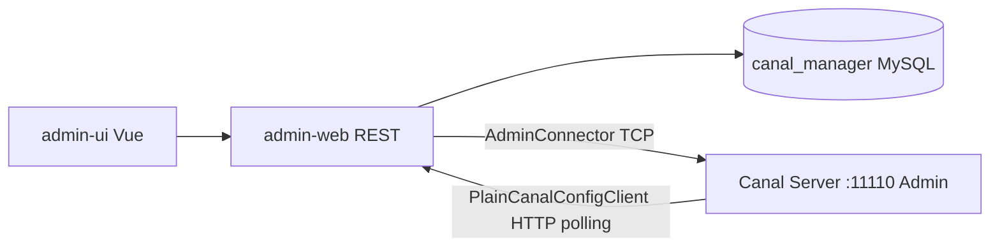

- **写配置**：UI → REST → DB
- **看状态/日志/启停**：Web → `SimpleAdminConnectors` → Server Admin 端口
- **Server 拉配置**：`PlainCanalConfigClient` → `/api/v1/config/*_polling`

---

## 33. 多流解析与 RDS 场景

### 33.1 GroupEventParser（多流）

配置 `canal.instance.multi.stream.on=true` 时，一个逻辑 destination 可挂载 **多个** `MysqlEventParser`（多库/多订阅源），由 `GroupEventParser` 代理：

```17:36:parse/src/main/java/com/alibaba/otter/canal/parse/inbound/group/GroupEventParser.java
public class GroupEventParser implements CanalEventParser {
    private List<CanalEventParser> eventParsers = new ArrayList<>();

    public void start() {
        for (CanalEventParser eventParser : eventParsers) {
            eventParser.start();
        }
    }
```

每个子 Parser 独立 dump 线程，共享同一 `eventSink`/`eventStore` 时需注意 Spring 装配方式（通常各流不同 destination 子名或独立 store，以实际 XML 为准）。

### 33.2 RdsBinlogEventParserProxy（阿里云 RDS）

当配置 `canal.instance.rds.*`（accesskey/secretkey/instanceId）时，使用 `RdsBinlogEventParserProxy` 替代普通 `MysqlEventParser`：

```23:38:parse/src/main/java/com/alibaba/otter/canal/parse/inbound/mysql/rds/RdsBinlogEventParserProxy.java
public class RdsBinlogEventParserProxy extends MysqlEventParser {
    private RdsLocalBinlogEventParser rdsLocalBinlogEventParser = null;
    private ExecutorService executorService = Executors.newSingleThreadExecutor(...);
```

**双模式切换**：

1. 正常：在线连接 RDS 执行 `COM_BINLOG_DUMP`（父类 `MysqlEventParser`）。
2. binlog 被清理或 `ServerLogPurgedException`：后台线程启动 `RdsLocalBinlogEventParser`，通过 **RDS OpenAPI 下载 OSS binlog 文件** 到本地目录，用 `LocalBinLogConnection` 离线解析。

`setRdsOssMode(true)` 处理 RDS OSS binlog 与 MariaDB/MySQL checksum 差异。适合云上自动主备、binlog 定期归档场景。

---

## 34. PlainCanalConfigClient HTTP 轮询 API

Server 端（Manager 模式或 `canal.admin.manager` 配置）通过 HTTP 与 Admin 同步配置。

### 34.1 主要端点

```72:106:instance/manager/src/main/java/com/alibaba/otter/canal/instance/manager/plain/PlainCanalConfigClient.java
    public PlainCanal findServer(String md5) {
        String url = configURL + "/api/v1/config/server_polling?ip=" + localIp + "&port=" + adminPort
                     + "&md5=" + md5 + "&register=" + (autoRegister ? 1 : 0) + "&cluster=" + autoCluster;
        return queryConfig(url);
    }

    public PlainCanal findInstance(String destination, String md5) {
        String url = configURL + "/api/v1/config/instance_polling/" + destination + "?md5=" + md5;
        return queryConfig(url);
    }

    public String findInstances(String md5) {
        String url = configURL + "/api/v1/config/instances_polling?md5=" + md5 + "&ip=" + localIp + "&port=" + adminPort;
    }
```

| API | 作用 |
|-----|------|
| `server_polling` | 拉取/更新全局 `canal.properties`；`register=1` 触发 `autoRegister` 登记 Node |
| `instances_polling` | 返回本机应运行的 destination 列表（逗号分隔） |
| `instance_polling/{name}` | 拉取单个 instance 的 properties 全文 |

请求头带 `user`/`passwd`，响应用 `contentMd5` 判断是否有变更；**md5 不变则 body 为空**，减少流量。

### 34.2 与 CanalLauncher 的配合

`CanalLauncher` 定时 `findServer(lastMd5)`，变化则 **整进程** `canalStater.stop()` + `start()`（见 §22.4）。Instance 级变更由 `ManagerInstanceConfigMonitor` + `findInstance` 触发对应 destination 的 `reload`。

---

## 35. Manager 配置监听与 Client/MQ 补充

### 35.1 ManagerInstanceConfigMonitor

与 §29 的 `SpringInstanceConfigMonitor` 对称，在 `instance.global.mode=manager` 时启用：不扫描本地 `conf/`，而是轮询 Admin 的 `instances_polling` + 各 instance 的 `instance_polling`。

```74:118:deployer/src/main/java/com/alibaba/otter/canal/deployer/monitor/ManagerInstanceConfigMonitor.java
    private void scan() {
        String instances = configClient.findInstances(null);
        final List<String> is = Lists.newArrayList(StringUtils.split(instances, ','));
        for (String instance : is) {
            if (!configs.containsKey(instance)) {
                PlainCanal newPlainCanal = configClient.findInstance(instance, null);
                if (newPlainCanal != null) {
                    configs.put(instance, newPlainCanal);
                    start.add(instance);
                }
            } else {
                PlainCanal newPlainCanal = configClient.findInstance(instance, plainCanal.getMd5());
                if (newPlainCanal != null) {
                    restart.add(instance);
                }
            }
        }
        // 不在列表中的 instance → stop
        stop.forEach(instance -> notifyStop(instance));
        restart.forEach(instance -> notifyReload(instance));
        start.forEach(instance -> notifyStart(instance));
    }
```

**与 Spring 模式的差异**：新增/删除 destination 由 Admin **分配列表** 驱动，而非文件系统目录；配置变更用 **md5** 增量拉取，避免全量 properties 重复传输。

### 35.2 CanalMessageDeserializer（TCP Client）

`SimpleCanalConnector` 从 Netty 收到字节后，统一经 `CanalMessageDeserializer` 解析为 `Message`：

```17:41:client/src/main/java/com/alibaba/otter/canal/client/CanalMessageDeserializer.java
    public static Message deserializer(byte[] data, boolean lazyParseEntry) {
        CanalPacket.Packet p = CanalPacket.Packet.parseFrom(data);
        switch (p.getType()) {
            case MESSAGES: {
                CanalPacket.Messages messages = CanalPacket.Messages.parseFrom(p.getBody());
                Message result = new Message(messages.getBatchId());
                if (lazyParseEntry) {
                    result.setRawEntries(messages.getMessagesList());
                    result.setRaw(true);
                } else {
                    for (ByteString byteString : messages.getMessagesList()) {
                        result.addEntry(CanalEntry.Entry.parseFrom(byteString));
                    }
                }
                return result;
            }
            case ACK: {
                throw new CanalClientException("something goes wrong with reason: " + ack.getErrorMessage());
            }
        }
    }
```

`lazyParseEntry=true` 时保留 `ByteString` 列表，延迟解析 `Entry`，降低大 batch 的 CPU 开销；与 Server 侧 `lazyParseEntry` 配置对应。

### 35.3 RocketMQ Producer（与 Kafka 对称）

`@SPI("rocketmq")` 的 `CanalRocketMQProducer` 同样继承 `AbstractMQProducer`，`send` 模板与 §31 一致：`dynamicTopic` 并行 → 成功 `callback.commit()` / 失败 `rollback()`。

```151:182:connector/rocketmq-connector/src/main/java/com/alibaba/otter/canal/connector/rocketmq/producer/CanalRocketMQProducer.java
    public void send(MQDestination destination, Message message, Callback callback) {
        ExecutorTemplate template = new ExecutorTemplate(sendExecutor);
        try {
            if (!StringUtils.isEmpty(destination.getDynamicTopic())) {
                // messageTopics → 多 topic 并行 submit
                template.waitForResult();
            } else {
                send(destination, destination.getTopic(), message);
            }
            callback.commit();
        } catch (Throwable e) {
            callback.rollback();
        }
    }
```

RocketMQ 特有：`getTopicDynamicQueuesSize` 用 **队列数** 作分区数；支持阿里云 ACL、`namespace`、消息轨迹。`flatMessage` 分支输出 JSON `FlatMessage`，供 `CanalRocketMQConnector` / adapter MQ 模式消费。

### 35.4 client-adapter：HBase 适配器概要

`@SPI("hbase")` 的 `HbaseAdapter` 在 `init` 时加载 `MappingConfig`（库表 → HBase 表/列族映射），通过 `HbaseTemplate` 写 `Put`/`Delete`：

```41:80:client-adapter/hbase/src/main/java/com/alibaba/otter/canal/client/adapter/hbase/HbaseAdapter.java
@SPI("hbase")
public class HbaseAdapter implements OuterAdapter {
    private HbaseSyncService hbaseSyncService;
    private HbaseTemplate hbaseTemplate;
    private HbaseConfigMonitor configMonitor;

    public void init(OuterAdapterConfig configuration, Properties envProperties) {
        Map<String, MappingConfig> hbaseMappingTmp = MappingConfigLoader.load(envProperties);
        Configuration hbaseConfig = HBaseConfiguration.create();
        properties.forEach(hbaseConfig::set);
```

`HbaseSyncService.sync` 将 `Dml` 转为 rowkey（可配置 hash/列拼接），与 RDB/ES 一样由 `AdapterProcessor` 批量调用 `OuterAdapter.sync`。`HbaseConfigMonitor` 监听 mapping yml 热更新，与 §13 的 `SyncSwitch` 配合启停同步。

---

## 36. Canal 通信架构总览

Canal 在运行时涉及 **四条独立通信平面**，端口、协议、职责各不相同：

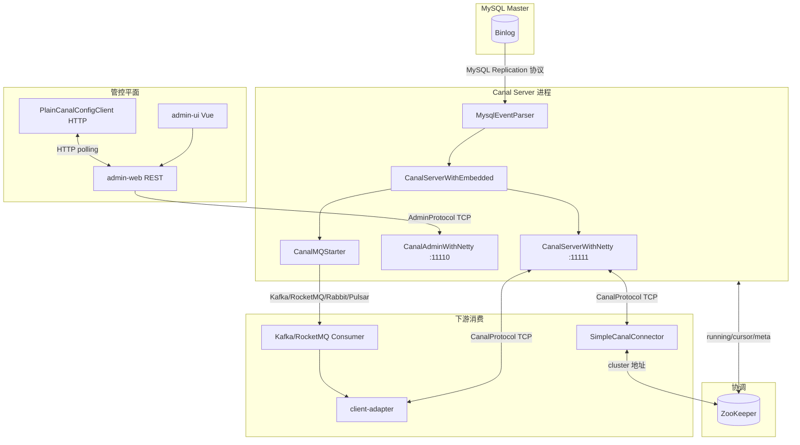

### 36.1 端口与协议对照

| 平面 | 默认端口 | 传输 | 协议载体 | 典型调用方 |
|------|----------|------|----------|------------|
| **数据消费** | `canal.port` **11111** | TCP | `CanalProtocol.proto` → `CanalPacket` | Java Client、client-adapter TCP 模式 |
| **进程管控** | `canal.admin.port` **11110** | TCP | `AdminProtocol.proto` → `AdminPacket` | admin-web `AdminConnector` |
| **配置下发** | Admin HTTP **8089** | HTTP | REST `/api/v1/config/*_polling` | `PlainCanalConfigClient` |
| **MySQL 复制** | 3306 | TCP | MySQL Client/Server 协议 | `MysqlConnector` |
| **Prometheus** | `canal.metrics.pull.port` **11112** | HTTP | `/metrics` | Prometheus scrape |
| **ZK 协调** | 2181 | TCP | ZK 原生协议 | `ServerRunningMonitor`、`ZooKeeperMetaManager` |

### 36.2 统一帧格式（数据面 + 管控面）

所有 Canal 自定义 TCP 协议（11111 / 11110）共用 **4 字节大端长度头 + Protobuf body**：

```15:20:server/src/main/java/com/alibaba/otter/canal/server/netty/handler/FixedHeaderFrameDecoder.java
public class FixedHeaderFrameDecoder extends ReplayingDecoder<VoidEnum> {
    protected Object decode(...) throws Exception {
        return buffer.readBytes(buffer.readInt());  // 先读 4 字节 length，再读 body
    }
}
```

发送侧对称实现（`NettyUtils.write` / `SimpleCanalConnector.writeWithHeader`）：

```44:50:server/src/main/java/com/alibaba/otter/canal/server/netty/NettyUtils.java
    public static void write(Channel channel, byte[] body, ...) {
        byte[] header = ByteBuffer.allocate(HEADER_LENGTH).order(ByteOrder.BIG_ENDIAN).putInt(body.length).array();
        Channels.write(channel, ChannelBuffers.wrappedBuffer(header, body))...
    }
```

**注意**：长度字段表示 **Protobuf Packet 序列化后的字节数**，不包含 4 字节头本身。

### 36.3 Netty Pipeline（数据端口 11111）

```71:82:server/src/main/java/com/alibaba/otter/canal/server/netty/CanalServerWithNetty.java
        bootstrap.setPipelineFactory(() -> {
            ChannelPipeline pipelines = Channels.pipeline();
            pipelines.addLast(new FixedHeaderFrameDecoder());
            pipelines.addLast(new HandshakeInitializationHandler(childGroups));
            pipelines.addLast(new ClientAuthenticationHandler(embeddedServer));
            pipelines.addLast(new SessionHandler(embeddedServer));
            return pipelines;
        });
```

连接建立后按序经过：**定长帧解码 → 握手发 seed → 客户端认证（认证成功后移除前两个 Handler）→ 业务 Session**。认证通过后注入 `IdleStateHandler` 做读写空闲断开（默认 1 小时，可由 `ClientAuth.net_read_timeout` 覆盖）。

---

## 37. TCP 数据协议详解（CanalProtocol）

协议定义：`protocol/src/main/java/com/alibaba/otter/canal/protocol/CanalProtocol.proto`。

### 37.1 Packet 信封结构

```35:51:protocol/src/main/java/com/alibaba/otter/canal/protocol/CanalProtocol.proto
message Packet {
     int32 version = 2;          // 当前固定为 1
     PacketType type = 3;
     Compression compression = 4; // 默认 NONE
     bytes body = 5;              // 具体消息体
}
```

### 37.2 PacketType 全表

| 枚举值 | 名称 | 方向 | body 类型 | 含义 |
|--------|------|------|-----------|------|
| 1 | HANDSHAKE | S→C | `Handshake` | 服务端发 8 字节 seed + 支持的压缩算法 |
| 2 | CLIENTAUTHENTICATION | C→S | `ClientAuth` | 用户名 + scramble 密码 + 可选 destination/clientId |
| 3 | ACK | S→C / 双向 | `Ack` | 成功（error_code=0）或错误 |
| 4 | SUBSCRIPTION | C→S | `Sub` | 订阅 destination，带 filter |
| 5 | UNSUBSCRIPTION | C→S | `Unsub` | 取消订阅 |
| 6 | GET | C→S | `Get` | 拉取 batch，`auto_ack=false` 时为 getWithoutAck |
| 7 | MESSAGES | S→C | `Messages` | 返回 `batch_id` + 若干 `Entry` 字节 |
| 8 | CLIENTACK | C→S | `ClientAck` | 确认 batch_id，释放 Store 位点 |
| 12 | CLIENTROLLBACK | C→S | `ClientRollback` | 回滚 batch（batch_id=0 表示全部） |
| 9 | SHUTDOWN | — | — | 管理类（较少用） |
| 10 | DUMP | — | `Dump` | 指定位点 dump |
| 11 | HEARTBEAT | — | `HeartBeat` | 心跳 |

### 37.3 典型消费会话时序

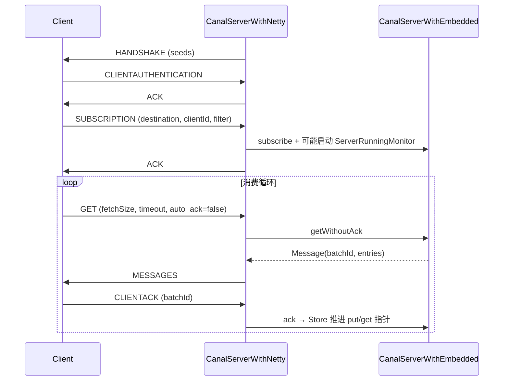

### 37.4 GET / MESSAGES 关键字段

`Get` 消息（客户端 `SimpleCanalConnector.getWithoutAck`）：

```114:130:protocol/src/main/java/com/alibaba/otter/canal/protocol/CanalProtocol.proto
message Get {
    string destination = 1;
    string client_id = 2;
    int32 fetch_size = 3;
    int64 timeout = 4;   // -1 表示不阻塞等待
    int32 unit = 5;      // 时间单位 ordinal：2=毫秒
    bool auto_ack = 6;   // Canal 主流用法为 false
}
```

`Messages` 响应：

```134:137:protocol/src/main/java/com/alibaba/otter/canal/protocol/CanalProtocol.proto
message Messages {
    int64 batch_id = 1;
    repeated bytes messages = 2;  // 每个元素是一个 CanalEntry.Entry 的 protobuf 字节
}
```

服务端 `SessionHandler` 对 **raw 模式** 做了性能优化：当 `Message.isRaw()==true` 时，用 `CodedOutputStream` 手工拼装 `MESSAGES` 包，避免重复 parse/serialize `Entry`（与 §42 的 MQ 序列化逻辑同源）。

### 37.5 CLIENTACK / CLIENTROLLBACK 语义

```231:278:server/src/main/java/com/alibaba/otter/canal/server/netty/handler/SessionHandler.java
                case CLIENTACK:
                    if (ack.getBatchId() == -1L) { // get 无数据
                    } else {
                        embeddedServer.ack(clientIdentity, ack.getBatchId());
                    }
                case CLIENTROLLBACK:
                    if (rollback.getBatchId() == 0L) {
                        embeddedServer.rollback(clientIdentity);  // 全部未 ack 批次
                    } else {
                        embeddedServer.rollback(clientIdentity, rollback.getBatchId());
                    }
```

- `batch_id = -1`：GET 超时或 Store 暂无数据，**无需 ack**。
- `CLIENTACK` 不返回响应包（仅内部 `ChannelFutureAggregator` 统计）。
- 客户端 `connect()` 后默认 `rollbackOnConnect=true`，会先 rollback 再消费，避免重复投递未 ack 数据。

---

## 38. 认证机制：MySQL 风格 scramble

Canal 数据端口认证算法与 **MySQL 4.1+ native password** 同源，实现在 `SecurityUtil`：

```10:17:protocol/src/main/java/com/alibaba/otter/canal/protocol/SecurityUtil.java
 * 1、client: stage1_hash = SHA1(明文密码); token = SHA1(scramble + SHA1(stage1_hash)) XOR stage1_hash
 * 2、server: token = SHA1(token XOR SHA1(scramble + password))
 * 3、check token vs password
```

### 38.1 握手与认证流程

1. **Server** `HandshakeInitializationHandler.channelOpen` 生成 8 字节随机 `seed`，发 `HANDSHAKE`。
2. **Client** `SimpleCanalConnector.doConnect` 收到 seed 后：

```167:184:client/src/main/java/com/alibaba/otter/canal/client/impl/SimpleCanalConnector.java
            ByteString seed = handshake.getSeeds();
            String newPasswd = SecurityUtil.byte2HexStr(SecurityUtil.scramble411(password.getBytes(), seed.toByteArray()));
            ClientAuth ca = ClientAuth.newBuilder()
                .setUsername(username)
                .setPassword(ByteString.copyFromUtf8(newPasswd))
                .setNetReadTimeout(idleTimeout)
                .build();
            writeWithHeader(Packet.newBuilder().setType(PacketType.CLIENTAUTHENTICATION).setBody(ca.toByteString()).build()...);
```

3. **Server** `ClientAuthenticationHandler` 调用 `embeddedServer.auth(username, hexPassword, seed)`，内部用 `scrambleServerAuth` 校验。
4. 认证成功发 `ACK`；失败发 `ACK(error_code=400)` 并带错误信息。
5. 若 `ClientAuth` 中带 `destination` + `clientId`，认证阶段即可 **合并 subscribe**（减少一次往返）。

Admin 端口（11110）使用同一套 `SecurityUtil`，但 `ClientAuth` 不含 destination，仅做进程级鉴权。

---

## 39. Admin 管控协议（AdminProtocol）

定义：`protocol/.../AdminProtocol.proto`。与数据协议共用 **4 字节头 + Protobuf**，但 `Packet` 无 `compression` 字段，body 为 field 4。

### 39.1 PacketType

| 值 | 类型 | body | 用途 |
|----|------|------|------|
| 1 | HANDSHAKE | `Handshake` | 仅 seeds，无压缩枚举 |
| 2 | CLIENTAUTHENTICATION | `ClientAuth` | 进程级认证 |
| 3 | ACK | `Ack` | 响应 |
| 4 | SERVER | `ServerAdmin` | `action`: check/start/stop/restart/list |
| 5 | INSTANCE | `InstanceAdmin` | `destination` + `action`: start/stop/release/restart |
| 6 | LOG | `LogAdmin` | 拉取 canal / instance 日志 tail |

### 39.2 与数据协议差异

| 维度 | CanalProtocol (11111) | AdminProtocol (11110) |
|------|----------------------|------------------------|
| 业务包 | SUBSCRIPTION/GET/MESSAGES/CLIENTACK | SERVER/INSTANCE/LOG |
| 认证后 Handler | `SessionHandler` 长连接消费 | `SessionHandler` 请求-响应式管控 |
| 典型连接模式 | 客户端常驻、循环 GET | admin-web 短连接或连接池 |
| 错误码 | 401/402 等 | Admin 侧 300 段 |

Admin `SessionHandler` 处理逻辑见 §30.2；`CanalAdminController`（Deployer）与 `CanalAdmin` 接口实现一一对应。

---

## 40. Admin Manager 节点注册与配置分配

Manager 模式下 Canal Server 通过 `PlainCanalConfigClient.findServer(md5)` 轮询，URL 带 `register=1` 时触发 **自动登记节点**。

### 40.1 autoRegister 逻辑

```32:52:admin/admin-web/src/main/java/com/alibaba/otter/canal/admin/service/impl/PollingConfigServiceImpl.java
    public boolean autoRegister(String ip, Integer adminPort, String cluster, String name) {
        NodeServer server = NodeServer.find.query().where().eq("ip", ip).eq("adminPort", adminPort).findOne();
        if (server == null) {
            server = new NodeServer();
            server.setIp(ip);
            server.setAdminPort(adminPort);
            server.setTcpPort(adminPort + 1);      // 约定：数据端口 = adminPort + 1
            server.setMetricPort(adminPort + 2);   // 监控端口 = adminPort + 2
            if (StringUtils.isNotEmpty(cluster)) {
                server.setClusterId(canalClusterService.findByName(cluster).getId());
            }
            nodeServerService.save(server);
        }
        return true;
    }
```

**端口约定**：若 Admin 登记时只上报 `adminPort=11110`，则 UI 自动推断 `tcpPort=11111`、`metricPort=11112`。

### 40.2 配置归属：单机 vs 集群

| 场景 | `canal.properties` 来源 | `instances` 列表来源 |
|------|---------------------------|----------------------|
| 单机 Node | `CanalConfig.serverId = node.id` | 绑定该 server 的 instance |
| 集群 Node | `CanalConfig.clusterId = cluster.id` | 集群下所有 `status=1` 的 instance |

`getChangedConfig` / `getInstancesConfig` / `getInstanceConfig` 均用 **contentMd5** 判断变更；md5 一致则返回 `content=null`，Server 端跳过 reload。

### 40.3 与 ZK 的关系

- **Admin Manager**：管配置与 Node 元数据（MySQL `canal_manager`），**不替代** ZK 的 instance 选主。
- **ZK**：仍负责每个 destination 的 `running` 临时节点，决定 **哪台 Server 真正跑 Parser**（§41）。
- 典型部署：Admin 告诉 Server「应有哪些 destination」；ZK 决定「多机中谁 active」。

---

## 41. ZooKeeper 路径与 Server/Client 选主

路径规范集中在 `ZookeeperPathUtils`：

```7:27:common/src/main/java/com/alibaba/otter/canal/common/zookeeper/ZookeeperPathUtils.java
 * /otter/canal/destinations/{dest}/running          (EPHEMERAL) Server 选主
 * /otter/canal/destinations/{dest}/{clientId}/running (EPHEMERAL) Client 选主
 * /otter/canal/destinations/{dest}/{clientId}/cursor  消费位点
 * /otter/canal/destinations/{dest}/{clientId}/mark/{batchId}  batch 标记
```

### 41.1 Server 侧：ServerRunningMonitor

```138:163:common/src/main/java/com/alibaba/otter/canal/common/zookeeper/running/ServerRunningMonitor.java
    private void initRunning() {
        String path = ZookeeperPathUtils.getDestinationServerRunning(destination);
        byte[] bytes = JsonUtils.marshalToByte(serverData);
        try {
            zkClient.create(path, bytes, CreateMode.EPHEMERAL);  // 抢占成功 → active
            processActiveEnter();
        } catch (ZkNodeExistsException e) {
            activeData = JsonUtils.unmarshalFromByte(zkClient.readData(path), ServerRunningData.class);
            // 已有其他节点 active，本机 standby
        }
    }
```

- `ServerRunningData` 含 `address`（ip:port）、`active` 等 JSON 字段。
- 临时节点删除（active 机器宕机）→ `handleDataDeleted` → 延迟 5s 后 `initRunning` 重抢，避免抖动。
- `release()`：主动将 running 节点标为非 active，供 Admin `releaseInstance` 做 **优雅切主**。

### 41.2 Client 侧：ClientRunningMonitor

与 Server 对称，路径为 `/destinations/{dest}/{clientId}/running`。`ClusterCanalConnector` 通过 ZK 发现当前 active Server 地址；`SimpleCanalConnector` + `ClientRunningMonitor` 保证 **同一 clientId 只有一个消费者在工作**（HA 消费）。

### 41.3 Meta 与 cursor

`ZooKeeperMetaManager`（§25）将 client 消费进度写入 `cursor` 节点；`mark/{batchId}` 记录未 ack 批次，与 `MemoryEventStoreWithBuffer` 三指针配合实现 **at-least-once** 语义。

---

## 42. CanalMessageSerializerUtil 序列化

MQ Producer 与 TCP `SessionHandler` 共用此工具，将 `Message` 转为可投递字节。

### 42.1 两种路径

```25:78:connector/core/src/main/java/com/alibaba/otter/canal/connector/core/util/CanalMessageSerializerUtil.java
    public static byte[] serializer(Message data, boolean filterTransactionEntry) {
        if (data.isRaw() && !isEmpty(data.getRawEntries())) {
            // 路径 A：raw ByteString 列表，手工 CodedOutputStream（高性能，与 SessionHandler 一致）
            output.writeEnum(3, PacketType.MESSAGES.getNumber());
            output.writeInt64(1, data.getId());
            for (ByteString rowEntry : rowEntries) {
                output.writeBytes(2, rowEntry);
            }
        } else if (!isEmpty(data.getEntries())) {
            // 路径 B：MQ 常见——已解析的 Entry 列表，封装完整 Packet protobuf
            for (CanalEntry.Entry entry : data.getEntries()) {
                if (filterTransactionEntry && isTransaction(entry)) continue;
                messageBuilder.addMessages(entry.toByteString());
            }
            packetBuilder.setType(PacketType.MESSAGES).setVersion(1);
            return packetBuilder.build().toByteArray();
        }
    }
```

| 路径 | 触发条件 | 输出形态 | 使用场景 |
|------|----------|----------|----------|
| A raw | `Message.isRaw()` | 仅 `MESSAGES` 体或内嵌 Packet | Server lazyParse、高性能 TCP |
| B 非 raw | `getEntries()` 非空 | 完整 `Packet{ type=MESSAGES, body=Messages }` | Kafka/RocketMQ 默认投递 |

`filterTransactionEntry=true` 时去掉 `TRANSACTIONBEGIN/END`，减小 MQ 消息体积（下游通常不关心事务边界包）。

### 42.2 反序列化

`deserializer(byte[], lazyParseEntry)` 与 `CanalMessageDeserializer`（§35.2）逻辑一致：解析 `Packet` → `Messages` → `List<Entry>` 或 raw `ByteString`。

---

## 43. RabbitMQ / Pulsar Producer

与 §31 Kafka、§35.3 RocketMQ 同属 `AbstractMQProducer` + `@SPI` 体系。

### 43.1 CanalRabbitMQProducer

```41:99:connector/rabbitmq-connector/.../CanalRabbitMQProducer.java
@SPI("rabbitmq")
public class CanalRabbitMQProducer extends AbstractMQProducer {
    // init: ConnectionFactory → queueDeclare / exchangeDeclare / queueBind
    public void send(MQDestination destination, Message message, Callback callback) {
        // dynamicTopic 并行 → template.waitForResult() → callback.commit/rollback
    }
}
```

特点：

- 支持 `amqp://` URI 或 `host:port`；阿里云 AMQP 用 `AliyunCredentialsProvider`。
- 消息发到 **queue** 或 **exchange + routingKey**；`flatMessage` 时 body 为 `FlatMessage` JSON。
- 非 flat 时用 `CanalMessageSerializerUtil.serializer` 得到 protobuf 字节，作为 AMQP body。

### 43.2 CanalPulsarMQProducer

```39:104:connector/pulsarmq-connector/.../CanalPulsarMQProducer.java
@SPI("pulsarmq")
public class CanalPulsarMQProducer extends AbstractMQProducer {
    // PulsarClient + 可选 token 认证 + sendPartitionExecutor
    public static final String MSG_PROPERTY_PARTITION_NAME = "partitionNum";
}
```

特点：

- Topic 可能动态（表名正则），Producer **懒加载** 缓存于 `PRODUCERS` Map。
- 分区属性写入 Pulsar message property `partitionNum`，便于消费端保序。
- `flatMessage` 与 protobuf 双模式，与 Kafka 对齐。

### 43.3 MQ Producer SPI 总览

| SPI name | 类 | 顺序保证手段 |
|----------|-----|--------------|
| kafka | `CanalKafkaProducer` | `max.in.flight=1` + 分区 hash |
| rocketmq | `CanalRocketMQProducer` | queue 选择 + `sendPartitionExecutor` |
| rabbitmq | `CanalRabbitMQProducer` | 单 queue 或 routingKey |
| pulsarmq | `CanalPulsarMQProducer` | partition property + 多 topic producer |

全部遵循：**send 成功 → `callback.commit()` → Server `ack`；异常 → `rollback()`**（§19）。

---

## 44. client-adapter MQ 消费全链路

client-adapter 通过 **统一抽象 `CanalMsgConsumer`** 屏蔽 TCP / Kafka / RocketMQ 等差异，`AdapterProcessor` 只关心 `List<CommonMessage>`。

### 44.1 SPI 加载

```66:79:client-adapter/launcher/.../AdapterProcessor.java
        ExtensionLoader<CanalMsgConsumer> loader = new ExtensionLoader<>(CanalMsgConsumer.class);
        String key = destination + "_" + groupId;
        canalMsgConsumer = new ProxyCanalMsgConsumer(loader.getExtension(
            canalClientConfig.getMode().toLowerCase(), key, "/plugin", "/canal-adapter/plugin"));
        properties.put(CanalConstants.CANAL_MQ_FLAT_MESSAGE, canalClientConfig.getFlatMessage());
        canalMsgConsumer.init(properties, canalDestination, groupId);
```

`application.yml` 中 `canal.conf.mode` 取值：`tcp` | `kafka` | `rocketMQ` | `rabbitMQ` 等，对应 `connector/*/consumer` 下 `@SPI` 实现。

### 44.2 消费循环

```184:214:client-adapter/launcher/.../AdapterProcessor.java
        while (running) {
            canalMsgConsumer.connect();
            while (running) {
                syncSwitch.get(canalDestination, 1L, TimeUnit.MINUTES);  // 开关控制
                List<CommonMessage> commonMessages = canalMsgConsumer.getMessage(timeout, MILLISECONDS);
                writeOut(commonMessages);   // → MessageUtil.flatMessage2Dml → OuterAdapter.sync
                canalMsgConsumer.ack();
            }
            canalMsgConsumer.disconnect();
        }
```

失败时：`rollback()` 重试；`terminateOnException=true` 则 `syncSwitch.off` 停同步。

### 44.3 TCP 模式：CanalTCPConsumer

```32:78:connector/tcp-connector/.../CanalTCPConsumer.java
@SPI("tcp")
public class CanalTCPConsumer implements CanalMsgConsumer {
    // host 直连 SimpleCanalConnector，或 zkHosts → ClusterCanalConnector
    public List<CommonMessage> getMessage(...) {
        Message message = canalConnector.getWithoutAck(batchSize, timeout, unit);
        return MessageUtil.convert(message);  // Entry → CommonMessage
    }
}
```

内部仍是 **CanalProtocol** 全套：connect → subscribe → GET → MESSAGES → CLIENTACK。

### 44.4 Kafka 模式：CanalKafkaConsumer

```33:112:connector/kafka-connector/.../CanalKafkaConsumer.java
@SPI("kafka")
public class CanalKafkaConsumer implements CanalMsgConsumer {
    public void connect() {
        if (flatMessage) {
            value.deserializer = StringDeserializer;  // JSON FlatMessage
        } else {
            value.deserializer = KafkaMessageDeserializer;  // protobuf Message
        }
        kafkaConsumer.subscribe(topic);
    }
    public List<CommonMessage> getMessage(...) {
        // poll → JSON.parseObject(flatMessageJson, CommonMessage.class)
    }
    public void rollback() {
        kafkaConsumer.seek(partition, currentOffsets.get(partition));  // 按分区回退 offset
    }
}
```

**flatMessage=true**（与 Server `canal.mq.flatMessage=true` 配套）时，消息体为 `FlatMessage` JSON，经 `MessageUtil.flatMessage2Dml` 转 `Dml`，无需再解析 `CanalEntry`。

### 44.5 端到端数据形态转换

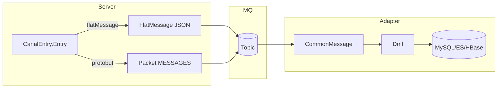

| 阶段 | TCP 模式 | MQ flat 模式 | MQ protobuf 模式 |
|------|----------|--------------|------------------|
| Server 输出 | MESSAGES + Entry bytes | FlatMessage / topic | CanalMessageSerializerUtil |
| Consumer | `MessageUtil.convert(Message)` | `JSON → CommonMessage` | `KafkaMessageDeserializer` |
| Adapter | `parse4Dml` 或 `flatMessage2Dml` | `flatMessage2Dml` | `parse4Dml` |

---

## 45. FlatMessage 与 CommonMessage 数据模型

MQ 模式与 client-adapter 普遍使用 **行级 JSON** 而非完整 `CanalEntry` Protobuf。Canal 内部有两层近似结构：

| 类 | 模块 | 用途 |
|----|------|------|
| `FlatMessage` | `protocol` | Server 端 MQ Producer 构造、序列化为 JSON 投递 |
| `CommonMessage` | `connector/core` | Consumer SPI 统一返回类型，字段与 FlatMessage 对齐 |
| `Dml` | `client-adapter/common` | Adapter 落地层内部模型，`MessageUtil` 负责转换 |

### 45.1 FlatMessage 字段说明

```12:30:protocol/src/main/java/com/alibaba/otter/canal/protocol/FlatMessage.java
public class FlatMessage implements Serializable {
    private long id;                          // 对应 Message.batchId
    private String database;                  // schema
    private String table;
    private List<String> pkNames;             // 主键列名
    private Boolean isDdl;
    private String type;                      // INSERT / UPDATE / DELETE / CREATE / ...
    private Long es;                          // binlog executeTime（毫秒）
    private Long ts;                          // Canal 构建时间戳
    private String sql;                       // DDL 时有值
    private Map<String, Integer> sqlType;     // 列 → JDBC Types
    private Map<String, String> mysqlType;    // 列 → mysql 类型字符串
    private List<Map<String, String>> data;   // 变更后行（INSERT/UPDATE 的 after）
    private List<Map<String, String>> old;    // 变更前行（UPDATE/DELETE）
    private String gtid;
}
```

**一行 binlog 多行数据**：`data` / `old` 为 `List<Map>`，每个 Map 对应一行；UPDATE 时 `data[i]` 与 `old[i]` 一一对应。

### 45.2 Server 端构造：MQMessageUtils.messageConverter

```355:376:connector/core/src/main/java/com/alibaba/otter/canal/connector/core/producer/MQMessageUtils.java
    public static List<FlatMessage> messageConverter(EntryRowData[] datas, long id) {
        FlatMessage flatMessage = new FlatMessage(id);
        flatMessage.setDatabase(entry.getHeader().getSchemaName());
        flatMessage.setTable(entry.getHeader().getTableName());
        flatMessage.setIsDdl(rowChange.getIsDdl());
        flatMessage.setType(eventType.toString());
        flatMessage.setEs(entry.getHeader().getExecuteTime());
        flatMessage.setGtid(entry.getHeader().getGtid());
        // 遍历 RowData → 填充 data/old/sqlType/mysqlType/pkNames
    }
```

`messagePartition(FlatMessage, partitionsNum, pkHashConfigs)` 按主键 hash 拆分到不同 MQ 分区，保证 **同一主键行变更顺序**。

### 45.3 Adapter 侧：flatMessage2Dml

```149:175:client-adapter/common/.../MessageUtil.java
    public static Dml flatMessage2Dml(String destination, String groupId, CommonMessage commonMessage) {
        Dml dml = new Dml();
        dml.setDestination(destination);
        dml.setDatabase(commonMessage.getDatabase());
        dml.setType(commonMessage.getType());
        dml.setData(commonMessage.getData());   // Map<String,Object>，已做类型转换
        dml.setOld(commonMessage.getOld());
        return dml;
    }
```

TCP 模式走 `parse4Dml(Message)`：从 `CanalEntry.Entry` → `RowChange` → `Dml`，需解析 `storeValue` 二进制。

---

## 46. CanalEntry 协议结构

定义：`protocol/.../EntryProtocol.proto`，生成类 `CanalEntry`。

### 46.1 核心消息层次

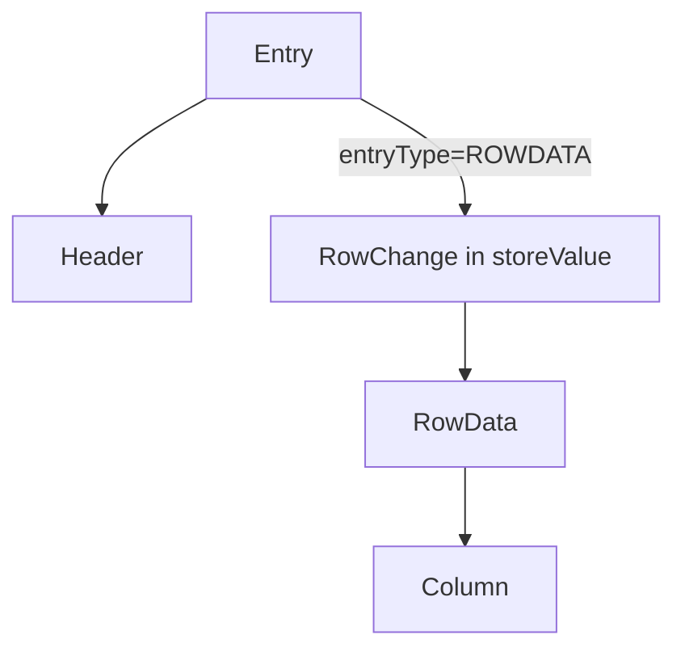

```12:22:protocol/src/main/java/com/alibaba/otter/canal/protocol/EntryProtocol.proto
message Entry {
     Header header = 1;
     EntryType entryType = 2;    // TRANSACTIONBEGIN / ROWDATA / TRANSACTIONEND / HEARTBEAT
     bytes storeValue = 3;       // entryType 对应的嵌套 protobuf 序列化结果
}
```

### 46.2 Header 关键字段

| 字段 | 含义 |
|------|------|
| `logfileName` + `logfileOffset` | binlog 位点（file + position） |
| `executeTime` | 变更在 MySQL 执行时间 |
| `schemaName` / `tableName` | 库表 |
| `eventType` | INSERT/UPDATE/DELETE/CREATE/... |
| `gtid` | GTID 模式下事务标识 |

### 46.3 EntryType 与 storeValue 对应关系

| entryType | storeValue 解析为 | 说明 |
|-----------|-------------------|------|
| TRANSACTIONBEGIN | `TransactionBegin` | 事务开始，含 threadId |
| ROWDATA | `RowChange` | DML/DDL 主体 |
| TRANSACTIONEND | `TransactionEnd` | 事务结束 |
| HEARTBEAT | — | 内部心跳，常过滤 |

`RowChange` 含 `isDdl`、`sql`（DDL）、`rowDatas[]`（DML 多行）。每行 `RowData` 有 `beforeColumns` / `afterColumns`。

### 46.4 Message 与 Entry 的关系

- `Message`（Java 类）：一次 `getWithoutAck` 返回的 **批次**，含 `id`（batchId）+ `List<Entry>`。
- TCP `MESSAGES` 包：`batch_id` + 多个 Entry 的 **独立 protobuf 字节**。
- 事务边界：同一 batch 可含 BEGIN + 多 ROWDATA + END；MQ flat 模式通常跳过 BEGIN/END。

---

## 47. ClusterCanalConnector 集群消费与 Failover

`ClusterCanalConnector` 包装 `SimpleCanalConnector`，在 **subscribe/get/ack 失败时自动 disconnect → sleep → connect** 换节点重试。

### 47.1 三种寻址策略（CanalConnectors）

| 工厂方法 | AccessStrategy | 寻址方式 |
|----------|----------------|----------|
| `newSingleConnector` | 无（直连） | 固定 `SocketAddress` |
| `newClusterConnector(List)` | `SimpleNodeAccessStrategy` | 静态 Server 列表轮询 |
| `newClusterConnector(zkServers)` | `ClusterNodeAccessStrategy` | ZK 动态发现 |

### 47.2 ClusterNodeAccessStrategy：双路径监听

```52:75:client/src/main/java/com/alibaba/otter/canal/client/impl/ClusterNodeAccessStrategy.java
        // 路径1：/destinations/{dest}/cluster/ 子节点列表 → 候选 Server 地址（shuffle）
        String clusterPath = ZookeeperPathUtils.getDestinationClusterRoot(destination);
        zkClient.subscribeChildChanges(clusterPath, childListener);

        // 路径2：/destinations/{dest}/running → 当前 active Server
        String runningPath = ZookeeperPathUtils.getDestinationServerRunning(destination);
        zkClient.subscribeDataChanges(runningPath, dataListener);

    public SocketAddress nextNode() {
        if (runningAddress != null) {
            return runningAddress;           // 优先连 active 节点
        } else if (!currentAddress.isEmpty()) {
            return currentAddress.get(0);      // lazy 启动：触发第一台 start
        }
        throw new ServerNotFoundException(...);
    }
```

**与 §41 ServerRunningMonitor 的关系**：Server 抢 `running` 成功后写入 `ServerRunningData.address`；Client 读同一节点得到 `ip:port`（数据端口 11111）。

### 47.3 Failover 重试模板

```278:286:client/src/main/java/com/alibaba/otter/canal/client/impl/ClusterCanalConnector.java
    private void restart() throws CanalClientException {
        disconnect();
        Thread.sleep(retryInterval);   // 默认 5s
        connect();                     // nextNode() 可能指向新 active
    }
```

`getWithoutAck` / `ack` / `subscribe` 均在 catch 后调用 `restart()`，默认 `retryTimes=3`。`retryTimes=-1` 时 subscribe 阻塞等待可被 `InterruptedException` 优雅打断（issue 相关修复）。

`connect()` 内 `SimpleCanalConnector` 重写 `getNextAddress()` → `accessStrategy.nextNode()`，实现 **无硬编码 IP 的透明切换**。

---

## 48. ClientRunningMonitor 消费端 HA

与 Server 侧 `ServerRunningMonitor` 对称，保证 **同一 destination + clientId 只有一个消费进程 active**。

### 48.1 ZK 路径

`/otter/canal/destinations/{destination}/{clientId}/running`（EPHEMERAL）

### 48.2 抢占与切换

```107:131:client/src/main/java/com/alibaba/otter/canal/client/impl/running/ClientRunningMonitor.java
    public synchronized void initRunning() {
        String path = ZookeeperPathUtils.getDestinationClientRunning(destination, clientData.getClientId());
        try {
            zkClient.create(path, bytes, CreateMode.EPHEMERAL);
            processActiveEnter();   // 回调 listener → doConnect
            mutex.set(true);
        } catch (ZkNodeExistsException e) {
            activeData = JsonUtils.unmarshalFromByte(zkClient.readData(path), ClientRunningData.class);
            if (isMine(activeData.getAddress())) {
                mutex.set(true);    // 避免活锁（issue #697）
            }
        }
    }
```

`SimpleCanalConnector.connect()` 若设置了 `runningMonitor`，则 **先 `waitClientRunning()` 抢 ZK 节点**，成为 active 后才 `doConnect()`；`disconnect()` 时 stop monitor 并释放节点。

### 48.3 典型部署

| 模式 | 组件 | 效果 |
|------|------|------|
| 单 Client 直连 | 无 Monitor | 简单消费 |
| Client 多机 HA | `ClientRunningMonitor` + 相同 clientId | 主备消费，备机 standby |
| Client 连 Server 集群 | `ClusterCanalConnector` + ZK | Server 与 Client 双层 HA |

---

## 49. CanalConnectors 连接工厂

统一入口 `client/.../CanalConnectors.java`，屏蔽 `SimpleCanalConnector` / `ClusterCanalConnector` 构造细节。

```29:75:client/src/main/java/com/alibaba/otter/canal/client/CanalConnectors.java
    public static CanalConnector newSingleConnector(SocketAddress address, String destination, ...) {
        SimpleCanalConnector c = new SimpleCanalConnector(address, username, password, destination);
        c.setSoTimeout(60 * 1000);
        c.setIdleTimeout(60 * 60 * 1000);
        return c;
    }

    public static CanalConnector newClusterConnector(List addresses, ...) {
        return new ClusterCanalConnector(..., new SimpleNodeAccessStrategy(addresses));
    }

    public static CanalConnector newClusterConnector(String zkServers, ...) {
        return new ClusterCanalConnector(..., new ClusterNodeAccessStrategy(destination, ZkClientx.getZkClient(zkServers)));
    }
```

默认超时：`soTimeout=60s`（单次读包），`idleTimeout=1h`（传给 Server 侧 IdleStateHandler）。

**example 模块**与 **connector/tcp-connector** 均通过此工厂或等价的 `SimpleCanalConnector` / `ClusterCanalConnector` 接入。

---

## 50. MysqlMultiStageCoprocessor 并行解析

当 `canal.instance.parser.parallel=true` 时，`MysqlConnection.dump` 走 **MultiStageCoprocessor** 路径，用 LMAX Disruptor 将解析拆为多阶段流水线。

### 50.1 四阶段模型

```29:37:parse/src/main/java/com/alibaba/otter/canal/parse/inbound/mysql/MysqlMultiStageCoprocessor.java
 * 1. 网络接收 (单线程)        — MysqlConnection 读 socket → publish LogBuffer
 * 2. 事件基本解析 (单线程)    — 事件类型、DDL 建 TableMeta、维护位点
 * 3. 事件深度解析 (多线程)    — DML 行数据完整反序列化
 * 4. 投递到 store (单线程)    — EventTransactionBuffer → Sink
```

与单线程 `dump(..., SinkFunction)` 对比：

```182:210:parse/src/main/java/com/alibaba/otter/canal/parse/inbound/mysql/MysqlConnection.java
    // 单线程：fetch → decode → sink 在同循环
    public void dump(String binlogfilename, Long binlogPosition, SinkFunction func) {
        while (fetcher.fetch()) {
            LogEvent event = decoder.decode(fetcher, context);
            func.sink(event);
        }
    }

    // 并行：fetch 只 publish LogBuffer，解码在 Disruptor worker
    public void dump(String binlogfilename, Long binlogPosition, MultiStageCoprocessor coprocessor) {
        while (fetcher.fetch()) {
            LogBuffer buffer = fetcher.duplicate();
            coprocessor.publish(buffer);
        }
    }
```

### 50.2 配置与背压

- `ringBufferSize`：Disruptor 环形缓冲大小，满时 `publish` 阻塞，形成对网络读的背压。
- `parserThreadCount`：阶段 3 并行 worker 数。
- `eventsPublishBlockingTime`：统计 publish 阻塞耗时，可用于监控。

适用场景：宽表、大行、高 QPS 时把 **CPU 密集的 Row 解析** 从 IO 线程剥离；代价是内存占用与复杂度上升。

---

## 51. AbstractCanalInstance 组件装配与生命周期

每个 **destination** 对应一个 `CanalInstance`，是 Parser/Sink/Store/Meta 的容器。

### 51.1 核心依赖

```33:41:instance/core/src/main/java/com/alibaba/otter/canal/instance/core/AbstractCanalInstance.java
    protected String destination;
    protected CanalEventStore<Event> eventStore;
    protected CanalEventParser eventParser;
    protected CanalEventSink<List<CanalEntry.Entry>> eventSink;
    protected CanalMetaManager metaManager;
    protected CanalAlarmHandler alarmHandler;
    protected CanalMQConfig mqConfig;
```

Spring 模式由 `default-instance.xml` 注入具体实现 Bean；`CanalInstanceWithSpring` 继承 `AbstractCanalInstance`。

### 51.2 启动顺序

```76:98:instance/core/src/main/java/com/alibaba/otter/canal/instance/core/AbstractCanalInstance.java
    public void start() {
        metaManager.start();
        alarmHandler.start();
        eventStore.start();
        eventSink.start();
        beforeStartEventParser(eventParser);
        eventParser.start();    // 最后启动：开始连 MySQL dump
    }
```

**停止顺序相反**：先停 Parser（断 binlog），再停 Sink/Store，最后 Meta。

### 51.3 subscribe 与 filter 热更新

`subscribeChange(ClientIdentity)` 将客户端 filter 设为 `AviaterRegexFilter` 注入 `AbstractEventParser`；`GroupEventParser` 时对每个子 Parser 分别设置（§33）。

数据流：

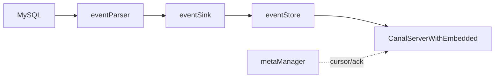

---

## 52. MySQL 复制命令包补充（GTID / Semi-sync）

§6 已介绍 `COM_BINLOG_DUMP`；此处补充 GTID 与半同步细节。

### 52.1 命令字对照

| 命令 | 字节 | 类 | 场景 |
|------|------|-----|------|
| COM_REGISTER_SLAVE | 0x15 | `RegisterSlaveCommandPacket` | dump 前注册 slaveId |
| COM_BINLOG_DUMP | 0x12 | `BinlogDumpCommandPacket` | 按 file+position |
| COM_BINLOG_DUMP_GTID | 0x1e | `BinlogDumpGTIDCommandPacket` | 按 GTIDSet |

### 52.2 GTID Dump 包结构

```31:64:driver/.../BinlogDumpGTIDCommandPacket.java
    public byte[] toBytes() {
        out.write(getCommand());                              // 0x1e
        ByteHelper.writeUnsignedShortLittleEndian(BINLOG_THROUGH_GTID, out);  // flags
        ByteHelper.writeUnsignedIntLittleEndian(slaveServerId, out);
        ByteHelper.writeUnsignedIntLittleEndian(0, out);      // binlog-filename-len = 0
        ByteHelper.writeUnsignedInt64LittleEndian(4, out);    // binlog-pos 占位
        byte[] bs = gtidSet.encode();
        ByteHelper.writeUnsignedIntLittleEndian(bs.length, out);
        out.write(bs);                                        // GTID set 二进制
    }
```

`MysqlConnection.dump(GTIDSet)` **不调用** `sendRegisterSlave`（与 file 模式不同），直接 `sendBinlogDumpGTID`。

### 52.3 dump 主流程（file 模式）

```182:210:parse/.../MysqlConnection.java
    public void dump(String binlogfilename, Long binlogPosition, SinkFunction func) {
        updateSettings();
        loadBinlogChecksum();
        sendRegisterSlave();
        sendBinlogDump(binlogfilename, binlogPosition);
        while (fetcher.fetch()) {
            LogEvent event = decoder.decode(fetcher, context);
            func.sink(event);
            if (event.getSemival() == 1) {
                sendSemiAck(...);   // 半同步复制 ACK
            }
        }
    }
```

### 52.4 Semi-sync 与 checksum

- `loadBinlogChecksum()`：查询 `@@binlog_checksum`，设置 `FormatDescriptionLogEvent` 的 checksum 算法，否则 `LogDecoder` 解析 ROW 事件会错位。
- `sendSemiAck`：当 Master 开启半同步且事件 `semival==1` 时回 ACK，否则 Master 可能阻塞提交。

---

## 53. Spring 装配：default-instance.xml 全图

每个 destination 对应一个 Spring 子上下文，加载 `classpath:spring/default-instance.xml`（import `base-instance.xml`）。

### 53.1 配置加载链

```14:22:deployer/src/main/resources/spring/base-instance.xml
    <bean class="...PropertyPlaceholderConfigurer">
        <property name="locationNames">
            <list>
                <value>classpath:canal.properties</value>
                <value>classpath:${canal.instance.destination:}/instance.properties</value>
            </list>
        </property>
    </bean>
```

Manager 模式下 `PlainCanalInstanceGenerator` 用 `propertiesLocal` 覆盖占位符（§28），无需物理 `conf/{dest}/` 目录。

### 53.2 Bean 依赖图

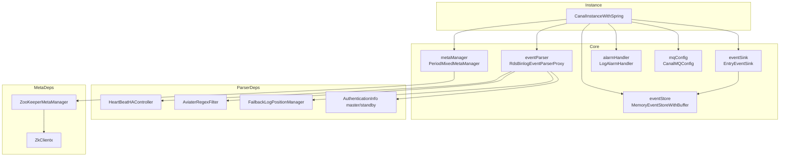

### 53.3 关键配置项与 Bean 映射

| instance.properties 键 | 注入 Bean / 属性 | 作用 |
|------------------------|------------------|------|
| `canal.instance.master.address` | `eventParser.masterInfo` | MySQL 主库 |
| `canal.instance.filter.regex` | `eventParser.eventFilter` | 表白名单 |
| `canal.instance.transaction.size` | `eventParser.transactionSize` → `EventTransactionBuffer` | 事务内最大 entry 数 |
| `canal.instance.memory.buffer.size` | `eventStore.bufferSize` | Store 环形槽位数 |
| `canal.instance.memory.rawEntry` | `eventStore.raw` | TCP 是否 raw 透传 |
| `canal.instance.parser.parallel` | `eventParser.parallel` | Disruptor 并行 |
| `canal.instance.gtidon` | `eventParser.isGTIDMode` | GTID dump |
| `canal.mq.topic` 等 | `mqConfig` | MQ 投递目标（§57） |

`baseEventParser` 抽象父类为 `RdsBinlogEventParserProxy`：未配置 RDS 时行为等同 `MysqlEventParser`（§33）。

---

## 54. EventTransactionBuffer 与事务切分

Parser 将 `LogEvent` 转为 `CanalEntry.Entry` 后，先进入 `EventTransactionBuffer`，**按事务边界批量 flush 到 Sink**。

### 54.1 flush 触发条件

```65:90:parse/src/main/java/com/alibaba/otter/canal/parse/inbound/EventTransactionBuffer.java
    public void add(CanalEntry.Entry entry) {
        switch (entry.getEntryType()) {
            case TRANSACTIONBEGIN:
                flush();           // 先刷上一事务
                put(entry);
                break;
            case TRANSACTIONEND:
                put(entry);
                flush();           // 事务结束，整包提交 Sink
                break;
            case ROWDATA:
                put(entry);
                if (!isDml(eventType)) {
                    flush();       // DDL 等非 DML 立即刷出
                }
                break;
            case HEARTBEAT:
                put(entry);
                flush();
                break;
        }
    }
```

### 54.2 与 transactionSize 的关系

`AbstractEventParser.start()` 中：

```149:150:parse/src/main/java/com/alibaba/otter/canal/parse/inbound/AbstractEventParser.java
        transactionBuffer.setBufferSize(transactionSize);// 默认 1024
```

当单事务内 ROW 数超过 `bufferSize`（2 的幂），`put()` 会 **中途 flush**，把大事务 **切成多个 Entry 列表** 投递 Sink（`default-instance.xml` 注释：超过大小后切分为多个事务投递）。

### 54.3 数据流位置


---

## 55. EntryEventSink 事务过滤与空事务策略

`EntryEventSink` 在 `sinkData` 中做 **表级 filter**、**空事务压缩**、**Store 背压**（§16 已述 `doSink`/`tryPut`）。

### 55.1 filterTransactionEntry

配置：`canal.instance.filter.transaction.entry`（MQ 模式可由 `canal.mq.filterTransactionEntry` 自动设为 true）。

```99:114:sink/src/main/java/com/alibaba/otter/canal/sink/entry/EntryEventSink.java
            if (filterTransactionEntry && (entryType == TRANSACTIONBEGIN || entryType == TRANSACTIONEND)) {
                if (lastTransactionCount <= emptyTransctionThresold   // 8192
                    && abs(executeTime - lastTransactionTimestamp) <= emptyTransactionInterval) {  // 5s
                    continue;   // 丢弃空事务头尾
                } else if (entryType == TRANSACTIONEND) {
                    lastTransactionCount.set(0L);  // 仅 END 重置计数，保证 BEGIN/END 成对
                }
            }
```

目的：高 QPS 下大量 **无行变更的空事务** 不占 Store；仍周期性放行 END，便于推进位点。

### 55.2 空事务放行策略

若无 ROWDATA/HEARTBEAT，仅含 BEGIN/END：

```126:139:sink/src/main/java/com/alibaba/otter/canal/sink/entry/EntryEventSink.java
            if (filterEmtryTransactionEntry && !events.isEmpty()) {
                if (abs(currentTimestamp - lastEmptyTransactionTimestamp) > emptyTransactionInterval
                    || lastEmptyTransactionCount > emptyTransctionThresold) {
                    return doSink(events);   // 每 5s 或超 8192 次放一批
                }
            }
            return true;   // 多数空事务直接丢弃
```

### 55.3 HeartBeatEntryEventHandler

构造时默认 `addHandler(new HeartBeatEntryEventHandler())`，在 `before/after` 链路上处理心跳 Entry（与 detecting SQL 心跳配合）。

---

## 56. Store 批次组装与 ddlIsolation

`MemoryEventStoreWithBuffer.doGet` 决定 **一次 getWithoutAck 返回哪些 Event**。

### 56.1 两种 batchMode

| 模式 | 配置 | 停止条件 |
|------|------|----------|
| `MEMSIZE`（默认） | `canal.instance.memory.batch.mode=MEMSIZE` | 累计内存 ≥ `batchSize * bufferMemUnit` |
| `ITEMSIZE` | `ITEMSIZE` | 条数 ≥ `batchSize` |

### 56.2 ddlIsolation

`canal.instance.get.ddl.isolation=true` 时：

```294:303:store/src/main/java/com/alibaba/otter/canal/store/memory/MemoryEventStoreWithBuffer.java
                if (ddlIsolation && isDdl(event.getEventType())) {
                    if (entrys.size() == 0) {
                        entrys.add(event);   // batch 仅含本条 DDL
                    } else {
                        end = next - 1;      // DDL 不混入 DML batch
                    }
                    break;
                }
```

保证 **DDL 单独成批**，避免与 DML 混在一个 `Message` 里导致下游执行顺序问题。

### 56.3 ack 位点选择（GTID）

```340:348:store/src/main/java/com/alibaba/otter/canal/store/memory/MemoryEventStoreWithBuffer.java
        for (int i = entrys.size() - 1; i >= 0; i--) {
            Event event = entrys.get(i);
            if (TRANSACTIONEND == event.getEntryType() || isDdl(event.getEventType()) ...) {
                range.setAck(CanalEventUtils.createPosition(event));
                break;
            }
        }
```

GTID 模式下 **ack 必须落在事务 END**，否则重连会从 GTID 中间开始导致丢最后一个事务。

---

## 57. CanalMQConfig 与 CanalMQStarter

### 57.1 Instance 级 MQ 目标

```229:237:deployer/src/main/resources/spring/default-instance.xml
    <bean id="mqConfig" class="com.alibaba.otter.canal.instance.core.CanalMQConfig">
        <property name="topic" value="${canal.mq.topic}" />
        <property name="dynamicTopic" value="${canal.mq.dynamicTopic}" />
        <property name="partitionsNum" value="${canal.mq.partitionsNum}" />
        <property name="partitionHash" value="${canal.mq.partitionHash}" />
        ...
    </bean>
```

每个 destination 可有 **独立 topic / 动态 topic 规则 / 分区 hash**（表主键字段列表）。

### 57.2 每 destination 一个 Worker

```62:68:server/src/main/java/com/alibaba/otter/canal/server/CanalMQStarter.java
            String[] dsts = StringUtils.split(destinations, ",");
            for (String destination : dsts) {
                CanalMQRunnable canalMQRunnable = new CanalMQRunnable(destination);
                canalMQWorks.put(destination, canalMQRunnable);
                executorService.execute(canalMQRunnable);
            }
```

Worker 内部逻辑：

```157:199:server/src/main/java/com/alibaba/otter/canal/server/CanalMQStarter.java
                canalDestination.setTopic(mqConfig.getTopic());
                canalDestination.setDynamicTopic(mqConfig.getDynamicTopic());
                canalServer.subscribe(clientIdentity);   // clientId 固定 1001
                message = canalServer.getWithoutAck(clientIdentity, getBatchSize, ...);
                canalMQProducer.send(canalDestination, message, new Callback() {
                    public void commit() { canalServer.ack(clientIdentity, batchId); }
                    public void rollback() { canalServer.rollback(clientIdentity, batchId); }
                });
```

**本质**：MQ 模式是内置的 **虚拟客户端**（destination + clientId=1001），与外部 TCP 客户端竞争同一 Store；`CanalController` 在 instance 启停时调用 `startDestination` / `stopDestination` 联动 MQ 线程。

### 57.3 dynamicTopic 示例

`canal.mq.dynamicTopic` 形如 `test\\..*` → topic 名 `test_{schema}_{table}`，由 `MQMessageUtils.messageTopics` 按 Entry 拆分后并行 send（§31）。

---

## 58. CanalStarter：tcp 与 MQ 模式切换

全局配置：`canal.serverMode`（`canal.properties`），取值 `tcp` | `kafka` | `rocketMQ` | `rabbitMQ` | `pulsarmq` 等。

```64:84:deployer/src/main/java/com/alibaba/otter/canal/deployer/CanalStarter.java
        String serverMode = CanalController.getProperty(properties, CanalConstants.CANAL_SERVER_MODE);
        if (!"tcp".equalsIgnoreCase(serverMode)) {
            canalMQProducer = loader.getExtension(serverMode.toLowerCase(), "/plugin", "/canal/plugin");
            canalMQProducer.init(properties);
            System.setProperty(CanalConstants.CANAL_WITHOUT_NETTY, "true");  // 可不启 11111
            if (mqProperties.isFlatMessage()) {
                System.setProperty("canal.instance.memory.rawEntry", "false");  // 避免 ByteString 二次解析
            }
        }
        controller.start();
        if (canalMQProducer != null) {
            canalMQStarter.start(CanalController.getDestinations(properties));
        }
```

| serverMode | 11111 TCP | MQ Producer | Store rawEntry（flat 时） |
|------------|-----------|-------------|---------------------------|
| tcp | 启用 | 无 | 默认 true |
| kafka/... | 可禁用 | SPI 加载 | 强制 false |

Admin 端口 11110 与 `CanalController` 在两种模式下均会启动（若配置）。

---

## 59. PeriodMixedMetaManager 元数据刷新

`default-instance.xml` 默认 Meta 实现：**内存 + ZK 定时合并**。

```26:30:meta/src/main/java/com/alibaba/otter/canal/meta/PeriodMixedMetaManager.java
 * 1. 去除 batch 数据刷新到 zk，切换时 batch 可忽略
 * 2. cursor 定时刷新，合并多次 ack 请求
```

| 数据 | 内存 | ZK 持久化 |
|------|------|-----------|
| subscribe / filter | MemoryMetaManager | ZK |
| cursor（消费位点） | 内存 + 脏标记 | 每 `period` ms 批量 flush |
| batch mark（未 ack） | 启动时从 ZK 加载 | 运行期 **不写 ZK**（切换可重放） |

`canal.zookeeper.flush.period` 默认 1000ms。与 `ZooKeeperMetaManager`（§25）配合，cursor 路径见 §41。

---

## 60. RDB Adapter：SQL 生成与批量写入

模块：`client-adapter/rdb`，`@SPI("rdb")`。

### 60.1 配置与映射

- `rdb/mytest_user.yml`：`outerAdapterKey` → `MappingConfig`（源表 → 目标库表、列映射、主键 hash 并发）。
- `mappingConfigCache` 键：`{destination}_{database}-{table}`（MQ 模式加 `groupId` 前缀）。

### 60.2 同步流水线

```154:186:client-adapter/rdb/.../RdbSyncService.java
    public void sync(Map mappingConfig, List<Dml> dmls, ...) {
        sync(dmls, dml -> {
            if (dml.getIsDdl()) { columnsTypeCache.remove(...); return false; }
            configMap = mappingConfig.get(destination + "_" + database + "-" + table);
            for (MappingConfig config : configMap.values()) {
                appendDmlPartition(config, dml);  // 按 pkHash 分到 threads 个队列
            }
            return true;
        });
    }
```

`appendDmlPartition`：`SingleDml.dml2SingleDmls` 把多行 Dml 拆成单行，再 `pkHash % threads` 分区并行。

### 60.3 SQL 拼装（INSERT 示例）

```249:267:client-adapter/rdb/.../RdbSyncService.java
    private void insert(BatchExecutor batchExecutor, MappingConfig config, SingleDml dml) {
        Map<String, String> columnsMap = SyncUtil.getColumnsMap(dbMapping, data);
        insertSql.append("INSERT INTO ").append(SyncUtil.getDbTableName(dbMapping, dbType)).append(" (");
        columnsMap.forEach((targetCol, srcCol) -> insertSql.append(backtick).append(targetCol)...);
        insertSql.append(") VALUES (");
        // SyncUtil.getTargetColumnValue 做类型转换后 BatchExecutor.execute
    }
```

UPDATE/DELETE 用 **主键列** 构造 WHERE；`BatchExecutor` 单连接 `autoCommit=false`，多句 `execute` 后一次 `commit()`。

### 60.4 BatchExecutor

```54:74:client-adapter/rdb/.../BatchExecutor.java
    public void execute(String sql, List<Map<String, ?>> values) {
        PreparedStatement pstmt = getConn().prepareStatement(sql);
        SyncUtil.setPStmt(type, pstmt, value, i + 1);
        pstmt.execute();
    }
    public void commit() { getConn().commit(); }
```

`skipDupException` 可忽略唯一键冲突；`mirror` 模式走 `RdbMirrorDbSyncService` 整库镜像（独立配置块）。

---

## 61. ES Adapter：ESSyncService 同步策略

模块：`client-adapter/escore`（`ES6xAdapter` / `ES7xAdapter` / `ES8xAdapter` 继承 `ESAdapter`）。

### 61.1 入口

```42:61:client-adapter/escore/.../ESSyncService.java
    public void sync(Collection<ESSyncConfig> esSyncConfigs, Dml dml) {
        for (ESSyncConfig config : esSyncConfigs) {
            this.sync(config, dml);   // 一张源表可映射多个 ES index
        }
    }
```

### 61.2 按 DML 类型分发

```93:102:client-adapter/escore/.../ESSyncService.java
            if (type.equalsIgnoreCase("INSERT")) {
                insert(config, dml);
            } else if (type.equalsIgnoreCase("UPDATE")) {
                update(config, dml);
            } else if (type.equalsIgnoreCase("DELETE")) {
                delete(config, dml);
            }
```

### 61.3 insert 的四种路径

`insert` 根据 `SchemaItem`（由 mapping 中 SQL 解析）选择策略：

| 场景 | 方法 | 行为 |
|------|------|------|
| 单表、字段均为简单映射 | `singleTableSimpleFiledInsert` | 直接用 Dml 行数据写 ES document |
| 主表变更 | `mainTableInsert` | 执行 mapping SQL 查全字段再索引 |
| 从表、简单关联 | `joinTableSimpleFieldOperation` | 用关联字段拼 ES 文档局部更新 |
| 从表、复杂 SQL / 子查询 | `wholeSqlOperation` | 全量 SQL 重查后 upsert ES |

`SchemaItem` 由 `SqlParser` 解析 yml 中的 `sql` 字段得到表关系与 SELECT 列表；`ESTemplate` 封装 bulk index/update/delete。

### 61.4 与 RDB 的差异

- RDB：**行列映射 + JDBC PreparedStatement**，强调事务批量。
- ES：**文档模型 + 可能回源 SQL 补全字段**，支持宽表、多表 join 映射；`syncByTimestamp` 模式跳过实时 DML，走定时全量。

---

## 62. LogEventConvert：LogEvent → Entry

`LogEventConvert` 是 binlog 五层中 **第四层→第五层** 的核心：`LogEvent`（dbsync 二进制对象）→ `CanalEntry.Entry`（Protobuf）。

### 62.1 parse() 事件分发

```97:144:parse/src/main/java/com/alibaba/otter/canal/parse/inbound/mysql/dbsync/LogEventConvert.java
    public Entry parse(LogEvent logEvent, boolean isSeek) {
        switch (logEvent.getHeader().getType()) {
            case QUERY_EVENT:        return parseQueryEvent(...);   // DDL/DCL/部分 DML
            case XID_EVENT:          return parseXidEvent(...);     // 事务 COMMIT → TRANSACTIONEND
            case TABLE_MAP_EVENT:    parseTableMapEvent(...);     // 更新 TableMeta，不产出 Entry
            case WRITE_ROWS_EVENT:   return parseRowsEvent(...);
            case UPDATE_ROWS_EVENT:  return parseRowsEvent(...);
            case DELETE_ROWS_EVENT:  return parseRowsEvent(...);
            case GTID_LOG_EVENT:     return parseGTIDLogEvent(...);
            case HEARTBEAT_LOG_EVENT: return parseHeartbeatLogEvent(...);
            ...
        }
    }
```

| LogEvent 类型 | 产出 EntryType | 说明 |
|---------------|----------------|------|
| QUERY（BEGIN） | TRANSACTIONBEGIN | 含 threadId、XA 信息 |
| XID | TRANSACTIONEND | InnoDB 事务提交 |
| WRITE/UPDATE/DELETE ROWS | ROWDATA | 行变更主体 |
| GTID | 写入 Header.gtid | 供 GTID 位点 |
| HEARTBEAT | HEARTBEAT | Master idle 信号 |

`TABLE_MAP_EVENT` 只更新 `TableMetaCache`，**不向下游投递**；后续 ROW 事件用 `table_id` 查表结构。

### 62.2 parseRowsEvent：行数据反序列化

```521:597:parse/.../LogEventConvert.java
    public Entry parseRowsEvent(RowsLogEvent event, TableMeta tableMeta) {
        tableMeta = parseRowsEventForTableMeta(event);  // 从 cache 按 table_id 取
        RowsLogBuffer buffer = event.getRowsBuf(charset);
        while (buffer.nextOneRow(columns, false)) {
            if (INSERT)  parseOneRow(..., isAfter=true);   // afterColumns
            if (DELETE)  parseOneRow(..., isAfter=false);  // beforeColumns
            if (UPDATE)  parseOneRow(before) + parseOneRow(after);
            rowChangeBuider.addRowDatas(rowDataBuilder.build());
        }
        return createEntry(header, ROWDATA, rowChange.toByteString());
    }
```

`parseOneRow` 按 `TableMeta.FieldMeta` 将 binlog 列值转为 `CanalEntry.Column`（含 `mysqlType`、`sqlType`、`value` 字符串）。支持：

- **列级白/黑名单**：`fieldFilterMap` / `fieldBlackFilterMap`（`canal.instance.filter.field`）
- **online DDL 列数不一致**：检测 `columnInfo.length > tableMeta.fields.size()`，结合 TSDB 或 RDS 无主键特殊列
- **filterTableError**：表结构异常时返回 null 而非抛错（issue #92）

### 62.3 与 TSDB 的配合

`parseRowsEventForTableMeta` 从 `TableMetaCache` 按 **事件时间戳** 取对应版本的 `TableMeta`（§26）。`TABLE_MAP` 到达时更新 cache，保证 ROW 解析使用正确列定义。

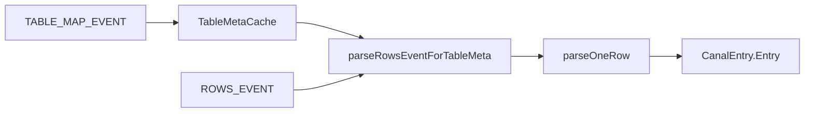

---

## 63. AviaterRegexFilter 表级与列级过滤

### 63.1 表级：schema.table 正则

配置：`canal.instance.filter.regex`（白名单，默认 `.*\..*`）、`canal.instance.filter.black.regex`（黑名单）。

```61:74:filter/src/main/java/com/alibaba/otter/canal/filter/aviater/AviaterRegexFilter.java
    public boolean filter(String filtered) {
        env.put("pattern", pattern);           // 多规则用 | 连接，已 ^...$ 包裹
        env.put("target", filtered.toLowerCase());  // 如 mydb.mytable
        return (Boolean) exp.execute(env);   // regex(pattern, target)
    }
```

**构造优化**：

1. 逗号分隔多规则 → 按 **长度降序** 排序（避免 `foo` 抢先匹配 `foot`）
2. 每条规则加 `^` `$` 全匹配
3. `RegexFunction` 使用 Apache ORO `Perl5Matcher.matches`

```20:26:filter/src/main/java/com/alibaba/otter/canal/filter/aviater/RegexFunction.java
    public AviatorObject call(Map env, AviatorObject arg1, AviatorObject arg2) {
        return AviatorBoolean.valueOf(matcher.matches(text, PatternUtils.getPattern(pattern)));
    }
```

黑名单构造时 `defaultEmptyValue=false`：空 pattern **不匹配任何表**（全部过滤）。

### 63.2 过滤生效点

| 阶段 | 组件 | 对象 |
|------|------|------|
| Parser | `AbstractEventParser.eventFilter` | 解析后 Entry，表名 `schema.table` |
| Parser | `LogEventConvert.nameFilter` | ROW 解析前可跳过 |
| Sink | `EntryEventSink.doFilter` | 投递 Store 前二次过滤 |
| 客户端 | `Sub.filter` / `subscribe(filter)` | Server 动态更新 Parser filter（§51） |

客户端 subscribe 的 filter **覆盖** instance 默认 regex，实现 per-client 订阅。

### 63.3 列级过滤

`canal.instance.filter.field` / `filter.black.field` 格式：`schema.table:col1,col2`，注入 `LogEventConvert.fieldFilterMap`，在 `parseOneRow` 中跳过非关注列，减小 Entry 体积。

---

## 64. RDB 镜像库：RdbMirrorDbSyncService

**镜像库（mirrorDb）**：源库整库同步到目标库，**表结构随 DDL 自动演进**，无需为每张表写 mapping。

### 64.1 配置形态

`rdb.yml` 中 `mirrorDb` 段：指定 `database`、目标 `dataSourceKey`，与普通过表 mapping 并存。`RdbAdapter` 同时持有 `RdbSyncService` 与 `RdbMirrorDbSyncService`。

### 64.2 同步逻辑

```50:87:client-adapter/rdb/.../RdbMirrorDbSyncService.java
    public void sync(List<Dml> dmls) {
        for (Dml dml : dmls) {
            MirrorDbConfig cfg = mirrorDbConfigCache.get(destination + "." + database);
            if (dml.getIsDdl()) {
                syncDml(dmlList);          // 先刷完积压 DML
                executeDdl(cfg, dml);      // 目标库执行同源 DDL
                remove columnsTypeCache / tableConfig
            } else {
                initMappingConfig(table, ...);  // 懒创建 1:1 表映射 mapAll=true
                dmlList.add(dml);
            }
        }
        syncDml(dmlList);
    }
```

`initMappingConfig` 为每张首次出现的表自动生成 `MappingConfig`：`targetDb=sourceDb`、`targetTable=sourceTable`、`mapAll=true`、主键同名映射。

### 64.3 DDL 执行

```152:169:client-adapter/rdb/.../RdbMirrorDbSyncService.java
    private void executeDdl(MirrorDbConfig mirrorDbConfig, Dml ddl) {
        String sql = ddl.getSql().replace("`", backtick);  // 适配 Oracle/PG 引号
        statement.execute(sql);
        mirrorDbConfig.getTableConfig().remove(ddl.getTable());
    }
```

**顺序保证**：DDL 前必须 `syncDml` 清空队列，避免 DML 与建表顺序错乱。

### 64.4 与普通 RDB mapping 对比

| 模式 | 配置量 | DDL | 列映射 |
|------|--------|-----|--------|
| 普通过表 mapping | 每表 yml | 需手工或 ETL | 可自定义 target 列 |
| mirrorDb | 每库一条 | 自动转发 SQL | 全列 1:1 |

---

## 65. example 模块示例对照

模块：`example/`，演示 **最小可运行消费端**，无 Spring 依赖。

### 65.1 类层次

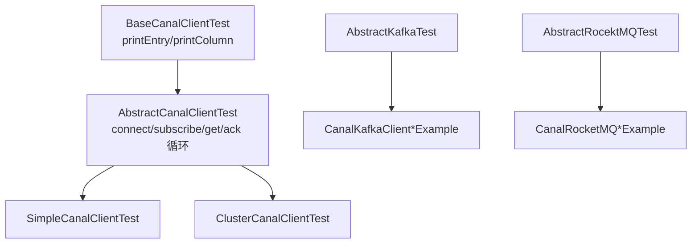

### 65.2 TCP 消费模板（与 Adapter 同源）

```51:90:example/.../AbstractCanalClientTest.java
    protected void process() {
        while (running) {
            connector.connect();
            connector.subscribe();
            while (running) {
                Message message = connector.getWithoutAck(batchSize);
                if (batchId != -1 && size > 0) {
                    printEntry(message.getEntries());
                }
                if (batchId != -1) {
                    connector.ack(batchId);
                }
            }
        } catch (Throwable e) {
            connector.rollback();
        } finally {
            connector.disconnect();
        }
    }
```

与 §44 `CanalTCPConsumer`、§37 CanalProtocol 完全一致。

### 65.3 各入口对照

| 类 | 连接方式 | 用途 |
|----|----------|------|
| `SimpleCanalClientTest` | `newSingleConnector(ip:11111)` | 单机 TCP |
| `ClusterCanalClientTest` | `newClusterConnector(zk, dest)` | ZK 发现 Server + Failover |
| `CanalKafkaClientExample` | `KafkaCanalConnector` protobuf | MQ 非 flat |
| `CanalKafkaClientFlatMessageExample` | `KafkaCanalConnector(..., flat=true)` | FlatMessage JSON |
| `CanalRocketMQClientExample` | `RocketMQCanalConnector` | RocketMQ 消费 |
| `SimpleCanalClientPermanceTest` | 压测 batchSize/吞吐 | 性能基准 |

`BaseCanalClientTest.printEntry` 演示如何解析 `TRANSACTIONBEGIN/ROWDATA`、打印 GTID（`header.gtid` 与 `props.curtGtid`）、BLOB 列 UTF-8 转换。

---

## 66. CanalLauncher 进程启动全链路

入口：`deployer/.../CanalLauncher.main`。

### 66.1 启动分支

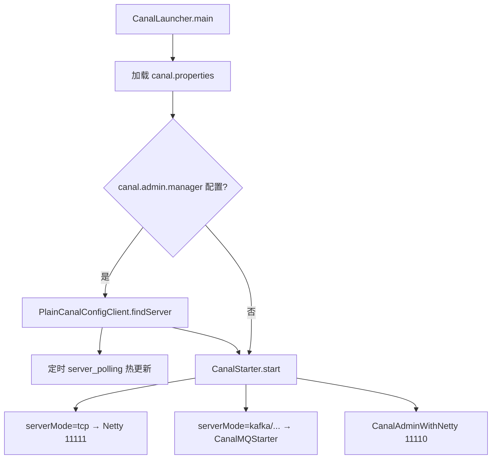

### 66.2 Manager 模式轮询

```74:100:deployer/.../CanalLauncher.java
    PlainCanalConfigClient configClient = new PlainCanalConfigClient(managerAddress, user, passwd, registerIp, adminPort, autoRegister, ...);
    PlainCanal canalConfig = configClient.findServer(null);
    managerProperties.putAll(properties);
    executor.scheduleWithFixedDelay(() -> {
        PlainCanal newConfig = configClient.findServer(lastMd5);
        if (newConfig != null) {
            canalStater.stop();
            canalStater.start();   // 全局 canal.properties 变更 → 整进程重启
        }
    }, scanInterval);
```

`runningLatch.await()` 阻塞主线程，ShutdownHook 释放。

### 66.3 与 CanalStarter 分工

| 类 | 职责 |
|----|------|
| `CanalLauncher` | 读配置、Admin 轮询、创建 `CanalStarter` |
| `CanalStarter` | 加载 MQ Producer、创建 `CanalController`、启 Admin Netty |
| `CanalController` | Instance 生成、ZK Monitor、嵌入 Server |

---

## 67. MysqlConnector 连接阶段协议

Canal 连 MySQL 使用 **标准 MySQL Client/Server 协议**（非 Canal 自定义协议），实现在 `driver/.../MysqlConnector.java`。

### 67.1 连接阶段时序

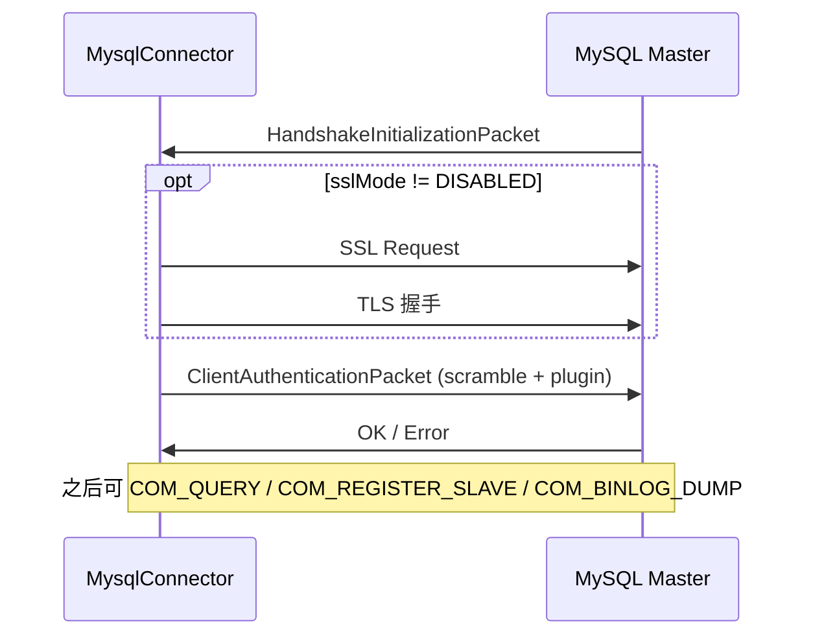

### 67.2 negotiate 核心步骤

```182:212:driver/.../MysqlConnector.java
    private void negotiate(SocketChannel channel) {
        HandshakeInitializationPacket handshake = readHandshake();
        if (sslMode != DISABLED) {
            send SslRequestCommandPacket;
            upgradeToSSL();
        }
        // 根据 server auth plugin 选择 mysql_native_password / caching_sha2 / sha256...
        send ClientAuthenticationPacket(username, scramble(password, seed));
        read OK packet;
    }
```

与 Canal **消费端口认证**（§38）类似，均基于 MySQL scramble；但这里是 **真实连库账号**（`canal.instance.dbUsername`），权限需 `REPLICATION SLAVE, REPLICATION CLIENT` 等。

### 67.3 与 dump 的关系

`negotiate` 成功后，`MysqlConnection` 方可：

1. `COM_QUERY` 查 `@@binlog_checksum`、`SHOW MASTER STATUS` 等
2. `COM_REGISTER_SLAVE`（0x15）
3. `COM_BINLOG_DUMP` / `COM_BINLOG_DUMP_GTID`（§52）

连接池：`SocketChannelPool` 复用 channel；`soTimeout` 默认 1h，与 binlog 长连接匹配。

---

## 附录：推荐阅读源码顺序

若希望自行通读 Binlog 监听全链路，建议按以下顺序：

1. `BinlogDumpCommandPacket` / `RegisterSlaveCommandPacket` — 理解发什么给 MySQL  
2. `MysqlConnector.negotiate` — 理解如何连上 MySQL  
3. `MysqlConnection.dump` — 理解 dump 全流程  
4. `DirectLogFetcher.fetch` — 理解如何从 socket 变成 LogBuffer  
5. `LogDecoder.decode` — 理解 binlog 二进制结构  
6. `LogEventConvert.parse` — 理解 ROW/QUERY 如何变成 Entry  
7. `AbstractEventParser.start` — 理解线程模型与重试  
8. `EventTransactionBuffer` → `EntryEventSink` → `MemoryEventStoreWithBuffer` — 理解下游背压  
9. `CanalServerWithEmbedded.getWithoutAck/ack` — 理解客户端消费语义  
10. `CanalController` + `ServerRunningMonitor` — 集群启停与选主  
11. `EntryEventSink.doSink` + `MemoryEventStoreWithBuffer.ack` — 背压与环形缓冲  
12. `CanalAdapterLoader` + `AdapterProcessor` — 异构数据落地  
13. `CanalMQStarter` — MQ 投递与 ack 回调  
14. `SimpleCanalConnector` + `SessionHandler` — Client/Server 协议对称  
15. `CanalAdminController` + `PollingConfigServiceImpl` — 管控与配置下发  
16. `PrometheusService` + `StoreCollector` — 可观测性  
17. `findStartPositionInternal` + `MetaLogPositionManager` — 启动位点策略  
18. `DatabaseTableMeta` — 表结构版本化  
19. `SpringCanalInstanceGenerator` / `PlainCanalInstanceGenerator` — Instance 装配两种模式  
20. `SpringInstanceConfigMonitor` / `ManagerInstanceConfigMonitor` — 配置热加载  
21. `CanalAdminWithNetty` + admin `SessionHandler` — 11110 管控协议  
22. `CanalKafkaProducer` / `CanalRocketMQProducer` — MQ 投递与 ack 回调  
23. `PlainCanalConfigClient` — HTTP polling 与 Admin 协同  
24. `GroupEventParser` / `RdsBinlogEventParserProxy` — 多流与云上 RDS  
25. `CanalMessageDeserializer` — TCP 客户端反序列化  
26. `HbaseAdapter` + `HbaseSyncService` — 宽表落地（可选）  
27. `CanalProtocol.proto` + `FixedHeaderFrameDecoder` — 理解帧格式与 PacketType  
28. `SimpleCanalConnector.doConnect` + `SecurityUtil` — 握手与认证  
29. `SessionHandler` — SUBSCRIPTION/GET/CLIENTACK 服务端实现  
30. `AdminProtocol.proto` + admin `SessionHandler` — 管控协议  
31. `PollingConfigServiceImpl` — Manager 节点注册与配置 md5  
32. `ZookeeperPathUtils` + `ServerRunningMonitor` — ZK 选主路径  
33. `CanalMessageSerializerUtil` — MQ 与 TCP 序列化双路径  
34. `CanalRabbitMQProducer` / `CanalPulsarMQProducer` — 其余 MQ SPI  
35. `AdapterProcessor` + `CanalKafkaConsumer` — adapter MQ 消费闭环  
36. `FlatMessage` + `MQMessageUtils.messageConverter` — MQ 行级 JSON  
37. `EntryProtocol.proto` — Entry/RowChange/Header 结构  
38. `ClusterNodeAccessStrategy` + `ClusterCanalConnector.restart` — Client 集群 Failover  
39. `ClientRunningMonitor` — 消费端 ZK 选主  
40. `CanalConnectors` — 三种连接模式入口  
41. `MysqlMultiStageCoprocessor` — Disruptor 四阶段并行解析  
42. `AbstractCanalInstance.start` — Instance 组件启动顺序  
43. `BinlogDumpGTIDCommandPacket` + `MysqlConnection.dump` — GTID 与半同步  
44. `default-instance.xml` + `base-instance.xml` — Spring Bean 装配  
45. `EventTransactionBuffer` — 事务边界 flush  
46. `EntryEventSink.sinkData` — 空事务过滤  
47. `MemoryEventStoreWithBuffer.doGet` — batch 与 ddlIsolation  
48. `CanalMQStarter.worker` + `CanalMQConfig` — MQ 虚拟客户端  
49. `CanalStarter.start` — serverMode 切换  
50. `PeriodMixedMetaManager` — cursor 定时刷 ZK  
51. `RdbSyncService` + `BatchExecutor` — JDBC 落地  
52. `ESSyncService.insert/update` — ES 多策略同步  
53. `LogEventConvert.parse/parseRowsEvent` — LogEvent 转 Entry  
54. `AviaterRegexFilter` + `RegexFunction` — 表白名单  
55. `RdbMirrorDbSyncService` — 镜像库 DDL/DML  
56. `AbstractCanalClientTest` + example 各 Example — 消费端模板  
57. `CanalLauncher.main` + `CanalStarter.start` — 进程启动  
58. `MysqlConnector.negotiate` — MySQL 连接认证  

---

*文档生成说明：内容基于 canal 1.1.9-SNAPSHOT 工作区源码静态分析，若版本升级请以实际代码为准。*
