# Alibaba Canal 源码架构与 Binlog 监听原理深度分析

> 基于 canal **1.1.9-SNAPSHOT** 源码梳理，面向需要深入理解实现细节的开发者。  
> 本文已合并原 `CLIENT_ADAPTER_SOURCE_ANALYSIS.md` 全文。正文按 **六篇** 组织；细粒度 **§1–§114** 锚点保留（部分节已归并，见 [附录 A](#附录-a章节归并对照表)）。

---

## 文档导读

### 如何阅读

| 目标 | 建议路径 |
|------|----------|
| 30 分钟建立全局观 | [§3](#3-整体运行时架构) → [§5](#5-核心数据流水线) → [§6](#6-binlog-监听底层原理重点) → [§103](#103-全链路架构速查一页纸) |
| 跟一条 binlog 到消费 | 第二篇（§6–§11）→ 第三篇 Server（§15–§19）→ 第五篇 Client（§21） |
| 上生产 / 排障 | [§72](#72-全链路故障排查清单) + [§76](#76-性能调优参数速查表) + [§12](#12-关键类索引) |
| Adapter 同步 | [§13](#13-client-adapter-源码剖析) + 第四篇 Adapter 扩展（§60–§64、§82–§88） |
| 查类 / 查配置 | [§12](#12-关键类索引)、[§98](#98-canalproperties-与-instanceproperties-配置释义) |

**说明**：早期按专题拆成 114 个小节，存在「概要 + 深度」重复。现已将 **§110–§114** 正文并入对应主节（§16、§31、§35、§41、§46），原编号仅保留跳转锚点。其它重复对（如 §47/§96）在导读表中标注 **主读 / 延伸**。

### 六篇结构（推荐目录）

| 篇 | 主题 | 主读章节 | 延伸（可选） |
|----|------|----------|--------------|
| **一、总览** | 定位、模块、启动、类索引 | §1–§4、§12 | §11 设计亮点 |
| **二、Binlog 解析链** | 拉流 → dbsync → Entry | §5–§11 | §52、§54、§62、§67、§70、§73、§84、§105、§109 |
| **三、Server 与投递** | Instance、Sink/Store、TCP/MQ | §14–§19、§51、§53 | §55–§56、§57–§58、§74、§80–§81、§87、§97 |
| **四、协议与生态** | Protobuf、MQ、Adapter | §13、§36–§46 | §44–§45、§60–§64、§75、§82–§88、§93、§102 |
| **五、HA 与位点** | ZK、Meta、主备、位点决策 | §9–§10、§17、§20 | §24–§26、§59、§68、§85–§86、§91、§95、§99、§101、§104 |
| **六、运维与速查** | Admin、配置、监控、排障 | §22、§28–§35、§66–§72、§76–§79、§98、§103 | §32–§34、§40、§77–§78、§92、§106–§107 |

---

## 目录（按篇）

**一、总览** — [§1](#1-项目定位与核心思想) · [§2](#2-maven-模块架构) · [§3](#3-整体运行时架构) · [§4](#4-启动与生命周期) · [§12](#12-关键类索引)

**二、Binlog 解析链** — [§5](#5-核心数据流水线) · [§6](#6-binlog-监听底层原理重点) · **[§7](#7-binlog-二进制解析dbsync)（TableMap/ROW/checksum/压缩事务）** · [§8](#8-业务语义转换logeventconvert) · [§9](#9-位点与-meta-双轨管理) · [§10](#10-高可用与容错设计) · [§11](#11-技术亮点与设计亮点) · 延伸：§52 §54 §62 §67 §70 §73 §84 §105 §109

**三、Server 与投递** — [§14](#14-deployer-与-canalcontroller) · [§15](#15-server-消费-api-与-netty) · [§16](#16-sink-与-store-源码) · [§17](#17-位点管理器与-meta-实现) · [§18](#18-过滤与表结构-tsdb) · [§19](#19-mq-投递canalmqstarter) · [§51](#51-abstractcanalinstance-组件装配与生命周期) · [§53](#53-spring-装配default-instancexml-全图) · 延伸：§55–§58 §66 §74 §80–§81 §87 §97

**四、协议与生态** — [§13](#13-client-adapter-源码剖析) · [§36](#36-canal-通信架构总览) · [§37](#37-tcp-数据协议详解canalprotocol) · [§38](#38-认证机制mysql-风格-scramble) · [§42](#42-canalmessageserializerutil-序列化) · [§45](#45-flatmessage-与-commonmessage-数据模型) · [§46](#46-canalentry-协议结构) · [§31](#31-kafka-producer-发送链路) · [§43](#43-rabbitmq--pulsar-producer) · 延伸：§39–§40 §44 §60–§64 §75 §82–§88 §93 §102

**五、HA 与位点** — [§20](#20-ha-控制器源码) · [§21](#21-canal-java-client-源码) · [§41](#41-zookeeper-路径与-serverclient-选主) · [§47](#47-clustercanalconnector-集群消费与-failover) · [§49](#49-canalconnectors-连接工厂) · 延伸：§24–§26 §48 §59 §68 §85–§86 §90–§91 §95 §99–§101 §104

**六、运维与速查** — [§22](#22-canal-admin-与配置下发) · [§28](#28-instance-生成spring-与-manager-模式) · [§29](#29-本地-conf-热加载springinstanceconfigmonitor) · [§35](#35-manager-配置监听与-clientmq-补充) · [§72](#72-全链路故障排查清单) · [§76](#76-性能调优参数速查表) · [§78](#78-生产部署拓扑与端口规划) · [§98](#98-canalproperties-与-instanceproperties-配置释义) · [§103](#103-全链路架构速查一页纸) · 延伸：§23 §32–§34 §65 §66 §79 §92 §106–§108

**已归并锚点（跳转用）** — [§110→§16.3](#163-entryeventsink-背压与空事务深度) · [§111→§35.5](#355-managerinstanceconfigmonitor-深度) · [§112→§31.4](#314-kafka-与-rocketmq-producer-对比) · [§113→§46.5](#465-eventtype-枚举速查) · [§114→§41.4](#414-serverrunningmonitor-抢主时序)

<details>
<summary>附录：§1–§114 完整编号索引（展开）</summary>

§1–§12 总览与索引 · §13–§21 生态与 Client · §22–§35 Admin/配置 · §36–§58 协议与 MQ 细节 · §59–§72 Meta/Adapter/排障 · §73–§103 深度与速查 · §104–§109 Binlog/MQ 源码走读 · §110–§114 已归并（见上）

</details>

---

## 1. 项目定位与核心思想

Canal 是阿里巴巴开源的 **MySQL 增量日志解析与订阅** 中间件。其本质不是“侵入式监听数据库”，而是 **完整模拟 MySQL 主从复制中的 Slave 角色**：

1. 通过 MySQL Client/Server 协议与 Master 建立 TCP 连接并完成认证；
2. 发送 `COM_REGISTER_SLAVE` 注册复制身份；
3. 发送 `COM_BINLOG_DUMP`（或 GTID 变体）请求 Master 从指定位点开始推送 binlog 字节流；
4. 在本地按 MySQL binlog 格式解码事件，再转换为 Canal 统一的 `CanalEntry`（Protobuf）供下游消费。

这与 README 中的描述一致：Canal 伪装成 Slave，Master 主动推送 binary log，Canal 负责解析 byte 流。

---

## 2. Maven 模块架构

根 POM：`pom.xml`，版本 `1.1.9-SNAPSHOT`。

### 2.1 核心链路模块（按依赖顺序）

| 模块 | 路径 | 职责 |
|------|------|------|
| **common** | `common/` | ZK 客户端、JSON、地址工具、`ServerRunningMonitor`（Server 级 HA） |
| **protocol** | `protocol/` | Protobuf 协议、`Entry`、`Message`、位点 `EntryPosition`/`LogPosition` |
| **driver** | `driver/` | MySQL 原生协议：握手、认证、命令包、SocketChannel |
| **dbsync** | `dbsync/` | 从 TDDL 演化来的 **binlog 二进制解码器**（`LogDecoder`、`LogEvent`） |
| **filter** | `filter/` | Aviator 正则表/库过滤 |
| **parse** | `parse/` | 连接 MySQL、dump binlog、解析、位点管理、Parser HA |
| **sink** | `sink/` | Parser → Store 桥接（`EntryEventSink`） |
| **store** | `store/` | 内存环形队列 `MemoryEventStoreWithBuffer` |
| **meta** | `meta/` | 客户端订阅、游标、batch 未 ack 管理 |
| **instance** | `instance/` | 将 parser/sink/store/meta 组装为 `CanalInstance` |
| **server** | `server/` | Embedded + Netty 对外服务 |
| **deployer** | `deployer/` | 可运行入口 `CanalLauncher` |
| **client** | `client/` | Java 消费端 |

### 2.2 扩展生态模块

| 模块 | 职责 |
|------|------|
| **connector** | Kafka / RocketMQ / RabbitMQ / Pulsar / TCP 投递 |
| **client-adapter** | 同步到 ES、HBase、RDB、ClickHouse 等 |
| **admin** | WebUI 动态配置与运维 |
| **prometheus** | 监控指标 |
| **example** | 示例客户端 |

### 2.3 依赖关系（简化）

```
driver ──► (被 parse 使用)
dbsync ──► (被 parse 使用)
parse  ──► common, protocol, meta, sink, filter, driver
instance/core ──► parse, sink, store, meta
server ──► instance, protocol, store, meta
deployer ──► server, connector(可选), prometheus
```

**设计要点**：将 **网络协议（driver）**、**二进制解码（dbsync）**、**业务解析（parse）**、**投递存储（sink/store）**、**对外服务（server/client）** 严格分层，便于替换数据源（历史上还有 Oracle 解析抽象）和多语言 Client。

---

## 3. 整体运行时架构

### 3.1 逻辑分层图

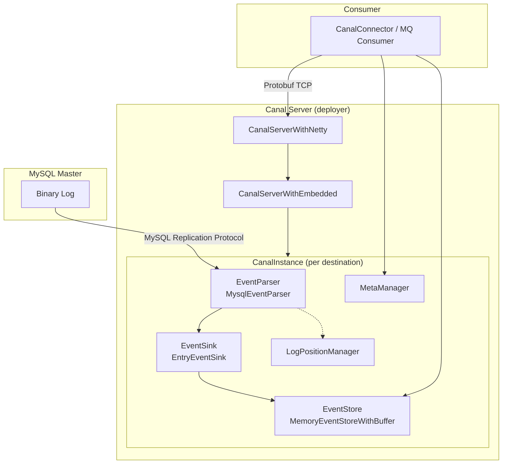

### 3.2 两个“位点”概念（极易混淆）

| 类型 | 接口 | 含义 | 典型实现 |
|------|------|------|----------|
| **解析位点** | `CanalLogPositionManager` | Parser 下次从 MySQL 哪个 binlog 位置继续 dump | `FailbackLogPositionManager`（Memory + Meta 兜底） |
| **消费位点** | `CanalMetaManager` | 各 Client 已 subscribe/ack 到哪里 | `PeriodMixedMetaManager`（内存 + ZK 周期刷盘） |

Parser 在 **事务结束** 时持久化解析位点；Client **ack** 时更新消费游标并释放 Store 环形缓冲区槽位。

### 3.3 Instance 内组件装配

Spring 配置：`deployer/src/main/resources/spring/default-instance.xml`

```xml
CanalInstanceWithSpring
  ├── eventParser  → MysqlEventParser (parent: baseEventParser)
  ├── eventSink    → EntryEventSink → eventStore
  ├── eventStore   → MemoryEventStoreWithBuffer
  └── metaManager  → PeriodMixedMetaManager → ZooKeeperMetaManager
```

---

## 4. 启动与生命周期

### 4.1 Server 启动链

| 步骤 | 类 | 文件 |
|------|-----|------|
| main | `CanalLauncher` | `deployer/.../CanalLauncher.java` |
| 编排 | `CanalStarter` | `deployer/.../CanalStarter.java` |
| 核心 | `CanalController` | `deployer/.../CanalController.java` |

`CanalController` 主要动作：

1. 创建 `CanalServerWithEmbedded`（逻辑服务）与 `CanalServerWithNetty`（网络层，可由 `canal.without.netty` 关闭）；
2. 若配置 `canal.zkServers`，为每个 **destination** 注册 `ServerRunningMonitor`（ZK 选主，保证同一 destination 只有一个活跃 Server）；
3. `embeddedCanalServer.start()` + `canalServer.start()` 绑定端口。

**Instance 懒加载**：`CanalServerWithEmbedded` 使用 `ComputingMap`，首次访问某 destination 时通过 `CanalInstanceGenerator`（Spring/Plain）生成 `CanalInstanceWithSpring`。

### 4.2 Instance 组件启动顺序

`AbstractCanalInstance.start()`（`instance/core/.../AbstractCanalInstance.java`）：

```
metaManager → alarmHandler → eventStore → eventSink → eventParser
```

Parser 启动前会执行 `beforeStartEventParser`：启动 `CanalLogPositionManager`、绑定 `HeartBeatHAController` 与 `MysqlEventParser` 并启动 HA 控制器。

**设计原因**：Store/Sink 必须先就绪，否则 Parser 线程 dump 出的数据无处存放；Meta 需先于 Client 订阅存在。

---

## 5. 核心数据流水线

### 5.1 端到端流程

```
MySQL binlog 字节流
    → DirectLogFetcher.fetch()          // 读 MySQL 协议包
    → LogDecoder.decode()               // 二进制 → LogEvent
    → LogEventConvert.parse()           // LogEvent → CanalEntry.Entry
    → EventTransactionBuffer.add()      // 按事务攒批
    → [flush] EntryEventSink.sink()     // 写入 Store
    → MemoryEventStoreWithBuffer.put()  // 环形缓冲
    → CanalServerWithEmbedded.getWithoutAck()
    → Client ack → metaManager + eventStore.ack()
```

### 5.2 事务边界缓冲：`EventTransactionBuffer`

文件：`parse/.../EventTransactionBuffer.java`

- `TRANSACTIONBEGIN`：先 flush 上一事务，再写入；
- `ROWDATA`：累积行变更；
- `TRANSACTIONEND`：写入后 **flush**，触发 `TransactionFlushCallback`；
- `HEARTBEAT`：立即 flush（表示 master 暂时无新事件，idle）。

`AbstractEventParser` 构造时注册的 callback：

```java
transactionBuffer = new EventTransactionBuffer(transaction -> {
    consumeTheEventAndProfilingIfNecessary(transaction);  // → eventSink.sink()
    logPositionManager.persistLogPosition(destination, position);  // 事务级位点
});
```

**设计亮点**：下游消费以 **事务** 为原子单元，避免半事务被消费；解析位点在事务提交时推进，与 binlog 语义一致。

### 5.3 Sink：`EntryEventSink`

将 `List<Entry>` 包装为 `Event`，调用 `eventStore.tryPut()`；Store 满时自旋等待。支持 `HeartBeatEntryEventHandler` 等扩展。

### 5.4 Store：环形缓冲区

`MemoryEventStoreWithBuffer`（`store/.../MemoryEventStoreWithBuffer.java`）：

- `bufferSize` 必须为 2 的幂（默认 16384）；
- 维护 `putSequence` / `getSequence` / `ackSequence`；
- 支持 `BatchMode.ITEMSIZE` 与 `MEMSIZE` 两种批量获取模式；
- `ddlIsolation`：DDL 单独成批，避免与 DML 混批。

### 5.5 并行解析管线（1.1.x 性能核心）

`MysqlMultiStageCoprocessor` 注释（`parse/.../MysqlMultiStageCoprocessor.java`）：

```
1. 网络接收 (单线程)     — dump 循环读 socket
2. 事件基本解析 (单线程)  — 类型、TableMeta、位点
3. 事件深度解析 (多线程)  — DML 行数据完整解析
4. 投递 store (单线程)   — transactionBuffer → sink
```

基于 **LMAX Disruptor** `RingBuffer` 串联各 Stage，将最耗 CPU 的 DML 反序列化并行化，网络 IO 与解析解耦。

配置项（`default-instance.xml`）：

- `canal.instance.parser.parallel`（默认 true）
- `canal.instance.parser.parallelThreadSize`
- `canal.instance.parser.parallelBufferSize`（默认 256，须为 2 的幂）

---

## 6. Binlog 监听底层原理（重点）

本章从 **TCP 连接** 到 **事件回调** 按调用栈展开，这是 Canal 最核心的技术路径。

### 6.1 与 MySQL 复制的关系

MySQL 原生复制流程：

1. Slave IO 线程连接 Master，注册 slave，`COM_BINLOG_DUMP` 指定 binlog 文件与 position；
2. Master 将 binlog 事件封装为 **MySQL 协议包**（4 字节头 + payload）连续发送；
3. Slave 解析 binlog event，写入 relay log，SQL 线程重放。

Canal **只实现 IO 线程侧的逻辑**（拉取 + 解析），不重放 SQL；解析结果进入内存 Store 而非 relay log。

### 6.2 第一层：MySQL 协议连接 `MysqlConnector`

文件：`driver/.../MysqlConnector.java`

**connect() 流程**：

```java
channel = SocketChannelPool.open(address);
negotiate(channel);  // 握手 → 可选 SSL → 认证
```

**negotiate()** 遵循 MySQL Connection Phase：

1. 读 `HandshakeInitializationPacket`（协议版本、serverId、认证插件、capabilities）；
2. 发 `ClientAuthenticationPacket`（用户名、密码 scramble，支持 `caching_sha2_password` 等）；
3. 可能多轮 `AuthSwitchRequest`；
4. 记录 `connectionId`、`serverVersion`。

**dump 断开特殊处理**：`disconnect()` 时若 `dumping==true`，会 `fork()` 新连接执行 `KILL CONNECTION {connectionId}`，避免 Master 侧悬挂的 dump 连接占用 `slaveId`。

**fork()**：复制连接参数创建新 connector，用于：

- 心跳检测 SQL（与 dump 连接分离）；
- `metaConnection` 查询表结构；
- 杀 dump 连接。

### 6.3 第二层：复制会话 `MysqlConnection`

文件：`parse/.../MysqlConnection.java`，实现 `ErosaConnection`。

#### 6.3.1 标准 dump 入口 `dump(file, position, sink)`

```java
updateSettings();        // 会话变量
loadBinlogChecksum();  // CRC32 or OFF
loadVersionComment();  // Percona/MariaDB 兼容
sendRegisterSlave();   // COM_REGISTER_SLAVE (0x15)
sendBinlogDump(...);   // COM_BINLOG_DUMP (0x12)
DirectLogFetcher fetcher = new DirectLogFetcher(bufferSize);
fetcher.start(connector.getChannel());
LogDecoder decoder = new LogDecoder(UNKNOWN_EVENT, ENUM_END_EVENT);
while (fetcher.fetch()) {
    LogEvent event = decoder.decode(fetcher, context);
    func.sink(event);
    if (event.getSemival() == 1) sendSemiAck(...);  // 半同步复制
}
```

**seek()** 变体：为加速位点查找，只 decode `ROTATE/FORMAT_DESCRIPTION/QUERY/XID` 等少量事件类型。

#### 6.3.2 会话准备 `updateSettings()`

向 Master 发送一系列 `SET`（失败多数只 warn，不中断）：

| SQL | 目的 |
|-----|------|
| `set wait_timeout=9999999` | 防连接被服务端断开 |
| `set net_read/write_timeout=7200` | 大事务/慢网络 |
| `set names 'binary'` | 结果集不做字符集转换，按二进制解析 |
| `set @master_binlog_checksum=@@global.binlog_checksum` | 与 Master checksum 对齐，避免 Rotate 乱码 |
| `set @slave_uuid=uuid()` | MySQL 5.6+ 防止重复 slave 被 kill |
| `SET @master_heartbeat_period={nano}` | 请求 Master 定期发 **Heartbeat binlog event**（空闲时） |

Heartbeat 周期常量：`DirectLogFetcher.MASTER_HEARTBEAT_PERIOD_SECONDS = 15`，读超时 `READ_TIMEOUT = (15+10)*1000` ms，保证大于心跳间隔。

#### 6.3.3 `COM_REGISTER_SLAVE` 包结构

类：`RegisterSlaveCommandPacket`（command = **0x15**）

字段：`serverId`、`reportHost`、`reportUser`、`reportPasswd`、`reportPort` 等，按 MySQL Internals 小端编码。

Canal 将 **本地 socket 的 host:port** 填入 report 字段，使 Master 的 `SHOW SLAVE HOSTS` 可识别该“伪 Slave”。

#### 6.3.4 `COM_BINLOG_DUMP` 包结构

类：`BinlogDumpCommandPacket`（command = **0x12**）

`toBytes()` 布局（与 MySQL 文档一致）：

```
1  byte   command (0x12)
4  bytes  binlog position (little endian)
2  bytes  flags — 设置 BINLOG_SEND_ANNOTATE_ROWS_EVENT
4  bytes  slave server id
n  bytes  binlog filename (可选，空则从当前位点)
```

发送后 `connector.setDumping(true)`，标记进入流式 binlog 模式。

**slaveId** 来源：配置 `canal.instance.mysql.slaveId`，必须在集群内 **唯一**；重复会导致 EOF 或连接被踢（`DirectLogFetcher` 对 mark=254 的 warn）。

#### 6.3.5 GTID 模式

**MySQL**：`BinlogDumpGTIDCommandPacket` → `COM_BINLOG_DUMP_GTID`，携带 `GTIDSet`。

**MariaDB**：先 `SET @slave_connect_state='...'`，再 `sendRegisterSlave` + `sendBinlogDump("", 0)`。

`LogContext.setGtidSet(gtidSet)` 供 decoder 维护 GTID 状态；支持 `processIterateDecode` 处理压缩事务 payload。

### 6.4 第三层：从 Socket 读 replication 流 `DirectLogFetcher`

文件：`parse/.../mysql/dbsync/DirectLogFetcher.java`（继承 `dbsync` 的 `LogFetcher`）

#### 6.4.1 MySQL 协议包在 dump 阶段的形态

dump 建立后，Master 发送的每个 **MySQL Packet**：

```
3 bytes  payload length (little endian)
1 byte   sequence id
n bytes  payload
```

对 **正常 binlog 数据包**，payload 第一个字节 `mark = 0`，后续为 **原始 binlog event 字节**（可能多个 event 拼在一个 packet，或一个 event 拆成多个 16MB 大包）。

#### 6.4.2 `fetch()` 核心逻辑

```java
fetch0(0, 4);                           // 读 4 字节头
netlen = getUint24(0); netnum = getUint8(3);
fetch0(4, netlen);                      // 读 body
mark = getUint8(4);
if (mark == 255) → ErrorPacket (含 binlog purged 检测 → ServerLogPurgedException)
if (mark == 254) → EOF，Master 断开
while (netlen == MAX_PACKET_LENGTH)     // 16MB-1 分包拼接
    继续读下一个 packet 追加到 buffer
origin = NET_HEADER_SIZE + 1;           // 跳过 mark，指向 binlog event 起始
position = origin;
limit -= origin;
```

**半同步**（`db.semi=1`）：payload 前 3 字节为 semi 标记，`origin` 再后移 2 字节；`semival==1` 时 `MysqlConnection` 发 `SemiAck`。

#### 6.4.3 IO 模型

`channel.read(buffer, off, len, READ_TIMEOUT_MILLISECONDS)` — **阻塞 NIO** 读满指定长度；超时抛 `SocketTimeoutException` 并 close。

**设计取舍**：dump 是长连接单消费者，阻塞读简化协议处理；并行模式下仅 **stage1 单线程** 读 socket，避免多线程抢 channel。

### 6.5 第四层：二进制事件解码 `LogDecoder`

文件：`dbsync/.../LogDecoder.java`。从 `DirectLogFetcher` 得到的 `LogBuffer` 上按 **完整 event 长度** 切分；细节见 **[§7 Binlog 二进制解析](#7-binlog-二进制解析dbsync)**。

```java
LogHeader header = new LogHeader(buffer, context.getFormatDescription());
int len = header.getEventLen();
if (handleSet.get(header.getType()))
    event = decode(buffer, header, context);
else
    event = new UnknownLogEvent(header);
buffer.consume(len);   // 消费 len 字节，指针前移
```

**`LogContext` 在 decode 过程中的维护**（单线程，非线程安全）：

| 动作 | 触发事件 | 效果 |
|------|----------|------|
| `setFormatDescription` | `FORMAT_DESCRIPTION_EVENT` | 记录 post-header 长度表、checksum 算法 |
| `putTable` | `TABLE_MAP_EVENT` | `table_id → TableMapLogEvent` 写入 `mapOfTable` |
| `fillTable` | `WRITE/UPDATE/DELETE_ROWS_*` | 按 `table_id` 取 TableMap，缺失则 `TableIdNotFoundException` |
| `clearAllTables` | ROW 带 `STMT_END_F` | 语句结束，清空 map（多语句事务边界） |
| `setLogPosition` | `ROTATE_EVENT` | 换新 `logFileName` + position |
| `setGtidSet` / `putGtid` | GTID 相关 | Header 携带 GTID 字符串 |

**压缩事务**：MySQL 8.0+ `TRANSACTION_PAYLOAD_EVENT` 在 **GTID dump** 与 **并行 Parser** 路径会走 `processIterateDecode`（§7.8）；普通 `dump(file,pos)` 单线程路径 **不** 调用该方法，若仅用文件位点 dump 且 Master 开启 binlog 事务压缩，需确认是否走 GTID 或 `parallel=true`。

### 6.6 第五层：Parser 主循环 `AbstractEventParser`

`start()` 创建 **单线程** `parseThread`，核心循环（简化）：

```
while (running) {
    erosaConnection = buildErosaConnection();
    startHeartBeat();
    preDump();
    connect();
    position = findStartPosition();   // 可能很耗时（时间戳/GTID/文件）
    processTableMeta(position);
    reconnect();                        // 清状态后正式 dump
    if (parallel)
        erosaConnection.dump(..., multiStageCoprocessor);
    else
        erosaConnection.dump(..., sinkHandler);
    // 异常：sleep 10-20s 重试，reset transactionBuffer/binlogParser
}
```

`sinkHandler` 对每条 `LogEvent` 调用 `parseAndProfilingIfNecessary` → `transactionBuffer.add(entry)`。

### 6.7 位点查找 `findStartPosition`（启动 dump 前）

`MysqlEventParser.findStartPositionInternal()` 优先级大致为：

1. `logPositionManager.getLatestIndexBy(destination)` — 上次持久化的解析位点；
2. 配置 `masterPosition` / `standbyPosition`；
3. 按 **时间戳** 在 binlog 中 seek（`MysqlConnection.seek`）；
4. HA 切换、serverId 变化时的 **fallback 时间回退**（`fallbackIntervalInSeconds`）；
5. binlog 被 purge：`ServerLogPurgedException` → 时间戳兜底或 `autoResetLatestPosMode`。

### 6.8 完整时序图（文件 + 位点模式）

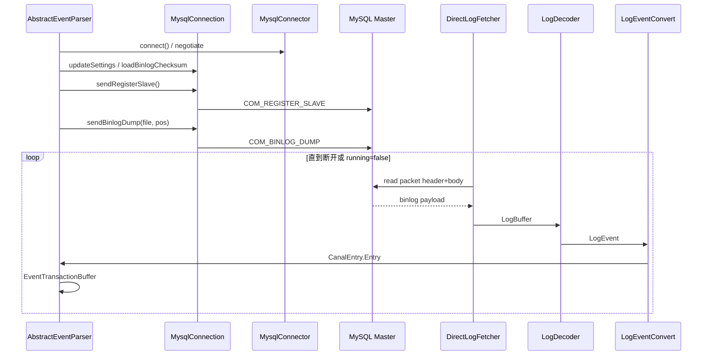

### 6.9 本地文件模式（补充）

除在线 dump 外，还有：

- `LocalBinLogConnection` + `LocalBinlogEventParser`：读取本地 binlog 文件目录（RDS OSS 离线场景）；
- `RdsBinlogEventParserProxy`：通过阿里云 API 拉取 binlog。

在线原理相同，只是 `LogFetcher` 从文件而非 socket 读取。

---

## 7. Binlog 二进制解析（dbsync）

模块 `dbsync` 源自淘宝 TDDL 的 binlog 解析库（包名 `com.taobao.tddl.dbsync.binlog`），被 `MysqlConnection.dump`、`LocalBinLogConnection`、seek 扫文件共用。本节说明 **字节 → LogEvent** 的底层原理；**LogEvent → CanalEntry** 在 §8 / §62。

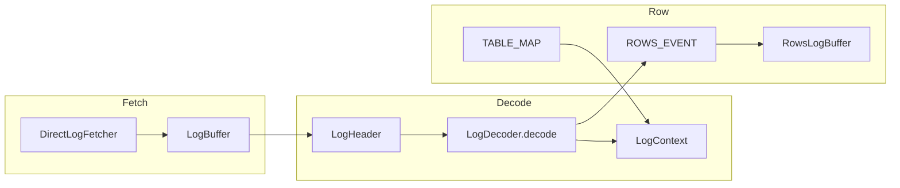

### 7.1 核心类型

| 类 | 作用 |
|----|------|
| `LogFetcher` / `DirectLogFetcher` | 累积 socket/文件字节，`fetch()` 产出可 decode 的 `LogBuffer`（§6.4、§109） |
| `LogBuffer` | 可读缓冲区；`consume(n)` 前移；`duplicate` 切子区间；支持 `limit` 截断（checksum 剥尾） |
| `LogContext` | **单 dump 线程** 上下文：`mapOfTable`、`formatDescription`、`logPosition`、`gtidSet`、`iterateDecode` 标志 |
| `LogHeader` | 解析 Common-Header（19 字节）+ 各事件 Post-Header，得到 `type/eventLen/logPos/...` |
| `LogDecoder` | `decode(buffer, context)` 切事件；`decode(buffer, header, context)` 反序列化 body |
| `*LogEvent` | 强类型事件体；ROW 类继承 `RowsLogEvent` |

`LogDecoder` 构造时常用 `new LogDecoder(UNKNOWN_EVENT, ENUM_END_EVENT)`，即 **handleSet 包含全部事件类型**，未知类型仍走 `UnknownLogEvent` 占位。

### 7.2 Binlog Event 物理布局

每个 binlog event 在文件/流中连续存储，Canal 用 `LogHeader` 先读 **Common-Header**（固定 19 字节）：

| 字段 | 长度 | 含义 |
|------|------|------|
| `timestamp` | 4 | 事件时间（秒） |
| `type` | 1 | 事件类型枚举 |
| `server_id` | 4 | 产生该事件的 server_id |
| `event_len` | 4 | **整个 event** 字节长度（含 header+body+可选 checksum） |
| `log_pos` | 4 | Master 上下一 event 的文件偏移 |
| `flags` | 2 | 标志位 |

之后是 **Post-Header**（长度由 `FormatDescriptionLogEvent` 的 `postHeaderLen[]` 决定）+ **Body**。`LogDecoder.decode(LogBuffer, LogContext)` 要求 `buffer.limit() >= event_len`，否则返回 `null`（数据未读满，rewind 等待下一包拼接）。

Canal 写入 `EntryPosition` 时常用 **`logPos - eventLen` 作为 startPos**（`LogEventConvert.createPosition`），与 MySQL「event 起始偏移」语义一致。

### 7.3 LogDecoder 解码流程

```68:111:dbsync/src/main/java/com/taobao/tddl/dbsync/binlog/LogDecoder.java
    public LogEvent decode(LogBuffer buffer, LogContext context) throws IOException {
        if (limit >= FormatDescriptionLogEvent.LOG_EVENT_HEADER_LEN) {
            LogHeader header = new LogHeader(buffer, context.getFormatDescription());
            final int len = header.getEventLen();
            if (limit >= len) {
                if (handleSet.get(header.getType())) {
                    buffer.limit(len);
                    try {
                        event = decode(buffer, header, context);
                    } finally {
                        buffer.limit(limit);
                    }
                } else {
                    event = new UnknownLogEvent(header);
                }
                buffer.consume(len);
                return event;
            }
        }
        buffer.rewind();
        return null;
    }
```

**与 replication 包的关系**：一个 MySQL Packet 的 payload 里可含 **多个** binlog event；也可能一个 event 跨多个 `0xFFFFFF` 大包（§109）。`consume(len)` 保证 decoder 与 fetcher 指针同步。

### 7.4 TABLE_MAP 与 ROW 事件配对

ROW 格式下，MySQL 不直接在行事件里带库表名，而是：

1. 先写 `TABLE_MAP_EVENT`：分配 `table_id`，携带库名、表名、列类型数组、nullable 位图、可选 metadata（MySQL 8 `binlog_row_metadata`）。
2. 再写 `WRITE_ROWS_EVENT` / `UPDATE_ROWS_EVENT` / `DELETE_ROWS_EVENT`：只带 `table_id` + 行数据比特流。

```210:215:dbsync/src/main/java/com/taobao/tddl/dbsync/binlog/LogDecoder.java
            case LogEvent.TABLE_MAP_EVENT: {
                TableMapLogEvent mapEvent = new TableMapLogEvent(header, buffer, descriptionEvent);
                logPosition.position = header.getLogPos();
                context.putTable(mapEvent);
                return mapEvent;
            }
```

```199:211:dbsync/src/main/java/com/taobao/tddl/dbsync/binlog/event/RowsLogEvent.java
    public final void fillTable(LogContext context) {
        table = context.getTable(tableId);
        if (table == null) {
            throw new TableIdNotFoundException("not found tableId:" + tableId);
        }
        if ((flags & RowsLogEvent.STMT_END_F) != 0) {
            context.clearAllTables();
        }
        // 统计 JSON 列个数，供 RowsLogBuffer 解析
    }
```

**典型顺序**（单表 INSERT）：

```
TABLE_MAP(table_id=6, db=t, tbl=user)
WRITE_ROWS(table_id=6, columns=全列, rows=...)
```

**跨表事务**：

```
TABLE_MAP(id=6, order) → WRITE_ROWS(6)
TABLE_MAP(id=7, item)  → WRITE_ROWS(7)
XID_EVENT
```

`LogEventConvert` 对 `TABLE_MAP` **只更新 TableMap、通常不产出 Entry**；真正 DML Entry 在 `parseRowsEvent`。

若从 **事务中间** 启动 dump（位点在 TABLE_MAP 之前），下一 ROW 找不到 map → **`TableIdNotFoundException`**（§10.3 会触发重找位点）。

### 7.5 ROW 行图像与 RowsLogBuffer

`RowsLogEvent` 构造时从 body 解析：

| 字段 | 含义 |
|------|------|
| `table_id` | 关联 TableMap |
| `flags` | 含 `STMT_END_F` 等 |
| `columns` | `BitSet`：本行 **携带了哪些列** 的字节（见 §7.6） |
| `changeColumns` | UPDATE 专用：after 图像列集合 |
| `rowsBuf` | 行数据区 `LogBuffer` 切片 |

```521:581:parse/src/main/java/com/alibaba/otter/canal/parse/inbound/mysql/dbsync/LogEventConvert.java
            RowsLogBuffer buffer = event.getRowsBuf(charset);
            BitSet columns = event.getColumns();
            BitSet changeColumns = event.getChangeColumns();
            while (buffer.nextOneRow(columns, false)) {
                if (EventType.INSERT == eventType) {
                    parseOneRow(..., columns, true, tableMeta);   // after
                } else if (EventType.DELETE == eventType) {
                    parseOneRow(..., columns, false, tableMeta);  // before
                } else {
                    parseOneRow(..., columns, false, tableMeta);  // before
                    buffer.nextOneRow(changeColumns, true);
                    parseOneRow(..., changeColumns, true, tableMeta);  // after
                }
            }
```

`RowsLogBuffer` 按 `ColumnInfo.type/meta`（来自 TableMap）读取 MySQL 二进制字段值（`MYSQL_TYPE_LONG`、`MYSQL_TYPE_STRING`、`MYSQL_TYPE_JSON` 等），再与 **TSDB/TableMetaCache 的 FieldMeta** 对齐生成 `CanalEntry.Column`。

**MariaDB 压缩 ROW**：`RowsLogEvent` 构造时若 `compress=true`，先 `uncompressBuf()` 再解析，并把 event type 从 `*_COMPRESSED_*` 映射回普通 ROW 类型（issue #4388）。

### 7.6 binlog_row_image 与 BitSet columns

连接建立后 `MysqlConnection.loadBinlogImage()` 查询 `@@binlog_row_image`（`FULL` / `MINIMAL` / `NOBLOB`），用于理解 Master 行为；**行事件里具体带哪些列** 由 binlog 里的 `columns` / `changeColumns` **BitSet** 表达。

| binlog_row_image | Master 行为（简述） | Canal 侧 |
|------------------|---------------------|----------|
| **FULL** | UPDATE 记录完整 before/after（在 BitSet 标记的列上） | 列较全，易与 TableMeta 对齐 |
| **MINIMAL** | UPDATE 仅主键 + 变更列 | `columns`/`changeColumns` 稀疏；`parseOneRow` 对 `!cols.get(i)` **直接 skip** |
| **NOBLOB** | 不含未变更 BLOB/TEXT | 介于两者之间 |

```671:676:parse/src/main/java/com/alibaba/otter/canal/parse/inbound/mysql/dbsync/LogEventConvert.java
        for (int i = 0; i < columnCnt; i++) {
            ColumnInfo info = columnInfo[i];
            // mysql 5.6开始支持nolob/minimal类型,并不一定记录所有的列,需要进行判断
            if (!cols.get(i)) {
                continue;
            }
```

**下游含义**：MINIMAL 模式下 Canal Entry 的 `beforeColumns` 可能 **只有主键**，业务若要做「全字段 diff」需查表补全，不能假设 binlog 含全行。

**online DDL**：TableMap 列数 > TableMeta 字段数时，会 **强制 reload 表结构**（§73）；RDS 无主键表可能多一列 `__#alibaba_rds_row_id#__` 特殊处理。

### 7.7 Checksum（CRC32）与 MariaDB 差异

**探测**：`loadBinlogChecksum()` 查 `@@global.binlog_checksum`；`updateSettings()` 里 `set @master_binlog_checksum=@@global.binlog_checksum`，避免 Rotate 后首事件解析乱码（尤其 **MariaDB** 在第一个 Rotate 即带 checksum，见 `MysqlConnection` 注释 issue #1081）。

**剥离**：非 `FORMAT_DESCRIPTION` 事件使用当前 `FormatDescription` 的算法；若启用 CRC32 且 **非** iterate 子解码：

```182:188:dbsync/src/main/java/com/taobao/tddl/dbsync/binlog/LogDecoder.java
        if (checksumAlg != OFF && checksumAlg != UNDEF) {
            if (context.isIterateDecode()) {
                // 主 TRANSACTION_PAYLOAD 已处理 checksum，子事件不再剥尾
            } else {
                buffer.limit(header.getEventLen() - BINLOG_CHECKSUM_LEN);
            }
        }
```

decode 时 body 不含最后 4 字节 CRC；`consume(event_len)` 仍按 **含 checksum 的物理长度** 推进流指针。

### 7.8 TRANSACTION_PAYLOAD 压缩事务（MySQL 8.0+）

大事务可将多个 event 打包进 **`TRANSACTION_PAYLOAD_EVENT`**，payload 经 **Zstd**（或无压缩）展开后再逐个 `decode`。

```122:160:dbsync/src/main/java/com/taobao/tddl/dbsync/binlog/LogDecoder.java
    public List<LogEvent> processIterateDecode(LogEvent event, LogContext context) {
        if (event.getHeader().getType() == TRANSACTION_PAYLOAD_EVENT) {
            // Zstd 解压 → iterateBuffer
            context.setIterateDecode(true);
            while (iterateBuffer.hasRemaining()) {
                LogEvent deEvent = decode(iterateBuffer, context);
                deEvent.getHeader().setLogFileName(event.getHeader().getLogFileName());
                deEvent.getHeader().setLogPos(event.getHeader().getLogPos());
                deEvent.getHeader().setEventLen(event.getHeader().getEventLen());
                events.add(deEvent);
            }
            context.setIterateDecode(false);
        }
        return events;
    }
```

**位点语义**：子事件 **逻辑上共享主事件的 logPos/eventLen**（物理 binlog 只有外层一条）。因此：

- ack 位点仍可按外层 event 推进；
- `BatchMode.MEMSIZE` 用 `rawLength` 时可能 **偏大**（注释：影响 getBatch 数量）。

**调用路径差异**：

| dump 模式 | 是否展开 TRANSACTION_PAYLOAD |
|-----------|-------------------------------|
| `dump(file, pos)` 单线程 | **否**（只 `decode` 一次） |
| `dump(GTIDSet)` | **是**（`processIterateDecode`） |
| `dump(..., MultiStageCoprocessor)` | **是**（stage2 识别后 iterate） |

生产若开启 binlog 事务压缩，应优先 **GTID** 或 **`canal.instance.parser.parallel=true`**。

### 7.9 Rotate、FormatDescription、GTID 与上下文重置

| 事件 | dbsync 行为 | Canal 业务影响 |
|------|-------------|----------------|
| `FORMAT_DESCRIPTION_EVENT` | `context.setFormatDescription` | 决定 v1/v2 ROW header 长度、checksum 算法 |
| `ROTATE_EVENT` | `context.setLogPosition(新文件名, position)` | `Entry.header.logfileName` 切换；findStart 依赖正确文件名 |
| `PREVIOUS_GTIDS_LOG_EVENT` | 解码进 GTID 集合 | GTID 模式起始边界 |
| `GTID_LOG_EVENT` | 更新 `context.gtidSet` | `Entry.header.gtid` |
| `QUERY_EVENT` (BEGIN) | 文本事务开始 | 转为 `TRANSACTIONBEGIN` Entry |
| `XID_EVENT` | InnoDB commit | 转为 `TRANSACTIONEND` Entry |

`LogContext.reset()` 会清空 TableMap 与恢复默认 FormatDescription——Parser **重连** 时通过新 `LogContext` 避免脏 map。

### 7.10 常见事件类型（节选）

定义于 `LogEvent.java`（与 MySQL `log_event_type` 对齐）：

| 常量 | 值 | 含义 |
|------|-----|------|
| `QUERY_EVENT` | 2 | DDL、BEGIN 等文本 SQL |
| `ROTATE_EVENT` | 4 | 切换到新 binlog 文件 |
| `XID_EVENT` | 16 | InnoDB 事务提交 |
| `TABLE_MAP_EVENT` | 19 | 表结构映射（ROW 模式必需） |
| `WRITE_ROWS_EVENT` | 30 | 插入行图像 |
| `UPDATE_ROWS_EVENT` | 31 | 更新前后图像 |
| `DELETE_ROWS_EVENT` | 32 | 删除行图像 |
| `GTID_LOG_EVENT` | 33 | GTID 事务边界 |
| `TRANSACTION_PAYLOAD_EVENT` | 100 | 压缩事务容器（8.0+） |
| `PARTIAL_UPDATE_ROWS_EVENT` | - | 8.0 部分列更新 |

v1 事件（`*_V1`）与 v2 成对出现，由 `FormatDescription` 的 `post_header_len` 区分；Canal 在 `LogDecoder` switch 中 **同时处理** 两套 type 常量。

### 7.11 与 §8 的边界

| 层次 | 模块 | 输入/输出 |
|------|------|-----------|
| dbsync | `LogDecoder`、`*LogEvent` | 字节 → **结构化 LogEvent**（仍含 table_id、二进制行） |
| parse | `LogEventConvert` | LogEvent + **TableMeta** → **CanalEntry** Protobuf |
| parse | `EventTransactionBuffer` | Entry 列表按事务 flush → Sink（§54） |

读懂 §7 后，排查 **TableIdNotFound**、**列数不匹配**、**checksum 乱码**、**压缩事务无数据** 四类问题应优先对照 **TableMap / row_image / dump 路径 / checksum 会话变量**，再查 TSDB 与过滤配置。

---

## 8. 业务语义转换（LogEventConvert）

文件：`parse/.../LogEventConvert.java`。上游 **dbsync** 产出 `LogEvent` 见 **§7**；本节为 **LogEvent → CanalEntry**。

`parse(LogEvent)` 按 `eventType` switch：

| Binlog 事件 | Canal Entry |
|-------------|-------------|
| `QUERY_EVENT` | DDL / BEGIN（事务开始） |
| `XID_EVENT` | TRANSACTIONEND |
| `WRITE/UPDATE/DELETE_ROWS_*` | ROWDATA（含 before/after 列） |
| `TABLE_MAP_EVENT` | 更新 `TableMetaCache`，不一定产出 Entry |
| GTID 相关 | 维护 gtid 元数据 |

依赖 **TableMetaTSDB**（`enableTsdb`）或内存 `TableMetaCache` 解析列类型、变长字段、JSON 等。

过滤在解析阶段完成：`AviaterRegexFilter` 对 schema.table 匹配；支持 field 级黑白名单。

---

## 9. 位点与 Meta 双轨管理

### 9.1 解析位点 `CanalLogPositionManager`

默认（`default-instance.xml`）：

```xml
FailbackLogPositionManager(
  MemoryLogPositionManager,           <!-- 主：快，重启丢失 -->
  MetaLogPositionManager(metaManager) <!-- 备：取客户端最小未消费位点 -->
)
```

**写入时机**：`EventTransactionBuffer` 在 `TRANSACTIONEND` flush 后。

**读取时机**：`MysqlEventParser.findStartPositionInternal()` 启动 dump 前。

### 9.2 消费 Meta `CanalMetaManager`

- `subscribe(clientIdentity, filter)`：注册过滤规则；
- `addBatch` / `removeBatch`：getWithoutAck 时创建 batch，ack 时删除；
- `updateCursor`：ack 后推进消费位点。

`CanalServerWithEmbedded.getWithoutAck()`：

1. 从 `eventStore.tryGet` 取事件；
2. `metaManager.addBatch` 记录 `[startPosition, endPosition]`；
3. Client `ack(batchId)` → `eventStore.ack` 释放 ring buffer。

---

## 10. 高可用与容错设计

### 10.1 Server 级 HA（Canal 集群）

`ServerRunningMonitor`（`common/.../ServerRunningMonitor.java`）：

- ZK **临时节点** `/otter/canal/destinations/{destination}/running`；
- 创建成功者 `processActiveEnter` → `embeddedCanalServer.start(destination)`；
- 节点丢失后延迟重试选主。

无 ZK 时单机直接 `processActiveEnter`。

### 10.2 MySQL 主备 HA（Parser 级）

`HeartBeatHAController` + `MysqlDetectingTimeTask`：

- 定时执行 `detectingSQL`；
- 连续失败超过 `detectingRetryTimes` → `MysqlEventParser.doSwitch()` 交换 `masterInfo`/`standbyInfo`，`stop()` 后 `start()` 重连新库。

### 10.3 Dump 异常恢复

| 异常 | 处理 |
|------|------|
| 网络中断 | parseThread catch，sleep 10-20s，`reconnect` 重试 |
| binlog purge | `ServerLogPurgedException`，按时间戳或最新位点重置 |
| `TableIdNotFoundException` | 可能起始位点在事务中间，设置 `needTransactionPosition` 重找 |
| duplicate slaveId | EOF packet，检查实例 slaveId 配置 |

### 10.4 心跳与空闲检测

- **Binlog Heartbeat Event**：Master 在无变更时按 `@master_heartbeat_period` 发送，Canal flush 心跳 Entry，用于延迟监控；
- **SQL 心跳**：独立连接执行 `detectingSQL`，用于 HA 与存活性，不干扰 dump 连接。

---

## 11. 技术亮点与设计亮点

### 11.1 技术亮点

1. **协议级 Slave 仿真**：非 JDBC 轮询，无侵入，延迟接近原生复制 IO 线程。
2. **自研二进制解码栈（dbsync）**：零拷贝倾向的 `LogBuffer`、按类型 BitSet 过滤 decode，seek 模式极速扫 binlog。
3. **多阶段 Disruptor 并行解析**：网络、轻量解析、重量 DML 解析、store 投递流水线，显著提升吞吐（官方称 1.1.x 约 150% 提升）。
4. **事务缓冲与位点绑定**：`EventTransactionBuffer` 保证事务原子投递，解析位点仅在事务结束推进。
5. **GTID / MariaDB / Percona / MySQL 8.4+ 兼容**：独立分支处理认证、GTID dump、checksum、压缩事务。
6. **半同步复制 ACK**：可选 `db.semi=1` + `SemiAck`，适配半同步主库环境。
7. **双轨位点 + Failback**：重启后优先内存位点，否则回退到客户端最小 cursor，减少重复消费窗口。
8. **环形 Store + batch ack**：背压控制（Store 满则 Parser 侧 sink 阻塞），多客户端独立 cursor。
9. **可插拔投递**：TCP Protobuf、Kafka/RocketMQ Connector、client-adapter 异构同步。
10. **TableMeta TSDB**：DDL 历史版本化，解决 binlog 行事件只有 table_id 的问题。

### 11.2 设计亮点（架构层面）

1. **ErosaConnection 抽象**：`MysqlConnection` / `LocalBinLogConnection` 统一 `dump`/`seek` 接口，Parser 与数据源解耦。
2. **Instance = 独立管道**：每个 destination 一组 parser/store/meta，多租户隔离。
3. **Embedded + Netty 分离**：核心逻辑可嵌入式测试，Netty 仅作协议适配。
4. **Client-Server + Protobuf**：多语言客户端只需实现协议，不必理解 binlog。
5. **过滤双阶段**：Parser 端表过滤 + 支持 Sink 端路由扩展（为多下游预留）。
6. **fork 连接模型**：dump、心跳、元数据、KILL 互不阻塞，避免长事务占用心跳连接。
7. **配置驱动 Spring 组装**：`default-instance.xml` 可替换 Memory/ZK/File 等实现，运维友好。

---

## 12. 关键类索引

| 领域 | 类 | 路径 |
|------|-----|------|
| 启动 | `CanalLauncher`, `CanalController` | `deployer/...` |
| 实例 | `AbstractCanalInstance`, `CanalInstanceWithSpring` | `instance/...` |
| 服务 | `CanalServerWithEmbedded`, `CanalServerWithNetty` | `server/...` |
| 协议连接 | `MysqlConnector` | `driver/.../MysqlConnector.java` |
| Binlog 连接 | `MysqlConnection` | `parse/.../MysqlConnection.java` |
| 读包 | `DirectLogFetcher` | `parse/.../dbsync/DirectLogFetcher.java` |
| 解码 | `LogDecoder` | `dbsync/.../LogDecoder.java` |
| 转换 | `LogEventConvert` | `parse/.../LogEventConvert.java` |
| 主循环 | `AbstractEventParser`, `MysqlEventParser` | `parse/.../inbound/` |
| 并行 | `MysqlMultiStageCoprocessor` | `parse/.../MysqlMultiStageCoprocessor.java` |
| 事务缓冲 | `EventTransactionBuffer` | `parse/.../EventTransactionBuffer.java` |
| 存储 | `MemoryEventStoreWithBuffer` | `store/.../` |
| 投递 | `EntryEventSink` | `sink/.../` |
| Dump 命令 | `BinlogDumpCommandPacket` | `driver/.../BinlogDumpCommandPacket.java` |
| 注册 Slave | `RegisterSlaveCommandPacket` | `driver/.../RegisterSlaveCommandPacket.java` |
| Server HA | `ServerRunningMonitor` | `common/.../ServerRunningMonitor.java` |
| DB HA | `HeartBeatHAController` | `parse/.../ha/HeartBeatHAController.java` |
| 配置 | `default-instance.xml` | `deployer/src/main/resources/spring/` |
| Adapter 启动 | `CanalAdapterService`, `CanalAdapterLoader`, `AdapterProcessor` | `client-adapter/launcher/...` |
| Adapter SPI | `ExtensionLoader`, `OuterAdapter`, `ProxyOuterAdapter` | `client-adapter/common/...` |
| TCP 消费端 | `CanalTCPConsumer` | `connector/tcp-connector/...` |
| Java Client | `SimpleCanalConnector`, `ClusterCanalConnector` | `client/...` |
| Client HA | `ClientRunningMonitor` | `client/.../running/` |
| Admin 管控 | `CanalAdminController`, `CanalInstanceServiceImpl` | `deployer/.../admin/`, `admin/admin-web/...` |
| 配置轮询 | `PlainCanalConfigClient`, `PollingConfigServiceImpl` | `instance/manager/...`, `admin/...` |
| Prometheus | `PrometheusService`, `CanalInstanceExports`, `StoreCollector` | `prometheus/...` |
| 位点查找 | `MysqlEventParser.findStartPositionInternal` | `parse/.../MysqlEventParser.java` |
| Meta ZK | `ZooKeeperMetaManager` | `meta/...` |
| Parser 位点兜底 | `MetaLogPositionManager` | `parse/.../index/` |
| TSDB | `DatabaseTableMeta`, `TableMetaTSDBFactory` | `parse/.../tsdb/` |
| Instance 生成 | `SpringCanalInstanceGenerator`, `PlainCanalInstanceGenerator` | `instance/spring/...`, `instance/manager/...` |
| 配置热加载 | `SpringInstanceConfigMonitor`, `ManagerInstanceConfigMonitor` | `deployer/.../monitor/` |
| Admin Netty | `CanalAdminWithNetty`, admin `SessionHandler` | `server/.../admin/` |
| MQ Producer | `CanalKafkaProducer`, `CanalRocketMQProducer` | `connector/kafka-connector/...`, `rocketmq-connector/...` |
| 多流 / RDS | `GroupEventParser`, `RdsBinlogEventParserProxy` | `parse/.../group/`, `parse/.../rds/` |
| Client 反序列化 | `CanalMessageDeserializer` | `client/.../CanalMessageDeserializer.java` |
| Adapter HBase | `HbaseAdapter`, `HbaseSyncService` | `client-adapter/hbase/...` |
| 协议定义 | `CanalProtocol.proto`, `AdminProtocol.proto` | `protocol/...` |
| 帧解码 | `FixedHeaderFrameDecoder`, `NettyUtils` | `server/.../netty/` |
| MQ 消费 SPI | `CanalMsgConsumer`, `CanalKafkaConsumer`, `CanalTCPConsumer` | `connector/*/consumer/` |
| MQ 序列化 | `CanalMessageSerializerUtil` | `connector/core/.../util/` |
| 认证 | `SecurityUtil.scramble411` | `protocol/.../SecurityUtil.java` |
| 扁平消息 | `FlatMessage`, `CommonMessage`, `MQMessageUtils` | `protocol/...`, `connector/core/...` |
| 实例核心 | `AbstractCanalInstance`, `CanalInstanceWithSpring` | `instance/core/...`, `instance/spring/...` |
| 连接工厂 | `CanalConnectors` | `client/.../CanalConnectors.java` |
| Spring 装配 | `default-instance.xml`, `base-instance.xml` | `deployer/src/main/resources/spring/` |
| 事务缓冲 | `EventTransactionBuffer` | `parse/.../EventTransactionBuffer.java` |
| MQ 运行 | `CanalMQStarter`, `CanalStarter` | `server/...`, `deployer/...` |
| RDB 落地 | `RdbAdapter`, `RdbSyncService`, `BatchExecutor` | `client-adapter/rdb/...` |
| ES 落地 | `ESAdapter`, `ESSyncService` | `client-adapter/escore/...` |
| 行转换 | `LogEventConvert` | `parse/.../dbsync/LogEventConvert.java` |
| 表过滤 | `AviaterRegexFilter`, `RegexFunction` | `filter/.../aviater/` |
| 镜像库 | `RdbMirrorDbSyncService` | `client-adapter/rdb/...` |
| 示例 | `example` 模块各 Test/Example | `example/src/main/java/...` |
| 进程入口 | `CanalLauncher` | `deployer/.../CanalLauncher.java` |
| Meta 内存 | `MemoryMetaManager`, `MemoryClientIdentityBatch` | `meta/...` |
| MQ 路由 | `MQMessageUtils` | `connector/core/.../MQMessageUtils.java` |
| DDL 解析 | `DruidDdlParser` | `parse/.../ddl/DruidDdlParser.java` |
| 表结构缓存 | `TableMetaCache` | `parse/.../dbsync/TableMetaCache.java` |
| Adapter REST | `CommonRest`, `SyncSwitch` | `client-adapter/launcher/...` |
| MQ Connector | `CanalMQProducer`, `CanalMsgConsumer` SPI | `connector/*-connector/` |
| Adapter SPI | `OuterAdapter`, `ExtensionLoader` | `client-adapter/*/META-INF/canal/` |
| 位点管理 | `FailbackLogPositionManager`, `MetaLogPositionManager` | `parse/.../index/` |
| Meta 持久化 | `PeriodMixedMetaManager`, `ZooKeeperMetaManager` | `meta/.../` |
| Netty 握手 | `FixedHeaderFrameDecoder`, `ClientAuthenticationHandler` | `server/.../netty/handler/` |
| Java Client | `SimpleCanalConnector`, `ClientRunningMonitor` | `client/.../impl/` |
| 监控 | `StoreCollector`, `ParserCollector`, `PrometheusService` | `prometheus/...` |
| RDS 解析 | `RdsBinlogEventParserProxy`, `RdsLocalBinlogEventParser` | `parse/.../rds/` |
| ZK 路径 | `ZookeeperPathUtils` | `common/.../zookeeper/` |
| 连接工厂 | `CanalConnectors`, `SimpleNodeAccessStrategy` | `client/...` |
| Adapter 消费 | `AdapterProcessor`, `CanalAdapterLoader` | `client-adapter/launcher/...` |
| 配置拉取 | `PlainCanalConfigClient` | `instance/manager/.../plain/` |
| Server 选主 | `ServerRunningMonitor` | `common/.../running/` |

---

## 13. client-adapter 源码剖析

> 独立落地进程：Spring Boot 启动器 + SPI 适配器 fat jar，从 Canal Server / MQ 拉取变更并写入异构存储。

### 13.1 架构：启动器 vs 适配器

| 组件 | 模块 | 职责 |
|------|------|------|
| 启动器 | `client-adapter/launcher` | `CanalAdapterService` 启动、`AdapterProcessor` 消费循环、REST |
| 公共 | `client-adapter/common` | `OuterAdapter`、`Dml`、`ExtensionLoader` |
| 适配器 | `rdb`/`escore`/`hbase`/… | `@SPI("rdb")` 等，jar 放 `plugin/` |

### 13.2 启动链

`CanalAdapterService` 在 Spring `@PostConstruct` 中：

```50:61:client-adapter/launcher/src/main/java/com/alibaba/otter/canal/adapter/launcher/loader/CanalAdapterService.java
    @PostConstruct
    public synchronized void init() {
        if (running) {
            return;
        }
        try {
            syncSwitch.refresh();
            adapterLoader = new CanalAdapterLoader(adapterCanalConfig);
            adapterLoader.init();
            running = true;
```

`CanalAdapterLoader.init()` 对每个 `canalAdapters[].instance` × `groups[]`：

1. `ExtensionLoader.getExtension(name, key)` 加载 `OuterAdapter`（`ProxyOuterAdapter` 切换 ClassLoader）。
2. **校验**：`canalOuterAdapters.size() == outerAdapters 配置数`，否则抛异常，防止只消费不写入。
3. `new AdapterProcessor(...).start()` 启动消费线程。

```76:87:client-adapter/launcher/src/main/java/com/alibaba/otter/canal/adapter/launcher/loader/CanalAdapterLoader.java
                if(CollectionUtils.isEmpty(canalOuterAdapters) || canalOuterAdapters.size() != group.getOuterAdapters().size() ){
                    String msg = String.format("instance=%s,groupId=%s Load OuterAdapters is Empty，pls check rdb.yml",
                                canalAdapter.getInstance(),group.getGroupId());
                        throw new RuntimeException(msg);
                 }
                AdapterProcessor adapterProcessor = canalAdapterProcessors.computeIfAbsent(
                    canalAdapter.getInstance() + "|" + StringUtils.trimToEmpty(group.getGroupId()),
                    f -> new AdapterProcessor(canalClientConfig,
                        canalAdapter.getInstance(),
                        group.getGroupId(),
                        canalOuterAdapterGroups));
                adapterProcessor.start();
```

### 13.3 SPI：从 `plugin/` 加载 fat jar

适配器 **不** 从 classpath 加载，只扫描 `lib/plugin/*.jar`：

```265:306:client-adapter/common/src/main/java/com/alibaba/otter/canal/client/adapter/support/ExtensionLoader.java
        String dir = File.separator + this.getJarDirectoryPath() + File.separator + "plugin";
        // ...
                    localClassLoader = new URLClassExtensionLoader(new URL[] { url });
                    loadFile(extensionClasses, CANAL_DIRECTORY, localClassLoader);
```

`META-INF/canal/com.alibaba.otter.canal.client.adapter.OuterAdapter` 示例：`rdb=com.alibaba.otter.canal.client.adapter.rdb.RdbAdapter`。

`getExtension("rdb", "oracle1")` 缓存键 `rdb-oracle1`，同一类可 **多实例** 对应多套 JDBC。

### 13.4 AdapterProcessor 消费循环

构造时加载 **connector** 模块的 `CanalMsgConsumer`（与 adapter 的 ExtensionLoader 不同）：

```66:79:client-adapter/launcher/src/main/java/com/alibaba/otter/canal/adapter/launcher/loader/AdapterProcessor.java
        ExtensionLoader<CanalMsgConsumer> loader = new ExtensionLoader<>(CanalMsgConsumer.class);
        String key = destination + "_" + groupId;
        canalMsgConsumer = new ProxyCanalMsgConsumer(loader.getExtension(canalClientConfig.getMode().toLowerCase(),
            key,
            CONNECTOR_SPI_DIR,
            CONNECTOR_STANDBY_SPI_DIR));
        canalMsgConsumer.init(properties, canalDestination, groupId);
```

主循环（节选）：

```184:213:client-adapter/launcher/src/main/java/com/alibaba/otter/canal/adapter/launcher/loader/AdapterProcessor.java
        while (running) {
            try {
                syncSwitch.get(canalDestination);
                canalMsgConsumer.connect();
                out: while (running) {
                    syncSwitch.get(canalDestination, 1L, TimeUnit.MINUTES);
                    for (int i = 0; i < retry; i++) {
                        try {
                            List<CommonMessage> commonMessages = canalMsgConsumer
                                .getMessage(this.canalClientConfig.getTimeout(), TimeUnit.MILLISECONDS);
                            writeOut(commonMessages);
                            canalMsgConsumer.ack();
                            break;
                        } catch (Exception e) {
                            // 失败 rollback；重试耗尽可 syncSwitch.off(destination)
```

`writeOut`：`MessageUtil.flatMessage2Dml` → 组间并行、组内 **串行** `adapter.sync`；成功才 `ack`。

### 13.5 TCP 消费：`CanalTCPConsumer`

```62:98:connector/tcp-connector/src/main/java/com/alibaba/otter/canal/connector/tcp/consumer/CanalTCPConsumer.java
    public void connect() {
        canalConnector.connect();
        canalConnector.subscribe();
    }

    public List<CommonMessage> getMessage(Long timeout, TimeUnit unit) {
        Message message = canalConnector.getWithoutAck(batchSize, timeout, unit);
        currentBatchId = message.getId();
        if (batchId == -1 || size == 0) {
            return null;
        } else {
            return MessageUtil.convert(message);
        }
    }

    public void disconnect() {
        // 避免 unsubscribe 导致 server 清 cursor
        canalConnector.disconnect();
    }
```

### 13.6 RDB 落地（示例）

`RdbAdapter.init` → `ConfigLoader.load("rdb")` 读 `conf/rdb/*.yml`，`match(outerAdapterKey)` 过滤配置。

`RdbSyncService.sync`：按 `destination[_groupId]_db-table` 查映射；`concurrent=true` 时 `pkHash` 分区到多 `BatchExecutor` 线程提交 JDBC batch。

```154:184:client-adapter/rdb/src/main/java/com/alibaba/otter/canal/client/adapter/rdb/service/RdbSyncService.java
    public void sync(Map<String, Map<String, MappingConfig>> mappingConfig, List<Dml> dmls, Properties envProperties) {
        sync(dmls, dml -> {
            if (dml.getIsDdl() != null && dml.getIsDdl()) {
                columnsTypeCache.remove(...);
                return false;
            }
            configMap = mappingConfig.get(destination + "_" + database + "-" + table);
            for (MappingConfig config : configMap.values()) {
                appendDmlPartition(config, dml);
            }
            return true;
        });
    }
```

### 13.7 ES 落地（与 RDB 差异）

```76:87:client-adapter/escore/src/main/java/com/alibaba/otter/canal/client/adapter/es/core/ESAdapter.java
    public void sync(List<Dml> dmls) {
        for (Dml dml : dmls) {
            if (!dml.getIsDdl()) {
                sync(dml);
            }
        }
        esSyncService.commit();
    }
```

跳过 DDL；多表 JOIN 场景在 `ESSyncService.insert` 中按主表/从表回查源库 SQL 组文档后批量写 ES。

### 13.8 SyncSwitch 与 REST

`SyncSwitch.off(destination)` 使 `BooleanMutex` 为 false，`AdapterProcessor` 在 `get()` 阻塞暂停同步；ZK 模式写 `/sync-switch/{destination}`。

`CommonRest` ETL：`syncSwitch.off` → `adapter.etl()` → `on`，并用 ZK 锁防并发。

---

## 14. Deployer 与 CanalController

> `CanalController` 调度、`InstanceAction`、`lazy` 等细节见 **§74**（延伸）。

入口：`deployer/.../CanalLauncher.main()` → `CanalStarter` → `CanalController`。

### 14.1 构造阶段：组装 Server 与 Instance 生成器

```108:116:deployer/src/main/java/com/alibaba/otter/canal/deployer/CanalController.java
        embeddedCanalServer = CanalServerWithEmbedded.instance();
        embeddedCanalServer.setCanalInstanceGenerator(instanceGenerator);
        int metricsPort = Integer.valueOf(getProperty(properties, CanalConstants.CANAL_METRICS_PULL_PORT, "11112"));
        embeddedCanalServer.setMetricsPort(metricsPort);
```

- `instanceGenerator`：按 `canal.instance.global.mode` 选 `SpringCanalInstanceGenerator` 或 `PlainCanalInstanceGenerator`（Manager 远程配置）。
- `embeddedCanalServer`：真正持有 `CanalInstance` 与 `getWithoutAck/ack` 逻辑。
- `canalServer`（Netty）：对外 Protobuf，内部委托 `embeddedCanalServer`。

### 14.2 ZK 选主：按 destination 启停 Instance

```156:184:deployer/src/main/java/com/alibaba/otter/canal/deployer/CanalController.java
        ServerRunningMonitors.setRunningMonitors(MigrateMap.makeComputingMap((Function<String, ServerRunningMonitor>) destination -> {
            ServerRunningMonitor runningMonitor = new ServerRunningMonitor(serverData);
            runningMonitor.setDestination(destination);
            runningMonitor.setListener(new ServerRunningListener() {

                public void processActiveEnter() {
                    embeddedCanalServer.start(destination);
                    if (canalMQStarter != null) {
                        canalMQStarter.startDestination(destination);
                    }
                }

                public void processActiveExit() {
                    if (canalMQStarter != null) {
                        canalMQStarter.stopDestination(destination);
                    }
                    embeddedCanalServer.stop(destination);
                }
```

**解读**：集群下每个 `destination` 只有一个 Canal 节点跑 Parser；抢到 ZK 临时节点才 `start(destination)`，丢失则 `stop` 并停 MQ 投递线程。

### 14.3 Instance 懒加载

`CanalServerWithEmbedded` 用 `ComputingMap`：首次访问某 destination 时 `instanceGenerator.generate(destination)` 加载 Spring XML（`default-instance.xml`）得到 `CanalInstanceWithSpring`。

---

## 15. Server 消费 API 与 Netty

### 15.1 getWithoutAck：Meta + Store 协同（同步块）

```318:367:server/src/main/java/com/alibaba/otter/canal/server/embedded/CanalServerWithEmbedded.java
    public Message getWithoutAck(ClientIdentity clientIdentity, int batchSize, Long timeout, TimeUnit unit)
                                                                                                           throws CanalServerException {
        CanalInstance canalInstance = canalInstances.get(clientIdentity.getDestination());
        synchronized (canalInstance) {
            PositionRange<LogPosition> positionRanges = canalInstance.getMetaManager().getLastestBatch(clientIdentity);

            Events<Event> events = null;
            if (positionRanges != null) { // 存在未 ack 的 batch，从上次 end 继续拉
                events = getEvents(canalInstance.getEventStore(), positionRanges.getStart(), batchSize, timeout, unit);
            } else {
                Position start = canalInstance.getMetaManager().getCursor(clientIdentity);
                if (start == null) {
                    start = canalInstance.getEventStore().getFirstPosition();
                }
                events = getEvents(canalInstance.getEventStore(), start, batchSize, timeout, unit);
            }

            if (CollectionUtils.isEmpty(events.getEvents())) {
                return new Message(-1, true, new ArrayList());
            } else {
                Long batchId = canalInstance.getMetaManager().addBatch(clientIdentity, events.getPositionRange());
                // raw 模式返回 Event.rawEntry，否则 Entry
                return new Message(batchId, raw, entrys);
            }
        }
    }
```

要点：

- **`synchronized (canalInstance)`**：保证 meta（batch/cursor）与 store 读取顺序一致，避免 batchId 与数据错位。
- **未 ack 的 batch**：`getLastestBatch` 非空则从上次 batch 的 `start` 继续读（支持重复 get 补数据）。
- **batchId = -1**：空包，客户端不应 ack。

### 15.2 ack：更新 cursor 并释放 Store

```396:437:server/src/main/java/com/alibaba/otter/canal/server/embedded/CanalServerWithEmbedded.java
    public void ack(ClientIdentity clientIdentity, long batchId) throws CanalServerException {
        CanalInstance canalInstance = canalInstances.get(clientIdentity.getDestination());
        positionRanges = canalInstance.getMetaManager().removeBatch(clientIdentity, batchId);
        if (positionRanges == null) {
            throw new CanalServerException(String.format("ack error , clientId:%s batchId:%d is not exist", ...));
        }
        if (positionRanges.getAck() != null) {
            canalInstance.getMetaManager().updateCursor(clientIdentity, positionRanges.getAck());
        }
        canalInstance.getEventStore().ack(positionRanges.getEnd(), positionRanges.getEndSeq());
    }
```

`eventStore.ack` 推进 `ackSequence`，环形缓冲区槽位可被 Parser 覆盖（背压释放）。

### 15.3 Netty：`SessionHandler` 协议分发

```47:62:server/src/main/java/com/alibaba/otter/canal/server/netty/handler/SessionHandler.java
            switch (packet.getType()) {
                case SUBSCRIPTION:
                    Sub sub = Sub.parseFrom(packet.getBody());
                    ClientIdentity clientIdentity = new ClientIdentity(sub.getDestination(), Short.parseShort(sub.getClientId()), sub.getFilter());
                    if (!embeddedServer.isStart(clientIdentity.getDestination())) {
                        ServerRunningMonitor runningMonitor = ServerRunningMonitors.getRunningMonitor(clientIdentity.getDestination());
                        if (!runningMonitor.isStart()) {
                            runningMonitor.start();
                        }
                    }
                    embeddedServer.subscribe(clientIdentity);
```

- `SUBSCRIPTION`：可触发 `ServerRunningMonitor.start()`（无 ZK 单机场景）。
- `GET`：调用 `embeddedServer.getWithoutAck`。
- `CLIENTACK` / `CLIENTROLLBACK`：对应 ack/rollback。

Netty 层无业务状态，全部是 **Protobuf Packet → Embedded API** 的薄封装。

---

## 16. Sink 与 Store 源码

### 16.1 EntryEventSink：过滤 + 背压写入 Store

```89:124:sink/src/main/java/com/alibaba/otter/canal/sink/entry/EntryEventSink.java
    private boolean sinkData(List<CanalEntry.Entry> entrys, InetSocketAddress remoteAddress)
                            throws InterruptedException {
        List<Event> events = new ArrayList<>();
        for (CanalEntry.Entry entry : entrys) {
            if (!doFilter(entry)) {
                continue;
            }
            // 空事务头尾过滤策略（便于推进位点又不过度刷屏）
            if (filterTransactionEntry && (entry.getEntryType() == TRANSACTIONBEGIN || ...)) {
                // ...
            }
            Event event = new Event(new LogIdentity(remoteAddress, -1L), entry, raw);
            events.add(event);
        }
        if (hasRowData || hasHeartBeat) {
            return doSink(events);
        }
```

`doFilter`：仅对 `ROWDATA` 调 `AviaterRegexFilter`，匹配 `schema.table`。

`doSink`：**自旋** `eventStore.tryPut`，满则 `applyWait`（Parser 线程阻塞 → 背压）：

```160:179:sink/src/main/java/com/alibaba/otter/canal/sink/entry/EntryEventSink.java
    protected boolean doSink(List<Event> events) {
        do {
            if (eventStore.tryPut(events)) {
                return true;
            } else {
                applyWait(++fullTimes);
            }
        } while (running && fullTimes <= maxFullTimes);
```

### 16.2 MemoryEventStoreWithBuffer：环形队列三指针

```46:49:store/src/main/java/com/alibaba/otter/canal/store/memory/MemoryEventStoreWithBuffer.java
    private AtomicLong        putSequence   = new AtomicLong(INIT_SEQUENCE);
    private AtomicLong        getSequence   = new AtomicLong(INIT_SEQUENCE);
    private AtomicLong        ackSequence   = new AtomicLong(INIT_SEQUENCE);
```

- `put`：Parser/Sink 写入，`putSequence++`。
- `get/tryGet`：Server 读取，`getSequence` 推进。
- `ack`：`cleanUntil` 从 `ackSequence+1` 扫到 batch 的 `endSeq`，释放 slot：

```426:441:store/src/main/java/com/alibaba/otter/canal/store/memory/MemoryEventStoreWithBuffer.java
    public void cleanUntil(Position position, Long seqId) throws CanalStoreException {
        long sequence = ackSequence.get();
        long maxSequence = getSequence.get();
        if (seqId > 0) {
            maxSequence = seqId;
        }
        for (long next = sequence + 1; next <= maxSequence; next++) {
            Event event = entries[getIndex(next)];
```

`bufferSize` 必须为 2 的幂；`indexMask = bufferSize - 1` 做环形下标。

更细的 Store 三指针、`ddlIsolation`、batch 语义见 **§56、§81**；空事务过滤策略见 **§55**。

### 16.3 EntryEventSink 背压与空事务深度

（原 §110，与 §55 互补）

**空事务**：`sinkData` 在无 `ROWDATA`/`HEARTBEAT` 时默认丢弃纯 BEGIN/END；可通过 `emptyTransactionInterval`（默认 5s）、`emptyTransctionThresold`（8192）偶尔放行以推进位点。`TRANSACTIONEND` 才重置计数（issue #2616）。

**背压**：`doSink` 在 `tryPut` 失败时 `applyWait` 退避，并调用 `handler.retry`；`eventsSinkBlockingTime` 计入 Prometheus（§92）。`parseThread.interrupt()` 使 `Thread.interrupted()` 退出循环，配合 `transactionBuffer.reset()`（§84）。

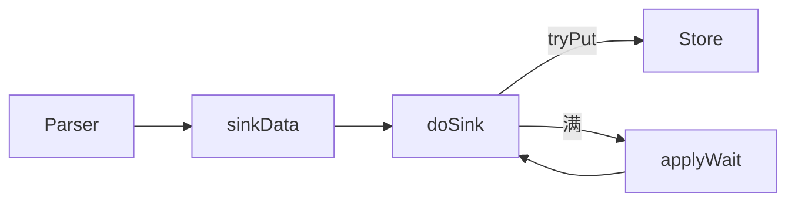

---

## 17. 位点管理器与 Meta 实现

### 17.1 FailbackLogPositionManager（Parser 重启位点）

```62:81:parse/src/main/java/com/alibaba/otter/canal/parse/index/FailbackLogPositionManager.java
    public LogPosition getLatestIndexBy(String destination) {
        LogPosition logPosition = primary.getLatestIndexBy(destination);
        if (logPosition != null) {
            return logPosition;
        }
        return secondary.getLatestIndexBy(destination);
    }

    public void persistLogPosition(String destination, LogPosition logPosition) throws CanalParseException {
        try {
            primary.persistLogPosition(destination, logPosition);
        } catch (CanalParseException e) {
            secondary.persistLogPosition(destination, logPosition);
        }
    }
```

Spring 默认：`primary=MemoryLogPositionManager`（快、重启丢），`secondary=MetaLogPositionManager`（取客户端最小未消费 cursor）。

**写入时机**：`EventTransactionBuffer` 在 `TRANSACTIONEND` flush 后 `persistLogPosition`（见 `AbstractEventParser` 构造 callback）。

### 17.2 MetaManager（客户端消费）

- `subscribe`：记录 filter。
- `addBatch`：`getWithoutAck` 时登记 `[start,end]` 与 `batchId`。
- `removeBatch` + `updateCursor`：`ack` 时删除 batch 并推进游标。
- `PeriodMixedMetaManager`：内存 + 周期刷 ZK/File。

Parser 位点与 Client 位点分离：**Parser 可以比 Client 跑得更快**，Store 满则 Sink 阻塞 Parser。

---

## 18. 过滤与表结构 TSDB

### 18.1 AviaterRegexFilter

```22:58:filter/src/main/java/com/alibaba/otter/canal/filter/aviater/AviaterRegexFilter.java
public class AviaterRegexFilter implements CanalEventFilter<String> {
    private static final String             FILTER_EXPRESSION = "regex(pattern,target)";
    // pattern 按长度排序后 join 为 a|b|c，避免短模式误匹配长表名
    public AviaterRegexFilter(String pattern, boolean defaultEmptyValue){
        list.sort(COMPARATOR);
        list = completionPattern(list);
        this.pattern = StringUtils.join(list, PATTERN_SPLIT);
    }
```

配置项 `canal.instance.filter.regex`（如 `.*\\..*`）在 `LogEventConvert` / `EntryEventSink.doFilter` 两处生效：解析阶段减少无效 Entry，Sink 阶段再滤一次 ROWDATA。

### 18.2 TableMeta TSDB

`enableTsdb=true` 时，DDL 写入 TSDB（MySQL/H2），按 binlog 时间维护 **表结构版本**；解析 `TABLE_MAP_EVENT` + `table_id` 时查对应版本列元数据。

解决：binlog 行事件只有 `table_id`，无列名；无 TSDB 则依赖当前库表结构，DDL 后可能列不匹配（`TableIdNotFoundException`）。

---

## 19. MQ 投递（CanalMQStarter）

当 `canal.serverMode` 非 tcp 且配置 MQ 时，`CanalController` 创建 `CanalMQStarter`，在 `processActiveEnter` 里 `startDestination`。

消费逻辑与 Client 相同，从 **本机 Embedded Server** 拉数据：

```172:199:server/src/main/java/com/alibaba/otter/canal/server/CanalMQStarter.java
                while (running && destinationRunning.get()) {
                    Message message = canalServer.getWithoutAck(clientIdentity, getBatchSize, ...);
                    final long batchId = message.getId();
                    if (batchId != -1 && size != 0) {
                        canalMQProducer.send(canalDestination, message, new Callback() {
                            public void commit() {
                                canalServer.ack(clientIdentity, batchId);
                            }
                            public void rollback() {
                                canalServer.rollback(clientIdentity, batchId);
                            }
                        });
                    }
                }
```

**语义**：MQ 发送成功才 `ack`；失败 `rollback`，与 client-adapter 的「先写目标库再 ack」对称。

`flatMessage` 开启时 Producer 侧序列化为 JSON `CommonMessage`，供 adapter MQ 模式直接 `flatMessage2Dml`。

---

## 20. HA 控制器源码

### 20.1 ServerRunningMonitor：ZK 临时节点选主

```138:163:common/src/main/java/com/alibaba/otter/canal/common/zookeeper/running/ServerRunningMonitor.java
    private void initRunning() {
        String path = ZookeeperPathUtils.getDestinationServerRunning(destination);
        byte[] bytes = JsonUtils.marshalToByte(serverData);
        try {
            mutex.set(false);
            zkClient.create(path, bytes, CreateMode.EPHEMERAL);
            activeData = serverData;
            processActiveEnter();
            mutex.set(true);
        } catch (ZkNodeExistsException e) {
            bytes = zkClient.readData(path, true);
            activeData = JsonUtils.unmarshalFromByte(bytes, ServerRunningData.class);
        }
```

- 创建成功 → 本机 `active`，回调 `processActiveEnter` 启动 instance。
- 节点已存在 → 监听 `dataListener`；节点删除后 `delayExecutor` 延迟 5s 再 `initRunning`，防抖动。

无 ZK：`processActiveEnter()` 直接执行（单机）。

### 20.2 HeartBeatHAController：主备 MySQL 切换

```29:45:parse/src/main/java/com/alibaba/otter/canal/parse/ha/HeartBeatHAController.java
    public void onSuccess(long costTime) {
        failedTimes = 0;
    }

    public void onFailed(Throwable e) {
        failedTimes++;
        synchronized (this) {
            if (failedTimes > detectingRetryTimes) {
                if (switchEnable) {
                    eventParser.doSwitch();
                    failedTimes = 0;
                }
            }
        }
    }
```

`MysqlDetectingTimeTask` 在独立连接执行 `detectingSQL`；连续失败超过阈值且 `heartbeatHaEnable=true` 时，`MysqlEventParser.doSwitch()` 交换 `masterInfo`/`standbyInfo` 并 `stop()` → `start()` 重连新库。

与 Server HA 正交：前者决定 **哪台 Canal 机器** 跑 destination，后者决定 **连哪台 MySQL**。

---

## 21. Canal Java Client 源码

模块：`client/`。对外接口 `CanalConnector`，工厂 `CanalConnectors.newSingleConnector` / `newClusterConnector`。

### 21.1 SimpleCanalConnector：Protobuf over TCP

与 Server 端 `SessionHandler` 对称：4 字节头 + Protobuf `Packet`。

**connect**：可选 `ClientRunningMonitor`（客户端 HA）；否则 `doConnect()` 后直接 `rollback()` 清未 ack 数据：

```101:126:client/src/main/java/com/alibaba/otter/canal/client/impl/SimpleCanalConnector.java
    public void connect() throws CanalClientException {
        if (connected) {
            return;
        }
        if (runningMonitor != null) {
            if (!runningMonitor.isStart()) {
                runningMonitor.start();
            }
        } else {
            waitClientRunning();
            if (!running) {
                return;
            }
            doConnect();
            if (filter != null) {
                subscribe(filter);
            }
            if (rollbackOnConnect) {
                rollback();
            }
        }
        connected = true;
    }
```

**getWithoutAck**：发 `PacketType.GET`，body 含 `fetchSize`、`timeout`、`autoAck=false`：

```307:331:client/src/main/java/com/alibaba/otter/canal/client/impl/SimpleCanalConnector.java
    public Message getWithoutAck(int batchSize, Long timeout, TimeUnit unit) throws CanalClientException {
        waitClientRunning();
        writeWithHeader(Packet.newBuilder()
            .setType(PacketType.GET)
            .setBody(Get.newBuilder()
                .setAutoAck(false)
                .setDestination(clientIdentity.getDestination())
                .setClientId(String.valueOf(clientIdentity.getClientId()))
                .setFetchSize(size)
                .setTimeout(time)
                .setUnit(unit.ordinal())
                .build()
                .toByteString())
            .build()
            .toByteArray());
        return receiveMessages();
    }
```

`readDataLock` / `writeDataLock` 分离，避免并发读写同一 channel 导致包错乱。

**与 client-adapter 关系**：`CanalTCPConsumer` 内部即封装 `SimpleCanalConnector` + `getWithoutAck` / `ack`，逻辑与自写 Client 一致。

### 21.2 ClusterCanalConnector：ZK 选 Server 节点

```41:65:client/src/main/java/com/alibaba/otter/canal/client/impl/ClusterCanalConnector.java
    public void connect() throws CanalClientException {
        while (currentConnector == null) {
            currentConnector = new SimpleCanalConnector(null, username, password, destination) {
                @Override
                public SocketAddress getNextAddress() {
                    return accessStrategy.nextNode();
                }
            };
            currentConnector.setZkClientx(((ClusterNodeAccessStrategy) accessStrategy).getZkClient());
            currentConnector.connect();
```

`ClusterNodeAccessStrategy` 从 ZK `/otter/canal/destinations/{dest}/1001/running` 等路径发现活跃 Canal Server，失败换节点重试（默认 3 次、间隔 5s）。

### 21.3 ClientRunningMonitor：消费端 HA

与 `ServerRunningMonitor` 同模式，ZK 路径为 **客户端维度**：

```83:88:client/src/main/java/com/alibaba/otter/canal/client/impl/running/ClientRunningMonitor.java
    public void start() {
        String path = ZookeeperPathUtils.getDestinationClientRunning(this.destination, clientData.getClientId());
        zkClient.subscribeDataChanges(path, dataListener);
        initRunning();
    }
```

同一 `(destination, clientId)` 仅一个活跃 Consumer 拉取，避免重复消费。

---

## 22. Canal Admin 与配置下发

模块：`admin/admin-web`（Spring + Ebean）、`admin/admin-ui`（Vue）。

### 22.1 数据模型（MySQL `canal_manager`）

`admin-web/src/main/resources/canal_manager.sql` 核心表：

| 表 | 用途 |
|----|------|
| `canal_node_server` | Canal Server 节点 ip、admin_port、tcp_port、metric_port、cluster_id |
| `canal_config` | 全局 `canal.properties` 内容（按 server 或 cluster） |
| `canal_instance_config` | 每个 destination 的 `instance.properties` 文本 |
| `canal_cluster` | 集群名与 zk_hosts |
| `canal_adapter_config` | client-adapter 配置（可选） |

`CanalInstanceConfig` 实体：`name`（destination）、`content`（完整 instance 配置）、`contentMd5`、`status`（1 启用 / 0 停用）。

### 22.2 Admin Web → Canal Server：AdminConnector

列表页查询运行状态：对每个 instance 并发调各节点的 **Admin 端口**：

```88:103:admin/admin-web/src/main/java/com/alibaba/otter/canal/admin/service/impl/CanalInstanceServiceImpl.java
                for (NodeServer nodeServer : nodeServers) {
                    String runningInstances = SimpleAdminConnectors.execute(nodeServer.getIp(),
                        nodeServer.getAdminPort(),
                        AdminConnector::getRunningInstances);
                    String[] instances = runningInstances.split(",");
                    for (String instance : instances) {
                        if (instance.equals(canalInstanceConfig1.getName())) {
                            canalInstanceConfig1.setRunningStatus("1");
```

远程启停：

```281:294:admin/admin-web/src/main/java/com/alibaba/otter/canal/admin/service/impl/CanalInstanceServiceImpl.java
        } else if ("stop".equals(option)) {
            if (nodeServer.getClusterId() != null) {
                result = SimpleAdminConnectors.execute(nodeServer.getIp(),
                    nodeServer.getAdminPort(),
                    adminConnector -> adminConnector.releaseInstance(canalInstanceConfig.getName()));
            } else {
                return instanceOperation(id, "stop");
            }
```

- **集群 stop**：`releaseInstance` → Server 侧释放 ZK running 节点，触发 HA 切换。
- **单机 stop**：仅 DB `status=0`，配合配置拉取后 instance 不再启动。

### 22.3 Deployer 侧：CanalAdminController（admin 端口 11110）

`CanalStarter` 在 `canal.admin.port` 配置时启动 `CanalAdminWithNetty`：

```110:131:deployer/src/main/java/com/alibaba/otter/canal/deployer/CanalStarter.java
        if (canalAdmin == null && StringUtils.isNotEmpty(port)) {
            CanalAdminController canalAdmin = new CanalAdminController(this);
            canalAdmin.setUser(user);
            canalAdmin.setPasswd(passwd);
            CanalAdminWithNetty canalAdminWithNetty = CanalAdminWithNetty.instance();
            canalAdminWithNetty.setCanalAdmin(canalAdmin);
            canalAdminWithNetty.setPort(Integer.parseInt(port));
            canalAdminWithNetty.start();
```

`CanalAdminController` 实现 `CanalAdmin` 接口，核心能力：

```106:117:deployer/src/main/java/com/alibaba/otter/canal/deployer/admin/CanalAdminController.java
    public String getRunningInstances() {
        Map<String, CanalInstance> instances = CanalServerWithEmbedded.instance().getCanalInstances();
        instances.forEach((destination, instance) -> {
            if (instance.isStart()) {
                runningInstances.add(destination);
            }
        });
        return Joiner.on(",").join(runningInstances);
    }
```

```136:174:deployer/src/main/java/com/alibaba/otter/canal/deployer/admin/CanalAdminController.java
    public boolean startInstance(String destination) {
        InstanceAction instanceAction = getInstanceAction(destination);
        instanceAction.start(destination);
    }
    public boolean releaseInstance(String destination) {
        instanceAction.release(destination);
    }
    public boolean restartInstance(String destination) {
        instanceAction.reload(destination);
    }
```

与 `CanalController` 里 `ServerRunningMonitor` 的 `InstanceAction` 是同一套启停逻辑。

### 22.4 Canal Server ← Admin Manager：配置轮询

`CanalLauncher` 若配置 `canal.admin.manager`（Admin 地址），则用 `PlainCanalConfigClient` 拉取远程配置：

```52:123:deployer/src/main/java/com/alibaba/otter/canal/deployer/CanalLauncher.java
            String managerAddress = CanalController.getProperty(properties, CanalConstants.CANAL_ADMIN_MANAGER);
            if (StringUtils.isNotEmpty(managerAddress)) {
                final PlainCanalConfigClient configClient = new PlainCanalConfigClient(managerAddress, ...);
                PlainCanal canalConfig = configClient.findServer(null);
                Properties managerProperties = canalConfig.getProperties();
                managerProperties.putAll(properties);
                executor.scheduleWithFixedDelay(() -> {
                    PlainCanal newCanalConfig = configClient.findServer(lastCanalConfig.getMd5());
                    if (newCanalConfig != null) {
                        canalStater.stop();
                        managerProperties.putAll(properties);
                        canalStater.start();
                        lastCanalConfig = newCanalConfig;
                    }
                }, 0, scanIntervalInSecond, TimeUnit.SECONDS);
```

Admin 侧 `PollingConfigServiceImpl.getChangedConfig`：对比 `contentMd5`，变化才返回新 `canal.properties`：

```55:73:admin/admin-web/src/main/java/com/alibaba/otter/canal/admin/service/impl/PollingConfigServiceImpl.java
    public CanalConfig getChangedConfig(String ip, Integer port, String md5) {
        CanalConfig canalConfig = ... // 按 serverId 或 clusterId 查
        if (!canalConfig.getContentMd5().equals(md5)) {
            return canalConfig;
        }
        return null;
    }
```

`getInstanceConfig(destination, md5)` 同理下发单个 instance 的 properties 全文。

**闭环**：UI 改配置 → DB → Server 定时 pull → md5 变化 → **整进程 restart** 加载新配置。

---

## 23. Prometheus 监控

模块：`prometheus/`，通过 SPI `CanalMetricsService` 接入 Server。

### 23.1 启动与端口

```42:59:prometheus/src/main/java/com/alibaba/otter/canal/prometheus/PrometheusService.java
    public void initialize() {
        server = new HTTPServer(port);
        DefaultExports.initialize();
        instanceExports.initialize();
        clientProfiler.start();
        profiler().setInstanceProfiler(clientProfiler);
    }
```

默认 metrics 端口：`canal.metrics.pull.port`（常 11112），与 tcp 11111、admin 11110 分离。

### 23.2 按 Instance 注册 Collector

```44:66:prometheus/src/main/java/com/alibaba/otter/canal/prometheus/CanalInstanceExports.java
    public void initialize() {
        storeCollector.register();
        entryCollector.register();
        metaCollector.register();
        sinkCollector.register();
        parserCollector.register();
    }

    void register(CanalInstance instance) {
        requiredInstanceRegistry(storeCollector).register(instance);
        // ... 同上四类
    }
```

| Collector | 采集对象 | 典型指标 |
|-----------|----------|----------|
| `ParserCollector` | `MysqlEventParser` | 解析延迟、事件计数 |
| `SinkCollector` | `EntryEventSink` | sink 阻塞时间 |
| `StoreCollector` | `MemoryEventStoreWithBuffer` | put/get/ack sequence、mem、delay、rows |
| `MetaCollector` | `CanalMetaManager` | 订阅与 batch |
| `EntryCollector` | Entry 维度统计 |

`StoreCollector` 从 `MemoryEventStoreWithBuffer` 读 `putSequence`/`getSequence`/`ackSequence` 等（见 `StoreCollector.collect()`）。

Instance 启动/停止时 `register`/`unregister`，标签通常含 `destination`。

---

## 24. MysqlEventParser 位点查找

`findStartPosition()` 最终进入 `findStartPositionInternal()`，决定 **首次 dump 的 binlog 文件与 offset**。

### 24.1 有历史解析位点

```412:512:parse/src/main/java/com/alibaba/otter/canal/parse/inbound/mysql/MysqlEventParser.java
    protected EntryPosition findStartPositionInternal(ErosaConnection connection) {
        LogPosition logPosition = logPositionManager.getLatestIndexBy(destination);
        if (logPosition == null) {
            // 无记录：用 masterPosition/standbyPosition 或 show master status
            // 支持仅 timestamp、journalName+position 等组合
        } else {
            if (logPosition.getIdentity().getSourceAddress().equals(mysqlConnection.getConnector().getAddress())) {
                if (dumpErrorCount > dumpErrorCountThreshold) {
                    // serverId 变化（VIP 切换）→ fallbackFindByStartTimestamp
                    // autoResetLatestPosMode → findEndPosition（跳到最新，可能丢数据）
                }
                return logPosition.getPostion();
            } else {
                // HA 切换到备库：时间回退 fallbackIntervalInSeconds
                long newStartTimestamp = logPosition.getPostion().getTimestamp() - fallbackIntervalInSeconds * 1000;
                return findByStartTimeStamp(mysqlConnection, newStartTimestamp);
            }
        }
    }
```

**分支含义**：

| 条件 | 行为 |
|------|------|
| `logPosition == null` | 用配置文件 `masterPosition` 或 `show master status` / 按时间戳 seek |
| 地址未变 | 直接用 `logPosition.postion`（Failback 后的内存或 Meta 最小 cursor） |
| dump 失败超阈值 + serverId 变 | 按时间戳回找，应对 RDS/VIP 主备切换 |
| 地址变化（切库） | 时间戳减去 `fallbackIntervalInSeconds`（默认 60s）再 seek，避免漏事务 |

### 24.2 与 Failback + Meta 的配合

重启时 `FailbackLogPositionManager` 先读 **内存** 位点；若无则 `MetaLogPositionManager.getLatestIndexBy` 取所有订阅客户端 **最小 cursor**，保证不越过最慢消费者。

---

## 25. Meta 模块实现（ZK）

### 25.1 ZK 目录结构

`ZooKeeperMetaManager` 注释中的布局：

```
/otter/canal/destinations/{dest}/1001/
  filter
  cursor
  batch_mark/{batchId}
```

```63:89:meta/src/main/java/com/alibaba/otter/canal/meta/ZooKeeperMetaManager.java
    public void subscribe(ClientIdentity clientIdentity) throws CanalMetaManagerException {
        String path = ZookeeperPathUtils.getClientIdNodePath(clientIdentity.getDestination(),
            clientIdentity.getClientId());
        zkClientx.createPersistent(path, true);
        if (clientIdentity.hasFilter()) {
            zkClientx.createPersistent(filterPath, bytes);
        }
    }
```

### 25.2 addBatch / ack 与 Server 的配合

Server `getWithoutAck` 时 `addBatch(clientIdentity, positionRange)` 在 ZK 记录 batchId → 位点区间；`ack` 时 `removeBatch` + `updateCursor`。

多 clientId 同一 destination 各自独立 cursor，Store 只有一份 ring buffer，由 **最慢 ack** 的 client 间接限制 Store 回收（通过 Meta 位点参与 Failback）。

### 25.3 MetaLogPositionManager：Parser 读 Meta、不写

```50:77:parse/src/main/java/com/alibaba/otter/canal/parse/index/MetaLogPositionManager.java
    public LogPosition getLatestIndexBy(String destination) {
        List<ClientIdentity> clientIdentities = metaManager.listAllSubscribeInfo(destination);
        for (ClientIdentity clientIdentity : clientIdentities) {
            LogPosition position = (LogPosition) metaManager.getCursor(clientIdentity);
            result = CanalEventUtils.min(result, position);
        }
        return result;
    }

    public void persistLogPosition(String destination, LogPosition logPosition) {
        // do nothing
    }
```

作为 Failback 的 **secondary**：重启后若内存位点丢失，Parser 不会跑到所有 Client 都已 ack 之后的位置。

---

## 26. TableMeta TSDB

### 26.1 问题背景

ROW 格式 binlog 只有 `table_id`，列信息在 `TABLE_MAP_EVENT` 与表结构绑定。若只用当前库表 DDL，历史 binlog 或 DDL 后可能 **列数/类型不匹配**（`TableIdNotFoundException`）。

### 26.2 接口与实现

```10:15:parse/src/main/java/com/alibaba/otter/canal/parse/inbound/mysql/tsdb/TableMetaTSDBFactory.java
public interface TableMetaTSDBFactory {
    public TableMetaTSDB build(String destination, String springXml);
}
```

| 实现 | 说明 |
|------|------|
| `MemoryTableMeta` | 内存，进程内 DDL 累积 |
| `DatabaseTableMeta` | 独立 DB（canal_tsdb），按时间版本存储表结构快照 |

`AbstractMysqlEventParser.buildParser()` 在 `enableTsdb=true` 时通过 `DefaultTableMetaTSDBFactory` 构建 TSDB，注入 `LogEventConvert` 的 `TableMetaCache`。

配置（`default-instance.xml`）：`canal.instance.tsdb.enable`、`tsdb.spring.xml`、`tsdb.url`、快照间隔/过期等。

### 26.3 与解析流程的衔接

`LogEventConvert` 解析 `TABLE_MAP_EVENT` 时更新 cache；解析 ROW 时按 `table_id` + 事件时间查 **对应版本的 TableMeta**，再反序列化行数据为 `CanalEntry.RowData`。

---

## 27. Connector 生产端与 example

### 27.1 Server 侧 MQ 生产（回顾）

`CanalMQStarter` 使用 SPI `CanalMQProducer`（`connector/kafka-connector`、`rocketmq-connector` 等），从 Embedded Server `getWithoutAck` 取 `Message`，发送成功后 `ack`。

Producer 与 Consumer 解耦：Canal Server 只负责 **投递到 MQ**；`client-adapter` 或自研程序从 MQ 消费。

### 27.2 connector 模块结构

| 子模块 | SPI 名 | 角色 |
|--------|--------|------|
| `connector/core` | - | `CanalMsgConsumer`、`CommonMessage`、`ExtensionLoader` |
| `connector/tcp-connector` | tcp | 直连 Server（adapter 使用） |
| `connector/kafka-connector` | kafka | Server Producer / Client Consumer |
| `connector/rocketmq-connector` | rocketmq | 同上 |
| `connector/rabbitmq-connector` | rabbitmq | 同上 |

Server 部署在 `deployer` 中通过 `CanalStarter` 加载 MQ Producer；adapter 从 `plugin/` 加载 Consumer jar。

### 27.3 example 模块

`example/` 提供最小可运行样例（如 `ClusterClientTest`、`CanalClientTest`），演示：

- `CanalConnectors.newSingleConnector(host, destination, user, pass)`
- `connect` → `subscribe` → 循环 `getWithoutAck` / `ack`

适合作为阅读 Client 协议前的入口，无额外框架依赖。

---

## 28. Instance 生成：Spring 与 Manager 模式

`CanalController` 根据 `canal.instance.global.mode` 选择 `CanalInstanceGenerator` 实现。

### 28.1 Spring 模式（默认）：`SpringCanalInstanceGenerator`

本地 `conf/{destination}/instance.properties` + `classpath:spring/default-instance.xml`。

```26:44:instance/spring/src/main/java/com/alibaba/otter/canal/instance/spring/SpringCanalInstanceGenerator.java
    public CanalInstance generate(String destination) {
        synchronized (CanalEventParser.class) {
            try {
                System.setProperty("canal.instance.destination", destination);
                this.beanFactory = getBeanFactory(springXml);
                String beanName = destination;
                if (!beanFactory.containsBean(beanName)) {
                    beanName = defaultName;
                }
                return (CanalInstance) beanFactory.getBean(beanName);
            } finally {
                System.setProperty("canal.instance.destination", "");
            }
        }
    }
```

每次 `generate` 新建 `ClassPathXmlApplicationContext`，按 destination 取 Spring Bean（通常为 `CanalInstanceWithSpring`）。`System.setProperty("canal.instance.destination")` 供占位符 `${canal.instance.destination}` 解析。

### 28.2 Manager 模式：`PlainCanalInstanceGenerator`

Canal Server 配置 `canal.admin.manager` 后，Instance 配置从 Admin **HTTP 拉取**，不再依赖本地 `conf/{dest}/` 目录。

```38:66:instance/manager/src/main/java/com/alibaba/otter/canal/instance/manager/PlainCanalInstanceGenerator.java
    public CanalInstance generate(String destination) {
        synchronized (CanalEventParser.class) {
            try {
                PlainCanal canal = canalConfigClient.findInstance(destination, null);
                Properties properties = canal.getProperties();
                properties.putAll(canalConfig);
                PropertyPlaceholderConfigurer.propertiesLocal.set(properties);
                System.setProperty("canal.instance.destination", destination);
                this.beanFactory = getBeanFactory(springXml);
                return (CanalInstance) beanFactory.getBean(beanName);
            } finally {
                System.setProperty("canal.instance.destination", "");
                PropertyPlaceholderConfigurer.propertiesLocal.remove();
            }
        }
    }
```

**关键点**：`propertiesLocal` ThreadLocal 注入本次 Instance 的 **全部** `instance.properties` 键值，覆盖 XML 中的 `${...}`，实现「配置在 DB、运行时用 Spring 组装」。

### 28.3 对比

| 维度 | Spring 模式 | Manager 模式 |
|------|-------------|--------------|
| 配置来源 | 本地 `conf/` | Admin DB + HTTP polling |
| Generator | `SpringCanalInstanceGenerator` | `PlainCanalInstanceGenerator` |
| 配置监听 | `SpringInstanceConfigMonitor` | `ManagerInstanceConfigMonitor` + `PlainCanalConfigClient` |
| 适用 | 单机运维、Git 管理配置 | 多机统一管控、WebUI 改配置 |

---

## 29. 本地 conf 热加载：SpringInstanceConfigMonitor

当 `canal.auto.scan=true` 且 `instance.global.mode=spring` 时，`CanalController` 注册该 Monitor，默认每 5 秒扫描 `conf/` 下子目录。

### 29.1 扫描逻辑

```103:130:deployer/src/main/java/com/alibaba/otter/canal/deployer/monitor/SpringInstanceConfigMonitor.java
        for (File instanceDir : instanceDirs) {
            String destination = instanceDir.getName();
            File[] instanceConfigs = instanceDir.listFiles((dir, name) ->
                StringUtils.equalsIgnoreCase(name, "instance.properties"));
            if (!actions.containsKey(destination) && instanceConfigs.length > 0) {
                notifyStart(instanceDir, destination, instanceConfigs);
            } else if (actions.containsKey(destination)) {
                if (instanceConfigs.length == 0) {
                    notifyStop(destination);
                } else {
                    boolean hasChanged = judgeFileChanged(instanceConfigs, lastFile.getInstanceFiles());
                    if (hasChanged) {
                        notifyReload(destination);
                    }
                }
            }
        }
```

| 事件 | 触发 | 动作 |
|------|------|------|
| 新建 `conf/example/instance.properties` | `notifyStart` | `InstanceAction.start` → 启动 HA Monitor |
| 删除配置文件 | `notifyStop` | `stop` + 移除 actions |
| `lastModified` 变化 | `notifyReload` | `stop` + `start`（整实例重启） |
| 删除整个 destination 目录 | `notifyStop` | 同 stop |

### 29.2 InstanceAction 与 HA 联动

```274:280:deployer/src/main/java/com/alibaba/otter/canal/deployer/CanalController.java
                public void reload(String destination) {
                    stop(destination);
                    start(destination);
                }
```

`release` 用于 Admin 集群停实例：调用 `ServerRunningMonitor.release()` 释放 ZK 临时节点，让其他节点抢占。

---

## 30. Admin Netty 管控协议

端口：**11110**（`canal.admin.port`），与数据端口 11111 分离。

### 30.1 Pipeline

```71:82:server/src/main/java/com/alibaba/otter/canal/admin/netty/CanalAdminWithNetty.java
        bootstrap.setPipelineFactory(() -> {
            ChannelPipeline pipelines = Channels.pipeline();
            pipelines.addLast(new FixedHeaderFrameDecoder());
            pipelines.addLast(new HandshakeInitializationHandler(childGroups));
            pipelines.addLast(new ClientAuthenticationHandler(canalAdmin));
            pipelines.addLast(new SessionHandler(canalAdmin));
            return pipelines;
        });
```

与 Canal 数据协议类似：定长头 → 握手 → 认证（`CanalAdmin.auth`）→ 业务。

### 30.2 SessionHandler：Protobuf `AdminPacket`

```32:80:server/src/main/java/com/alibaba/otter/canal/admin/handler/SessionHandler.java
            switch (packet.getType()) {
                case SERVER:
                    switch (sa.getAction()) {
                        case "check": ...
                        case "start": canalAdmin.start();
                        case "list": canalAdmin.getRunningInstances();
                    }
                case INSTANCE:
                    switch (ia.getAction()) {
                        case "start": canalAdmin.startInstance(ia.getDestination());
                        case "stop": canalAdmin.stopInstance(...);
                        case "release": canalAdmin.releaseInstance(...);
                        case "restart": canalAdmin.restartInstance(...);
                    }
                case LOG:
                    // canalLog / instanceLog
```

Admin Web 的 `AdminConnector`（admin-web 模块）作为 **TCP Client** 连接各 Node 的 11110，调用上述 action；Deployer 侧由 `CanalAdminController` 实现同一 `CanalAdmin` 接口。

---

## 31. Kafka Producer 发送链路

类：`connector/kafka-connector/.../CanalKafkaProducer.java`，继承 `AbstractMQProducer`。

### 31.1 初始化

```54:82:connector/kafka-connector/src/main/java/com/alibaba/otter/canal/connector/kafka/producer/CanalKafkaProducer.java
    public void init(Properties properties) {
        super.init(properties);  // 创建 buildExecutor、sendExecutor 线程池
        kafkaProperties.put("max.in.flight.requests.per.connection", 1);  // 保证顺序
        kafkaProperties.put("value.serializer", KafkaMessageSerializer.class);
        producer = new KafkaProducer<>(kafkaProperties);
    }
```

`max.in.flight.requests.per.connection=1` 与注释一致：异步发送重试时保持分区内顺序。

### 31.2 send：构建 Record → flush → callback

```141:197:connector/kafka-connector/src/main/java/com/alibaba/otter/canal/connector/kafka/producer/CanalKafkaProducer.java
    public void send(MQDestination mqDestination, Message message, Callback callback) {
        ExecutorTemplate template = new ExecutorTemplate(sendExecutor);
        if (!StringUtils.isEmpty(mqDestination.getDynamicTopic())) {
            Map<String, Message> messageMap = MQMessageUtils.messageTopics(message, ...);
            for (Map.Entry<String, Message> entry : messageMap.entrySet()) {
                template.submit(() -> send(mqDestination, topicName, messageSub, flat));
            }
            result = template.waitForResult();
        } else {
            result = send(mqDestination, mqDestination.getTopic(), message, flat);
        }
        producer.flush();
        for (Future future : futures) {
            future.get();
        }
        callback.commit();
    } catch (Throwable e) {
        callback.rollback();
    }
```

与 `CanalMQStarter` 配合：**全部 Future 成功** 才 `commit()` → Server `ack`；任一分区失败则 `rollback`。

### 31.3 分区与 flatMessage

```207:234:connector/kafka-connector/src/main/java/com/alibaba/otter/canal/connector/kafka/producer/CanalKafkaProducer.java
        if (!flat) {
            if (mqDestination.getPartitionHash() != null) {
                EntryRowData[] datas = MQMessageUtils.buildMessageData(message, buildExecutor);
                Message[] messages = MQMessageUtils.messagePartition(datas, partitionNum, partitionHash, databaseHash);
                for (int i = 0; i < length; i++) {
                    records.add(new ProducerRecord<>(topicName, i, null, CanalMessageSerializerUtil.serializer(...)));
                }
            }
        } else {
            // FlatMessage JSON，供 client-adapter MQ 模式消费
            EntryRowData[] datas = MQMessageUtils.buildMessageData(message, buildExecutor);
            // messagePartitionFlat ...
        }
```

- **protobuf 模式**：整包 `Message` 序列化，可按 `partitionHash`（表主键 hash）拆到多分区。
- **flatMessage**：按行拆成 `FlatMessage` JSON，与 `MessageUtil.flatMessage2Dml` 对接。

`AbstractMQProducer` 统一加载 `canal.mq.flatMessage`、`parallelBuildThreadSize`、`parallelSendThreadSize` 等（见 `loadCanalMqProperties`）。

与 Store ack 的 `commit/rollback` 时序见 **§106、§97**。

### 31.4 Kafka 与 RocketMQ Producer 对比

（原 §112；RocketMQ 概要亦见 §35.3）

| 维度 | CanalKafkaProducer | CanalRocketMQProducer |
|------|-------------------|----------------------|
| 发送 | `send` → `Future`，最后 `flush` + `get` | `send` **同步** `SendResult` |
| 顺序 | `max.in.flight.requests.per.connection=1` | 固定 `MessageQueue` 选择器 |
| 分区数 | `partitionsNum` 配置 | 优先 Topic 实际 Queue 数 |
| 云 | Kerberos 可选 | 阿里云 ACL / namespace |
| 失败 | `callback.rollback()` → Store rollback | 同左 |

RabbitMQ / Pulsar 结构类似（§43），均继承 `AbstractMQProducer`。

---

## 32. admin-ui 前端架构

模块：`admin/admin-ui`（Vue 2 + vue-element-admin），`admin/admin-web`（Spring Boot REST + Ebean ORM）。

### 32.1 路由与功能页

```72:131:admin/admin-ui/src/router/index.js
  {
    path: '/canalServer',
    name: 'Canal Server',
    children: [
      { path: 'canalClusters', component: CanalCluster },      // 集群 + ZK
      { path: 'nodeServers', component: NodeServer },            // Server 节点列表/状态
      { path: 'nodeServer/config', component: CanalConfig },   // canal.properties 编辑
      { path: 'canalInstances', component: CanalInstance },    // Instance 列表
      { path: 'canalInstance/add', component: CanalInstanceAdd },
      { path: 'nodeServer/log', component: CanalLogDetail },     // 远程拉 Server 日志
      { path: 'canalInstance/log', component: CanalInstanceLogDetail }
    ]
  }
```

前端通过 axios 调用 `/api/{env}/canal/*`（`CanalInstanceController` 等），`env` 为多环境隔离（如 dev/prod）。

### 32.2 与后端的协作关系

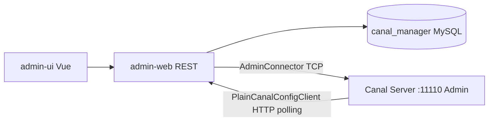

- **写配置**：UI → REST → DB
- **看状态/日志/启停**：Web → `SimpleAdminConnectors` → Server Admin 端口
- **Server 拉配置**：`PlainCanalConfigClient` → `/api/v1/config/*_polling`

---

## 33. 多流解析与 RDS 场景

### 33.1 GroupEventParser（多流）

配置 `canal.instance.multi.stream.on=true` 时，一个逻辑 destination 可挂载 **多个** `MysqlEventParser`（多库/多订阅源），由 `GroupEventParser` 代理：

```17:36:parse/src/main/java/com/alibaba/otter/canal/parse/inbound/group/GroupEventParser.java
public class GroupEventParser implements CanalEventParser {
    private List<CanalEventParser> eventParsers = new ArrayList<>();

    public void start() {
        for (CanalEventParser eventParser : eventParsers) {
            eventParser.start();
        }
    }
```

每个子 Parser 独立 dump 线程，共享同一 `eventSink`/`eventStore` 时需注意 Spring 装配方式（通常各流不同 destination 子名或独立 store，以实际 XML 为准）。

### 33.2 RdsBinlogEventParserProxy（阿里云 RDS）

当配置 `canal.instance.rds.*`（accesskey/secretkey/instanceId）时，使用 `RdsBinlogEventParserProxy` 替代普通 `MysqlEventParser`：

```23:38:parse/src/main/java/com/alibaba/otter/canal/parse/inbound/mysql/rds/RdsBinlogEventParserProxy.java
public class RdsBinlogEventParserProxy extends MysqlEventParser {
    private RdsLocalBinlogEventParser rdsLocalBinlogEventParser = null;
    private ExecutorService executorService = Executors.newSingleThreadExecutor(...);
```

**双模式切换**：

1. 正常：在线连接 RDS 执行 `COM_BINLOG_DUMP`（父类 `MysqlEventParser`）。
2. binlog 被清理或 `ServerLogPurgedException`：后台线程启动 `RdsLocalBinlogEventParser`，通过 **RDS OpenAPI 下载 OSS binlog 文件** 到本地目录，用 `LocalBinLogConnection` 离线解析。

`setRdsOssMode(true)` 处理 RDS OSS binlog 与 MariaDB/MySQL checksum 差异。适合云上自动主备、binlog 定期归档场景。

---

## 34. PlainCanalConfigClient HTTP 轮询 API

Server 端（Manager 模式或 `canal.admin.manager` 配置）通过 HTTP 与 Admin 同步配置。

### 34.1 主要端点

```72:106:instance/manager/src/main/java/com/alibaba/otter/canal/instance/manager/plain/PlainCanalConfigClient.java
    public PlainCanal findServer(String md5) {
        String url = configURL + "/api/v1/config/server_polling?ip=" + localIp + "&port=" + adminPort
                     + "&md5=" + md5 + "&register=" + (autoRegister ? 1 : 0) + "&cluster=" + autoCluster;
        return queryConfig(url);
    }

    public PlainCanal findInstance(String destination, String md5) {
        String url = configURL + "/api/v1/config/instance_polling/" + destination + "?md5=" + md5;
        return queryConfig(url);
    }

    public String findInstances(String md5) {
        String url = configURL + "/api/v1/config/instances_polling?md5=" + md5 + "&ip=" + localIp + "&port=" + adminPort;
    }
```

| API | 作用 |
|-----|------|
| `server_polling` | 拉取/更新全局 `canal.properties`；`register=1` 触发 `autoRegister` 登记 Node |
| `instances_polling` | 返回本机应运行的 destination 列表（逗号分隔） |
| `instance_polling/{name}` | 拉取单个 instance 的 properties 全文 |

请求头带 `user`/`passwd`，响应用 `contentMd5` 判断是否有变更；**md5 不变则 body 为空**，减少流量。

### 34.2 与 CanalLauncher 的配合

`CanalLauncher` 定时 `findServer(lastMd5)`，变化则 **整进程** `canalStater.stop()` + `start()`（见 §22.4）。Instance 级变更由 `ManagerInstanceConfigMonitor` + `findInstance` 触发对应 destination 的 `reload`。

---

## 35. Manager 配置监听与 Client/MQ 补充

### 35.1 ManagerInstanceConfigMonitor

与 §29 的 `SpringInstanceConfigMonitor` 对称，在 `instance.global.mode=manager` 时启用：不扫描本地 `conf/`，而是轮询 Admin 的 `instances_polling` + 各 instance 的 `instance_polling`。

```74:118:deployer/src/main/java/com/alibaba/otter/canal/deployer/monitor/ManagerInstanceConfigMonitor.java
    private void scan() {
        String instances = configClient.findInstances(null);
        final List<String> is = Lists.newArrayList(StringUtils.split(instances, ','));
        for (String instance : is) {
            if (!configs.containsKey(instance)) {
                PlainCanal newPlainCanal = configClient.findInstance(instance, null);
                if (newPlainCanal != null) {
                    configs.put(instance, newPlainCanal);
                    start.add(instance);
                }
            } else {
                PlainCanal newPlainCanal = configClient.findInstance(instance, plainCanal.getMd5());
                if (newPlainCanal != null) {
                    restart.add(instance);
                }
            }
        }
        // 不在列表中的 instance → stop
        stop.forEach(instance -> notifyStop(instance));
        restart.forEach(instance -> notifyReload(instance));
        start.forEach(instance -> notifyStart(instance));
    }
```

**与 Spring 模式的差异**：新增/删除 destination 由 Admin **分配列表** 驱动，而非文件系统目录；配置变更用 **md5** 增量拉取，避免全量 properties 重复传输。

### 35.2 CanalMessageDeserializer（TCP Client）

`SimpleCanalConnector` 从 Netty 收到字节后，统一经 `CanalMessageDeserializer` 解析为 `Message`：

```17:41:client/src/main/java/com/alibaba/otter/canal/client/CanalMessageDeserializer.java
    public static Message deserializer(byte[] data, boolean lazyParseEntry) {
        CanalPacket.Packet p = CanalPacket.Packet.parseFrom(data);
        switch (p.getType()) {
            case MESSAGES: {
                CanalPacket.Messages messages = CanalPacket.Messages.parseFrom(p.getBody());
                Message result = new Message(messages.getBatchId());
                if (lazyParseEntry) {
                    result.setRawEntries(messages.getMessagesList());
                    result.setRaw(true);
                } else {
                    for (ByteString byteString : messages.getMessagesList()) {
                        result.addEntry(CanalEntry.Entry.parseFrom(byteString));
                    }
                }
                return result;
            }
            case ACK: {
                throw new CanalClientException("something goes wrong with reason: " + ack.getErrorMessage());
            }
        }
    }
```

`lazyParseEntry=true` 时保留 `ByteString` 列表，延迟解析 `Entry`，降低大 batch 的 CPU 开销；与 Server 侧 `lazyParseEntry` 配置对应。

### 35.3 RocketMQ Producer（与 Kafka 对称）

`@SPI("rocketmq")` 的 `CanalRocketMQProducer` 同样继承 `AbstractMQProducer`，`send` 模板与 §31 一致：`dynamicTopic` 并行 → 成功 `callback.commit()` / 失败 `rollback()`。

```151:182:connector/rocketmq-connector/src/main/java/com/alibaba/otter/canal/connector/rocketmq/producer/CanalRocketMQProducer.java
    public void send(MQDestination destination, Message message, Callback callback) {
        ExecutorTemplate template = new ExecutorTemplate(sendExecutor);
        try {
            if (!StringUtils.isEmpty(destination.getDynamicTopic())) {
                // messageTopics → 多 topic 并行 submit
                template.waitForResult();
            } else {
                send(destination, destination.getTopic(), message);
            }
            callback.commit();
        } catch (Throwable e) {
            callback.rollback();
        }
    }
```

RocketMQ 特有：`getTopicDynamicQueuesSize` 用 **队列数** 作分区数；支持阿里云 ACL、`namespace`、消息轨迹。`flatMessage` 分支输出 JSON `FlatMessage`，供 `CanalRocketMQConnector` / adapter MQ 模式消费。

### 35.4 client-adapter：HBase 适配器概要

`@SPI("hbase")` 的 `HbaseAdapter` 在 `init` 时加载 `MappingConfig`（库表 → HBase 表/列族映射），通过 `HbaseTemplate` 写 `Put`/`Delete`：

```41:80:client-adapter/hbase/src/main/java/com/alibaba/otter/canal/client/adapter/hbase/HbaseAdapter.java
@SPI("hbase")
public class HbaseAdapter implements OuterAdapter {
    private HbaseSyncService hbaseSyncService;
    private HbaseTemplate hbaseTemplate;
    private HbaseConfigMonitor configMonitor;

    public void init(OuterAdapterConfig configuration, Properties envProperties) {
        Map<String, MappingConfig> hbaseMappingTmp = MappingConfigLoader.load(envProperties);
        Configuration hbaseConfig = HBaseConfiguration.create();
        properties.forEach(hbaseConfig::set);
```

`HbaseSyncService.sync` 将 `Dml` 转为 rowkey（可配置 hash/列拼接），与 RDB/ES 一样由 `AdapterProcessor` 批量调用 `OuterAdapter.sync`。`HbaseConfigMonitor` 监听 mapping yml 热更新，与 §13 的 `SyncSwitch` 配合启停同步。

### 35.5 ManagerInstanceConfigMonitor 深度

（原 §111；与 §29 Spring 监听器对照）

| 对比项 | Spring 模式 | Manager 模式 |
|--------|-------------|----------------|
| 监听源 | 本地 `conf/*/` | `findInstances` / `findInstance` |
| 全局配置变更 | 本地 `canal.properties` | `CanalLauncher` **整进程**重启（§107） |
| instance 变更 | reload 单 destination | 同左：`stop` → `reload` → `start` |

**scan 顺序**：先 `notifyStop`，再 `notifyReload`，最后 `notifyStart`。`findInstance(dest, md5)` 在 md5 未变时返回 null，跳过拉取。

HTTP：`/api/v1/config/server_polling`、`instances_polling`、`instance_polling`（§34）。

---

## 36. Canal 通信架构总览

Canal 在运行时涉及 **四条独立通信平面**，端口、协议、职责各不相同：

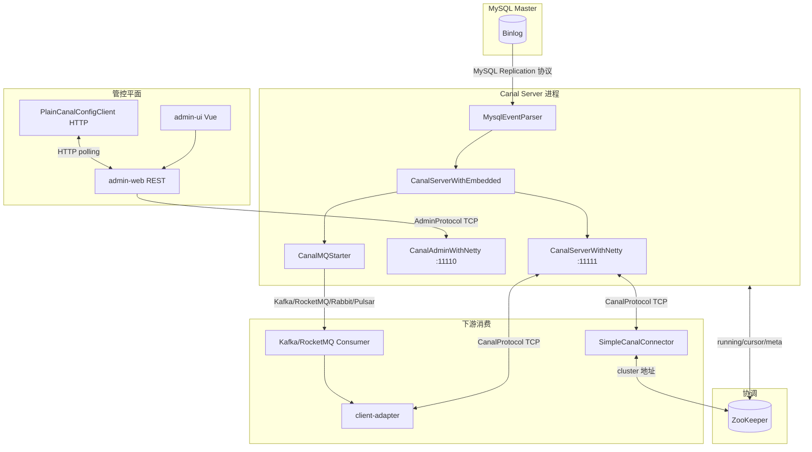

### 36.1 端口与协议对照

| 平面 | 默认端口 | 传输 | 协议载体 | 典型调用方 |
|------|----------|------|----------|------------|
| **数据消费** | `canal.port` **11111** | TCP | `CanalProtocol.proto` → `CanalPacket` | Java Client、client-adapter TCP 模式 |
| **进程管控** | `canal.admin.port` **11110** | TCP | `AdminProtocol.proto` → `AdminPacket` | admin-web `AdminConnector` |
| **配置下发** | Admin HTTP **8089** | HTTP | REST `/api/v1/config/*_polling` | `PlainCanalConfigClient` |
| **MySQL 复制** | 3306 | TCP | MySQL Client/Server 协议 | `MysqlConnector` |
| **Prometheus** | `canal.metrics.pull.port` **11112** | HTTP | `/metrics` | Prometheus scrape |
| **ZK 协调** | 2181 | TCP | ZK 原生协议 | `ServerRunningMonitor`、`ZooKeeperMetaManager` |

### 36.2 统一帧格式（数据面 + 管控面）

所有 Canal 自定义 TCP 协议（11111 / 11110）共用 **4 字节大端长度头 + Protobuf body**：

```15:20:server/src/main/java/com/alibaba/otter/canal/server/netty/handler/FixedHeaderFrameDecoder.java
public class FixedHeaderFrameDecoder extends ReplayingDecoder<VoidEnum> {
    protected Object decode(...) throws Exception {
        return buffer.readBytes(buffer.readInt());  // 先读 4 字节 length，再读 body
    }
}
```

发送侧对称实现（`NettyUtils.write` / `SimpleCanalConnector.writeWithHeader`）：

```44:50:server/src/main/java/com/alibaba/otter/canal/server/netty/NettyUtils.java
    public static void write(Channel channel, byte[] body, ...) {
        byte[] header = ByteBuffer.allocate(HEADER_LENGTH).order(ByteOrder.BIG_ENDIAN).putInt(body.length).array();
        Channels.write(channel, ChannelBuffers.wrappedBuffer(header, body))...
    }
```

**注意**：长度字段表示 **Protobuf Packet 序列化后的字节数**，不包含 4 字节头本身。

### 36.3 Netty Pipeline（数据端口 11111）

```71:82:server/src/main/java/com/alibaba/otter/canal/server/netty/CanalServerWithNetty.java
        bootstrap.setPipelineFactory(() -> {
            ChannelPipeline pipelines = Channels.pipeline();
            pipelines.addLast(new FixedHeaderFrameDecoder());
            pipelines.addLast(new HandshakeInitializationHandler(childGroups));
            pipelines.addLast(new ClientAuthenticationHandler(embeddedServer));
            pipelines.addLast(new SessionHandler(embeddedServer));
            return pipelines;
        });
```

连接建立后按序经过：**定长帧解码 → 握手发 seed → 客户端认证（认证成功后移除前两个 Handler）→ 业务 Session**。认证通过后注入 `IdleStateHandler` 做读写空闲断开（默认 1 小时，可由 `ClientAuth.net_read_timeout` 覆盖）。

---

## 37. TCP 数据协议详解（CanalProtocol）

协议定义：`protocol/src/main/java/com/alibaba/otter/canal/protocol/CanalProtocol.proto`。

### 37.1 Packet 信封结构

```35:51:protocol/src/main/java/com/alibaba/otter/canal/protocol/CanalProtocol.proto
message Packet {
     int32 version = 2;          // 当前固定为 1
     PacketType type = 3;
     Compression compression = 4; // 默认 NONE
     bytes body = 5;              // 具体消息体
}
```

### 37.2 PacketType 全表

| 枚举值 | 名称 | 方向 | body 类型 | 含义 |
|--------|------|------|-----------|------|
| 1 | HANDSHAKE | S→C | `Handshake` | 服务端发 8 字节 seed + 支持的压缩算法 |
| 2 | CLIENTAUTHENTICATION | C→S | `ClientAuth` | 用户名 + scramble 密码 + 可选 destination/clientId |
| 3 | ACK | S→C / 双向 | `Ack` | 成功（error_code=0）或错误 |
| 4 | SUBSCRIPTION | C→S | `Sub` | 订阅 destination，带 filter |
| 5 | UNSUBSCRIPTION | C→S | `Unsub` | 取消订阅 |
| 6 | GET | C→S | `Get` | 拉取 batch，`auto_ack=false` 时为 getWithoutAck |
| 7 | MESSAGES | S→C | `Messages` | 返回 `batch_id` + 若干 `Entry` 字节 |
| 8 | CLIENTACK | C→S | `ClientAck` | 确认 batch_id，释放 Store 位点 |
| 12 | CLIENTROLLBACK | C→S | `ClientRollback` | 回滚 batch（batch_id=0 表示全部） |
| 9 | SHUTDOWN | — | — | 管理类（较少用） |
| 10 | DUMP | — | `Dump` | 指定位点 dump |
| 11 | HEARTBEAT | — | `HeartBeat` | 心跳 |

### 37.3 典型消费会话时序

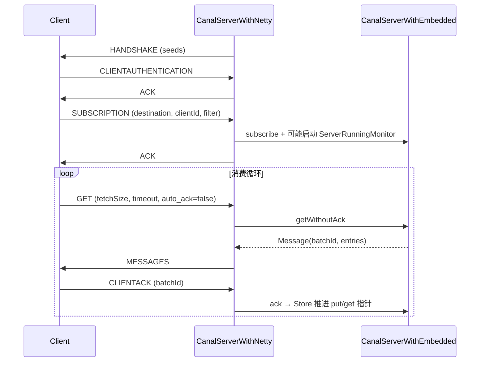

### 37.4 GET / MESSAGES 关键字段

`Get` 消息（客户端 `SimpleCanalConnector.getWithoutAck`）：

```114:130:protocol/src/main/java/com/alibaba/otter/canal/protocol/CanalProtocol.proto
message Get {
    string destination = 1;
    string client_id = 2;
    int32 fetch_size = 3;
    int64 timeout = 4;   // -1 表示不阻塞等待
    int32 unit = 5;      // 时间单位 ordinal：2=毫秒
    bool auto_ack = 6;   // Canal 主流用法为 false
}
```

`Messages` 响应：

```134:137:protocol/src/main/java/com/alibaba/otter/canal/protocol/CanalProtocol.proto
message Messages {
    int64 batch_id = 1;
    repeated bytes messages = 2;  // 每个元素是一个 CanalEntry.Entry 的 protobuf 字节
}
```

服务端 `SessionHandler` 对 **raw 模式** 做了性能优化：当 `Message.isRaw()==true` 时，用 `CodedOutputStream` 手工拼装 `MESSAGES` 包，避免重复 parse/serialize `Entry`（与 §42 的 MQ 序列化逻辑同源）。

### 37.5 CLIENTACK / CLIENTROLLBACK 语义

```231:278:server/src/main/java/com/alibaba/otter/canal/server/netty/handler/SessionHandler.java
                case CLIENTACK:
                    if (ack.getBatchId() == -1L) { // get 无数据
                    } else {
                        embeddedServer.ack(clientIdentity, ack.getBatchId());
                    }
                case CLIENTROLLBACK:
                    if (rollback.getBatchId() == 0L) {
                        embeddedServer.rollback(clientIdentity);  // 全部未 ack 批次
                    } else {
                        embeddedServer.rollback(clientIdentity, rollback.getBatchId());
                    }
```

- `batch_id = -1`：GET 超时或 Store 暂无数据，**无需 ack**。
- `CLIENTACK` 不返回响应包（仅内部 `ChannelFutureAggregator` 统计）。
- 客户端 `connect()` 后默认 `rollbackOnConnect=true`，会先 rollback 再消费，避免重复投递未 ack 数据。

---

## 38. 认证机制：MySQL 风格 scramble

Canal 数据端口认证算法与 **MySQL 4.1+ native password** 同源，实现在 `SecurityUtil`：

```10:17:protocol/src/main/java/com/alibaba/otter/canal/protocol/SecurityUtil.java
 * 1、client: stage1_hash = SHA1(明文密码); token = SHA1(scramble + SHA1(stage1_hash)) XOR stage1_hash
 * 2、server: token = SHA1(token XOR SHA1(scramble + password))
 * 3、check token vs password
```

### 38.1 握手与认证流程

1. **Server** `HandshakeInitializationHandler.channelOpen` 生成 8 字节随机 `seed`，发 `HANDSHAKE`。
2. **Client** `SimpleCanalConnector.doConnect` 收到 seed 后：

```167:184:client/src/main/java/com/alibaba/otter/canal/client/impl/SimpleCanalConnector.java
            ByteString seed = handshake.getSeeds();
            String newPasswd = SecurityUtil.byte2HexStr(SecurityUtil.scramble411(password.getBytes(), seed.toByteArray()));
            ClientAuth ca = ClientAuth.newBuilder()
                .setUsername(username)
                .setPassword(ByteString.copyFromUtf8(newPasswd))
                .setNetReadTimeout(idleTimeout)
                .build();
            writeWithHeader(Packet.newBuilder().setType(PacketType.CLIENTAUTHENTICATION).setBody(ca.toByteString()).build()...);
```

3. **Server** `ClientAuthenticationHandler` 调用 `embeddedServer.auth(username, hexPassword, seed)`，内部用 `scrambleServerAuth` 校验。
4. 认证成功发 `ACK`；失败发 `ACK(error_code=400)` 并带错误信息。
5. 若 `ClientAuth` 中带 `destination` + `clientId`，认证阶段即可 **合并 subscribe**（减少一次往返）。

Admin 端口（11110）使用同一套 `SecurityUtil`，但 `ClientAuth` 不含 destination，仅做进程级鉴权。

---

## 39. Admin 管控协议（AdminProtocol）

定义：`protocol/.../AdminProtocol.proto`。与数据协议共用 **4 字节头 + Protobuf**，但 `Packet` 无 `compression` 字段，body 为 field 4。

### 39.1 PacketType

| 值 | 类型 | body | 用途 |
|----|------|------|------|
| 1 | HANDSHAKE | `Handshake` | 仅 seeds，无压缩枚举 |
| 2 | CLIENTAUTHENTICATION | `ClientAuth` | 进程级认证 |
| 3 | ACK | `Ack` | 响应 |
| 4 | SERVER | `ServerAdmin` | `action`: check/start/stop/restart/list |
| 5 | INSTANCE | `InstanceAdmin` | `destination` + `action`: start/stop/release/restart |
| 6 | LOG | `LogAdmin` | 拉取 canal / instance 日志 tail |

### 39.2 与数据协议差异

| 维度 | CanalProtocol (11111) | AdminProtocol (11110) |
|------|----------------------|------------------------|
| 业务包 | SUBSCRIPTION/GET/MESSAGES/CLIENTACK | SERVER/INSTANCE/LOG |
| 认证后 Handler | `SessionHandler` 长连接消费 | `SessionHandler` 请求-响应式管控 |
| 典型连接模式 | 客户端常驻、循环 GET | admin-web 短连接或连接池 |
| 错误码 | 401/402 等 | Admin 侧 300 段 |

Admin `SessionHandler` 处理逻辑见 §30.2；`CanalAdminController`（Deployer）与 `CanalAdmin` 接口实现一一对应。

---

## 40. Admin Manager 节点注册与配置分配

Manager 模式下 Canal Server 通过 `PlainCanalConfigClient.findServer(md5)` 轮询，URL 带 `register=1` 时触发 **自动登记节点**。

### 40.1 autoRegister 逻辑

```32:52:admin/admin-web/src/main/java/com/alibaba/otter/canal/admin/service/impl/PollingConfigServiceImpl.java
    public boolean autoRegister(String ip, Integer adminPort, String cluster, String name) {
        NodeServer server = NodeServer.find.query().where().eq("ip", ip).eq("adminPort", adminPort).findOne();
        if (server == null) {
            server = new NodeServer();
            server.setIp(ip);
            server.setAdminPort(adminPort);
            server.setTcpPort(adminPort + 1);      // 约定：数据端口 = adminPort + 1
            server.setMetricPort(adminPort + 2);   // 监控端口 = adminPort + 2
            if (StringUtils.isNotEmpty(cluster)) {
                server.setClusterId(canalClusterService.findByName(cluster).getId());
            }
            nodeServerService.save(server);
        }
        return true;
    }
```

**端口约定**：若 Admin 登记时只上报 `adminPort=11110`，则 UI 自动推断 `tcpPort=11111`、`metricPort=11112`。

### 40.2 配置归属：单机 vs 集群

| 场景 | `canal.properties` 来源 | `instances` 列表来源 |
|------|---------------------------|----------------------|
| 单机 Node | `CanalConfig.serverId = node.id` | 绑定该 server 的 instance |
| 集群 Node | `CanalConfig.clusterId = cluster.id` | 集群下所有 `status=1` 的 instance |

`getChangedConfig` / `getInstancesConfig` / `getInstanceConfig` 均用 **contentMd5** 判断变更；md5 一致则返回 `content=null`，Server 端跳过 reload。

### 40.3 与 ZK 的关系

- **Admin Manager**：管配置与 Node 元数据（MySQL `canal_manager`），**不替代** ZK 的 instance 选主。
- **ZK**：仍负责每个 destination 的 `running` 临时节点，决定 **哪台 Server 真正跑 Parser**（§41）。
- 典型部署：Admin 告诉 Server「应有哪些 destination」；ZK 决定「多机中谁 active」。

---

## 41. ZooKeeper 路径与 Server/Client 选主

路径规范集中在 `ZookeeperPathUtils`：

```7:27:common/src/main/java/com/alibaba/otter/canal/common/zookeeper/ZookeeperPathUtils.java
 * /otter/canal/destinations/{dest}/running          (EPHEMERAL) Server 选主
 * /otter/canal/destinations/{dest}/{clientId}/running (EPHEMERAL) Client 选主
 * /otter/canal/destinations/{dest}/{clientId}/cursor  消费位点
 * /otter/canal/destinations/{dest}/{clientId}/mark/{batchId}  batch 标记
```

### 41.1 Server 侧：ServerRunningMonitor

```138:163:common/src/main/java/com/alibaba/otter/canal/common/zookeeper/running/ServerRunningMonitor.java
    private void initRunning() {
        String path = ZookeeperPathUtils.getDestinationServerRunning(destination);
        byte[] bytes = JsonUtils.marshalToByte(serverData);
        try {
            zkClient.create(path, bytes, CreateMode.EPHEMERAL);  // 抢占成功 → active
            processActiveEnter();
        } catch (ZkNodeExistsException e) {
            activeData = JsonUtils.unmarshalFromByte(zkClient.readData(path), ServerRunningData.class);
            // 已有其他节点 active，本机 standby
        }
    }
```

- `ServerRunningData` 含 `address`（ip:port）、`active` 等 JSON 字段。
- 临时节点删除（active 机器宕机）→ `handleDataDeleted` → 延迟 5s 后 `initRunning` 重抢，避免抖动。
- `release()`：主动将 running 节点标为非 active，供 Admin `releaseInstance` 做 **优雅切主**。

### 41.2 Client 侧：ClientRunningMonitor

与 Server 对称，路径为 `/destinations/{dest}/{clientId}/running`。`ClusterCanalConnector` 通过 ZK 发现当前 active Server 地址；`SimpleCanalConnector` + `ClientRunningMonitor` 保证 **同一 clientId 只有一个消费者在工作**（HA 消费）。

### 41.3 Meta 与 cursor

`ZooKeeperMetaManager`（§25）将 client 消费进度写入 `cursor` 节点；`mark/{batchId}` 记录未 ack 批次，与 `MemoryEventStoreWithBuffer` 三指针配合实现 **at-least-once** 语义。

路径全集见 **§99**。

### 41.4 ServerRunningMonitor 抢主时序

（原 §114）

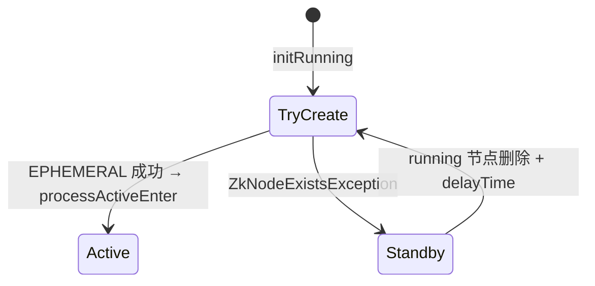

| 场景 | 行为 |
|------|------|
| `lazy=false` | `CanalController.start()` 即抢主（§74） |
| `lazy=true` | 首 `subscribe` 或 Admin `startInstance` 才 `start()`（§80） |
| `waitForActive` | `initRunning()` + `mutex.get()` 阻塞至成为 active |
| `processActiveEnter` | `embeddedServer.start` + `canalMQStarter.startDestination`（§97） |
| `release()` | 优雅让位，供 Admin `releaseInstance` |

---

## 42. CanalMessageSerializerUtil 序列化

MQ Producer 与 TCP `SessionHandler` 共用此工具，将 `Message` 转为可投递字节。

### 42.1 两种路径

```25:78:connector/core/src/main/java/com/alibaba/otter/canal/connector/core/util/CanalMessageSerializerUtil.java
    public static byte[] serializer(Message data, boolean filterTransactionEntry) {
        if (data.isRaw() && !isEmpty(data.getRawEntries())) {
            // 路径 A：raw ByteString 列表，手工 CodedOutputStream（高性能，与 SessionHandler 一致）
            output.writeEnum(3, PacketType.MESSAGES.getNumber());
            output.writeInt64(1, data.getId());
            for (ByteString rowEntry : rowEntries) {
                output.writeBytes(2, rowEntry);
            }
        } else if (!isEmpty(data.getEntries())) {
            // 路径 B：MQ 常见——已解析的 Entry 列表，封装完整 Packet protobuf
            for (CanalEntry.Entry entry : data.getEntries()) {
                if (filterTransactionEntry && isTransaction(entry)) continue;
                messageBuilder.addMessages(entry.toByteString());
            }
            packetBuilder.setType(PacketType.MESSAGES).setVersion(1);
            return packetBuilder.build().toByteArray();
        }
    }
```

| 路径 | 触发条件 | 输出形态 | 使用场景 |
|------|----------|----------|----------|
| A raw | `Message.isRaw()` | 仅 `MESSAGES` 体或内嵌 Packet | Server lazyParse、高性能 TCP |
| B 非 raw | `getEntries()` 非空 | 完整 `Packet{ type=MESSAGES, body=Messages }` | Kafka/RocketMQ 默认投递 |

`filterTransactionEntry=true` 时去掉 `TRANSACTIONBEGIN/END`，减小 MQ 消息体积（下游通常不关心事务边界包）。

### 42.2 反序列化

`deserializer(byte[], lazyParseEntry)` 与 `CanalMessageDeserializer`（§35.2）逻辑一致：解析 `Packet` → `Messages` → `List<Entry>` 或 raw `ByteString`。

---

## 43. RabbitMQ / Pulsar Producer

与 §31 Kafka、§35.3 RocketMQ 同属 `AbstractMQProducer` + `@SPI` 体系。

### 43.1 CanalRabbitMQProducer

```41:99:connector/rabbitmq-connector/.../CanalRabbitMQProducer.java
@SPI("rabbitmq")
public class CanalRabbitMQProducer extends AbstractMQProducer {
    // init: ConnectionFactory → queueDeclare / exchangeDeclare / queueBind
    public void send(MQDestination destination, Message message, Callback callback) {
        // dynamicTopic 并行 → template.waitForResult() → callback.commit/rollback
    }
}
```

特点：

- 支持 `amqp://` URI 或 `host:port`；阿里云 AMQP 用 `AliyunCredentialsProvider`。
- 消息发到 **queue** 或 **exchange + routingKey**；`flatMessage` 时 body 为 `FlatMessage` JSON。
- 非 flat 时用 `CanalMessageSerializerUtil.serializer` 得到 protobuf 字节，作为 AMQP body。

### 43.2 CanalPulsarMQProducer

```39:104:connector/pulsarmq-connector/.../CanalPulsarMQProducer.java
@SPI("pulsarmq")
public class CanalPulsarMQProducer extends AbstractMQProducer {
    // PulsarClient + 可选 token 认证 + sendPartitionExecutor
    public static final String MSG_PROPERTY_PARTITION_NAME = "partitionNum";
}
```

特点：

- Topic 可能动态（表名正则），Producer **懒加载** 缓存于 `PRODUCERS` Map。
- 分区属性写入 Pulsar message property `partitionNum`，便于消费端保序。
- `flatMessage` 与 protobuf 双模式，与 Kafka 对齐。

### 43.3 MQ Producer SPI 总览

| SPI name | 类 | 顺序保证手段 |
|----------|-----|--------------|
| kafka | `CanalKafkaProducer` | `max.in.flight=1` + 分区 hash |
| rocketmq | `CanalRocketMQProducer` | queue 选择 + `sendPartitionExecutor` |
| rabbitmq | `CanalRabbitMQProducer` | 单 queue 或 routingKey |
| pulsarmq | `CanalPulsarMQProducer` | partition property + 多 topic producer |

全部遵循：**send 成功 → `callback.commit()` → Server `ack`；异常 → `rollback()`**（§19）。

---

## 44. client-adapter MQ 消费全链路

client-adapter 通过 **统一抽象 `CanalMsgConsumer`** 屏蔽 TCP / Kafka / RocketMQ 等差异，`AdapterProcessor` 只关心 `List<CommonMessage>`。

### 44.1 SPI 加载

```66:79:client-adapter/launcher/.../AdapterProcessor.java
        ExtensionLoader<CanalMsgConsumer> loader = new ExtensionLoader<>(CanalMsgConsumer.class);
        String key = destination + "_" + groupId;
        canalMsgConsumer = new ProxyCanalMsgConsumer(loader.getExtension(
            canalClientConfig.getMode().toLowerCase(), key, "/plugin", "/canal-adapter/plugin"));
        properties.put(CanalConstants.CANAL_MQ_FLAT_MESSAGE, canalClientConfig.getFlatMessage());
        canalMsgConsumer.init(properties, canalDestination, groupId);
```

`application.yml` 中 `canal.conf.mode` 取值：`tcp` | `kafka` | `rocketMQ` | `rabbitMQ` 等，对应 `connector/*/consumer` 下 `@SPI` 实现。

### 44.2 消费循环

```184:214:client-adapter/launcher/.../AdapterProcessor.java
        while (running) {
            canalMsgConsumer.connect();
            while (running) {
                syncSwitch.get(canalDestination, 1L, TimeUnit.MINUTES);  // 开关控制
                List<CommonMessage> commonMessages = canalMsgConsumer.getMessage(timeout, MILLISECONDS);
                writeOut(commonMessages);   // → MessageUtil.flatMessage2Dml → OuterAdapter.sync
                canalMsgConsumer.ack();
            }
            canalMsgConsumer.disconnect();
        }
```

失败时：`rollback()` 重试；`terminateOnException=true` 则 `syncSwitch.off` 停同步。

### 44.3 TCP 模式：CanalTCPConsumer

```32:78:connector/tcp-connector/.../CanalTCPConsumer.java
@SPI("tcp")
public class CanalTCPConsumer implements CanalMsgConsumer {
    // host 直连 SimpleCanalConnector，或 zkHosts → ClusterCanalConnector
    public List<CommonMessage> getMessage(...) {
        Message message = canalConnector.getWithoutAck(batchSize, timeout, unit);
        return MessageUtil.convert(message);  // Entry → CommonMessage
    }
}
```

内部仍是 **CanalProtocol** 全套：connect → subscribe → GET → MESSAGES → CLIENTACK。

### 44.4 Kafka 模式：CanalKafkaConsumer

```33:112:connector/kafka-connector/.../CanalKafkaConsumer.java
@SPI("kafka")
public class CanalKafkaConsumer implements CanalMsgConsumer {
    public void connect() {
        if (flatMessage) {
            value.deserializer = StringDeserializer;  // JSON FlatMessage
        } else {
            value.deserializer = KafkaMessageDeserializer;  // protobuf Message
        }
        kafkaConsumer.subscribe(topic);
    }
    public List<CommonMessage> getMessage(...) {
        // poll → JSON.parseObject(flatMessageJson, CommonMessage.class)
    }
    public void rollback() {
        kafkaConsumer.seek(partition, currentOffsets.get(partition));  // 按分区回退 offset
    }
}
```

**flatMessage=true**（与 Server `canal.mq.flatMessage=true` 配套）时，消息体为 `FlatMessage` JSON，经 `MessageUtil.flatMessage2Dml` 转 `Dml`，无需再解析 `CanalEntry`。

### 44.5 端到端数据形态转换

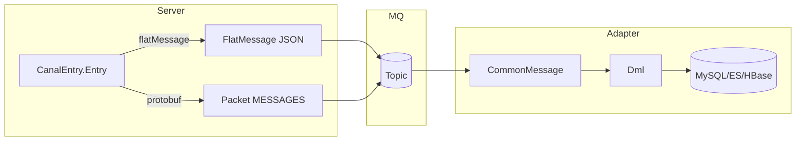

| 阶段 | TCP 模式 | MQ flat 模式 | MQ protobuf 模式 |
|------|----------|--------------|------------------|
| Server 输出 | MESSAGES + Entry bytes | FlatMessage / topic | CanalMessageSerializerUtil |
| Consumer | `MessageUtil.convert(Message)` | `JSON → CommonMessage` | `KafkaMessageDeserializer` |
| Adapter | `parse4Dml` 或 `flatMessage2Dml` | `flatMessage2Dml` | `parse4Dml` |

---

## 45. FlatMessage 与 CommonMessage 数据模型

MQ 模式与 client-adapter 普遍使用 **行级 JSON** 而非完整 `CanalEntry` Protobuf。Canal 内部有两层近似结构：

| 类 | 模块 | 用途 |
|----|------|------|
| `FlatMessage` | `protocol` | Server 端 MQ Producer 构造、序列化为 JSON 投递 |
| `CommonMessage` | `connector/core` | Consumer SPI 统一返回类型，字段与 FlatMessage 对齐 |
| `Dml` | `client-adapter/common` | Adapter 落地层内部模型，`MessageUtil` 负责转换 |

### 45.1 FlatMessage 字段说明

```12:30:protocol/src/main/java/com/alibaba/otter/canal/protocol/FlatMessage.java
public class FlatMessage implements Serializable {
    private long id;                          // 对应 Message.batchId
    private String database;                  // schema
    private String table;
    private List<String> pkNames;             // 主键列名
    private Boolean isDdl;
    private String type;                      // INSERT / UPDATE / DELETE / CREATE / ...
    private Long es;                          // binlog executeTime（毫秒）
    private Long ts;                          // Canal 构建时间戳
    private String sql;                       // DDL 时有值
    private Map<String, Integer> sqlType;     // 列 → JDBC Types
    private Map<String, String> mysqlType;    // 列 → mysql 类型字符串
    private List<Map<String, String>> data;   // 变更后行（INSERT/UPDATE 的 after）
    private List<Map<String, String>> old;    // 变更前行（UPDATE/DELETE）
    private String gtid;
}
```

**一行 binlog 多行数据**：`data` / `old` 为 `List<Map>`，每个 Map 对应一行；UPDATE 时 `data[i]` 与 `old[i]` 一一对应。

### 45.2 Server 端构造：MQMessageUtils.messageConverter

```355:376:connector/core/src/main/java/com/alibaba/otter/canal/connector/core/producer/MQMessageUtils.java
    public static List<FlatMessage> messageConverter(EntryRowData[] datas, long id) {
        FlatMessage flatMessage = new FlatMessage(id);
        flatMessage.setDatabase(entry.getHeader().getSchemaName());
        flatMessage.setTable(entry.getHeader().getTableName());
        flatMessage.setIsDdl(rowChange.getIsDdl());
        flatMessage.setType(eventType.toString());
        flatMessage.setEs(entry.getHeader().getExecuteTime());
        flatMessage.setGtid(entry.getHeader().getGtid());
        // 遍历 RowData → 填充 data/old/sqlType/mysqlType/pkNames
    }
```

`messagePartition(FlatMessage, partitionsNum, pkHashConfigs)` 按主键 hash 拆分到不同 MQ 分区，保证 **同一主键行变更顺序**。

### 45.3 Adapter 侧：flatMessage2Dml

```149:175:client-adapter/common/.../MessageUtil.java
    public static Dml flatMessage2Dml(String destination, String groupId, CommonMessage commonMessage) {
        Dml dml = new Dml();
        dml.setDestination(destination);
        dml.setDatabase(commonMessage.getDatabase());
        dml.setType(commonMessage.getType());
        dml.setData(commonMessage.getData());   // Map<String,Object>，已做类型转换
        dml.setOld(commonMessage.getOld());
        return dml;
    }
```

TCP 模式走 `parse4Dml(Message)`：从 `CanalEntry.Entry` → `RowChange` → `Dml`，需解析 `storeValue` 二进制。

---

## 46. CanalEntry 协议结构

定义：`protocol/.../EntryProtocol.proto`，生成类 `CanalEntry`。

### 46.1 核心消息层次

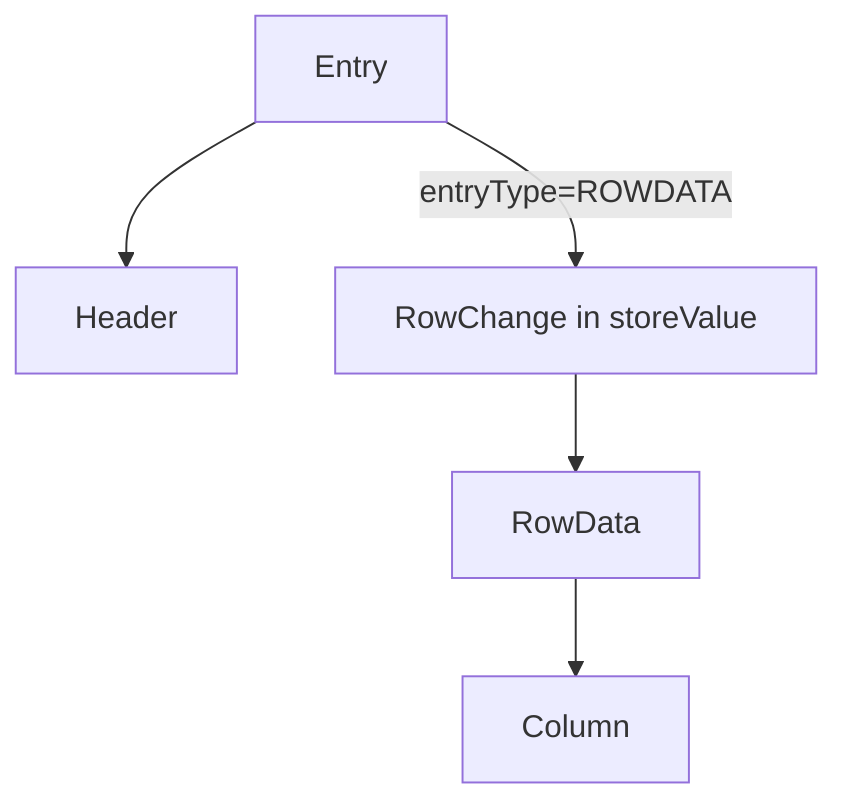

```12:22:protocol/src/main/java/com/alibaba/otter/canal/protocol/EntryProtocol.proto
message Entry {
     Header header = 1;
     EntryType entryType = 2;    // TRANSACTIONBEGIN / ROWDATA / TRANSACTIONEND / HEARTBEAT
     bytes storeValue = 3;       // entryType 对应的嵌套 protobuf 序列化结果
}
```

### 46.2 Header 关键字段

| 字段 | 含义 |
|------|------|
| `logfileName` + `logfileOffset` | binlog 位点（file + position） |
| `executeTime` | 变更在 MySQL 执行时间 |
| `schemaName` / `tableName` | 库表 |
| `eventType` | INSERT/UPDATE/DELETE/CREATE/... |
| `gtid` | GTID 模式下事务标识 |

### 46.3 EntryType 与 storeValue 对应关系

| entryType | storeValue 解析为 | 说明 |
|-----------|-------------------|------|
| TRANSACTIONBEGIN | `TransactionBegin` | 事务开始，含 threadId |
| ROWDATA | `RowChange` | DML/DDL 主体 |
| TRANSACTIONEND | `TransactionEnd` | 事务结束 |
| HEARTBEAT | — | 内部心跳，常过滤 |

`RowChange` 含 `isDdl`、`sql`（DDL）、`rowDatas[]`（DML 多行）。每行 `RowData` 有 `beforeColumns` / `afterColumns`。

### 46.4 Message 与 Entry 的关系

- `Message`（Java 类）：一次 `getWithoutAck` 返回的 **批次**，含 `id`（batchId）+ `List<Entry>`。
- TCP `MESSAGES` 包：`batch_id` + 多个 Entry 的 **独立 protobuf 字节**。
- 事务边界：同一 batch 可含 BEGIN + 多 ROWDATA + END；MQ flat 模式通常跳过 BEGIN/END。

### 46.5 EventType 枚举速查

（原 §113，`EntryProtocol.proto`）

| EventType | 类别 |
|-----------|------|
| INSERT / UPDATE / DELETE | DML |
| CREATE / ALTER / ERASE / RENAME / TRUNCATE | DDL |
| QUERY | 原始 SQL |
| CINDEX / DINDEX | 索引 |
| GTID | GTID 事件 |
| XACOMMIT / XAROLLBACK | XA |
| MHEARTBEAT | Master 心跳 |

`GTIDLOG`（EntryType=5）用于 GTID 集合变更；与 Header.`gtid` 字段配合使用。

---

## 47. ClusterCanalConnector 集群消费与 Failover

> **主读本节**；Failover 状态机与 `restart` 细节见 **§96**（延伸，内容重叠可跳过其一）。

`ClusterCanalConnector` 包装 `SimpleCanalConnector`，在 **subscribe/get/ack 失败时自动 disconnect → sleep → connect** 换节点重试。

### 47.1 三种寻址策略（CanalConnectors）

| 工厂方法 | AccessStrategy | 寻址方式 |
|----------|----------------|----------|
| `newSingleConnector` | 无（直连） | 固定 `SocketAddress` |
| `newClusterConnector(List)` | `SimpleNodeAccessStrategy` | 静态 Server 列表轮询 |
| `newClusterConnector(zkServers)` | `ClusterNodeAccessStrategy` | ZK 动态发现 |

### 47.2 ClusterNodeAccessStrategy：双路径监听

```52:75:client/src/main/java/com/alibaba/otter/canal/client/impl/ClusterNodeAccessStrategy.java
        // 路径1：/destinations/{dest}/cluster/ 子节点列表 → 候选 Server 地址（shuffle）
        String clusterPath = ZookeeperPathUtils.getDestinationClusterRoot(destination);
        zkClient.subscribeChildChanges(clusterPath, childListener);

        // 路径2：/destinations/{dest}/running → 当前 active Server
        String runningPath = ZookeeperPathUtils.getDestinationServerRunning(destination);
        zkClient.subscribeDataChanges(runningPath, dataListener);

    public SocketAddress nextNode() {
        if (runningAddress != null) {
            return runningAddress;           // 优先连 active 节点
        } else if (!currentAddress.isEmpty()) {
            return currentAddress.get(0);      // lazy 启动：触发第一台 start
        }
        throw new ServerNotFoundException(...);
    }
```

**与 §41 ServerRunningMonitor 的关系**：Server 抢 `running` 成功后写入 `ServerRunningData.address`；Client 读同一节点得到 `ip:port`（数据端口 11111）。

### 47.3 Failover 重试模板

```278:286:client/src/main/java/com/alibaba/otter/canal/client/impl/ClusterCanalConnector.java
    private void restart() throws CanalClientException {
        disconnect();
        Thread.sleep(retryInterval);   // 默认 5s
        connect();                     // nextNode() 可能指向新 active
    }
```

`getWithoutAck` / `ack` / `subscribe` 均在 catch 后调用 `restart()`，默认 `retryTimes=3`。`retryTimes=-1` 时 subscribe 阻塞等待可被 `InterruptedException` 优雅打断（issue 相关修复）。

`connect()` 内 `SimpleCanalConnector` 重写 `getNextAddress()` → `accessStrategy.nextNode()`，实现 **无硬编码 IP 的透明切换**。

---

## 48. ClientRunningMonitor 消费端 HA

与 Server 侧 `ServerRunningMonitor` 对称，保证 **同一 destination + clientId 只有一个消费进程 active**。

### 48.1 ZK 路径

`/otter/canal/destinations/{destination}/{clientId}/running`（EPHEMERAL）

### 48.2 抢占与切换

```107:131:client/src/main/java/com/alibaba/otter/canal/client/impl/running/ClientRunningMonitor.java
    public synchronized void initRunning() {
        String path = ZookeeperPathUtils.getDestinationClientRunning(destination, clientData.getClientId());
        try {
            zkClient.create(path, bytes, CreateMode.EPHEMERAL);
            processActiveEnter();   // 回调 listener → doConnect
            mutex.set(true);
        } catch (ZkNodeExistsException e) {
            activeData = JsonUtils.unmarshalFromByte(zkClient.readData(path), ClientRunningData.class);
            if (isMine(activeData.getAddress())) {
                mutex.set(true);    // 避免活锁（issue #697）
            }
        }
    }
```

`SimpleCanalConnector.connect()` 若设置了 `runningMonitor`，则 **先 `waitClientRunning()` 抢 ZK 节点**，成为 active 后才 `doConnect()`；`disconnect()` 时 stop monitor 并释放节点。

### 48.3 典型部署

| 模式 | 组件 | 效果 |
|------|------|------|
| 单 Client 直连 | 无 Monitor | 简单消费 |
| Client 多机 HA | `ClientRunningMonitor` + 相同 clientId | 主备消费，备机 standby |
| Client 连 Server 集群 | `ClusterCanalConnector` + ZK | Server 与 Client 双层 HA |

---

## 49. CanalConnectors 连接工厂

统一入口 `client/.../CanalConnectors.java`，屏蔽 `SimpleCanalConnector` / `ClusterCanalConnector` 构造细节。

```29:75:client/src/main/java/com/alibaba/otter/canal/client/CanalConnectors.java
    public static CanalConnector newSingleConnector(SocketAddress address, String destination, ...) {
        SimpleCanalConnector c = new SimpleCanalConnector(address, username, password, destination);
        c.setSoTimeout(60 * 1000);
        c.setIdleTimeout(60 * 60 * 1000);
        return c;
    }

    public static CanalConnector newClusterConnector(List addresses, ...) {
        return new ClusterCanalConnector(..., new SimpleNodeAccessStrategy(addresses));
    }

    public static CanalConnector newClusterConnector(String zkServers, ...) {
        return new ClusterCanalConnector(..., new ClusterNodeAccessStrategy(destination, ZkClientx.getZkClient(zkServers)));
    }
```

默认超时：`soTimeout=60s`（单次读包），`idleTimeout=1h`（传给 Server 侧 IdleStateHandler）。

**example 模块**与 **connector/tcp-connector** 均通过此工厂或等价的 `SimpleCanalConnector` / `ClusterCanalConnector` 接入。

---

## 50. MysqlMultiStageCoprocessor 并行解析

当 `canal.instance.parser.parallel=true` 时，`MysqlConnection.dump` 走 **MultiStageCoprocessor** 路径，用 LMAX Disruptor 将解析拆为多阶段流水线。

### 50.1 四阶段模型

```29:37:parse/src/main/java/com/alibaba/otter/canal/parse/inbound/mysql/MysqlMultiStageCoprocessor.java
 * 1. 网络接收 (单线程)        — MysqlConnection 读 socket → publish LogBuffer
 * 2. 事件基本解析 (单线程)    — 事件类型、DDL 建 TableMeta、维护位点
 * 3. 事件深度解析 (多线程)    — DML 行数据完整反序列化
 * 4. 投递到 store (单线程)    — EventTransactionBuffer → Sink
```

与单线程 `dump(..., SinkFunction)` 对比：

```182:210:parse/src/main/java/com/alibaba/otter/canal/parse/inbound/mysql/MysqlConnection.java
    // 单线程：fetch → decode → sink 在同循环
    public void dump(String binlogfilename, Long binlogPosition, SinkFunction func) {
        while (fetcher.fetch()) {
            LogEvent event = decoder.decode(fetcher, context);
            func.sink(event);
        }
    }

    // 并行：fetch 只 publish LogBuffer，解码在 Disruptor worker
    public void dump(String binlogfilename, Long binlogPosition, MultiStageCoprocessor coprocessor) {
        while (fetcher.fetch()) {
            LogBuffer buffer = fetcher.duplicate();
            coprocessor.publish(buffer);
        }
    }
```

### 50.2 配置与背压

- `ringBufferSize`：Disruptor 环形缓冲大小，满时 `publish` 阻塞，形成对网络读的背压。
- `parserThreadCount`：阶段 3 并行 worker 数。
- `eventsPublishBlockingTime`：统计 publish 阻塞耗时，可用于监控。

适用场景：宽表、大行、高 QPS 时把 **CPU 密集的 Row 解析** 从 IO 线程剥离；代价是内存占用与复杂度上升。

---

## 51. AbstractCanalInstance 组件装配与生命周期

每个 **destination** 对应一个 `CanalInstance`，是 Parser/Sink/Store/Meta 的容器。

### 51.1 核心依赖

```33:41:instance/core/src/main/java/com/alibaba/otter/canal/instance/core/AbstractCanalInstance.java
    protected String destination;
    protected CanalEventStore<Event> eventStore;
    protected CanalEventParser eventParser;
    protected CanalEventSink<List<CanalEntry.Entry>> eventSink;
    protected CanalMetaManager metaManager;
    protected CanalAlarmHandler alarmHandler;
    protected CanalMQConfig mqConfig;
```

Spring 模式由 `default-instance.xml` 注入具体实现 Bean；`CanalInstanceWithSpring` 继承 `AbstractCanalInstance`。

### 51.2 启动顺序

```76:98:instance/core/src/main/java/com/alibaba/otter/canal/instance/core/AbstractCanalInstance.java
    public void start() {
        metaManager.start();
        alarmHandler.start();
        eventStore.start();
        eventSink.start();
        beforeStartEventParser(eventParser);
        eventParser.start();    // 最后启动：开始连 MySQL dump
    }
```

**停止顺序相反**：先停 Parser（断 binlog），再停 Sink/Store，最后 Meta。

### 51.3 subscribe 与 filter 热更新

`subscribeChange(ClientIdentity)` 将客户端 filter 设为 `AviaterRegexFilter` 注入 `AbstractEventParser`；`GroupEventParser` 时对每个子 Parser 分别设置（§33）。

数据流：

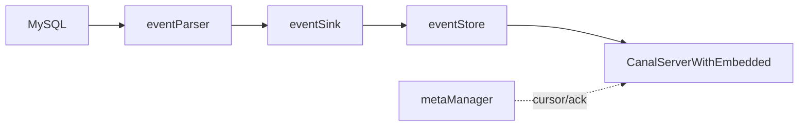

---

## 52. MySQL 复制命令包补充（GTID / Semi-sync）

§6 已介绍 `COM_BINLOG_DUMP`；此处补充 GTID 与半同步细节。

### 52.1 命令字对照

| 命令 | 字节 | 类 | 场景 |
|------|------|-----|------|
| COM_REGISTER_SLAVE | 0x15 | `RegisterSlaveCommandPacket` | dump 前注册 slaveId |
| COM_BINLOG_DUMP | 0x12 | `BinlogDumpCommandPacket` | 按 file+position |
| COM_BINLOG_DUMP_GTID | 0x1e | `BinlogDumpGTIDCommandPacket` | 按 GTIDSet |

### 52.2 GTID Dump 包结构

```31:64:driver/.../BinlogDumpGTIDCommandPacket.java
    public byte[] toBytes() {
        out.write(getCommand());                              // 0x1e
        ByteHelper.writeUnsignedShortLittleEndian(BINLOG_THROUGH_GTID, out);  // flags
        ByteHelper.writeUnsignedIntLittleEndian(slaveServerId, out);
        ByteHelper.writeUnsignedIntLittleEndian(0, out);      // binlog-filename-len = 0
        ByteHelper.writeUnsignedInt64LittleEndian(4, out);    // binlog-pos 占位
        byte[] bs = gtidSet.encode();
        ByteHelper.writeUnsignedIntLittleEndian(bs.length, out);
        out.write(bs);                                        // GTID set 二进制
    }
```

`MysqlConnection.dump(GTIDSet)` **不调用** `sendRegisterSlave`（与 file 模式不同），直接 `sendBinlogDumpGTID`。

### 52.3 dump 主流程（file 模式）

```182:210:parse/.../MysqlConnection.java
    public void dump(String binlogfilename, Long binlogPosition, SinkFunction func) {
        updateSettings();
        loadBinlogChecksum();
        sendRegisterSlave();
        sendBinlogDump(binlogfilename, binlogPosition);
        while (fetcher.fetch()) {
            LogEvent event = decoder.decode(fetcher, context);
            func.sink(event);
            if (event.getSemival() == 1) {
                sendSemiAck(...);   // 半同步复制 ACK
            }
        }
    }
```

### 52.4 Semi-sync 与 checksum

- `loadBinlogChecksum()`：查询 `@@binlog_checksum`，设置 `FormatDescriptionLogEvent` 的 checksum 算法，否则 `LogDecoder` 解析 ROW 事件会错位。
- `sendSemiAck`：当 Master 开启半同步且事件 `semival==1` 时回 ACK，否则 Master 可能阻塞提交。

---

## 53. Spring 装配：default-instance.xml 全图

每个 destination 对应一个 Spring 子上下文，加载 `classpath:spring/default-instance.xml`（import `base-instance.xml`）。

### 53.1 配置加载链

```14:22:deployer/src/main/resources/spring/base-instance.xml
    <bean class="...PropertyPlaceholderConfigurer">
        <property name="locationNames">
            <list>
                <value>classpath:canal.properties</value>
                <value>classpath:${canal.instance.destination:}/instance.properties</value>
            </list>
        </property>
    </bean>
```

Manager 模式下 `PlainCanalInstanceGenerator` 用 `propertiesLocal` 覆盖占位符（§28），无需物理 `conf/{dest}/` 目录。

### 53.2 Bean 依赖图

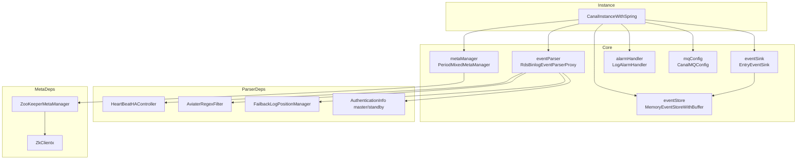

### 53.3 关键配置项与 Bean 映射

| instance.properties 键 | 注入 Bean / 属性 | 作用 |
|------------------------|------------------|------|
| `canal.instance.master.address` | `eventParser.masterInfo` | MySQL 主库 |
| `canal.instance.filter.regex` | `eventParser.eventFilter` | 表白名单 |
| `canal.instance.transaction.size` | `eventParser.transactionSize` → `EventTransactionBuffer` | 事务内最大 entry 数 |
| `canal.instance.memory.buffer.size` | `eventStore.bufferSize` | Store 环形槽位数 |
| `canal.instance.memory.rawEntry` | `eventStore.raw` | TCP 是否 raw 透传 |
| `canal.instance.parser.parallel` | `eventParser.parallel` | Disruptor 并行 |
| `canal.instance.gtidon` | `eventParser.isGTIDMode` | GTID dump |
| `canal.mq.topic` 等 | `mqConfig` | MQ 投递目标（§57） |

`baseEventParser` 抽象父类为 `RdsBinlogEventParserProxy`：未配置 RDS 时行为等同 `MysqlEventParser`（§33）。

---

## 54. EventTransactionBuffer 与事务切分

Parser 将 `LogEvent` 转为 `CanalEntry.Entry` 后，先进入 `EventTransactionBuffer`，**按事务边界批量 flush 到 Sink**。

### 54.1 flush 触发条件

```65:90:parse/src/main/java/com/alibaba/otter/canal/parse/inbound/EventTransactionBuffer.java
    public void add(CanalEntry.Entry entry) {
        switch (entry.getEntryType()) {
            case TRANSACTIONBEGIN:
                flush();           // 先刷上一事务
                put(entry);
                break;
            case TRANSACTIONEND:
                put(entry);
                flush();           // 事务结束，整包提交 Sink
                break;
            case ROWDATA:
                put(entry);
                if (!isDml(eventType)) {
                    flush();       // DDL 等非 DML 立即刷出
                }
                break;
            case HEARTBEAT:
                put(entry);
                flush();
                break;
        }
    }
```

### 54.2 与 transactionSize 的关系

`AbstractEventParser.start()` 中：

```149:150:parse/src/main/java/com/alibaba/otter/canal/parse/inbound/AbstractEventParser.java
        transactionBuffer.setBufferSize(transactionSize);// 默认 1024
```

当单事务内 ROW 数超过 `bufferSize`（2 的幂），`put()` 会 **中途 flush**，把大事务 **切成多个 Entry 列表** 投递 Sink（`default-instance.xml` 注释：超过大小后切分为多个事务投递）。

### 54.3 数据流位置


---

## 55. EntryEventSink 事务过滤与空事务策略

> 背压与 `tryPut` 循环见 **§16.3**；本节侧重 **filterTransactionEntry** 与空事务阈值配置。

`EntryEventSink` 在 `sinkData` 中做 **表级 filter**、**空事务压缩**、**Store 背压**（§16 已述 `doSink`/`tryPut`）。

### 55.1 filterTransactionEntry

配置：`canal.instance.filter.transaction.entry`（MQ 模式可由 `canal.mq.filterTransactionEntry` 自动设为 true）。

```99:114:sink/src/main/java/com/alibaba/otter/canal/sink/entry/EntryEventSink.java
            if (filterTransactionEntry && (entryType == TRANSACTIONBEGIN || entryType == TRANSACTIONEND)) {
                if (lastTransactionCount <= emptyTransctionThresold   // 8192
                    && abs(executeTime - lastTransactionTimestamp) <= emptyTransactionInterval) {  // 5s
                    continue;   // 丢弃空事务头尾
                } else if (entryType == TRANSACTIONEND) {
                    lastTransactionCount.set(0L);  // 仅 END 重置计数，保证 BEGIN/END 成对
                }
            }
```

目的：高 QPS 下大量 **无行变更的空事务** 不占 Store；仍周期性放行 END，便于推进位点。

### 55.2 空事务放行策略

若无 ROWDATA/HEARTBEAT，仅含 BEGIN/END：

```126:139:sink/src/main/java/com/alibaba/otter/canal/sink/entry/EntryEventSink.java
            if (filterEmtryTransactionEntry && !events.isEmpty()) {
                if (abs(currentTimestamp - lastEmptyTransactionTimestamp) > emptyTransactionInterval
                    || lastEmptyTransactionCount > emptyTransctionThresold) {
                    return doSink(events);   // 每 5s 或超 8192 次放一批
                }
            }
            return true;   // 多数空事务直接丢弃
```

### 55.3 HeartBeatEntryEventHandler

构造时默认 `addHandler(new HeartBeatEntryEventHandler())`，在 `before/after` 链路上处理心跳 Entry（与 detecting SQL 心跳配合）。

---

## 56. Store 批次组装与 ddlIsolation

`MemoryEventStoreWithBuffer.doGet` 决定 **一次 getWithoutAck 返回哪些 Event**。

### 56.1 两种 batchMode

| 模式 | 配置 | 停止条件 |
|------|------|----------|
| `MEMSIZE`（默认） | `canal.instance.memory.batch.mode=MEMSIZE` | 累计内存 ≥ `batchSize * bufferMemUnit` |
| `ITEMSIZE` | `ITEMSIZE` | 条数 ≥ `batchSize` |

### 56.2 ddlIsolation

`canal.instance.get.ddl.isolation=true` 时：

```294:303:store/src/main/java/com/alibaba/otter/canal/store/memory/MemoryEventStoreWithBuffer.java
                if (ddlIsolation && isDdl(event.getEventType())) {
                    if (entrys.size() == 0) {
                        entrys.add(event);   // batch 仅含本条 DDL
                    } else {
                        end = next - 1;      // DDL 不混入 DML batch
                    }
                    break;
                }
```

保证 **DDL 单独成批**，避免与 DML 混在一个 `Message` 里导致下游执行顺序问题。

### 56.3 ack 位点选择（GTID）

```340:348:store/src/main/java/com/alibaba/otter/canal/store/memory/MemoryEventStoreWithBuffer.java
        for (int i = entrys.size() - 1; i >= 0; i--) {
            Event event = entrys.get(i);
            if (TRANSACTIONEND == event.getEntryType() || isDdl(event.getEventType()) ...) {
                range.setAck(CanalEventUtils.createPosition(event));
                break;
            }
        }
```

GTID 模式下 **ack 必须落在事务 END**，否则重连会从 GTID 中间开始导致丢最后一个事务。

---

## 57. CanalMQConfig 与 CanalMQStarter

### 57.1 Instance 级 MQ 目标

```229:237:deployer/src/main/resources/spring/default-instance.xml
    <bean id="mqConfig" class="com.alibaba.otter.canal.instance.core.CanalMQConfig">
        <property name="topic" value="${canal.mq.topic}" />
        <property name="dynamicTopic" value="${canal.mq.dynamicTopic}" />
        <property name="partitionsNum" value="${canal.mq.partitionsNum}" />
        <property name="partitionHash" value="${canal.mq.partitionHash}" />
        ...
    </bean>
```

每个 destination 可有 **独立 topic / 动态 topic 规则 / 分区 hash**（表主键字段列表）。

### 57.2 每 destination 一个 Worker

```62:68:server/src/main/java/com/alibaba/otter/canal/server/CanalMQStarter.java
            String[] dsts = StringUtils.split(destinations, ",");
            for (String destination : dsts) {
                CanalMQRunnable canalMQRunnable = new CanalMQRunnable(destination);
                canalMQWorks.put(destination, canalMQRunnable);
                executorService.execute(canalMQRunnable);
            }
```

Worker 内部逻辑：

```157:199:server/src/main/java/com/alibaba/otter/canal/server/CanalMQStarter.java
                canalDestination.setTopic(mqConfig.getTopic());
                canalDestination.setDynamicTopic(mqConfig.getDynamicTopic());
                canalServer.subscribe(clientIdentity);   // clientId 固定 1001
                message = canalServer.getWithoutAck(clientIdentity, getBatchSize, ...);
                canalMQProducer.send(canalDestination, message, new Callback() {
                    public void commit() { canalServer.ack(clientIdentity, batchId); }
                    public void rollback() { canalServer.rollback(clientIdentity, batchId); }
                });
```

**本质**：MQ 模式是内置的 **虚拟客户端**（destination + clientId=1001），与外部 TCP 客户端竞争同一 Store；`CanalController` 在 instance 启停时调用 `startDestination` / `stopDestination` 联动 MQ 线程。

### 57.3 dynamicTopic 示例

`canal.mq.dynamicTopic` 形如 `test\\..*` → topic 名 `test_{schema}_{table}`，由 `MQMessageUtils.messageTopics` 按 Entry 拆分后并行 send（§31）。

---

## 58. CanalStarter：tcp 与 MQ 模式切换

全局配置：`canal.serverMode`（`canal.properties`），取值 `tcp` | `kafka` | `rocketMQ` | `rabbitMQ` | `pulsarmq` 等。

```64:84:deployer/src/main/java/com/alibaba/otter/canal/deployer/CanalStarter.java
        String serverMode = CanalController.getProperty(properties, CanalConstants.CANAL_SERVER_MODE);
        if (!"tcp".equalsIgnoreCase(serverMode)) {
            canalMQProducer = loader.getExtension(serverMode.toLowerCase(), "/plugin", "/canal/plugin");
            canalMQProducer.init(properties);
            System.setProperty(CanalConstants.CANAL_WITHOUT_NETTY, "true");  // 可不启 11111
            if (mqProperties.isFlatMessage()) {
                System.setProperty("canal.instance.memory.rawEntry", "false");  // 避免 ByteString 二次解析
            }
        }
        controller.start();
        if (canalMQProducer != null) {
            canalMQStarter.start(CanalController.getDestinations(properties));
        }
```

| serverMode | 11111 TCP | MQ Producer | Store rawEntry（flat 时） |
|------------|-----------|-------------|---------------------------|
| tcp | 启用 | 无 | 默认 true |
| kafka/... | 可禁用 | SPI 加载 | 强制 false |

Admin 端口 11110 与 `CanalController` 在两种模式下均会启动（若配置）。

---

## 59. PeriodMixedMetaManager 元数据刷新

`default-instance.xml` 默认 Meta 实现：**内存 + ZK 定时合并**。

```26:30:meta/src/main/java/com/alibaba/otter/canal/meta/PeriodMixedMetaManager.java
 * 1. 去除 batch 数据刷新到 zk，切换时 batch 可忽略
 * 2. cursor 定时刷新，合并多次 ack 请求
```

| 数据 | 内存 | ZK 持久化 |
|------|------|-----------|
| subscribe / filter | MemoryMetaManager | ZK |
| cursor（消费位点） | 内存 + 脏标记 | 每 `period` ms 批量 flush |
| batch mark（未 ack） | 启动时从 ZK 加载 | 运行期 **不写 ZK**（切换可重放） |

`canal.zookeeper.flush.period` 默认 1000ms。与 `ZooKeeperMetaManager`（§25）配合，cursor 路径见 §41。

---

## 60. RDB Adapter：SQL 生成与批量写入

模块：`client-adapter/rdb`，`@SPI("rdb")`。

### 60.1 配置与映射

- `rdb/mytest_user.yml`：`outerAdapterKey` → `MappingConfig`（源表 → 目标库表、列映射、主键 hash 并发）。
- `mappingConfigCache` 键：`{destination}_{database}-{table}`（MQ 模式加 `groupId` 前缀）。

### 60.2 同步流水线

```154:186:client-adapter/rdb/.../RdbSyncService.java
    public void sync(Map mappingConfig, List<Dml> dmls, ...) {
        sync(dmls, dml -> {
            if (dml.getIsDdl()) { columnsTypeCache.remove(...); return false; }
            configMap = mappingConfig.get(destination + "_" + database + "-" + table);
            for (MappingConfig config : configMap.values()) {
                appendDmlPartition(config, dml);  // 按 pkHash 分到 threads 个队列
            }
            return true;
        });
    }
```

`appendDmlPartition`：`SingleDml.dml2SingleDmls` 把多行 Dml 拆成单行，再 `pkHash % threads` 分区并行。

### 60.3 SQL 拼装（INSERT 示例）

```249:267:client-adapter/rdb/.../RdbSyncService.java
    private void insert(BatchExecutor batchExecutor, MappingConfig config, SingleDml dml) {
        Map<String, String> columnsMap = SyncUtil.getColumnsMap(dbMapping, data);
        insertSql.append("INSERT INTO ").append(SyncUtil.getDbTableName(dbMapping, dbType)).append(" (");
        columnsMap.forEach((targetCol, srcCol) -> insertSql.append(backtick).append(targetCol)...);
        insertSql.append(") VALUES (");
        // SyncUtil.getTargetColumnValue 做类型转换后 BatchExecutor.execute
    }
```

UPDATE/DELETE 用 **主键列** 构造 WHERE；`BatchExecutor` 单连接 `autoCommit=false`，多句 `execute` 后一次 `commit()`。

### 60.4 BatchExecutor

```54:74:client-adapter/rdb/.../BatchExecutor.java
    public void execute(String sql, List<Map<String, ?>> values) {
        PreparedStatement pstmt = getConn().prepareStatement(sql);
        SyncUtil.setPStmt(type, pstmt, value, i + 1);
        pstmt.execute();
    }
    public void commit() { getConn().commit(); }
```

`skipDupException` 可忽略唯一键冲突；`mirror` 模式走 `RdbMirrorDbSyncService` 整库镜像（独立配置块）。

---

## 61. ES Adapter：ESSyncService 同步策略

模块：`client-adapter/escore`（`ES6xAdapter` / `ES7xAdapter` / `ES8xAdapter` 继承 `ESAdapter`）。

### 61.1 入口

```42:61:client-adapter/escore/.../ESSyncService.java
    public void sync(Collection<ESSyncConfig> esSyncConfigs, Dml dml) {
        for (ESSyncConfig config : esSyncConfigs) {
            this.sync(config, dml);   // 一张源表可映射多个 ES index
        }
    }
```

### 61.2 按 DML 类型分发

```93:102:client-adapter/escore/.../ESSyncService.java
            if (type.equalsIgnoreCase("INSERT")) {
                insert(config, dml);
            } else if (type.equalsIgnoreCase("UPDATE")) {
                update(config, dml);
            } else if (type.equalsIgnoreCase("DELETE")) {
                delete(config, dml);
            }
```

### 61.3 insert 的四种路径

`insert` 根据 `SchemaItem`（由 mapping 中 SQL 解析）选择策略：

| 场景 | 方法 | 行为 |
|------|------|------|
| 单表、字段均为简单映射 | `singleTableSimpleFiledInsert` | 直接用 Dml 行数据写 ES document |
| 主表变更 | `mainTableInsert` | 执行 mapping SQL 查全字段再索引 |
| 从表、简单关联 | `joinTableSimpleFieldOperation` | 用关联字段拼 ES 文档局部更新 |
| 从表、复杂 SQL / 子查询 | `wholeSqlOperation` | 全量 SQL 重查后 upsert ES |

`SchemaItem` 由 `SqlParser` 解析 yml 中的 `sql` 字段得到表关系与 SELECT 列表；`ESTemplate` 封装 bulk index/update/delete。

### 61.4 与 RDB 的差异

- RDB：**行列映射 + JDBC PreparedStatement**，强调事务批量。
- ES：**文档模型 + 可能回源 SQL 补全字段**，支持宽表、多表 join 映射；`syncByTimestamp` 模式跳过实时 DML，走定时全量。

---

## 62. LogEventConvert：LogEvent → Entry

`LogEventConvert` 是 binlog 五层中 **第四层→第五层** 的核心：`LogEvent`（dbsync 二进制对象）→ `CanalEntry.Entry`（Protobuf）。

### 62.1 parse() 事件分发

```97:144:parse/src/main/java/com/alibaba/otter/canal/parse/inbound/mysql/dbsync/LogEventConvert.java
    public Entry parse(LogEvent logEvent, boolean isSeek) {
        switch (logEvent.getHeader().getType()) {
            case QUERY_EVENT:        return parseQueryEvent(...);   // DDL/DCL/部分 DML
            case XID_EVENT:          return parseXidEvent(...);     // 事务 COMMIT → TRANSACTIONEND
            case TABLE_MAP_EVENT:    parseTableMapEvent(...);     // 更新 TableMeta，不产出 Entry
            case WRITE_ROWS_EVENT:   return parseRowsEvent(...);
            case UPDATE_ROWS_EVENT:  return parseRowsEvent(...);
            case DELETE_ROWS_EVENT:  return parseRowsEvent(...);
            case GTID_LOG_EVENT:     return parseGTIDLogEvent(...);
            case HEARTBEAT_LOG_EVENT: return parseHeartbeatLogEvent(...);
            ...
        }
    }
```

| LogEvent 类型 | 产出 EntryType | 说明 |
|---------------|----------------|------|
| QUERY（BEGIN） | TRANSACTIONBEGIN | 含 threadId、XA 信息 |
| XID | TRANSACTIONEND | InnoDB 事务提交 |
| WRITE/UPDATE/DELETE ROWS | ROWDATA | 行变更主体 |
| GTID | 写入 Header.gtid | 供 GTID 位点 |
| HEARTBEAT | HEARTBEAT | Master idle 信号 |

`TABLE_MAP_EVENT` 只更新 `TableMetaCache`，**不向下游投递**；后续 ROW 事件用 `table_id` 查表结构。

### 62.2 parseRowsEvent：行数据反序列化

```521:597:parse/.../LogEventConvert.java
    public Entry parseRowsEvent(RowsLogEvent event, TableMeta tableMeta) {
        tableMeta = parseRowsEventForTableMeta(event);  // 从 cache 按 table_id 取
        RowsLogBuffer buffer = event.getRowsBuf(charset);
        while (buffer.nextOneRow(columns, false)) {
            if (INSERT)  parseOneRow(..., isAfter=true);   // afterColumns
            if (DELETE)  parseOneRow(..., isAfter=false);  // beforeColumns
            if (UPDATE)  parseOneRow(before) + parseOneRow(after);
            rowChangeBuider.addRowDatas(rowDataBuilder.build());
        }
        return createEntry(header, ROWDATA, rowChange.toByteString());
    }
```

`parseOneRow` 按 `TableMeta.FieldMeta` 将 binlog 列值转为 `CanalEntry.Column`（含 `mysqlType`、`sqlType`、`value` 字符串）。支持：

- **列级白/黑名单**：`fieldFilterMap` / `fieldBlackFilterMap`（`canal.instance.filter.field`）
- **online DDL 列数不一致**：检测 `columnInfo.length > tableMeta.fields.size()`，结合 TSDB 或 RDS 无主键特殊列
- **filterTableError**：表结构异常时返回 null 而非抛错（issue #92）

### 62.3 与 TSDB 的配合

`parseRowsEventForTableMeta` 从 `TableMetaCache` 按 **事件时间戳** 取对应版本的 `TableMeta`（§26）。`TABLE_MAP` 到达时更新 cache，保证 ROW 解析使用正确列定义。

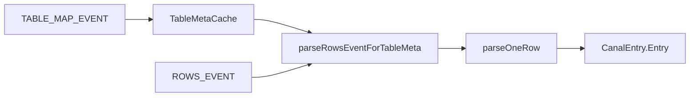

---

## 63. AviaterRegexFilter 表级与列级过滤

### 63.1 表级：schema.table 正则

配置：`canal.instance.filter.regex`（白名单，默认 `.*\..*`）、`canal.instance.filter.black.regex`（黑名单）。

```61:74:filter/src/main/java/com/alibaba/otter/canal/filter/aviater/AviaterRegexFilter.java
    public boolean filter(String filtered) {
        env.put("pattern", pattern);           // 多规则用 | 连接，已 ^...$ 包裹
        env.put("target", filtered.toLowerCase());  // 如 mydb.mytable
        return (Boolean) exp.execute(env);   // regex(pattern, target)
    }
```

**构造优化**：

1. 逗号分隔多规则 → 按 **长度降序** 排序（避免 `foo` 抢先匹配 `foot`）
2. 每条规则加 `^` `$` 全匹配
3. `RegexFunction` 使用 Apache ORO `Perl5Matcher.matches`

```20:26:filter/src/main/java/com/alibaba/otter/canal/filter/aviater/RegexFunction.java
    public AviatorObject call(Map env, AviatorObject arg1, AviatorObject arg2) {
        return AviatorBoolean.valueOf(matcher.matches(text, PatternUtils.getPattern(pattern)));
    }
```

黑名单构造时 `defaultEmptyValue=false`：空 pattern **不匹配任何表**（全部过滤）。

### 63.2 过滤生效点

| 阶段 | 组件 | 对象 |
|------|------|------|
| Parser | `AbstractEventParser.eventFilter` | 解析后 Entry，表名 `schema.table` |
| Parser | `LogEventConvert.nameFilter` | ROW 解析前可跳过 |
| Sink | `EntryEventSink.doFilter` | 投递 Store 前二次过滤 |
| 客户端 | `Sub.filter` / `subscribe(filter)` | Server 动态更新 Parser filter（§51） |

客户端 subscribe 的 filter **覆盖** instance 默认 regex，实现 per-client 订阅。

### 63.3 列级过滤

`canal.instance.filter.field` / `filter.black.field` 格式：`schema.table:col1,col2`，注入 `LogEventConvert.fieldFilterMap`，在 `parseOneRow` 中跳过非关注列，减小 Entry 体积。

---

## 64. RDB 镜像库：RdbMirrorDbSyncService

**镜像库（mirrorDb）**：源库整库同步到目标库，**表结构随 DDL 自动演进**，无需为每张表写 mapping。

### 64.1 配置形态

`rdb.yml` 中 `mirrorDb` 段：指定 `database`、目标 `dataSourceKey`，与普通过表 mapping 并存。`RdbAdapter` 同时持有 `RdbSyncService` 与 `RdbMirrorDbSyncService`。

### 64.2 同步逻辑

```50:87:client-adapter/rdb/.../RdbMirrorDbSyncService.java
    public void sync(List<Dml> dmls) {
        for (Dml dml : dmls) {
            MirrorDbConfig cfg = mirrorDbConfigCache.get(destination + "." + database);
            if (dml.getIsDdl()) {
                syncDml(dmlList);          // 先刷完积压 DML
                executeDdl(cfg, dml);      // 目标库执行同源 DDL
                remove columnsTypeCache / tableConfig
            } else {
                initMappingConfig(table, ...);  // 懒创建 1:1 表映射 mapAll=true
                dmlList.add(dml);
            }
        }
        syncDml(dmlList);
    }
```

`initMappingConfig` 为每张首次出现的表自动生成 `MappingConfig`：`targetDb=sourceDb`、`targetTable=sourceTable`、`mapAll=true`、主键同名映射。

### 64.3 DDL 执行

```152:169:client-adapter/rdb/.../RdbMirrorDbSyncService.java
    private void executeDdl(MirrorDbConfig mirrorDbConfig, Dml ddl) {
        String sql = ddl.getSql().replace("`", backtick);  // 适配 Oracle/PG 引号
        statement.execute(sql);
        mirrorDbConfig.getTableConfig().remove(ddl.getTable());
    }
```

**顺序保证**：DDL 前必须 `syncDml` 清空队列，避免 DML 与建表顺序错乱。

### 64.4 与普通 RDB mapping 对比

| 模式 | 配置量 | DDL | 列映射 |
|------|--------|-----|--------|
| 普通过表 mapping | 每表 yml | 需手工或 ETL | 可自定义 target 列 |
| mirrorDb | 每库一条 | 自动转发 SQL | 全列 1:1 |

---

## 65. example 模块示例对照

模块：`example/`，演示 **最小可运行消费端**，无 Spring 依赖。

### 65.1 类层次

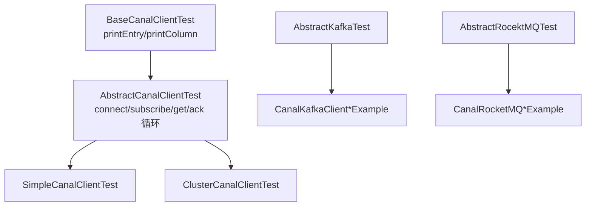

### 65.2 TCP 消费模板（与 Adapter 同源）

```51:90:example/.../AbstractCanalClientTest.java
    protected void process() {
        while (running) {
            connector.connect();
            connector.subscribe();
            while (running) {
                Message message = connector.getWithoutAck(batchSize);
                if (batchId != -1 && size > 0) {
                    printEntry(message.getEntries());
                }
                if (batchId != -1) {
                    connector.ack(batchId);
                }
            }
        } catch (Throwable e) {
            connector.rollback();
        } finally {
            connector.disconnect();
        }
    }
```

与 §44 `CanalTCPConsumer`、§37 CanalProtocol 完全一致。

### 65.3 各入口对照

| 类 | 连接方式 | 用途 |
|----|----------|------|
| `SimpleCanalClientTest` | `newSingleConnector(ip:11111)` | 单机 TCP |
| `ClusterCanalClientTest` | `newClusterConnector(zk, dest)` | ZK 发现 Server + Failover |
| `CanalKafkaClientExample` | `KafkaCanalConnector` protobuf | MQ 非 flat |
| `CanalKafkaClientFlatMessageExample` | `KafkaCanalConnector(..., flat=true)` | FlatMessage JSON |
| `CanalRocketMQClientExample` | `RocketMQCanalConnector` | RocketMQ 消费 |
| `SimpleCanalClientPermanceTest` | 压测 batchSize/吞吐 | 性能基准 |

`BaseCanalClientTest.printEntry` 演示如何解析 `TRANSACTIONBEGIN/ROWDATA`、打印 GTID（`header.gtid` 与 `props.curtGtid`）、BLOB 列 UTF-8 转换。

---

## 66. CanalLauncher 进程启动全链路

入口：`deployer/.../CanalLauncher.main`。

### 66.1 启动分支

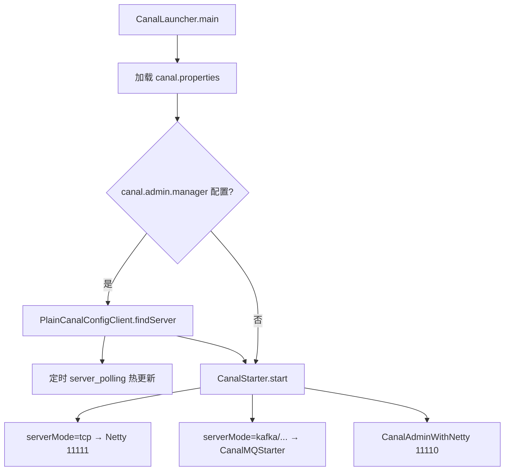

### 66.2 Manager 模式轮询

```74:100:deployer/.../CanalLauncher.java
    PlainCanalConfigClient configClient = new PlainCanalConfigClient(managerAddress, user, passwd, registerIp, adminPort, autoRegister, ...);
    PlainCanal canalConfig = configClient.findServer(null);
    managerProperties.putAll(properties);
    executor.scheduleWithFixedDelay(() -> {
        PlainCanal newConfig = configClient.findServer(lastMd5);
        if (newConfig != null) {
            canalStater.stop();
            canalStater.start();   // 全局 canal.properties 变更 → 整进程重启
        }
    }, scanInterval);
```

`runningLatch.await()` 阻塞主线程，ShutdownHook 释放。

### 66.3 与 CanalStarter 分工

| 类 | 职责 |
|----|------|
| `CanalLauncher` | 读配置、Admin 轮询、创建 `CanalStarter` |
| `CanalStarter` | 加载 MQ Producer、创建 `CanalController`、启 Admin Netty |
| `CanalController` | Instance 生成、ZK Monitor、嵌入 Server |

---

## 67. MysqlConnector 连接阶段协议

Canal 连 MySQL 使用 **标准 MySQL Client/Server 协议**（非 Canal 自定义协议），实现在 `driver/.../MysqlConnector.java`。

### 67.1 连接阶段时序

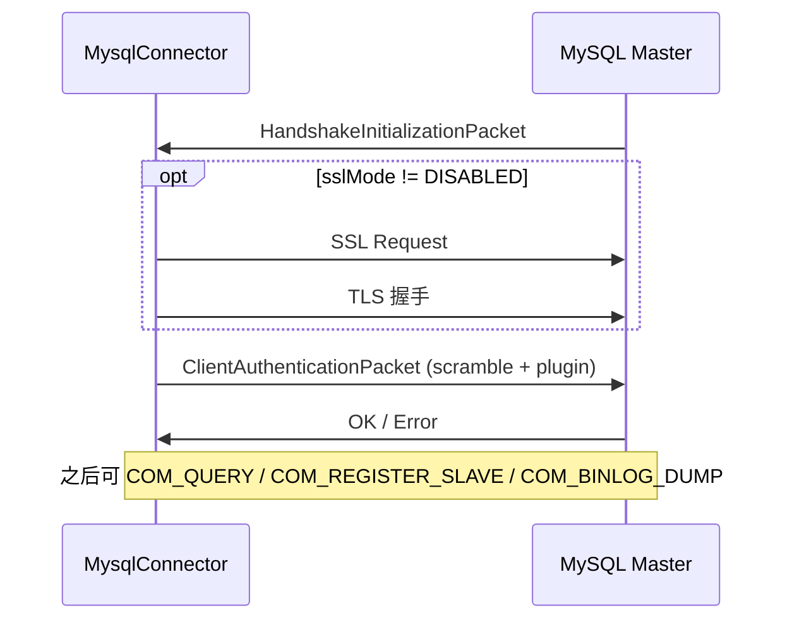

### 67.2 negotiate 核心步骤

```182:212:driver/.../MysqlConnector.java
    private void negotiate(SocketChannel channel) {
        HandshakeInitializationPacket handshake = readHandshake();
        if (sslMode != DISABLED) {
            send SslRequestCommandPacket;
            upgradeToSSL();
        }
        // 根据 server auth plugin 选择 mysql_native_password / caching_sha2 / sha256...
        send ClientAuthenticationPacket(username, scramble(password, seed));
        read OK packet;
    }
```

与 Canal **消费端口认证**（§38）类似，均基于 MySQL scramble；但这里是 **真实连库账号**（`canal.instance.dbUsername`），权限需 `REPLICATION SLAVE, REPLICATION CLIENT` 等。

### 67.3 与 dump 的关系

`negotiate` 成功后，`MysqlConnection` 方可：

1. `COM_QUERY` 查 `@@binlog_checksum`、`SHOW MASTER STATUS` 等
2. `COM_REGISTER_SLAVE`（0x15）
3. `COM_BINLOG_DUMP` / `COM_BINLOG_DUMP_GTID`（§52）

连接池：`SocketChannelPool` 复用 channel；`soTimeout` 默认 1h，与 binlog 长连接匹配。

---

## 68. MemoryMetaManager 与 batch 语义

`MemoryMetaManager` 是 Meta 的 **纯内存实现**，`PeriodMixedMetaManager`（§59）在其上增加 ZK 定时刷 cursor。

### 68.1 三类核心状态

| 结构 | 键 | 值 | 含义 |
|------|-----|-----|------|
| `destinations` | destination | `List<ClientIdentity>` | 已订阅客户端 |
| `cursors` | `ClientIdentity` | `Position` | 已 ack 的消费位点 |
| `batches` | `ClientIdentity` | `MemoryClientIdentityBatch` | 已 get 未 ack 的批次 |

### 68.2 getWithoutAck → addBatch

```324:367:server/.../CanalServerWithEmbedded.java
        synchronized (canalInstance) {
            PositionRange last = metaManager.getLastestBatch(clientIdentity);
            if (last != null) {
                events = getEvents(store, last.getStart(), batchSize, ...);  // 续拉同一流
            } else {
                Position start = metaManager.getCursor(clientIdentity);
                if (start == null) start = store.getFirstPosition();
                events = getEvents(store, start, batchSize, ...);
            }
            if (events.isEmpty()) return new Message(-1, ...);  // 无数据，不分配 batchId
            Long batchId = metaManager.addBatch(clientIdentity, events.getPositionRange());
            return new Message(batchId, raw, entrys);
        }
```

**要点**：

- `synchronized(canalInstance)` 保证 meta 与 store 顺序一致（注释说明不能先拿 meta 再乱序拿数据）。
- 存在未 ack 的 `lastestBatch` 时，从 `positionRange.start` **继续拉**（支持多次 get 拼同一逻辑流，但通常一次 get 一批）。
- `batchId` 由 `atomicMaxBatchId` 自增生成。

### 68.3 ack 必须按 batchId 升序

```147:156:meta/.../MemoryMetaManager.java
        public synchronized PositionRange removePositionRange(Long batchId) {
            Long minBatchId = Collections.min(batches.keySet());
            if (!minBatchId.equals(batchId)) {
                throw new CanalMetaManagerException("batchId is not the firstly");
            }
            return batches.remove(batchId);
        }
```

客户端 **不能** 先 ack batch 5 再 ack batch 4；否则抛 `CanalMetaManagerException`。`ack` 成功后：

1. `updateCursor(positionRanges.getAck())` — 持久化消费位点（事务 END 或 DDL，§56）
2. `eventStore.ack(end, endSeq)` — 释放环形缓冲槽位

### 68.4 rollback 语义

| API | Meta | Store |
|-----|------|-------|
| `rollback(clientIdentity)` | `clearAllBatchs` | `store.rollback()` 回到 get 前 |
| `rollback(clientIdentity, batchId)` | `removeBatch(batchId)`（须最小 id） | `store.rollback()` |

`SimpleCanalConnector.connect()` 默认 `rollbackOnConnect=true`，清除上次异常退出遗留的未 ack batch。

### 68.5 batch 与 ZK mark 节点

运行期 batch **不写 ZK**（`PeriodMixedMetaManager` 设计）；仅 cursor 定时刷盘。进程崩溃后未 ack 数据可 **重放**（at-least-once）。

---

## 69. MQMessageUtils 分区 hash 与 dynamicTopic

配置入口：`canal.mq.partitionHash`、`canal.mq.dynamicTopic`、`canal.mq.dynamicTopicPartitionNum`、`canal.mq.database.hash`。

### 69.1 partitionHash 配置语法

```45:69:connector/core/.../MQMessageUtils.java
    // 分号分隔多条；每条格式：
    //   schema.table          → tableHash（按表名 hash）
    //   schema.table:id^name  → 按指定列 hash
    //   schema.table:$pk$     → 按主键列 hash（autoPkHash）
    // 表名可写正则，走 AviaterRegexFilter
```

示例（`canal.properties`）：

```properties
canal.mq.partitionHash = mydb.order:id^user_id;mydb\\..*:$pk$
canal.mq.partitionsNum = 4
canal.mq.database.hash = true
```

### 69.2 hash 算法

```299:318:connector/core/.../MQMessageUtils.java
    int hashCode = 0;
    if (databaseHash) hashCode = database.hashCode();
    for (Column column : columns) {
        if (column.getIsKey() || pkNames.contains(column.getName())) {
            hashCode = hashCode ^ column.getValue().hashCode();
        }
    }
    int pkHash = Math.abs(Math.abs(hashCode) % partitionsNum);
```

- **异或累加** 主键列字符串 hash，再对分区数取模。
- **同一主键** 始终落同一分区，保证分区内顺序。
- **DDL** 固定进分区 0；无匹配规则时进分区 0。
- **UPDATE/DELETE** 用 `beforeColumns` 算 hash（删/改前主键）。

`flatMessage` 模式对 `List<Map<String,String>> data` 每行独立 hash，可能 **拆成多个 FlatMessage** 发到不同分区。

### 69.3 dynamicTopic 路由

```139:164:connector/core/.../MQMessageUtils.java
    public static Map<String, Message> messageTopics(Message message, String defaultTopic, String dynamicTopicConfigs) {
        for (Entry entry : entries) {
            // 跳过 TRANSACTION BEGIN/END
            Set<String> topics = matchTopics(schema + "." + table, dynamicTopicConfigs);
            // 命中则 message 按 topic 拆分
        }
    }
```

配置示例：

```properties
canal.mq.topic = canal_topic
canal.mq.dynamicTopic = mytopic:mydb\\..*,other_topic:mydb.order
```

- 无 `:` 的项：表名匹配则 topic = `schema.table`（小写）。
- 有 `:` 的项：`topic:schema.table.regex`。
- 与 `partitionHash` 正交：先 **按 topic 拆 Message**，再在每个 topic 内 **按 hash 选分区**。

---

## 70. DruidDdlParser：DDL 语句解析

当 `canal.instance.filter.druid.ddl=true`（默认）时，`LogEventConvert.parseQueryEvent` 用 **Druid SQL Parser** 解析 QUERY 事件中的 DDL，产出结构化 `DdlResult` 更新 TSDB / 过滤无关 DDL。

### 70.1 入口

```47:56:parse/.../ddl/DruidDdlParser.java
    public static List<DdlResult> parse(String queryString, String schemaName) {
        stmtList = SQLUtils.parseStatements(queryString, JdbcConstants.MYSQL, false);
        // ParserException → 退回 EventType.QUERY 原样透传
    }
```

### 70.2 支持的语句类型

| SQL 类型 | EventType | 用途 |
|----------|-----------|------|
| CREATE TABLE | CREATE | TSDB 记表结构 |
| ALTER TABLE | ALTER / RENAME / CINDEX / DINDEX | 表结构变更 |
| DROP TABLE | ERASE | 删表 |
| CREATE/DROP DATABASE | CREATE/ERASE | 库级 |
| TRUNCATE | TRUNCATE | 清表 |
| RENAME TABLE | RENAME | 表改名 |

对比 `SimpleDdlParser`：Druid 版覆盖 **更全的 ALTER 子类型**（加索引、约束等），适合 `enableTsdb=true` 场景。

### 70.3 与 filterQueryDdl 的关系

- `filterQueryDdl=true`：QUERY 类 DDL 在 Parser 层直接丢弃，不进 Store。
- `useDruidDdlFilter=true`：仍解析 DDL 更新 meta，但可通过 `DdlResult` 判断是否下发给客户端。

---

## 71. MysqlDetectingTimeTask 与主备切换

配置（`default-instance.xml`）：

- `canal.instance.detecting.enable`
- `canal.instance.detecting.sql`（如 `select 1`）
- `canal.instance.detecting.interval.time`（默认 5s）
- `canal.instance.detecting.heartbeatHaEnable` → `HeartBeatHAController.switchEnable`
- `canal.instance.standby.address` 备库

### 71.1 心跳任务

```215:254:parse/.../MysqlEventParser.java
    class MysqlDetectingTimeTask extends TimerTask {
        public void run() {
            mysqlConnection.query(detectingSQL);  // 或 update
            ((HeartBeatCallback) haController).onSuccess(costTime);
        } catch (Throwable e) {
            ((HeartBeatCallback) haController).onFailed(e);
        }
    }
```

使用 **独立 fork 连接** 执行心跳 SQL，不阻塞 binlog dump 主连接。

### 71.2 失败触发切换

```33:45:parse/.../ha/HeartBeatHAController.java
    public void onFailed(Throwable e) {
        if (++failedTimes > detectingRetryTimes && switchEnable) {
            eventParser.doSwitch();  // master ↔ standby
            failedTimes = 0;
        }
    }
```

`doSwitch()` 停止当前 dump → 切换 `runningInfo` → 按 `fallbackIntervalInSeconds` 回退位点 → 重新 `findStartPosition` → dump。

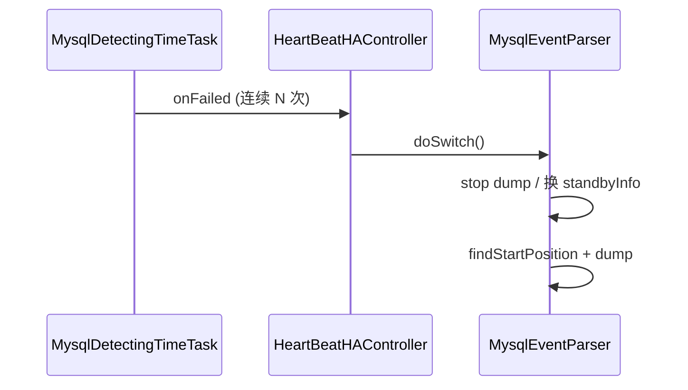

---

## 72. 全链路故障排查清单

按 **数据流向** 分层排查，附常见现象与对应配置/源码位置。

### 72.1 MySQL / Parser 层

| 现象 | 可能原因 | 排查 |
|------|----------|------|
| 连不上 Master | 账号权限、网络、SSL | `REPLICATION SLAVE/CLIENT`；`MysqlConnector.negotiate` 日志 |
| dump 立刻断开 | `slaveId` 冲突 | 全局唯一 `canal.instance.mysql.slaveId` |
| `ServerLogPurgedException` | binlog 被清理 | 调大保留；`auto.reset.latest.pos.mode`；RDS 用 OSS 模式 §33 |
| 无数据 / 位点不动 | 过滤掉所有表 | `filter.regex` / `filter.black.regex` §63 |
| GTID 丢事务 | ack 位点不在事务 END | §56 `ddlIsolation` / GTID ack 规则 |
| 表结构解析失败 | TSDB 无历史 meta | `enableTsdb`；`filter.table.error` |
| 主备不切 | 心跳未开或 `heartbeatHaEnable=false` | §71 detecting 配置 |

### 72.2 Server / Store 层

| 现象 | 可能原因 | 排查 |
|------|----------|------|
| 客户端 get 一直空 | instance 未启动 / 非 active 节点 | ZK `running` §41；`ServerRunningMonitor` |
| get 有数据 ack 失败 | batchId 乱序 ack | §68 必须按最小 batchId ack |
| 内存暴涨 | 消费慢于生产 | 增大 `memory.buffer.size`；加快消费；Store 背压 §16 |
| DDL 与 DML 乱序 | 未开 ddl 隔离 | `get.ddl.isolation=true` §56 |
| MQ 模式无 11111 | `serverMode!=tcp` | §58 `CANAL_WITHOUT_NETTY` |

### 72.3 Client / MQ 层

| 现象 | 可能原因 | 排查 |
|------|----------|------|
| 重复消费 | 未 ack 或 rollback 后重连 | 确认 `ack(batchId)`；`rollbackOnConnect` |
| 集群连错节点 | ZK running 过期 | `ClusterNodeAccessStrategy` §47 |
| MQ 分区乱序 | 同 key 不同分区 | 检查 `partitionHash` §69 |
| flat 与 adapter 不兼容 | 两端 flat 不一致 | Server `flatMessage` + adapter `canal.conf.flatMessage` |
| Kafka 发送失败回滚 | Producer 异常 | `callback.rollback` → Server 重投 §31 |

### 72.4 Admin / 配置层

| 现象 | 可能原因 | 排查 |
|------|----------|------|
| Manager 拉不到配置 | Node 未注册 | `autoRegister` §40；`server_polling` |
| 改配置不生效 | md5 未变 / 未 reload | `ManagerInstanceConfigMonitor` §35 |
| 整进程频繁重启 | 全局 `canal.properties` 抖动 | `CanalLauncher` 轮询 §66 |

### 72.5 推荐日志关键字

```text
# Parser
"begin to find start position" / "dump" / "table parser error"

# Server
"getWithoutAck successfully" / "ack successfully" / "rollback successfully"

# HA
"canal is running in node" / "HeartBeat failed"

# MQ
"Start the MQ work" / "send error" / "commit" / "rollback"

# Adapter
"Sync failed" / "Outer adapter sync failed" / "turn switch off"
```

### 72.6 常用诊断命令（运维）

```bash
# 查看 instance 日志
tail -f logs/example/example.log

# Admin 拉 Server 状态（11110 协议，或由 admin-ui）
# 查看 ZK
ls /otter/canal/destinations/example/running

# Prometheus（若开启）
curl localhost:11112/metrics | grep canal
```

---

## 73. TableMetaCache 与 online DDL

`TableMetaCache` 为 **ROW 事件解析** 提供列定义；与 `DatabaseTableMeta`（TSDB，§26）配合处理 **表结构随时间变化**。

### 73.1 两种后端

```51:59:parse/.../dbsync/TableMetaCache.java
    public TableMetaCache(MysqlConnection con, TableMetaTSDB tableMetaTSDB) {
        if (tableMetaTSDB == null) {
            this.tableMetaCache = createLocalCache();  // Guava LoadingCache
        } else {
            isOnTSDB = true;
        }
    }
```

| 模式 | 存储 | 适用 |
|------|------|------|
| 本地 Cache | `show create table` / `desc` 懒加载 | `tsdb.enable=false` |
| TSDB | H2/MySQL 持久化 + 按位点版本 | 默认 `tsdb.enable=true` |

### 73.2 按事件时间取 meta（TSDB）

```181:216:parse/.../dbsync/TableMetaCache.java
    public TableMeta getTableMeta(String schema, String table, boolean useCache, EntryPosition position) {
        if (tableMetaTSDB != null) {
            tableMeta = tableMetaTSDB.find(schema, table);  // 按当前解析位点对应版本
            if (tableMeta == null) {
                packet = connection.query("show create table " + fullName);
                tableMetaTSDB.apply(position, schema, createDDL, "first");
                tableMeta = tableMetaTSDB.find(schema, table);
            }
            return tableMeta;
        }
        return tableMetaCache.getUnchecked(fullName);
    }
```

`LogEventConvert.parseRowsEventForTableMeta` 传入 **当前 binlog 位点**，保证 online DDL 后 ROW 事件用 **新表结构** 解码。

### 73.3 online DDL 典型问题

MySQL **gh-ost / pt-osc** 等工具会短暂出现「binlog 列数 ≠ 内存表结构」：

```627:637:parse/.../LogEventConvert.java
        if (tableMeta != null && columnInfo.length > tableMeta.getFields().size()) {
            // online ddl 加字段：临时双写阶段列数不一致
            if (tableMetaCache.isOnRDS() || tableMetaCache.isOnPolarX()) {
                // RDS 可能多一列 hidden PK
            }
        }
```

| 策略 | 配置 | 效果 |
|------|------|------|
| 开启 TSDB | `canal.instance.tsdb.enable=true` | DDL 自动 `apply` 更新版本 |
| 忽略表错误 | `filter.table.error=true` | 解析失败返回 null，跳过该行 |
| 清 cache | `clearTableMeta(schema, table)` | 非 TSDB 时强制重拉 |

### 73.4 DDL 更新 TSDB

```268:275:parse/.../dbsync/TableMetaCache.java
    public boolean apply(EntryPosition position, String schema, String ddl, String extra) {
        if (tableMetaTSDB != null) {
            return tableMetaTSDB.apply(position, schema, ddl, extra);
        }
        return true;  // 纯 cache 模式依赖 invalidate 或重启
    }
```

`LogEventConvert.parseQueryEvent` 解析到 CREATE/ALTER 后调用 `tableMetaCache.apply`，与 `DruidDdlParser`（§70）联动。

### 73.5 环境探测

构造时查询 `show global variables like 'rds\_%'` / `polarx\_%'` 设置 `isOnRDS` / `isOnPolarX`，影响无主键表、hidden 列等特殊解析分支。

---

## 74. CanalController 深度剖析

> 基础流程见 §14；本节补充 **start/stop 顺序**、**InstanceAction 语义**、**destination 表达式** 与 **lazy 模式**。

### 74.1 核心字段

| 字段 | 职责 |
|------|------|
| `embeddedCanalServer` | 逻辑 Server，持有 Instance Map |
| `canalServer` | Netty 11111（`withoutNetty=true` 时为 null） |
| `instanceGenerator` | Spring / Plain 生成 `CanalInstance` |
| `ServerRunningMonitors` | 每 destination 一个 ZK 选主 Monitor |
| `instanceConfigMonitors` | Spring / Manager 配置热扫描 |
| `defaultAction` | start/stop/reload/release 回调 |
| `canalMQStarter` | MQ 模式虚拟消费者（§57） |

### 74.2 start() 顺序

```512:567:deployer/.../CanalController.java
    public void start() {
        initCid(/otter/canal/cluster/{ip:port});     // 登记 Server 节点
        embeddedCanalServer.start();                  // 1. 嵌入式服务
        for (destination : instanceConfigs) {
            if (!lazy) ServerRunningMonitor.start();  // 2. 非 lazy → 抢 ZK 启 Parser
            if (autoScan) configMonitor.register(dest, defaultAction);
        }
        if (autoScan) configMonitor.start();          // 3. 热扫描 conf 或 Manager
        if (canalServer != null) canalServer.start(); // 4. Netty 对外
    }
```

**lazy=true**（`canal.instance.global.lazy`）：进程启动 **不** 抢 running，等 **首个客户端 subscribe** 或 Admin `startInstance` 才 `ServerRunningMonitor.start()`。

### 74.3 InstanceAction 四种操作

| 操作 | 触发 | 行为 |
|------|------|------|
| `start` | 新建 conf 目录 / Manager 分配 | `runningMonitor.start()` 抢主 |
| `stop` | 删除 conf / Manager 移除 | `embeddedServer.stop` + `monitor.stop` |
| `reload` | 配置变更 | `stop` + `start` |
| `release` | Admin 优雅切主 | `runningMonitor.release()` 释放 ZK，他机抢占 |

`release` 在单机无 ZK 时会 `instanceConfigs.remove` 并 `monitor.stop`（§29）。

### 74.4 destination 批量表达式

```478:509:deployer/.../CanalController.java
    // canal.destinations.expr = example-{1-3}
    // → example-1,example-2,example-3
    public static String parseExpr(String expr) { ... }
```

用于 **多 instance 模板化部署**，每个 destination 仍对应独立 `conf/{name}/instance.properties`。

### 74.5 instanceGenerator 路由

```378:396:deployer/.../CanalController.java
        instanceGenerator = destination -> {
            InstanceConfig config = instanceConfigs.get(destination);
            if (config.getMode().isManager()) {
                return new PlainCanalInstanceGenerator(properties).generate(destination);
            } else if (config.getMode().isSpring()) {
                return new SpringCanalInstanceGenerator().generate(destination);
            }
        };
```

`CanalServerWithEmbedded` 首次 `start(destination)` 或 `getWithoutAck` 时调用 `generate`，**懒创建** Spring 子上下文。

### 74.6 stop() 逆序

```569:587:deployer/.../CanalController.java
        canalServer.stop();
        configMonitors.stop();
        for (runningMonitor : all) runningMonitor.stop();
        releaseCid(cluster node);
        embeddedCanalServer.stop();
```

---

## 75. client-adapter REST API 与 SyncSwitch

模块：`client-adapter/launcher`，默认端口 **8081**（`application.yml`）。

### 75.1 REST 端点一览

| 方法 | 路径 | 作用 |
|------|------|------|
| GET | `/destinations` | 列出 destination 及 sync 开关状态 |
| GET | `/syncSwitch/{destination}` | 查询 on/off |
| PUT | `/syncSwitch/{destination}/{on\|off}` | 启停增量同步 |
| POST | `/etl/{type}/{task}` | 全量 ETL（无 key） |
| POST | `/etl/{type}/{key}/{task}` | 全量 ETL（指定 adapter key） |
| GET | `/count/{type}/{task}` | 统计源表行数 |

`type` 为 SPI 名：`rdb`、`es6`、`es7`、`hbase` 等；`task` 为 yml 文件名如 `mytest_user.yml`。

### 75.2 ETL 与 syncSwitch 协作

```64:111:client-adapter/launcher/.../rest/CommonRest.java
    @PostMapping("/etl/{type}/{key}/{task}")
    public EtlResult etl(...) {
        etlLock.tryLock("/sync-etl/" + type + "-" + lockKey);  // ZK 分布式锁
        oriSwitchStatus = syncSwitch.status(destination);
        if (oriSwitchStatus) syncSwitch.off(destination);      // 暂停增量
        try {
            return adapter.etl(task, params);
        } finally {
            if (oriSwitchStatus) syncSwitch.on(destination);   // 恢复增量
            etlLock.unlock(...);
        }
    }
```

**全量 + 增量互斥**：ETL 期间 `AdapterProcessor` 在 `syncSwitch.get()` 阻塞（§44），避免全量与增量写冲突。

### 75.3 SyncSwitch 实现

```29:64:client-adapter/launcher/.../common/SyncSwitch.java
    private Mode mode = Mode.LOCAL;
    // 有 curator (ZK) → DISTRIBUTED：/sync-switch/{destination} 节点 on/off
    // 无 ZK → LOCAL：内存 BooleanMutex

    public void on(String destination)  { mutex.set(true);  write ZK "on"  }
    public void off(String destination) { mutex.set(false); write ZK "off" }
    public void get(String destination) { mutex.get(); }  // off 时阻塞消费线程
```

多 adapter 实例共享 ZK 时，**一处 off 全局停同步**；`terminateOnException=true` 时异常也会 `syncSwitch.off`（§44）。

### 75.4 典型运维命令

```bash
# 暂停 example 增量
curl -X PUT http://127.0.0.1:8081/syncSwitch/example/off

# 全量导入 RDB
curl -X POST "http://127.0.0.1:8081/etl/rdb/oracle1/mytest_user.yml"

# 带条件 ETL
curl -X POST "http://127.0.0.1:8081/etl/rdb/mytest_user.yml?params=id>=1000;id<2000"

# 恢复增量
curl -X PUT http://127.0.0.1:8081/syncSwitch/example/on
```

---

## 76. 性能调优参数速查表

基于 `deployer/src/main/resources/canal.properties` 与源码默认值，按 **调优目标** 分类。

### 76.1 吞吐与延迟（Server 侧）

| 参数 | 默认 | 调优建议 |
|------|------|----------|
| `canal.instance.memory.buffer.size` | 16384 | 环形槽位，须 2^n；消费慢则增大 |
| `canal.instance.memory.buffer.memunit` | 1024 | 配合 `batch.mode=MEMSIZE`，单批最大约 size×memunit |
| `canal.instance.memory.batch.mode` | MEMSIZE | `ITEMSIZE` 按条数截断 batch |
| `canal.instance.memory.rawEntry` | true | TCP 高性能保持 true；MQ flat 时 false（§58） |
| `canal.instance.transaction.size` | 1024 | 大事务切分阈值（§54） |
| `canal.instance.parser.parallel` | true | CPU 充足保持开启 |
| `canal.instance.parser.parallelThreadSize` | CPU×60% | ROW 解析线程数 |
| `canal.instance.parser.parallelBufferSize` | 256 | Disruptor ring，须 2^n |
| `canal.instance.network.receiveBufferSize` | 16384 | 可适当增大减少 syscall |

### 76.2 消费端 batch

| 参数 | 场景 |
|------|------|
| Client `batchSize` | `getWithoutAck(1000~5000)`，过大增加单次序列化开销 |
| `canal.mq.canalBatchSize` | MQ 模式 Server 拉取条数，默认 50 |
| `canal.mq.canalGetTimeout` | MQ get 超时 ms，默认 100 |
| adapter `syncBatchSize` | RDB/ES 每批写入行数 |

### 76.3 MQ 投递

| 参数 | 作用 |
|------|------|
| `canal.mq.send.thread.size` | 并行 send 线程，默认 30 |
| `canal.mq.build.thread.size` | 并行构建 FlatMessage，默认 8 |
| `canal.mq.partitionHash` | 分区路由，保证同主键有序（§69） |
| `canal.mq.database.hash` | hash 时混入库名 |
| `kafka.max.in.flight.requests.per.connection` | 1=强顺序，>1 吞吐高但可能乱序 |

### 76.4 稳定性与 HA

| 参数 | 作用 |
|------|------|
| `canal.zkServers` | 集群选主 + Meta 持久化 |
| `canal.zookeeper.flush.period` | cursor 刷 ZK 间隔 ms |
| `canal.instance.detecting.*` | 主库心跳与 failover（§71） |
| `canal.instance.fallbackIntervalInSeconds` | 切备库位点回退秒数 |
| `canal.auto.reset.latest.pos.mode` | binlog 被删时跳最新（生产慎用） |

### 76.5 TSDB 与磁盘

| 参数 | 作用 |
|------|------|
| `canal.instance.tsdb.enable` | online DDL 必备 |
| `canal.instance.tsdb.snapshot.interval` | 快照间隔小时 |
| `canal.instance.tsdb.snapshot.expire` | 过期清理小时 |
| `canal.file.data.dir` | TSDB H2 / meta 文件目录 |

### 76.6 过滤减负（降低 CPU）

| 参数 | 效果 |
|------|------|
| `canal.instance.filter.regex` | 缩小订阅表范围 |
| `canal.instance.filter.transaction.entry` | 丢弃空事务头尾 |
| `canal.instance.filter.field` | 列级裁剪 |
| `canal.instance.filter.dml.insert/update/delete` | 按类型过滤 |

### 76.7 调优检查清单

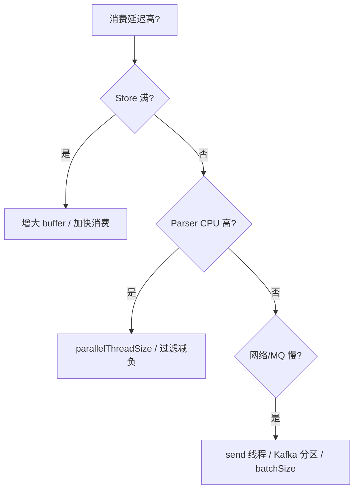

结合 Prometheus `StoreCollector`（§23）：关注 `put`、`get`、`ack` 阻塞时间与 ring 使用率。

---

## 77. Connector SPI 全量清单

`connector-core` 定义两类 SPI，通过 `META-INF/canal/` 注册，由 `CanalMQStarter` / client-adapter 按 `canal.serverMode` 或 yml 中的 `mode` 加载。

### 77.1 CanalMQProducer（Server → MQ）

| SPI key | 实现类 | 模块 |
|---------|--------|------|
| `kafka` | `CanalKafkaProducer` | `connector/kafka-connector` |
| `rocketmq` | `CanalRocketMQProducer` | `connector/rocketmq-connector` |
| `rabbitmq` | `CanalRabbitMQProducer` | `connector/rabbitmq-connector` |
| `pulsarmq` | `CanalPulsarMQProducer` | `connector/pulsarmq-connector` |

配置示例：`canal.serverMode = kafka`，`canal.mq.servers = 127.0.0.1:9092`。

### 77.2 CanalMsgConsumer（MQ → client-adapter）

| SPI key | 实现类 | 模块 |
|---------|--------|------|
| `tcp` | `CanalTCPConsumer` | `connector/tcp-connector` |
| `kafka` | `CanalKafkaConsumer` | `connector/kafka-connector` |
| `rocketmq` | `CanalRocketMQConsumer` | `connector/rocketmq-connector` |
| `rabbitmq` | `CanalRabbitMQConsumer` | `connector/rabbitmq-connector` |
| `pulsarmq` | `CanalPulsarMQConsumer` | `connector/pulsarmq-connector` |

client-adapter `application.yml`：

```yaml
canal.conf:
  mode: kafka   # 或 tcp / rocketMQ / rabbitMQ / pulsarMQ
  consumerProperties:
    kafka.bootstrap.servers: 127.0.0.1:9092
```

### 77.3 加载机制

```java
// connector-core SPI 入口
ExtensionLoader<CanalMQProducer> loader = ExtensionLoader.getExtensionLoader(CanalMQProducer.class);
CanalMQProducer producer = loader.getExtension("kafka");
```

`CanalMQStarter` 在 `serverMode != tcp` 时注册虚拟消费者线程，从 `embeddedCanalServer.getWithoutAck` 拉取后调用 `producer.send`（§57）。

### 77.4 模式对照

| 链路 | Server 侧 | 下游消费 |
|------|-----------|----------|
| 经典 TCP | `serverMode=tcp`，Netty 11111 | Java Client / tcp-connector |
| MQ 解耦 | `serverMode=kafka` 等 | client-adapter `mode=kafka` |
| 混合 | 多 Canal 节点 + 同一 Topic | 多 consumer group 或 adapter 多实例 |

---

## 78. 生产部署拓扑与端口规划

### 78.1 单机开发（最小集）

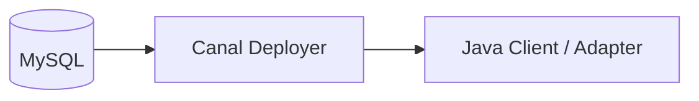

端口：11111（数据）、11110（Admin，可选）、11112（Prometheus，可选）、8081（adapter REST）。

### 78.2 HA 集群（ZK 选主）

```mermaid
flowchart TB
    subgraph ZK[ZooKeeper]
        R["/otter/canal/destinations/{dest}/running"]
        C["/otter/canal/destinations/{dest}/1001/cursor"]
    end
    MySQL[(MySQL 主库)] --> N1[Canal Node A]
    MySQL --> N2[Canal Node B]
    N1 -.->|抢 running| ZK
    N2 -.->|standby| ZK
    N1 -->|11111 仅 leader 有数据| Consumers[Clients / MQ]
```

要点：

- 每 destination **同一时刻仅一个** `ServerRunningMonitor` 持有 `running` 节点并启动 Parser。
- `cursor` / `mark` 存消费位点，failover 后新主从 ZK 恢复。
- `releaseInstance`（Admin）主动让出 running，配合滚动升级。

### 78.3 MQ 解耦拓扑

```mermaid
flowchart LR
    MySQL --> Canal1[Canal HA]
  Canal1 --> Kafka[Kafka Topic]
  Kafka --> A1[adapter-1]
  Kafka --> A2[adapter-2]
  A1 --> Oracle[(Oracle)]
  A2 --> ES[(Elasticsearch)]
```

Canal 只负责 **可靠投递**；RDB/ES 写入扩展由 adapter 水平扩展，ETL 时用 `syncSwitch`（§75）暂停增量。

### 78.4 Canal Admin 管控面

```mermaid
flowchart TB
    UI[admin-web UI] --> DB[(MySQL 配置库)]
    UI -->|AdminConnector TCP| N1[Node :11110]
    UI --> N2[Node :11110]
    N1 -->|PollingConfig| DB
    N2 -->|PollingConfig| DB
```

`manager` 模式下配置存 Admin DB，Deployer `CanalLauncher` 轮询 `PollingConfigController` 拉取 `canal.properties` / `instance.properties`（§22、§40）。

### 78.5 端口与防火墙速查

| 端口 | 协议 | 方向 | 说明 |
|------|------|------|------|
| 3306 | MySQL | Canal → DB | binlog 复制账号 |
| 11111 | TCP Canal | Client → Canal | 数据订阅 |
| 11110 | TCP Admin | Admin → Canal | 启停/日志 |
| 11112 | HTTP | 监控 | Prometheus scrape |
| 2181 | ZK | Canal ↔ ZK | HA + Meta |
| 9092 等 | MQ | Canal → Broker | serverMode=MQ |
| 8081 | HTTP | 运维 | adapter ETL/syncSwitch |

---

## 79. CanalAdmin API 方法速查

Deployer 实现：`CanalAdminController`（§22.3）；接口定义：`server/.../admin/CanalAdmin.java`；经 **11110 Netty** 或 `AdminConnector` 调用。

### 79.1 进程级

| 方法 | 作用 | 典型场景 |
|------|------|----------|
| `auth(user, passwd, seed)` | MySQL 风格 scramble 认证 | 连接握手 |
| `check()` | 进程是否在跑 | 健康检查 |
| `start()` | 启动 `CanalStarter` | Admin 一键启进程 |
| `stop()` | 停止进程 | 维护下线 |
| `restart()` | stop + start | 配置热更不生效时 |
| `getRunningInstances()` | 逗号分隔已 start 的 destination | 面板展示 |
| `listCanalLog()` / `canalLog(lines)` | canal 主日志 | 排障 |

### 79.2 Instance 级

| 方法 | 映射 `InstanceAction` | 说明 |
|------|----------------------|------|
| `checkInstance(dest)` | — | instance `isStart()` |
| `startInstance(dest)` | `start` | lazy 模式下等价首次订阅 |
| `stopInstance(dest)` | `stop` | 停 Parser + 移 embedded |
| `releaseInstance(dest)` | `release` | 集群让位，他机抢 running |
| `restartInstance(dest)` | `reload` | 配置变更后重载 |
| `listInstanceLog(dest)` / `instanceLog(...)` | — | `../logs/{dest}/` |

### 79.3 Admin Web REST（配置面）

与 11110 数据面分离，路径前缀 `/api/{env}/`：

| Controller | 主要能力 |
|------------|----------|
| `NodeServerController` | 节点 CRUD、`start/stop` 进程、`status` |
| `CanalInstanceController` | instance 配置 CRUD、`start/stop/release` |
| `CanalClusterController` | ZK 集群元数据 |
| `CanalConfigController` | 全局 `canal.properties` |
| `PollingConfigController` | Deployer 轮询拉配置（Header 鉴权） |

`CanalInstanceServiceImpl.start` 通过 `SimpleAdminConnectors.execute(ip, adminPort, AdminConnector::startInstance)` 下发到对应 Node。

### 79.4 认证与权限

- Deployer：`canal.admin.user` / `canal.admin.passwd`（空则免密）。
- Admin Web：`UserController.login` + Caffeine token 缓存。
- Polling：`user` / `passwd` Header 与 Manager 库校验。

---

## 80. SessionHandler 数据面请求全链路

文件：`server/.../netty/handler/SessionHandler.java`（§15.3 有概要，本节按 **PacketType** 展开）。

### 80.1 请求分发总览

```47:47:server/.../netty/handler/SessionHandler.java
            switch (packet.getType()) {
```

| PacketType | 请求体 | 核心调用 | 响应 |
|------------|--------|----------|------|
| `SUBSCRIPTION` | `Sub{destination, clientId, filter}` | `embeddedServer.subscribe` | ACK |
| `UNSUBSCRIPTION` | `Unsub` | `unsubscribe` + 可能 `release` | ACK |
| `GET` | `Get{fetchSize, timeout, unit}` | `getWithoutAck` | `MESSAGES` 或空 |
| `CLIENTACK` | `ClientAck{batchId}` | `embeddedServer.ack` | 无包（聚合器记指标） |
| `CLIENTROLLBACK` | `ClientRollback{batchId}` | `rollback` | 无包 |

### 80.2 SUBSCRIPTION：lazy 启 Parser

```54:62:server/.../netty/handler/SessionHandler.java
                        if (!embeddedServer.isStart(clientIdentity.getDestination())) {
                            ServerRunningMonitor runningMonitor = ServerRunningMonitors.getRunningMonitor(...);
                            if (!runningMonitor.isStart()) {
                                runningMonitor.start();  // lazy 模式下首个订阅才抢 ZK
                            }
                        }
                        embeddedServer.subscribe(clientIdentity);
```

流程：校验 destination/clientId → 必要时启动 `ServerRunningMonitor`（ZK 选主）→ `MetaManager.subscribe` 登记 filter → 记录 cursor。

### 80.3 GET：raw 与 Protobuf 双路径

- `timeout == -1`：`getWithoutAck(client, fetchSize)` 非阻塞 tryGet。
- 否则带 `timeout + unit` 阻塞/限时等待（§15、`CanalServerWithEmbedded`）。
- **`message.isRaw()`**：手工拼 `CodedOutputStream` 写 `MESSAGES`，避免 Entry 二次 parse，降低 CPU（§42）。
- `batchId == -1`：Store 无数据，返回空列表，**不分配 batchId**。

### 80.4 CLIENTACK 语义

```245:249:server/.../netty/handler/SessionHandler.java
                        } else if (ack.getBatchId() == -1L) { // -1代表上一次get没有数据，直接忽略
                        } else {
                            embeddedServer.ack(clientIdentity, ack.getBatchId());
```

- `batchId == 0`：错误 402。
- `batchId == -1`：上次空包，忽略。
- 正常 ack 推进 Meta cursor + Store `cleanUntil`（§81）。

### 80.5 UNSUBSCRIPTION 与资源释放

```331:338:server/.../netty/handler/SessionHandler.java
    private void stopCanalInstanceIfNecessary(ClientIdentity clientIdentity) {
        List<ClientIdentity> clientIdentitys = embeddedServer.listAllSubscribe(...);
        if (clientIdentitys != null && clientIdentitys.size() == 1 && clientIdentitys.contains(clientIdentity)) {
            ServerRunningMonitor runningMonitor = ServerRunningMonitors.getRunningMonitor(...);
            if (runningMonitor.isStart()) {
                runningMonitor.release();  // 最后一个订阅者离开 → 释放 running
            }
        }
    }
```

适用于 **lazy + 内部模式**：无订阅者时释放 Parser，减少与 MySQL 的长连接。

### 80.6 与 Client 对称关系

| Server `SessionHandler` | Client `SimpleCanalConnector` |
|-------------------------|-------------------------------|
| 收 `SUBSCRIPTION` | `sendSub` |
| 收 `GET` | `getWithoutAck` |
| 收 `CLIENTACK` | `ack` |
| 收 `CLIENTROLLBACK` | `rollback` |

Client 侧须 **按 batchId 升序 ack**（`CanalServerWithEmbedded` 注释要求）。

---

## 81. MemoryEventStoreWithBuffer 三指针与 ack 深度

> §16 有概述；本节说明 **背压公式**、**ack 匹配**、**rollback** 与 Meta 的配合。

### 81.1 三指针含义

```46:54:store/.../MemoryEventStoreWithBuffer.java
    private AtomicLong putSequence;   // Parser 最后写入位置
    private AtomicLong getSequence;   // Server 最后读取位置
    private AtomicLong ackSequence;   // 客户端已确认位置
    private AtomicLong putMemSize / getMemSize / ackMemSize;  // MEMSIZE 模式累计字节
```

环形下标：`index = sequence & (bufferSize - 1)`，`bufferSize` 必须为 2 的幂。

### 81.2 背压：何时阻塞 put

```534:534:store/.../MemoryEventStoreWithBuffer.java
                final long memsize = putMemSize.get() - ackMemSize.get();
```

`ITEMSIZE` 模式：`putSequence - min(getSequence, ackSequence) >= bufferSize` 时 `notFull.await()`，Parser 线程阻塞 → **消费慢则停止拉 binlog**。

### 81.3 get 与 ack 区间

```
ackSequence < getSequence
     |←—— 已 get 未 ack（Meta mark/batch）——→|
ackSequence ←—— ack 后释放 slot ——→ getSequence ←—— 可读 ——→ putSequence
```

- `get`：推进 `getSequence`，数据仍在 `entries[]`。
- `ack`：`cleanUntil` 从 `ackSequence+1` 扫描到目标 position/batch 末 seq，CAS 更新 `ackSequence`，`entries[i]=null` 释放内存。

### 81.4 cleanUntil 匹配逻辑

```441:472:store/.../MemoryEventStoreWithBuffer.java
            for (long next = sequence + 1; next <= maxSequence; next++) {
                Event event = entries[getIndex(next)];
                ...
                if ((seqId < 0 || next == seqId) && CanalEventUtils.checkPosition(event, (LogPosition) position)) {
                    if (batchMode.isMemSize()) {
                        ackMemSize.addAndGet(memsize);
                        for (long index = sequence + 1; index < next; index++) {
                            entries[getIndex(index)] = null;
                        }
                        Event lastEvent = entries[getIndex(next)];
                        lastEvent.setEntry(null);  // 末条只清 payload，保留 position 元数据
                    }
                    if (ackSequence.compareAndSet(sequence, next)) {
                        notFull.signal();  // 唤醒阻塞的 put
                        return;
                    }
                }
            }
```

`CanalServerWithEmbedded.ack` 传入 `positionRanges.getEnd()` 与 `endSeq`，与 Meta 中 `addBatch` 记录的 range 对齐。

### 81.5 rollback

```484:492:store/.../MemoryEventStoreWithBuffer.java
    public void rollback() {
        getSequence.set(ackSequence.get());
        getMemSize.set(ackMemSize.get());
    }
```

- **全量 rollback**：读指针回到 ack，未 ack 的 batch 可重新 get。
- **单 batch rollback**（`CanalServerWithEmbedded`）：Meta 删对应 batch 后同样 `eventStore.rollback()`。

### 81.6 与 MemoryMetaManager 协作

| 阶段 | Store | Meta |
|------|-------|------|
| getWithoutAck | `doGet` 推进 getSequence | `addBatch` → batchId + PositionRange |
| ack | `cleanUntil` 推进 ackSequence | `ack` 更新 cursor，删 batch |
| rollback | `getSequence = ackSequence` | 删未 ack batch |

保证 **meta 与 store 顺序一致**（`getWithoutAck` 对 `canalInstance` 加 `synchronized`）。

---

## 82. OuterAdapter SPI 全量清单

client-adapter 通过 `ExtensionLoader<OuterAdapter>` 加载，`META-INF/canal/com.alibaba.otter.canal.client.adapter.OuterAdapter` 注册。

### 82.1 已内置 Adapter

| SPI name | 实现类 | 模块 | 典型目标 |
|----------|--------|------|----------|
| `rdb` | `RdbAdapter` | `client-adapter/rdb` | MySQL/Oracle/PG 等 JDBC |
| `es6` | `ES6xAdapter` | `client-adapter/es6x` | Elasticsearch 6.x |
| `es7` | `ES7xAdapter` | `client-adapter/es7x` | Elasticsearch 7.x |
| `es8` | `ES8xAdapter` | `client-adapter/es8x` | Elasticsearch 8.x |
| `hbase` | `HbaseAdapter` | `client-adapter/hbase` | HBase 宽表 |
| `phoenix` | `PhoenixAdapter` | `client-adapter/phoenix` | HBase + Phoenix SQL |
| `clickhouse` | `ClickHouseAdapter` | `client-adapter/clickhouse` | ClickHouse |
| `tablestore` | `TablestoreAdapter` | `client-adapter/tablestore` | 阿里云 TableStore |
| `logger` | `LoggerAdapterExample` | `client-adapter/logger` | 调试打印 DML |

### 82.2 加载与校验

`CanalAdapterLoader` 要求 **每个 group 的 outerAdapters 配置数 == 实际加载数**，否则抛异常，防止「只消费 Canal 不写目标库」：

```76:79:client-adapter/launcher/src/main/java/com/alibaba/otter/canal/adapter/launcher/loader/CanalAdapterLoader.java
                if(CollectionUtils.isEmpty(canalOuterAdapters) || canalOuterAdapters.size() != group.getOuterAdapters().size() ){
                    String msg = String.format("instance=%s,groupId=%s Load OuterAdapters is Empty，pls check rdb.yml",
                                canalAdapter.getInstance(),group.getGroupId());
                        throw new RuntimeException(msg);
```

`ProxyOuterAdapter` 为每个 adapter 切换独立 `ClassLoader`，避免 ES/HBase 依赖冲突。

### 82.3 yml 配置结构（共性）

```yaml
dataSourceKey: defaultDS        # rdb 数据源
destination: example
groupId: g1
outerAdapters:
  - name: rdb
    key: oracle1
    properties: ...
```

- `name`：SPI key（上表第一列）。
- `key`：同类型多数据源区分（对应 `ExtensionLoader.getExtension(type, key)`）。
- `task` yml：`mytest_user.yml` 定义表映射，REST `/etl/rdb/{key}/{task}` 引用。

### 82.4 扩展自定义 Adapter

1. 实现 `OuterAdapter` + `@SPI("mytype")`。
2. 在 `META-INF/canal/...OuterAdapter` 写 `mytype=全限定类名`。
3. 打包 jar 放入 `client-adapter/lib` 或 Maven 依赖。
4. 实现 `sync(Dml)`、`etl`、`count` 等接口方法。

---

## 83. HBase / ClickHouse 等 Adapter 补充

> RDB/ES 见 §60–§61；本节覆盖 **宽表与其它 OLAP** 落地差异。

### 83.1 HBase Adapter

核心类：`HbaseAdapter` → `HbaseSyncService` → `HbaseTemplate`。

**行键与列映射**（`MappingConfig.HbaseMapping`）：

- `rowKey`：逗号分隔多列拼接复合 rowKey（`getRowKeys`）。
- `columnMapping`：MySQL 列 → HBase `family:qualifier`。
- DML 分支：`INSERT` put、`UPDATE` 先删后写或增量、`DELETE` delete row。

```31:40:client-adapter/hbase/.../HbaseSyncService.java
    public void sync(MappingConfig config, Dml dml) {
        String type = dml.getType();
        if (type.equalsIgnoreCase("INSERT")) insert(config, dml);
        else if (type.equalsIgnoreCase("UPDATE")) update(config, dml);
        else if (type.equalsIgnoreCase("DELETE")) delete(config, dml);
    }
```

**ETL**：`HbaseEtlService` 扫源表批量 put；**count** 用 `Scan` + `FirstKeyOnlyFilter` 估行数。

配置热更新：`HbaseConfigMonitor` 监听 yml 变更，与 RDB `RdbConfigMonitor` 模式相同。

### 83.2 Phoenix Adapter

在 HBase 之上通过 Phoenix JDBC 执行 UPSERT/DELETE，适合 **需要 SQL 查询** 的 HBase 场景；映射 yml 结构类似 RDB。

### 83.3 ClickHouse Adapter

- 批量 INSERT 为主，利用 CK 列存批量写入优势。
- 注意 **引擎与 ORDER BY** 与 MySQL 主键映射；UPDATE/DELETE 依赖 CK 版本能力（轻量删除 / 突变）。

### 83.4 TableStore Adapter

面向阿里云 OTS：主键、属性列映射与 `PutRow`/`UpdateRow`/`DeleteRow`；适合云上无自建 HBase 的场景。

### 83.5 选型对照

| 目标 | 推荐 Adapter | 注意点 |
|------|--------------|--------|
| 关系型异构同步 | `rdb` | 事务、镜像库 §64 |
| 搜索 / 聚合 | `es6/7/8` | 版本与 REST 客户端匹配 |
| 宽表 / 时序 | `hbase` | rowKey 设计决定热点 |
| OLAP 分析 | `clickhouse` | 批量、弱更新 |
| 云原生 NoSQL | `tablestore` | 地域与 endpoint |

---

## 84. AbstractEventParser 重连与异常恢复

文件：`parse/.../inbound/AbstractEventParser.java`，**单线程 `parseThread`** 外层 `while (running)` 循环。

### 84.1 单次 dump 生命周期

```mermaid
flowchart TD
    A[buildErosaConnection] --> B[startHeartBeat]
    B --> C[connect + findStartPosition]
    C --> D[reconnect 清状态]
    D --> E{parallel?}
    E -->|是| F[MultiStageCoprocessor.dump]
    E -->|否| G[sinkHandler.dump]
    F --> H[finally disconnect]
    G --> H
    H --> I[eventSink.interrupt + buffer.reset]
    I --> J{running?}
    J -->|是| K[sleep 10~20s 重试]
    K --> A
```

### 84.2 findStartPosition 后必须 reconnect

```200:201:parse/.../AbstractEventParser.java
                        erosaConnection.reconnect();
```

查找位点过程中可能执行 `show master status`、扫 binlog 等，连接状态不可直接 dump，需断开重连再 `COM_BINLOG_DUMP`。

### 84.3 异常分类处理

| 异常 | 行为 |
|------|------|
| `TableIdNotFoundException` | `needTransactionPosition=true`，下次从事务头重找位点 |
| 其它 `Throwable` | `sendAlarm` + `parserExceptionHandler`；`running` 时 sleep 重试 |
| `ClosedByInterruptException` | stop 时不抛 ParseException |

### 84.4 finally 清理（每次重试前）

```321:332:parse/.../AbstractEventParser.java
                    eventSink.interrupt();
                    transactionBuffer.reset();
                    binlogParser.reset();
                    if (multiStageCoprocessor != null) multiStageCoprocessor.stop();
```

避免 **半条事务** 或 **Disruptor 积压** 污染下一轮 dump。

### 84.5 退避重试

```334:339:parse/.../AbstractEventParser.java
                    if (running) {
                        Thread.sleep(10000 + RandomUtils.nextInt(10000));  // 10~20s 随机
                    }
```

防止 MySQL 故障时 **惊群重连**；与 `MysqlDetectingTimeTask`（§71）主备切换配合：detecting 切地址后，下一轮 `buildErosaConnection` 连新主库。

### 84.6 位点持久化时机

`EventTransactionBuffer` flush 回调里：

```137:140:parse/.../AbstractEventParser.java
            LogPosition position = buildLastTransactionPosition(transaction);
            if (position != null) {
                logPositionManager.persistLogPosition(destination, position);
            }
```

**按事务边界** 写 `MetaLogPositionManager` / ZK，与消费端 cursor 独立：Parser 位点领先于 Client ack 位点属正常。

### 84.7 心跳与 detecting

- `startHeartBeat`：`detectingEnable` 时定时 `show slave hosts` / 探测主库（实例级配置）。
- `lastEntryTime`：长时间无 binlog 事件时用于告警（非空库无变更）。

---

## 85. LogPositionManager 实现对比

Parser 侧位点由 `CanalLogPositionManager` 接口统一；Spring 默认装配见 `default-instance.xml`（§53）。

### 85.1 实现类一览

| 实现类 | 存储 | 读策略 | 写策略 | 典型场景 |
|--------|------|--------|--------|----------|
| `MemoryLogPositionManager` | JVM Map | 内存直读 | 事务 flush 时写内存 | **默认 primary**，性能最高 |
| `MetaLogPositionManager` | 委托 `CanalMetaManager` | 所有订阅 client **最小 cursor** | **不写**（只读兜底） | **默认 secondary**，防丢消费进度 |
| `FailbackLogPositionManager` | 组合 primary+secondary | primary 有则返回，否则 secondary | primary 失败则写 secondary | **生产默认**（XML 装配） |
| `FileMixedLogPositionManager` | Memory + 本地文件 | 先内存，启动时 load 文件 | 定时刷盘 overwrite | 无 ZK 单机持久化 |
| `ZooKeeperLogPositionManager` | ZK 节点 | 读 ZK | 写 ZK | 集群 Parser 位点共享 |
| `PeriodMixedLogPositionManager` | Memory + ZK | 内存优先 | 定时异步刷 ZK | 与 Meta 的 PeriodMixed 对称 |
| `MixedLogPositionManager` | Memory + ZK | 同步双写读内存 | 同步写 ZK | 强一致，性能较低 |

### 85.2 Failback 读取顺序

```63:68:parse/.../index/FailbackLogPositionManager.java
    public LogPosition getLatestIndexBy(String destination) {
        LogPosition logPosition = primary.getLatestIndexBy(destination);
        if (logPosition != null) {
            return logPosition;
        }
        return secondary.getLatestIndexBy(destination);
    }
```

**重启后**：内存位点为空 → 回落到 `MetaLogPositionManager`，取 **最慢消费者** cursor，避免 Parser 越过未 ack 数据。

### 85.3 MetaLogPositionManager：只读不写

```50:77:parse/.../index/MetaLogPositionManager.java
    public LogPosition getLatestIndexBy(String destination) {
        for (ClientIdentity clientIdentity : clientIdentities) {
            LogPosition position = (LogPosition) metaManager.getCursor(clientIdentity);
            result = CanalEventUtils.min(result, position);  // 取最小
        }
        return result;
    }
    public void persistLogPosition(...) {
        // do nothing — 解析位点由 Memory 承担，Meta 仅作消费进度参考
    }
```

### 85.4 FileMixed：定时刷盘

```31:34:parse/.../index/FileMixedLogPositionManager.java
 * 策略：
 * 1. 先写内存，然后定时刷新数据到File
 * 2. 数据采取overwrite模式(只保留最后一次)
```

文件目录：`canal.file.data.dir` 下按 destination 分文件，适合 **无 ZK 又需进程重启恢复 Parser 位点** 的场景。

### 85.5 与消费位点的关系

```mermaid
flowchart LR
    subgraph Parser
        LP[LogPositionManager]
        EP[EventParser]
    end
    subgraph Consumer
        MM[MetaManager cursor]
    end
    EP -->|事务边界 persist| LP
    MM -->|ack 更新| MM
    LP -.->|Failback 兜底读| MM
```

| 位点类型 | 管理者 | 更新时机 |
|----------|--------|----------|
| 解析位点 | LogPositionManager | 每事务 flush（`EventTransactionBuffer`） |
| 消费位点 | MetaManager | Client `ack(batchId)` |

两者独立：Parser 可领先 Consumer；Failback 用消费最小值防止 **丢数据**。

---

## 86. MetaManager 实现对比

消费侧 Meta（订阅、cursor、未 ack batch）由 `CanalMetaManager` 管理；默认 `PeriodMixedMetaManager`（§59）。

### 86.1 实现类一览

| 实现类 | 结构 | 持久化 | 默认 |
|--------|------|--------|------|
| `MemoryMetaManager` | 纯内存 Map | 无 | 测试 / 嵌入 |
| `ZooKeeperMetaManager` | 直读写 ZK | 每次 subscribe/ack 写 ZK | 集群底层 |
| `MixedMetaManager` | Memory 缓存 + ZK | 写操作异步刷 ZK | 早期组合模式 |
| `PeriodMixedMetaManager` | Memory + 定时刷 ZK | `period` ms 批量刷 | **default-instance.xml** |
| `FileMixedMetaManager` | 继承 Memory + 文件 | 定时写 `meta.dat` | 单机无 ZK |

### 86.2 PeriodMixedMetaManager（生产默认）

```50:57:deployer/.../spring/default-instance.xml
	<bean id="metaManager" class="com.alibaba.otter.canal.meta.PeriodMixedMetaManager">
		<property name="zooKeeperMetaManager">
			<bean class="com.alibaba.otter.canal.meta.ZooKeeperMetaManager">
				<property name="zkClientx" ref="zkClientx" />
			</bean>
		</property>
		<property name="period" value="${canal.zookeeper.flush.period:1000}" />
	</bean>
```

- **读**：优先内存（`MemoryMetaManager` 逻辑）。
- **写**：`subscribe`/`ack` 先改内存，加入刷盘任务队列，`period` 后批量写 ZK。
- 平衡 **ZK 写压力** 与 **failover 丢 cursor 窗口**（最多 `period` ms）。

### 86.3 MixedMetaManager vs PeriodMixed

| 对比项 | MixedMetaManager | PeriodMixedMetaManager |
|--------|------------------|------------------------|
| ZK 写入 | 每次操作 `executor.submit` 异步写 | 定时批量 flush |
| 启动加载 | 从 ZK load cursor/batch | 同左 |
| 适用 | 低 QPS、要求较快落盘 | 高 QPS 生产 |

### 86.4 FileMixedMetaManager

```34:38:meta/.../FileMixedMetaManager.java
 * 策略：
 * 1. 先写内存，然后定时刷新数据到File
 * 2. 数据采取overwrite模式(只保留最后一次)，通过logger实施append模式(记录历史版本)
```

路径：`{dataDir}/{destination}/meta.dat`，JSON 序列化 cursor；无 ZK 时的 **轻量 HA** 备选。

### 86.5 ZK 节点与内存结构对应

| 内存结构 | ZK 路径（§41） | 说明 |
|----------|----------------|------|
| `destinations` | 订阅列表 | `ClientIdentity` + filter |
| `cursors` | `.../cursor` | 已 ack 的消费位点 |
| `batches` | `.../mark/{batchId}` | get 后未 ack 的 PositionRange |

---

## 87. Canal Netty Pipeline 与连接握手

数据端口 **11111**，`CanalServerWithNetty` 使用 JBoss Netty 3.x。

### 87.1 Pipeline 顺序

```77:88:server/.../netty/CanalServerWithNetty.java
            ChannelPipeline pipelines = Channels.pipeline();
            pipelines.addLast(..., new FixedHeaderFrameDecoder());
            pipelines.addLast(..., new HandshakeInitializationHandler(childGroups));
            pipelines.addLast(..., new ClientAuthenticationHandler(embeddedServer));
            pipelines.addLast(..., new SessionHandler(embeddedServer));
```

```mermaid
flowchart LR
    Socket --> F[FixedHeaderFrameDecoder<br/>4字节长度帧]
    F --> H[HandshakeInitializationHandler<br/>发 HANDSHAKE+seed]
    H --> A[ClientAuthenticationHandler<br/>验 CLIENTAUTH]
    A --> S[SessionHandler<br/>SUB/GET/ACK]
```

### 87.2 定长头帧解码

```17:20:server/.../handler/FixedHeaderFrameDecoder.java
    protected Object decode(...) {
        return buffer.readBytes(buffer.readInt());  // 前 4 字节 = body 长度
    }
```

与 `CanalProtocol.proto` 的 Packet 封装一致：客户端 `SimpleCanalConnector` 同样先写 `length + protobuf body`。

### 87.3 握手与认证

**Server 主动**（channelOpen）：

```39:44:server/.../handler/HandshakeInitializationHandler.java
        final byte[] seed = RandomUtils.nextBytes(8);
        Packet.newBuilder()
            .setType(PacketType.HANDSHAKE)
            .setBody(Handshake.newBuilder().setSeeds(...).build()...)
```

**Client 回复** `CLIENTAUTH`：`username` + scramble(`password`, seed) + 可选 `destination/clientId/filter`（连接时预订阅）。

`ClientAuthenticationHandler` 校验通过后：
- 若 auth 包带 destination → 等同 `subscribe` + 可能 `runningMonitor.start()`；
- 安装 `IdleStateHandler`（默认 1h 无读写断连）；
- **从 pipeline 移除自身**，后续包直达 `SessionHandler`。

### 87.4 与 Admin Pipeline 对比

| 端口 | Handler 链 | 协议 |
|------|-------------|------|
| 11111 | Frame → Handshake → Auth → Session | `CanalProtocol.proto` |
| 11110 | Frame → Handshake → Auth → AdminSession | `AdminProtocol.proto` |

认证均复用 `SecurityUtil.scrambleServerAuth`（§38）。

### 87.5 TCP 选项

```70:74:server/.../netty/CanalServerWithNetty.java
        bootstrap.setOption("child.keepAlive", true);
        bootstrap.setOption("child.tcpNoDelay", true);
```

`childGroups` 统一管理连接，stop 时批量 close。

---

## 88. ClickHouse Adapter 源码深度

> §83 有概要；本节基于 `client-adapter/clickhouse` 模块展开。

### 88.1 组件结构

```
ClickHouseAdapter
  ├── DruidDataSource（jdbc.url 识别 dbType）
  ├── ClickHouseBatchSyncService      — 增量批量
  ├── ClickHouseMirrorDbBatchSyncService — 整库镜像
  ├── ClickHouseEtlService            — 全量 ETL
  └── ClickHouseConfigMonitor         — yml 热更新
```

### 88.2 初始化要点

```85:98:client-adapter/clickhouse/.../ClickHouseAdapter.java
        dataSource.setDefaultAutoCommit(false); // CK 批量写入需手动 commit
        dataSource.setMaxActive(30);
        ...
        clickHouseBatchSyncService = new ClickHouseBatchSyncService(dataSource,
            threads, batchSize, scheduleTime, skipDupException);
```

配置项（adapter yml / properties）：

| 参数 | 默认 | 作用 |
|------|------|------|
| `threads` | 3 | 并行 buffer 分片数 |
| `batchSize` | 1000 | 每批 INSERT 行数 |
| `scheduleTime` | 10 ms | 定时 flush 间隔 |
| `skipDupException` | true | 主键冲突跳过 |

### 88.3 增量写入策略

```201:217:client-adapter/clickhouse/.../ClickHouseBatchSyncService.java
                if (type.equalsIgnoreCase("INSERT")) {
                    appendDmlBufferPartition(config, dml);   // 入 hash 分片缓冲
                } else if (type.equalsIgnoreCase("UPDATE")) {
                    update(alterExecutors, config, singleDml);  // ALTER TABLE UPDATE
                } else if (type.equalsIgnoreCase("DELETE")) {
                    delete(alterExecutors, config, singleDml);  // ALTER TABLE DELETE
                } else if (type.equalsIgnoreCase("TRUNCATE")) {
                    truncate(alterExecutors, config);
                }
```

| DML | CK 实现 | 说明 |
|-----|---------|------|
| INSERT | JDBC `INSERT INTO ...` 批量 | 多线程 `bufferPools[hash%threads]` + 定时 `scheduleBatchSync` |
| UPDATE | `ALTER TABLE ... UPDATE col=val WHERE ...` | 走 `alterExecutors` 单线程，CK mutation 异步 |
| DELETE | `ALTER TABLE ... DELETE WHERE ...` | 同上 |
| TRUNCATE | `TRUNCATE TABLE` | 整表清空 |

**设计原因**：CK 列存引擎 **不适合高频单行 UPDATE**；INSERT 走批量，变更类走 mutation 语法（与 RDB 的 `UPDATE` SQL 不同）。

### 88.4 分片缓冲与线程模型

```83:92:client-adapter/clickhouse/.../ClickHouseBatchSyncService.java
            bufferPools = new ConcurrentHashMap[threads];
            batchExecutors = new BatchExecutor[threads];
            for (int i = 0; i < threads; i++) {
                bufferPools[i] = new ConcurrentHashMap<>();
                executorThreads[i] = Executors.newSingleThreadExecutor();
                scheduledExecutors[i] = Executors.newSingleThreadScheduledExecutor();
            }
            scheduleBatchSync();
```

按表名/config hash 到固定分片，**同表顺序写入**；不同表并行。

### 88.5 镜像库模式

`ClickHouseMirrorDbBatchSyncService`：类似 RDB `mirrorDb`（§64），按库同步 DDL + DML，无需逐表 column mapping。

### 88.6 运维注意

- CK **ReplicatedMergeTree** 与本地表：jdbc url 指向集群或单机需与 yml `dbMapping` 一致。
- mutation 有延迟，UPDATE/DELETE 后勿立即查 CK 验数。
- ETL 前调用 `/syncSwitch/off`（§75），全量完再 `on`。

---

## 89. driver MySQL 客户端命令包全集

模块：`driver/`，包路径 `parse/driver/mysql/packets/client/`。Canal 作为 **MySQL Slave** 发送的核心命令如下。

### 89.1 命令包一览

| 类 | COM 码 | 十六进制 | 用途 | 调用时机 |
|----|--------|----------|------|----------|
| `QuitCommandPacket` | COM_QUIT | `0x01` | 断开连接 | `disconnect()` |
| `QueryCommandPacket` | COM_QUERY | `0x03` | 执行 SQL | `show master status`、`show create table`、detecting SQL |
| `BinlogDumpCommandPacket` | COM_BINLOG_DUMP | `0x12` | 按 file+pos dump | 非 GTID 模式 |
| `RegisterSlaveCommandPacket` | COM_REGISTER_SLAVE | `0x15` | 注册复制 slaveId | dump 前必须 |
| `BinlogDumpGTIDCommandPacket` | COM_BINLOG_DUMP_GTID | `0x1e` | 按 GTID set dump | `isGTIDMode=true` |
| `SemiAckCommandPacket` | — | 自定义 | 半同步复制 ack | 半同步主库场景（§52） |
| `SslRequestCommandPacket` | — | SSL 握手 | TLS 升级 | `sslMode != DISABLED` |

### 89.2 COM_BINLOG_DUMP 载荷

```41:46:driver/.../BinlogDumpCommandPacket.java
 *  4   binlog position (little endian)
 *  2   binlog flags
 *  4   server_id of the slave
 *  n   binlog file name (optional)
```

`BINLOG_SEND_ANNOTATE_ROWS_EVENT` flag 置位，便于 ROW 事件带注解。

### 89.3 COM_REGISTER_SLAVE

注册 `slaveId`（`canal.instance.mysql.slaveId`），MySQL 用其区分复制连接；**集群内各 Canal instance 必须唯一**，否则互相踢连接。

### 89.4 COM_BINLOG_DUMP_GTID

```16:18:driver/.../BinlogDumpGTIDCommandPacket.java
    public static final int BINLOG_DUMP_NON_BLOCK   = 0x01;
    public static final int BINLOG_THROUGH_POSITION = 0x02;
    public static final int BINLOG_THROUGH_GTID     = 0x04;
```

`MysqlConnection.dump(GTIDSet, ...)` 组装 GTID 集合，支持 MariaDB / MySQL 差异（`parseGtidSet`）。

### 89.5 典型连接序列

```mermaid
sequenceDiagram
    participant C as MysqlConnector
    participant M as MySQL Master
    C->>M: TCP + Handshake + Auth
    C->>M: COM_REGISTER_SLAVE (slaveId)
    C->>M: COM_BINLOG_DUMP / COM_BINLOG_DUMP_GTID
    loop replication stream
        M-->>C: binlog event packets
    end
    Note over C,M: 并行 Query 用于 heartbeat/detecting
```

### 89.6 CommandPacket 基类

所有命令继承 `CommandPacket`：`command` 1 字节 + `arg` 载荷；经 `MysqlConnector.write` 封装 MySQL **3 字节长度 + 1 字节 seq** 协议头后发出。

---

## 90. SimpleCanalConnector 状态机与 HA 模式

> §21 有 API 概要；本节梳理 **connect / running / 读写锁** 与 **ZK 消费端 HA**。

### 90.1 核心状态变量

| 字段 | 含义 |
|------|------|
| `connected` | TCP 已握手认证（ZK 模式下由 Monitor 回调置位） |
| `running` | 当前线程允许发 SUB/GET/ACK（`waitClientRunning` 后 true） |
| `mutex` (`BooleanMutex`) | ZK 选主成功后 `set(true)`，阻塞 `waitClientRunning` |
| `filter` | 上次 subscribe 的 filter，HA 切换后自动重订阅 |
| `readDataLock` / `writeDataLock` | 读写分离锁，避免半包导致反序列化失败 |

### 90.2 两种 connect 路径

```102:126:client/.../impl/SimpleCanalConnector.java
    public void connect() {
        if (runningMonitor != null) {
            if (!runningMonitor.isStart()) runningMonitor.start();  // ZK HA
        } else {
            waitClientRunning();
            doConnect();
            if (filter != null) subscribe(filter);
            if (rollbackOnConnect) rollback();
        }
        connected = true;
    }
```

| 模式 | 条件 | 行为 |
|------|------|------|
| **单机** | `zkClientx == null` | 直接 `doConnect` → 可选 `rollback` |
| **ZK HA** | 设置 `zkClientx` + `initClientRunningMonitor` | `connect()` 只启 Monitor；真正 `doConnect` 在 **抢到 client running 节点** 后 |

### 90.3 ZK HA：ClientRunningListener

```440:451:client/.../impl/SimpleCanalConnector.java
            runningMonitor.setListener(new ClientRunningListener() {
                public InetSocketAddress processActiveEnter() {
                    InetSocketAddress address = doConnect();
                    mutex.set(true);           // 唤醒 waitClientRunning
                    if (filter != null) subscribe(filter);
                    if (rollbackOnConnect) rollback();
                    return address;
                }
                public void processActiveExit() {
                    doDisconnect();
                    mutex.set(false);
                }
            });
```

与 Server 端 `ServerRunningMonitor`（§41）对称：**同一 destination + clientId 仅一个活跃消费者**。

### 90.4 waitClientRunning

```465:477:client/.../impl/SimpleCanalConnector.java
    private void waitClientRunning() {
        if (zkClientx != null) {
            if (!connected) throw new CanalClientException("should connect first");
            running = true;
            mutex.get();  // 阻塞直到抢到 ZK 锁
        } else {
            running = true;  // 单机直接放行
        }
    }
```

`subscribe` / `getWithoutAck` / `ack` 入口均先 `waitClientRunning()`，未抢到锁则 `running=false` 直接返回。

### 90.5 消费 API 与 Server 对应

```319:327:client/.../impl/SimpleCanalConnector.java
            writeWithHeader(Packet.newBuilder()
                .setType(PacketType.GET)
                .setBody(Get.newBuilder()
                    .setAutoAck(false)
                    .setDestination(...)
                    .setFetchSize(size)
                    .setTimeout(time)
                    ...
```

| Client 方法 | PacketType | 默认行为 |
|-------------|------------|----------|
| `get(batchSize)` | GET + **自动** CLIENTACK | 便捷模式，不等手动 ack |
| `getWithoutAck(...)` | GET, `autoAck=false` | 生产推荐，与 Server batch 语义一致 |
| `ack(batchId)` | CLIENTACK | `batchId=-1` 不发包 |
| `rollback()` | CLIENTROLLBACK, `batchId=0` | 回滚所有未 ack batch |

### 90.6 握手序列（doConnect）

1. `SocketChannel.connect(address)`
2. 读 `HANDSHAKE` → 取 `seed`
3. `scramble411(password, seed)` → 发 `CLIENTAUTHENTICATION`
4. 读 `ACK`，`errorCode>0` 抛 `CanalClientException`

`ClusterCanalConnector` 在失败时 `disconnect` → `getNextAddress()` → 重试（§47）。

### 90.7 状态机简图

```mermaid
stateDiagram-v2
    [*] --> Disconnected
    Disconnected --> Connecting: connect()
    Connecting --> Connected: doConnect OK
    Connected --> Subscribed: subscribe(filter)
    Subscribed --> Fetching: getWithoutAck
    Fetching --> Subscribed: ack / rollback
    Connected --> Disconnected: disconnect()
    note right of Connecting: ZK模式需 mutex.get()
```

---

## 91. 多流解析：multiStream 与 GroupEventParser

Canal 存在 **两种「多流」语义**，勿混淆。

### 91.1 PolarDB-X / binlog-x：`multiStreamEnable`

配置：`canal.instance.multi.stream.on=true`（`default-instance.xml` → `MysqlEventParser`）。

**单 Parser**，SQL 带 `WITH {destination}`：

```672:675:parse/.../MysqlEventParser.java
            } else if (multiStreamEnable) {
                showSql = "show master status with " + destination;
```

```706:708:parse/.../MysqlEventParser.java
            if (multiStreamEnable) {
                showSql = "show binlog events with " + destination + " limit 1";
            }
```

用于 **云原生多流 binlog** 按逻辑流名查位点，仍写入 **同一 Store**。

### 91.2 Manager 多分组：`GroupEventParser`

`CanalInstanceWithManager` 在 `groupDbAddresses` 有多组时，为每组建一个 `MysqlEventParser`，再包一层 `GroupEventParser`：

```246:252:instance/manager/.../CanalInstanceWithManager.java
            if (eventParsers.size() > 1) {
                GroupEventParser groupEventParser = new GroupEventParser();
                groupEventParser.setEventParsers(eventParsers);
                this.eventParser = groupEventParser;
            } else {
                this.eventParser = eventParsers.get(0);
            }
```

`GroupEventParser` **仅代理** start/stop，无合并逻辑：

```19:36:parse/.../group/GroupEventParser.java
    public void start() {
        for (CanalEventParser eventParser : eventParsers) {
            if (!eventParser.isStart()) eventParser.start();
        }
    }
```

每组 Parser **独立 dump、独立位点**，共享同一 destination 的 Store/Sink（多线程写入同一环形队列，靠 Entry 顺序与事务边界区分）。

### 91.3 对比表

| 维度 | multiStreamEnable | GroupEventParser |
|------|-------------------|------------------|
| 触发 | instance.properties | Manager `groupDbAddresses` |
| Parser 数量 | 1 | N |
| MySQL 连接 | 通常 1 | N（每组 master/standby） |
| 位点 SQL | `show master status with dest` | 普通 `show master status` |
| Prometheus | 单 parser 标签 `parser=0` | `parser=1,2,...`（§92） |

### 91.4 subscribeChange 与 Group

客户端变更 filter 时，`AbstractCanalInstance` 遍历子 Parser 逐个 `setEventFilter`（§94）。

### 91.5 RDS 代理

Spring `base-instance.xml` 默认 `baseEventParser` 为 `RdsBinlogEventParserProxy`（§33），云上 RDS 用 OpenAPI 拉 binlog 而非直连 dump，可与上述两种模式组合。

---

## 92. Prometheus 指标字段全表与告警解读

端口：`canal.metrics.pull.port` 默认 **11112**，`PrometheusService` 启动 `HTTPServer` + `DefaultExports`（JVM）。

### 92.1 注册时机

```90:100:prometheus/.../PrometheusService.java
    public void register(CanalInstance instance) {
        if (instance.isStart()) {
            logger.warn("Cannot register metrics for destination {} that is running.", ...);
            return;
        }
        instanceExports.register(instance);
    }
```

须在 **instance 启动前** register（`CanalController` / Generator 创建 instance 时），否则无法挂载 Collector。

### 92.2 Instance 级 Collector（按 destination 标签）

#### Store — `StoreCollector`

| 指标名 | 类型 | 含义 | 告警参考 |
|--------|------|------|----------|
| `canal_instance_store_produce_seq` | Counter | putSequence 累计 | 与 consume 差值过大 → 积压 |
| `canal_instance_store_consume_seq` | Counter | ackSequence 累计 | |
| `canal_instance_store` | Gauge | batchMode、bufferSize | 容量规划 |
| `canal_instance_store_produce_mem` | Counter | putMemSize（MEMSIZE 模式） | 内存型 ring 使用率 |
| `canal_instance_store_consume_mem` | Counter | ackMemSize | |
| `canal_instance_put_delay` | Gauge | now - 最后 put 时间 | **持续升高** → Parser 还在写、消费慢 |
| `canal_instance_get_delay` | Gauge | now - 最后 get 时间 | |
| `canal_instance_ack_delay` | Gauge | now - 最后 ack 时间 | **ack_delay 高** → 客户端未确认 |
| `canal_instance_put/get/ack_rows` | Counter | 表行数统计 | 吞吐监控 |

#### Parser — `ParserCollector`

| 指标名 | 类型 | 标签 | 含义 |
|--------|------|------|------|
| `canal_instance_received_binlog_bytes` | Counter | destination, parser | 接收 binlog 字节 |
| `canal_instance_parser_mode` | Gauge | destination, parallel | 1=并行解析 |
| `canal_instance_publish_blocking_time` | Counter | destination, parser | Disruptor 发布阻塞累计(ms) |

`GroupEventParser` 时每个子 Parser 独立 `parser=1,2,...` 序列。

#### Sink — `SinkCollector`

| 指标名 | 含义 |
|--------|------|
| `canal_instance_sink_blocking_time` | `eventStore.put` 阻塞累计(ms)，**背压信号** |

#### Entry — `EntryCollector`

| 指标名 | 含义 |
|--------|------|
| `canal_instance_traffic_delay` | 最后一条 Entry 的 executeTime 与 now 差（业务延迟） |
| `canal_instance_transactions` | 事务计数 |

#### Meta — `MetaCollector`

| 指标名 | 含义 |
|--------|------|
| `canal_instance` | instance 存在标记，label `mode=spring` 等 |
| `canal_instance_subscriptions` | 当前订阅 client 数 |

### 92.3 Netty Client 请求 — `PrometheusClientInstanceProfiler`

| 指标名 | 含义 |
|--------|------|
| `canal_instance_client_bytes` | 下发字节 |
| `canal_instance_client_packets` | 按 packetType 计数 |
| `canal_instance_client_empty_batches` | 空 batch（batchId=-1） |
| `canal_instance_client_request_error` | 按 errorCode |
| `canal_instance_client_request_latency` | GET 等延迟直方图 |

由 `ChannelFutureAggregator` 在写完成后回调 `profiling`。

### 92.4 典型 PromQL 思路

```promql
# Store 积压（条目模式近似）
canal_instance_store_produce_seq - canal_instance_store_consume_seq

# 消费停滞：ack 延迟 > 60s
canal_instance_ack_delay > 60000

# Parser 背压
rate(canal_instance_sink_blocking_time[5m]) > 0
```

结合 §76 调大 `buffer.size` 或加快消费 / 增大 `batchSize`。

---

## 93. Phoenix / TableStore Adapter 源码

### 93.1 Phoenix Adapter

SPI：`phoenix` → `PhoenixAdapter`。

**连接**：不用 Druid，**Phoenix 内置连接池**，`DriverManager.getConnection(PhoenixUrl, phoenixPro)`：

```86:93:client-adapter/phoenix/.../PhoenixAdapter.java
            phoenixPro.setProperty("hbase.rpc.timeout","600000");
            phoenixPro.setProperty("phoenix.query.timeoutMs","3600000");
            Class.forName(DriverClass);
```

**同步**：`PhoenixSyncService` 对 `Dml` 生成 **UPSERT INTO** / **DELETE**（Phoenix SQL 语义），适合需要在 HBase 上用 SQL 查询的场景。

| 对比 | HBase Adapter | Phoenix Adapter |
|------|---------------|-----------------|
| API | `HbaseTemplate` Put/Delete | JDBC Phoenix SQL |
| 连接 | `HBaseConfiguration` | `jdbc:phoenix:...` |
| 场景 | 原生宽表 API | SQL 生态、二级索引 |

配置：`jdbc.driverClassName`、`jdbc.url`、可选 `threads` 控制 `PhoenixSyncService` 并发。

### 93.2 TableStore Adapter

SPI：`tablestore` → `TablestoreAdapter`，依赖阿里云 **TableStore SDK**。

**Writer 缓存**：按表维护 `TableStoreWriter`（`DefaultTableStoreWriter`）：

```76:87:client-adapter/tablestore/.../TablestoreAdapter.java
        config.setMaxBatchRowsCount(mapping.getCommitBatch());
        config.setConcurrency(mappingConfig.getThreads());
        config.setDispatchMode(DispatchMode.HASH_PRIMARY_KEY);
        config.setWriteMode(WriteMode.SEQUENTIAL);
        config.setBatchRequestType(BatchRequestType.BULK_IMPORT);
```

**增量 sync**：

```97:100:client-adapter/tablestore/.../TablestoreAdapter.java
            for (Dml dml : dmls) {
                // 按 mapping 路由到对应 TableStoreWriter
                // Future<WriterResult> 异步批量写
```

| DML | OTS 操作 |
|-----|----------|
| INSERT/UPDATE | `RowPutChange` / `RowUpdateChange` |
| DELETE | `RowDeleteChange` |

主键映射在 yml `dbMapping` 中配置 OTS 主键列；`PropertyConstants` 管理 endpoint、AccessKey 等。

### 93.3 选型补充（与 §83 对照）

| 目标 | Adapter | 关键点 |
|------|---------|--------|
| 自建 HBase | `hbase` | rowKey 设计 |
| HBase + SQL | `phoenix` | 超时调大、ZK 稳定 |
| 阿里云 OTS | `tablestore` | Writer 批量、HASH_PRIMARY_KEY 防热点 |

---

## 94. AbstractCanalInstance 生命周期与 Group 分支

文件：`instance/core/.../AbstractCanalInstance.java`。

### 94.1 start() 顺序（与 §51 一致，强调依赖）

```76:98:instance/core/.../AbstractCanalInstance.java
    public void start() {
        metaManager.start();
        alarmHandler.start();
        eventStore.start();
        eventSink.start();
        beforeStartEventParser(eventParser);
        eventParser.start();   // 最后启动 Parser，避免 Store 未就绪丢数据
        afterStartEventParser(eventParser);
    }
```

**原则**：Meta → Store → Sink → Parser；Parser 最后启动，避免无 Store 时 sink 失败。

### 94.2 stop() 逆序

```107:118:instance/core/.../AbstractCanalInstance.java
        eventParser.stop();   // 先停拉取
        eventSink.stop();
        eventStore.stop();
        // metaManager 通常保持（注释掉的 stop）
```

先断 binlog 源，再清空管道。

### 94.3 beforeStartEventParser 钩子

子类 `CanalInstanceWithSpring` / `CanalInstanceWithManager` 实现：

- 启动 `CanalLogPositionManager`
- 绑定 `HeartBeatHAController` 与 `MysqlEventParser`
- 注册 **Prometheus** `instanceExports.register(this)`（须 instance 未 start）

### 94.4 subscribeChange：Group 过滤分发

```46:64:instance/core/.../AbstractCanalInstance.java
    public boolean subscribeChange(ClientIdentity identity) {
        if (StringUtils.isNotEmpty(identity.getFilter())) {
            AviaterRegexFilter aviaterFilter = new AviaterRegexFilter(identity.getFilter());
            if (eventParser instanceof GroupEventParser) {
                for (CanalEventParser single : group.getEventParsers()) {
                    ((AbstractEventParser) single).setEventFilter(aviaterFilter);
                }
            } else {
                ((AbstractEventParser) eventParser).setEventFilter(aviaterFilter);
            }
        }
        return true;
    }
```

**注意**：filter 在 **Parser 层** 生效（binlog 解析后过滤）；Sink 层路由分发注释为后续扩展，当前仍单 Sink。

### 94.5 Group 模式下的 HA / 位点

- 每个子 `MysqlEventParser` 独立 `logPositionManager` 内存位点；
- 共享 `destination` 的 MetaManager cursor（消费进度仍按 clientId）；
- `ParserCollector` 按子 parser 序号分别上报（§92）。

### 94.6 与 Spring 装配关系

| 模式 | Instance 类 | eventParser 来源 |
|------|-------------|------------------|
| Spring | `CanalInstanceWithSpring` | `default-instance.xml` → `RdsBinlogEventParserProxy` / `MysqlEventParser` |
| Manager | `CanalInstanceWithManager` | 代码 `initEventParser()`，可 `GroupEventParser` |
| Plain | `CanalInstanceWithManager` 同类逻辑 | properties 解析 |

---

## 95. RdsBinlogEventParserProxy 与 OSS 本地回放

Spring 默认 `base-instance.xml` 将 `eventParser` 父 Bean 设为 `RdsBinlogEventParserProxy`；配置 AK/SK + `instanceId` 后启用 **RDS OpenAPI + OSS binlog 文件** 兜底。

### 95.1 双 Parser 结构

```mermaid
flowchart TB
    Proxy[RdsBinlogEventParserProxy]
    Proxy --> Online[MysqlEventParser 在线 dump]
    Proxy --> Local[RdsLocalBinlogEventParser OSS 文件]
    Online -->|PositionNotFound / LogPurged| Local
    Local -->|finishListener| Online
```

- **常态**：`super.start()` 走 `MysqlEventParser` 直连 RDS MySQL 拉 binlog。
- **位点被清理**：触发 `RdsLocalBinlogEventParser` 从 OSS 下载历史 binlog 本地回放。

### 95.2 初始化条件

```41:47:parse/.../rds/RdsBinlogEventParserProxy.java
        if (rdsLocalBinlogEventParser == null && StringUtils.isNotEmpty(accesskey)
            && StringUtils.isNotEmpty(secretkey) && StringUtils.isNotEmpty(instanceId)) {
            rdsLocalBinlogEventParser = new RdsLocalBinlogEventParser();
            setRdsOssMode(true);
```

| 配置项 | 说明 |
|--------|------|
| `canal.instance.rds.accesskey` / `secretkey` | 阿里云 AK/SK |
| `canal.instance.rds.instanceId` | RDS 实例 ID |
| `canal.aliyun.accesskey` 等 | `base-instance.xml` 占位符（与上同源） |
| `directory` | 默认 `{tmp}/{destination}`，存放下载的 binlog 文件 |
| `batchFileSize` | 默认 4，批量下载文件数 |

### 95.3 异常切换流程

```95:118:parse/.../rds/RdsBinlogEventParserProxy.java
    private void handleMysqlParserException(Throwable throwable) {
        if (throwable instanceof PositionNotFoundException || throwable instanceof ServerLogPurgedException) {
            executorService.execute(() -> {
                rdsBinlogEventParserProxy.stop();      // 停在线 dump
                rdsLocalBinlogEventParser.start();     // 启 OSS 本地解析
            });
        }
    }
```

`RdsLocalBinlogEventParser.start()`：

1. `RdsBinlogOpenApi.listBinlogFiles` 按时间范围列 OSS 备份文件；
2. `BinlogDownloadQueue` 下载到 `directory`；
3. `LocalBinlogEventParser` 读本地文件解析，**同一 `eventSink`** 写入 Store。

### 95.4 回放结束回切在线

```77:83:parse/.../rds/RdsBinlogEventParserProxy.java
            rdsLocalBinlogEventParser.setFinishListener(() -> executorService.execute(() -> {
                rdsLocalBinlogEventParser.stop();
                RdsBinlogEventParserProxy.this.setDumpErrorCount(0);
                RdsBinlogEventParserProxy.this.start();  // 重新在线 dump
            }));
```

清空 `dumpErrorCount`，避免再次误入本地模式死循环。

### 95.5 与自建 MySQL 差异

| 场景 | 自建 MySQL | RDS Proxy |
|------|------------|-----------|
| 连接 | 固定 master 地址 | 同左 + OpenAPI |
| binlog 被 purge | 需 DBA 备份或跳位点 | 自动 OSS 回补 |
| slaveId | 手动配置唯一 | 在线模式从 DB 查询 `serverId` |
| 权限 | REPLICATION SLAVE 等 | 另需 RDS API 权限 |

---

## 96. ClusterCanalConnector 集群 Failover 深度

> **延伸章节**（与 **§47** 重叠）：仅需 Failover 细节时读本节，否则只读 §47 即可。

### 96.1 组件关系

```mermaid
flowchart LR
    ZK[ZooKeeper]
    CNS[ClusterNodeAccessStrategy]
    CCC[ClusterCanalConnector]
    SCC[SimpleCanalConnector]
    ZK -->|cluster 子节点列表| CNS
    ZK -->|destination/running| CNS
    CCC --> SCC
    CNS -->|nextNode| SCC
```

`CanalConnectors.newClusterConnector(zkServers, destination, ...)` 构造上述链路。

### 96.2 ClusterNodeAccessStrategy

```52:74:client/.../ClusterNodeAccessStrategy.java
        String clusterPath = ZookeeperPathUtils.getDestinationClusterRoot(destination);
        zkClient.subscribeChildChanges(clusterPath, childListener);  // 所有 Canal Server 节点

        String runningPath = ZookeeperPathUtils.getDestinationServerRunning(destination);
        zkClient.subscribeDataChanges(runningPath, dataListener);   // 当前 active Server
```

`nextNode()` 策略：

1. **优先** `runningAddress`（已抢 `destination/running` 的 Server）；
2. 否则 `currentAddress.get(0)`（cluster 列表 shuffle 后第一个，触发 lazy 启动）；
3. 列表空 → `ServerNotFoundException`。

### 96.3 connect 与匿名 SimpleCanalConnector

```47:64:client/.../ClusterCanalConnector.java
                    currentConnector = new SimpleCanalConnector(null, username, password, destination) {
                        @Override
                        public SocketAddress getNextAddress() {
                            return accessStrategy.nextNode();
                        }
                    };
                    if (accessStrategy instanceof ClusterNodeAccessStrategy) {
                        currentConnector.setZkClientx(...);  // 启用 Client 端 running 选主
                    }
                    currentConnector.connect();
```

`address=null` 时 `doConnect` 调用 `getNextAddress()` 解析实际 IP:port。

### 96.4 restart 模板（所有 API 共用）

```278:286:client/.../ClusterCanalConnector.java
    private void restart() {
        disconnect();
        Thread.sleep(retryInterval);  // 默认 5s
        connect();                      // 重新 nextNode，可能切到新 Server
    }
```

`subscribe` / `getWithoutAck` / `ack` / `rollback` 失败时：`times++` → `restart()`，最多 `retryTimes`（默认 3）。

| 参数 | 默认 | 说明 |
|------|------|------|
| `retryTimes` | 3 | 设为 **-1** 时 subscribe 阻塞可被 interrupt（优雅停机） |
| `retryInterval` | 5000 ms | 重试间隔，防 CPU 空转 |

### 96.5 与 Server HA 的配合

| ZK 节点 | 角色 |
|---------|------|
| `/otter/canal/destinations/{dest}/cluster/{ip:port}` | Server 注册列表 |
| `/otter/canal/destinations/{dest}/running` | 当前解析 binlog 的 Server |
| `/otter/canal/destinations/{dest}/{clientId}/running` | 当前消费该 clientId 的 Client |

Failover 后：新 Server 从 Meta **cursor** 继续；未 ack 的 batch 需 Client `rollback` 或按 batchId 重投。

### 96.6 注意点

- `filter` 保存在 Cluster 层，restart 后通过 `setFilter` 传给新 `SimpleCanalConnector` 并自动 `subscribe(filter)`。
- **ack 到旧 Server 会失败**：restart 后应处理 **幂等** 或从未 ack 的 batch 重新消费。
- MQ 模式无 11111，不适用 `ClusterCanalConnector`（走 MQ consumer）。

---

## 97. CanalMQStarter 虚拟客户端全链路

`canal.serverMode != tcp` 时启用：无真实 TCP 消费者，Server 内置 **clientId=1001** 拉 Store 并投递 MQ。

### 97.1 启动装配

```64:108:deployer/.../CanalStarter.java
        if (!"tcp".equalsIgnoreCase(serverMode)) {
            canalMQProducer = loader.getExtension(serverMode.toLowerCase(), ...);
            canalMQProducer.init(properties);
        }
        if (canalMQProducer != null) {
            System.setProperty(CanalConstants.CANAL_WITHOUT_NETTY, "true");
            if (mqProperties.isFlatMessage()) {
                System.setProperty("canal.instance.memory.rawEntry", "false");
            }
        }
        controller.start();
        canalMQStarter = new CanalMQStarter(canalMQProducer);
        canalMQStarter.start(destinations);
        controller.setCanalMQStarter(canalMQStarter);
```

| 副作用 | 原因 |
|--------|------|
| `canal.withoutNetty=true` | 不启 11111，省资源 |
| `rawEntry=false`（flatMessage） | FlatMessage 不需 Entry 二次解析 |

### 97.2 与 ZK 选主联动

```163:180:deployer/.../CanalController.java
                public void processActiveEnter() {
                    embeddedCanalServer.start(destination);
                    if (canalMQStarter != null) {
                        canalMQStarter.startDestination(destination);
                    }
                }
                public void processActiveExit() {
                    if (canalMQStarter != null) {
                        canalMQStarter.stopDestination(destination);
                    }
                    embeddedCanalServer.stop(destination);
                }
```

仅 **running 节点** 跑 MQ worker，与 Parser HA 一致。

### 97.3 worker 主循环

```145:211:server/.../CanalMQStarter.java
        final ClientIdentity clientIdentity = new ClientIdentity(destination, (short) 1001, "");
        while (running && destinationRunning.get()) {
            canalServer.subscribe(clientIdentity);
            while (running && destinationRunning.get()) {
                message = canalServer.getWithoutAck(clientIdentity, getBatchSize, getTimeout, ...);
                if (batchId != -1 && size != 0) {
                    canalMQProducer.send(canalDestination, message, new Callback() {
                        public void commit() { canalServer.ack(clientIdentity, batchId); }
                        public void rollback() { canalServer.rollback(clientIdentity, batchId); }
                    });
                } else {
                    Thread.sleep(100);
                }
            }
        }
```

```mermaid
sequenceDiagram
    participant W as CanalMQRunnable
    participant E as CanalServerWithEmbedded
    participant S as Store
    participant M as CanalMQProducer
    W->>E: subscribe(1001)
    loop
        W->>E: getWithoutAck
        E->>S: doGet
        W->>M: send + Callback
        M-->>W: commit/rollback
        W->>E: ack/rollback
    end
```

### 97.4 线程模型

| 组件 | 说明 |
|------|------|
| `executorService` | `CachedThreadPool`，每 destination 一个 `CanalMQRunnable` |
| `CanalMQRunnable` | `running` 原子开关 + `CountDownLatch`，`stop(true)` 时 `future.cancel` + await |
| 全局 `running` | `destroy()` 置 false，所有 worker 退出 |

`start(destinations)` 启动时遍历 `canal.destinations`；HA 后续 `startDestination` 可单独追加 worker。

### 97.5 MQ 配置来源

`CanalMQConfig`（instance.properties / `default-instance.xml`）→ `MQDestination`：topic、partition、dynamicTopic、partitionHash 等（§57、§69）。

全局 MQ 连接：`canal.properties` 中 `kafka.*` / `rocketmq.*` 等，由 `CanalMQProducer.init(properties)` 读取。

### 97.6 与 client-adapter 对比

| 角色 | clientId | 消费方式 |
|------|----------|----------|
| CanalMQStarter | 1001（固定） | Server 内嵌，发 MQ |
| client-adapter | 配置项 | 独立进程，MQ/TCP 消费 |

**勿** 让 adapter 与 CanalMQStarter 使用同一 consumer group 抢同一 topic 分区，除非明确分工。

---

## 98. canal.properties 与 instance.properties 配置释义

### 98.1 两级配置关系

```mermaid
flowchart TB
    CP[canal.properties 全局]
    IP[conf/dest/instance.properties 实例]
    XML[default-instance.xml Spring]
    CP --> IP
    IP --> XML
```

- **全局**：端口、ZK、serverMode、默认 buffer、MQ 连接。
- **实例**：库地址、filter、位点、MQ topic、RDS AK 等。
- Spring `${canal.instance.*}` 占位符由 `PropertyPlaceholderConfigurer` 加载（§53）。

### 98.2 canal.properties 常用项（全局）

| 参数 | 默认/示例 | 含义 |
|------|-----------|------|
| `canal.port` | 11111 | TCP 数据端口 |
| `canal.metrics.pull.port` | 11112 | Prometheus |
| `canal.admin.port` | 11110 | Admin 管控 |
| `canal.zkServers` | 空 | ZK 地址，HA 必填 |
| `canal.zookeeper.flush.period` | 1000 | Meta 刷 ZK 间隔 ms |
| `canal.serverMode` | tcp | tcp / kafka / rocketMQ / rabbitMQ / pulsarMQ |
| `canal.withoutNetty` | false | MQ 模式自动 true |
| `canal.destinations` | example | 实例列表，逗号分隔 |
| `canal.auto.scan` | true | 扫描 conf 目录热加载 |
| `canal.instance.global.lazy` | false | 懒启 Parser |
| `canal.instance.global.spring.xml` | file-instance.xml | Meta/位点存储策略 |
| `canal.instance.memory.buffer.size` | 16384 | Store 环形槽位，2^n |
| `canal.instance.parser.parallel` | true | 并行解析 |
| `canal.auto.reset.latest.pos.mode` | false | binlog 缺失跳最新（生产慎用） |

### 98.3 instance.properties 常用项（实例）

| 参数 | 含义 |
|------|------|
| `canal.instance.mysql.slaveId` | 复制 slaveId，集群内唯一 |
| `canal.instance.gtidon` | GTID dump |
| `canal.instance.master.address` | 主库 host:port |
| `canal.instance.master.journal.name/position/timestamp/gtid` | 启动位点（空则自动） |
| `canal.instance.standby.address` | 备库，HA 切换 |
| `canal.instance.dbUsername/dbPassword` | 复制账号 |
| `canal.instance.filter.regex` | 表白名单正则 |
| `canal.instance.filter.black.regex` | 表黑名单 |
| `canal.instance.filter.field` | 列白名单 |
| `canal.instance.transaction.size` | 大事务切分条数 |
| `canal.instance.tsdb.enable` | online DDL 表结构版本 |
| `canal.instance.multi.stream.on` | PolarDB-X 多流 SQL |
| `canal.instance.rds.*` | RDS OpenAPI（§95） |
| `canal.mq.topic` | MQ 投递 topic |
| `canal.mq.dynamicTopic` | 按表路由 topic |
| `canal.mq.partitionHash` | 分区 hash 规则 |

### 98.4 spring.xml 与 global.spring.xml

| 文件 | Meta/位点 |
|------|-----------|
| `default-instance.xml` | ZK `PeriodMixedMetaManager` + `FailbackLogPositionManager` |
| `file-instance.xml` | 文件 `FileMixedMetaManager` |
| `memory-instance.xml` | 纯内存（测试） |

Manager 模式由 Admin DB 下发 **整份** `instance.properties` 文本，不依赖本地 conf 文件（§28、§40）。

### 98.5 配置优先级

1. JVM `-D` / 环境变量（`SYSTEM_PROPERTIES_MODE_OVERRIDE`）
2. `instance.properties` 覆盖 `canal.properties` 同名键（Instance 级）
3. Admin Manager 推送覆盖本地（Manager 模式）

---

## 99. ZooKeeper 路径速查表

源码注释与 `ZookeeperPathUtils` 定义了一致树形结构（§41 扩展）。

### 99.1 树形总览

```
/otter/canal/
├── cluster/                          # Canal Server 进程注册（可选）
│   └── {ip:port}                     # 临时节点
└── destinations/
    └── {destination}/
        ├── running                   # Server 选主（EPHEMERAL）→ ServerRunningData JSON
        ├── cluster/                  # 该 destination 可用 Server 列表
        │   └── {ip:port}
        ├── parse/                    # Parser 位点（部分模式）
        └── {clientId}/               # 如 1001
            ├── running               # Client 消费选主（EPHEMERAL）
            ├── filter                # 订阅 filter
            ├── cursor                # 已 ack 消费位点
            └── mark/
                └── {batchId}         # 未 ack batch，10 位补零
```

### 99.2 路径 API 对照

| 方法 | 路径模式 | 用途 |
|------|----------|------|
| `getDestinationPath(dest)` | `/otter/canal/destinations/{dest}` | 根 |
| `getDestinationServerRunning(dest)` | `.../{dest}/running` | Server 谁在跑 Parser |
| `getDestinationClusterRoot(dest)` | `.../{dest}/cluster` | Server 列表（Client 发现） |
| `getDestinationClusterNode(dest, node)` | `.../cluster/{ip:port}` | 注册单 Server |
| `getDestinationClientRunning(dest, clientId)` | `.../{dest}/{clientId}/running` | Client HA |
| `getCursorPath(dest, clientId)` | `.../{clientId}/cursor` | 消费进度 |
| `getBatchMarkPath(dest, clientId)` | `.../{clientId}/mark` | 未 ack batch 目录 |
| `getBatchMarkWithIdPath(..., batchId)` | `.../mark/{batchId}` | 单 batch 位点范围 |
| `getFilterPath(dest, clientId)` | `.../{clientId}/filter` | 过滤表达式 |
| `getCanalClusterNode(node)` | `/otter/canal/cluster/{ip:port}` | 全局 Server 登记 |

### 99.3 三类 running 辨析

| 节点 | 持有者 | 作用 |
|------|--------|------|
| `destinations/{d}/running` | Canal Server | 唯一节点 dump binlog |
| `destinations/{d}/cluster/*` | 各 Server 注册 | Client 发现候选 |
| `destinations/{d}/{cid}/running` | Java Client | 唯一消费者工作 |

### 99.4 运维常用 zkCli 命令

```bash
# 查看谁在跑 example
ls /otter/canal/destinations/example/running
get /otter/canal/destinations/example/running

# 查看所有 Server
ls /otter/canal/destinations/example/cluster

# 查看 client 1001 消费位点
get /otter/canal/destinations/example/1001/cursor
```

删除 `running` 节点可强制触发重新选主（需谨慎，可能双主窗口）。

---

## 100. CanalConnectors 三种连接模式深度

> **延伸章节**（与 **§49** 重叠）：选型与 HA 组合细节；入门读 §49 即可。

### 100.1 工厂方法对照

| 工厂方法 | 实现类 | 节点发现 | 适用场景 |
|----------|--------|----------|----------|
| `newSingleConnector(address, ...)` | `SimpleCanalConnector` | 固定 `SocketAddress` | 开发、单节点 Canal |
| `newClusterConnector(addresses, ...)` | `ClusterCanalConnector` | `SimpleNodeAccessStrategy` 轮询 | 多 Canal 无 ZK |
| `newClusterConnector(zkServers, ...)` | `ClusterCanalConnector` | `ClusterNodeAccessStrategy` | **生产推荐**，自动发现 + running |

```29:75:client/.../CanalConnectors.java
    public static CanalConnector newSingleConnector(SocketAddress address, ...) {
        SimpleCanalConnector canalConnector = new SimpleCanalConnector(address, ...);
        canalConnector.setSoTimeout(60 * 1000);
        canalConnector.setIdleTimeout(60 * 60 * 1000);
        return canalConnector;
    }
    public static CanalConnector newClusterConnector(String zkServers, ...) {
        return new ClusterCanalConnector(..., new ClusterNodeAccessStrategy(destination, ZkClientx.getZkClient(zkServers)));
    }
```

默认 **soTimeout=60s**，**idleTimeout=1h**（与 Server `ClientAuthenticationHandler` 侧 Idle 配合）。

### 100.2 SimpleNodeAccessStrategy（无 ZK）

```27:34:client/.../SimpleNodeAccessStrategy.java
    public SocketAddress nextNode() {
        try {
            return nodes.get(index);
        } finally {
            index = (index + 1) % nodes.size();  // 轮询
        }
    }
```

`ClusterCanalConnector` 连接失败 `restart()` 后 **轮询下一节点**，不感知 Server `running`。

### 100.3 与 ClientRunningMonitor 组合

仅 **ZK 集群模式** 在 `connect()` 时注入 `zkClientx`（§90、§96）：

- Server 侧：`destinations/{d}/running` 决定谁 dump；
- Client 侧：`destinations/{d}/{clientId}/running` 决定谁消费；
- `ClusterNodeAccessStrategy` 优先连 **Server running** 节点，减少连到 standby 的空读。

### 100.4 选型建议

```mermaid
flowchart TD
    A[需要消费 Canal?] --> B{有 ZK?}
    B -->|是| C[newClusterConnector zkServers]
    B -->|否| D{多台 Canal?}
    D -->|是| E[newClusterConnector addressList]
    D -->|否| F[newSingleConnector]
    G[serverMode=MQ] --> H[用 adapter/MQ Consumer 非 CanalConnectors]
```

| 模式 | 用 CanalConnectors? |
|------|-------------------|
| tcp + 自写 Java | 是 |
| tcp + client-adapter | adapter 内 `CanalTCPConsumer` |
| kafka/rocketmq | 否，走 `CanalMsgConsumer` SPI |

---

## 101. HeartBeatHA 与主备切换全链路

### 101.1 组件绑定（Instance 启动时）

```177:198:instance/core/.../AbstractCanalInstance.java
    protected void startEventParserInternal(CanalEventParser eventParser, boolean isGroup) {
        logPositionManager.start();
        if (eventParser instanceof MysqlEventParser) {
            CanalHAController haController = mysqlEventParser.getHaController();
            if (haController instanceof HeartBeatHAController) {
                ((HeartBeatHAController) haController).setCanalHASwitchable(mysqlEventParser);
            }
            haController.start();
        }
    }
```

Spring 注入（`default-instance.xml`）：

- `HeartBeatHAController`：`detectingRetryTimes`、`switchEnable`（`heartbeatHaEnable`）
- `MysqlEventParser`：`detectingEnable`、`detectingSQL`、`detectingIntervalInSeconds`

### 101.2 MysqlDetectingTimeTask

独立 **fork 连接** 执行探测 SQL，不阻塞 dump 主连接：

```224:254:parse/.../MysqlEventParser.java
        public void run() {
            if (reconnect) mysqlConnection.reconnect();
            else if (!mysqlConnection.isConnected()) mysqlConnection.connect();
            mysqlConnection.query(detectingSQL);  // 默认 select 1
            ((HeartBeatCallback) haController).onSuccess(costTime);
        } catch (Throwable e) {
            ((HeartBeatCallback) haController).onFailed(e);
            reconnect = true;
        }
```

| 配置 | 默认 | 作用 |
|------|------|------|
| `canal.instance.detecting.enable` | false | 是否启用心跳任务 |
| `canal.instance.detecting.sql` | select 1 | 探测语句 |
| `canal.instance.detecting.interval.time` | 3s | Timer 周期 |
| `canal.instance.detecting.retry.threshold` | 3 | 连续失败次数阈值 |
| `canal.instance.detecting.heartbeatHaEnable` | false | **true 才自动 doSwitch** |

### 101.3 HeartBeatHAController

```33:45:parse/.../ha/HeartBeatHAController.java
    public void onFailed(Throwable e) {
        failedTimes++;
        if (failedTimes > detectingRetryTimes) {
            if (switchEnable) {
                eventParser.doSwitch();
                failedTimes = 0;
            } else {
                logger.warn("HeartBeat failed Times:{} , should auto switch ?", failedTimes);
            }
        }
    }
```

`switchEnable=false` 时仅告警，**不切换**（与 §71 `MysqlDetectingTimeTask` 手动运维场景区分）。

### 101.4 doSwitch 主备倒换

```263:295:parse/.../MysqlEventParser.java
    public void doSwitch() {
        AuthenticationInfo newRunningInfo = (runningInfo.equals(masterInfo) ? standbyInfo : masterInfo);
        this.doSwitch(newRunningInfo);
    }
    public void doSwitch(AuthenticationInfo newRunningInfo) {
        if (newRunningInfo == null) { sendAlarm(...); return; }
        stop();
        runningInfo = newRunningInfo;
        start();  // 重新 findStartPosition + dump
    }
```

```mermaid
sequenceDiagram
    participant T as MysqlDetectingTimeTask
    participant H as HeartBeatHAController
    participant P as MysqlEventParser
    T->>H: onFailed x N
    H->>P: doSwitch()
    P->>P: stop() 断开 dump
    P->>P: runningInfo = standby
    P->>P: start() 新主库 dump
```

配合 `canal.instance.fallbackIntervalInSeconds`：切换后位点回退，避免新主库 GTID/file 不一致（§24）。

### 101.5 与 Server ZK HA 的区别

| 层级 | 机制 | 切换对象 |
|------|------|----------|
| MySQL 主备 | HeartBeatHA + doSwitch | Parser 连接的 **数据库地址** |
| Canal Server | ServerRunningMonitor | 哪台 JVM **跑 Parser** |
| Canal Client | ClientRunningMonitor | 哪个进程 **消费** |

三者正交，需分别配置。

---

## 102. AdapterProcessor 消费引擎深度

> §13、§44 有概要；本节展开 **线程模型**、**异常策略** 与 **writeOut 并发**。

### 102.1 启动链

```
CanalAdapterService.@PostConstruct
  → syncSwitch.refresh()
  → CanalAdapterLoader.init()
       → 加载 OuterAdapter（ExtensionLoader）
       → new AdapterProcessor(...).start()
```

每个 `(destination, groupId)` 一个 **独立线程** 跑 `process()`。

### 102.2 CanalMsgConsumer 加载

```67:79:client-adapter/launcher/.../AdapterProcessor.java
        String key = destination + "_" + groupId;
        canalMsgConsumer = new ProxyCanalMsgConsumer(loader.getExtension(
            canalClientConfig.getMode().toLowerCase(), key, CONNECTOR_SPI_DIR, ...));
        properties.put(CANAL_MQ_FLAT_MESSAGE, canalClientConfig.getFlatMessage());
        canalMsgConsumer.init(properties, canalDestination, groupId);
```

`mode`：`tcp` / `kafka` / `rocketmq` 等，与 Server `canal.serverMode` **独立**（adapter 自己连 MQ 或 TCP）。

### 102.3 主循环 process()

```184:251:client-adapter/launcher/.../AdapterProcessor.java
        while (running) {
            syncSwitch.get(canalDestination);           // off 时阻塞
            canalMsgConsumer.connect();
            out: while (running) {
                syncSwitch.get(canalDestination, 1, MINUTES);  // 每分钟检查开关
                for (int i = 0; i < retry; i++) {
                    List<CommonMessage> msgs = canalMsgConsumer.getMessage(timeout, MS);
                    writeOut(msgs);
                    canalMsgConsumer.ack();
                    break;
                } catch (Exception e) {
                    if (连接断开类) break out;  // 重连
                    canalMsgConsumer.rollback();
                    if (最后一次 && terminateOnException) syncSwitch.off(...);
                    else if (最后一次) ack();  // 跳过坏数据
                }
            }
            canalMsgConsumer.disconnect();
            Thread.sleep(1000);  // 外层重连
        }
```

| 配置 | 行为 |
|------|------|
| `retries` | 单批写入重试次数，`-1` = 无限 |
| `terminateOnException` | 重试耗尽后 **off syncSwitch** 停机 |
| `timeout` | `getMessage` 阻塞超时 |
| `syncBatchSize` | 拆分 `adapter.sync` 批次 |

### 102.4 writeOut 并发模型

```91:132:client-adapter/launcher/.../AdapterProcessor.java
        canalOuterAdapters.forEach(outerAdapters -> {
            futures.add(groupInnerExecutorService.submit(() -> {
                outerAdapters.forEach(adapter -> {      // 组内串行
                    List<Dml> dmls = MessageUtil.flatMessage2Dml(...);
                    batchSync(dmls, adapter);
                });
            }));
        });
        // 等待所有 Future
```

| 维度 | 策略 |
|------|------|
| **组间** | 线程池并行（每 group 一个 Future） |
| **组内** | 多个 OuterAdapter **串行** sync（注释建议组内只配一个） |
| 失败 | 任一组失败抛 `Outer adapter sync failed` → 触发 rollback 重试 |

`flatMessage2Dml`：MQ 模式走 `FlatMessage` JSON；TCP 模式解析 `Entry`（§45）。

### 102.5 stop 清理顺序

```266:288:client-adapter/launcher/.../AdapterProcessor.java
        running = false;
        syncSwitch.release(canalDestination);
        thread.join();
        groupInnerExecutorService.shutdown();
        canalOuterAdapters.forEach(adapters -> adapters.forEach(OuterAdapter::destroy));
```

---

## 103. 全链路架构速查一页纸

面向快速回顾，按 **数据流向** 串联 §1–§102 要点。

### 103.1 端到端（TCP 模式）

```
MySQL binlog
  → MysqlConnection.dump (driver COM_BINLOG_DUMP)
  → LogDecoder + LogEventConvert (dbsync/parse)
  → EventTransactionBuffer → EntryEventSink → MemoryEventStoreWithBuffer
  → CanalServerWithEmbedded.getWithoutAck
  → Netty SessionHandler / SimpleCanalConnector
  → 业务消费 或 client-adapter → OuterAdapter.sync
```

### 103.2 端到端（MQ 模式）

```
MySQL → Parser → Store
  → CanalMQStarter (clientId=1001) → CanalMQProducer → Kafka/RMQ...
  → client-adapter CanalKafkaConsumer → AdapterProcessor → RDB/ES/...
```

### 103.3 关键端口

| 端口 | 协议 |
|------|------|
| 3306 | MySQL |
| 11111 | Canal TCP |
| 11110 | Admin |
| 11112 | Prometheus |
| 8081 | adapter REST |
| 2181 | ZK |

### 103.4 关键类一张表

| 阶段 | 类 |
|------|-----|
| 进程入口 | `CanalLauncher` → `CanalStarter` → `CanalController` |
| 选主 | `ServerRunningMonitor` |
| 解析 | `AbstractEventParser` / `MysqlEventParser` |
| 存储 | `MemoryEventStoreWithBuffer` |
| 消费 Meta | `PeriodMixedMetaManager` |
| 解析位点 | `FailbackLogPositionManager` |
| 对外 | `CanalServerWithEmbedded` + `SessionHandler` |
| Java Client | `CanalConnectors` → `ClusterCanalConnector` |
| 落地 | `AdapterProcessor` + `RdbAdapter` 等 |

### 103.5 必记语义

| 概念 | 记住 |
|------|------|
| batchId | get 分配，ack 提交，须有序 ack |
| 三指针 | put / get / ack，背压看 put-ack |
| 双位点 | LogPositionManager（解析）≠ Meta cursor（消费） |
| lazy | 首订阅或 Admin 才启 Parser |
| flatMessage | MQ 常用，rawEntry=false |

### 103.6 文档章节导航（按问题查）

> 按 **篇** 浏览见 [文档导读](#文档导读)；重复主题见 [附录 A](#附录-a章节归并对照表)。

| 想查… | 主读 | 延伸 |
|--------|------|------|
| 全局 / 一页纸 | §103、§3、§5 | 导读六篇表 |
| binlog 怎么读 | §6–§8 | **§7**（dbsync 深度）、§105、§109 |
| TableMap/ROW/压缩事务 | §7.4–§7.8 | §62、§73 |
| 客户端协议 | §37–§38 | §80 |
| Store 背压 | §16.3 | §55、§81 |
| ZK HA | §41.4 | §99 |
| MQ 投递 / 选型 | §19、§31.4 | §97、§106 |
| Adapter | §13 | §82、§102 |
| RDS | §95 | §33 |
| 配置项 | §98 | §76 |
| 排障 | §72 | §84 |
| 监控 | §23 | §92 |
| Manager 配置 | §35.5 | §107 |
| Entry 协议 | §46 | §45 |
| Cluster Client | §47 | §96（可跳过） |
| 示例代码 | §65 | §108（可跳过） |

---

## 104. findStartPositionInternal 位点决策树

`MysqlEventParser` 启动 dump 前决定 **从哪个 binlog 文件的哪个 offset 开始**（§24 有概要）。

### 104.1 第一分支：有无持久化解析位点

```412:415:parse/.../MysqlEventParser.java
        LogPosition logPosition = logPositionManager.getLatestIndexBy(destination);
        if (logPosition == null) {
```

**有** `logPosition`（`Failback` 内存或 Meta 最小 cursor）→ 走 **恢复分支**（§104.3）。  
**无** → 走 **首次启动分支**（§104.2）。

### 104.2 首次启动（logPosition == null）

1. 按当前连接地址匹配 `masterPosition` / `standbyPosition`（`instance.properties`）。
2. 仍空 → `findEndPositionWithMasterIdAndTimestamp`（相当于 **从当前主库最新位点**）。
3. 若只配了 **timestamp** 无 journalName → `findByStartTimeStamp` 按时间戳扫 binlog。
4. 若配了 **journalName + position** → 直接使用。
5. 若只配 journalName + timestamp → `findAsPerTimestampInSpecificLogFile` 反查 offset。
6. RDS OSS 模式位点不存在可返回 `null` 走本地文件解析（§95）。

### 104.3 恢复启动（logPosition != null）

1. 连接地址与 `logPosition.identity.sourceAddress` 一致：
   - `dumpErrorCount` 超阈值 → 可能 **serverId 变化**（VIP 切换）→ 按时间戳重定位；
   - 否则 **沿用 logPosition** 继续 dump。
2. 地址不一致（HA 切换后）→ 用 `fallbackIntervalInSeconds` 回退时间戳再 `findByStartTimeStamp`。

### 104.4 决策简图

```mermaid
flowchart TD
    A[findStartPositionInternal] --> B{logPositionManager 有位点?}
    B -->|否| C[master/standby Position 配置]
    C --> D{journalName 空?}
    D -->|是| E[timestamp 或 show master status]
    D -->|否| F[position 或按文件+时间反查]
    B -->|是| G{连接地址匹配?}
    G -->|是| H{dump 失败过多?}
    H -->|是| I[按时间戳重找]
    H -->|否| J[用 logPosition 继续]
    G -->|否| K[fallback 时间回退 + 重找]
```

### 104.5 与消费位点关系

| 位点 | 来源 | 用途 |
|------|------|------|
| `logPositionManager` | 事务 flush 写 Memory | Parser **重启** |
| `MetaManager.cursor` | Client ack | 消费 **重启** |

首次部署若 **无消费端**，`MetaLogPositionManager` 可能为空，Failback 仅依赖 Memory；进程重启后 Memory 丢失则走 §104.2 首次逻辑——生产应配置 **明确 master.position** 或启用 ZK/File Meta。

---

## 105. MysqlConnection.dump 源码逐步

文件：`parse/.../mysql/MysqlConnection.java`，是 **在线 binlog 拉取** 的核心实现（§6 五层中的连接层）。

### 105.1 串行模式 dump（默认 sinkHandler）

```182:210:parse/.../MysqlConnection.java
    public void dump(String binlogfilename, Long binlogPosition, SinkFunction func) {
        updateSettings();
        loadBinlogChecksum();
        loadVersionComment();
        sendRegisterSlave();
        sendBinlogDump(binlogfilename, binlogPosition);
        DirectLogFetcher fetcher = new DirectLogFetcher(connector.getReceiveBufferSize());
        fetcher.start(connector.getChannel());
        LogDecoder decoder = new LogDecoder(...);
        LogContext context = new LogContext();
        context.setFormatDescription(new FormatDescriptionLogEvent(4, binlogChecksum));
        while (fetcher.fetch()) {
            accumulateReceivedBytes(fetcher.limit());
            LogEvent event = decoder.decode(fetcher, context);
            if (!func.sink(event)) break;
            if (event.getSemival() == 1) {
                sendSemiAck(context.getLogPosition().getFileName(), ...);
            }
        }
    }
```

| 步骤 | 方法 | 作用 |
|------|------|------|
| 1 | `updateSettings()` | 设置 `charset`、`@master_binlog_checksum` 等 session 变量 |
| 2 | `loadBinlogChecksum()` | 探测 binlog 是否 CRC32 |
| 3 | `loadVersionComment()` | 识别 Percona/MariaDB 等 |
| 4 | `sendRegisterSlave()` | COM_REGISTER_SLAVE，携带 slaveId |
| 5 | `sendBinlogDump(file, pos)` | COM_BINLOG_DUMP，Master 开始推流 |
| 6 | `DirectLogFetcher.fetch` 循环 | 读 MySQL 协议包 → LogBuffer |
| 7 | `LogDecoder.decode` | 二进制 → `LogEvent` |
| 8 | `func.sink` | 回调 `AbstractEventParser` → `LogEventConvert` → `transactionBuffer` |

### 105.2 并行模式 dump（MultiStageCoprocessor）

```259:277:parse/.../MysqlConnection.java
        sendRegisterSlave();
        sendBinlogDump(binlogfilename, binlogPosition);
        coprocessor.setConnection(this);
        while (fetcher.fetch()) {
            accumulateReceivedBytes(fetcher.limit());
            LogBuffer buffer = fetcher.duplicate();
            fetcher.consume(fetcher.limit());
            if (!coprocessor.publish(buffer)) break;
        }
```

**差异**：不在此线程 decode，只 `publish(LogBuffer)` 到 Disruptor；四阶段 worker 并行 `decode + convert`（§50）。

### 105.3 GTID 模式

```214:250:parse/.../MysqlConnection.java
        sendBinlogDumpGTID(gtidSet);
        context.setGtidSet(gtidSet);
        // 支持 compress event 的 iterateEvents 展开
```

`sendBinlogDumpGTID` 区分 MySQL / MariaDB 包格式（§52）。

### 105.4 sendBinlogDump 发包

```346:351:parse/.../MysqlConnection.java
        binlogDumpCmd.binlogFileName = binlogfilename;
        binlogDumpCmd.binlogPosition = binlogPosition;
        binlogDumpCmd.slaveServerId = this.slaveId;
        // HeaderPacket + cmdBody → connector.write
```

### 105.5 与 AbstractEventParser 的衔接

```mermaid
sequenceDiagram
    participant P as parseThread
    participant M as MysqlConnection
    participant MySQL as MySQL Master
    participant C as LogEventConvert
    P->>M: dump(file, pos, sinkHandler)
    M->>MySQL: REGISTER_SLAVE + BINLOG_DUMP
    loop fetch
        MySQL-->>M: replication packet
        M->>M: decode → LogEvent
        M->>C: sink → Entry
        C->>C: transactionBuffer.add
    end
```

`func.sink` 返回 false 或抛异常 → 跳出循环 → `AbstractEventParser` finally 里 disconnect 并重试（§84）。

---

## 106. CanalKafkaProducer 发送与 ack 回调

> §31 有概要；本节展开 **send → flush → callback.commit/rollback** 与 CanalMQStarter 的配合。

### 106.1 线程池（AbstractMQProducer）

```33:49:connector/core/.../AbstractMQProducer.java
        buildExecutor = new ThreadPoolExecutor(parallelBuildThreadSize, ...);  // 构建 FlatMessage / 分区
        sendExecutor = new ThreadPoolExecutor(parallelSendThreadSize, ...);    // 调用 send()
```

配置：`canal.mq.build.thread.size`（默认 8）、`canal.mq.send.thread.size`（默认 30）。

### 106.2 send 主流程

```141:197:connector/kafka-connector/.../CanalKafkaProducer.java
    public void send(MQDestination mqDestination, Message message, Callback callback) {
        // dynamicTopic → 按 schema.table 拆多个 topic，并行 submit
        // 否则单 topic send()
        producer.flush();
        for (Future future : futures) future.get();  // 等待全部发送完成
        callback.commit();
    } catch (Throwable e) {
        callback.rollback();
    }
```

**语义**：Kafka **异步 send**，但必须 `flush()` + `future.get()` 全部成功才 `commit()`；任一失败 → `rollback()` → `CanalMQStarter` 对 Store 执行 rollback，**不 ack**，数据可重投。

### 106.3 消息形态分支

| flatMessage | 序列化 | 分区 |
|-------------|--------|------|
| false | `CanalMessageSerializerUtil.serializer(Message)` Protobuf | `partitionHash` 或固定 partition |
| true | `JSON.toJSONBytes(FlatMessage)` | 同上 |

```207:234:connector/kafka-connector/.../CanalKafkaProducer.java
        if (!flat) {
            EntryRowData[] datas = MQMessageUtils.buildMessageData(message, buildExecutor);
            Message[] messages = MQMessageUtils.messagePartition(datas, ...);
            records.add(new ProducerRecord<>(topicName, partition, null, bytes));
        } else {
            List<FlatMessage> flatMessages = MQMessageUtils.messageConverter(datas, message.getId());
            ...
        }
        return produce(records);  // producer.send(record) 返回 Future
```

### 106.4 顺序性保证

```63:63:connector/kafka-connector/.../CanalKafkaProducer.java
        kafkaProperties.put("max.in.flight.requests.per.connection", 1);
```

与 §69 一致：允许吞吐与 **分区内顺序** 的权衡。

### 106.5 与 CanalMQStarter 闭环

```186:198:server/.../CanalMQStarter.java
                        canalMQProducer.send(canalDestination, message, new Callback() {
                            public void commit() { canalServer.ack(clientIdentity, batchId); }
                            public void rollback() { canalServer.rollback(clientIdentity, batchId); }
                        });
```

```mermaid
flowchart LR
    Store --> getWithoutAck
    getWithoutAck --> KafkaProducer.send
    KafkaProducer -->|commit| ack
    KafkaProducer -->|rollback| rollback
    ack --> Store释放
```

---

## 107. CanalLauncher Manager 模式与配置热更新

当 `canal.admin.manager` 配置 Admin 地址时，Deployer **不从本地 conf 读主配置**，而由 HTTP 轮询拉取。

### 107.1 启动分支

```52:128:deployer/.../CanalLauncher.java
            final CanalStarter canalStater = new CanalStarter(properties);
            String managerAddress = CanalController.getProperty(properties, CANAL_ADMIN_MANAGER);
            if (StringUtils.isNotEmpty(managerAddress)) {
                PlainCanalConfigClient configClient = new PlainCanalConfigClient(
                    managerAddress, user, passwd, registerIp, adminPort, autoRegister, autoCluster, name);
                PlainCanal canalConfig = configClient.findServer(null);  // 首次全量
                managerProperties.putAll(properties);  // 本地覆盖远程
                executor.scheduleWithFixedDelay(() -> { ... scan md5 ... }, 0, scanInterval, SECONDS);
                canalStater.setProperties(managerProperties);
            }
            canalStater.start();
            runningLatch.await();
```

| 本地保留项 | 典型用途 |
|------------|----------|
| `canal.admin.manager` | Admin 地址 |
| `canal.admin.user/passwd` | 轮询鉴权 |
| `canal.register.ip` | 注册 IP |

远程下发：**完整 `canal.properties` 内容**（含 destinations、ZK、serverMode 等）。

### 107.2 PlainCanalConfigClient 接口

```72:78:instance/manager/.../PlainCanalConfigClient.java
    public PlainCanal findServer(String md5) {
        String url = configURL + "/api/v1/config/server_polling?ip=" + localIp + "&port=" + adminPort
                     + "&md5=" + md5 + "&register=" + (autoRegister ? 1 : 0) + "&cluster=...&name=...";
        return queryConfig(url);
    }
```

对应 Admin `PollingConfigController`（§40）：md5 不变返回空，变化返回新配置 + 新 md5。

### 107.3 热更新策略

```103:114:deployer/.../CanalLauncher.java
                PlainCanal newCanalConfig = configClient.findServer(lastCanalConfig.getMd5());
                if (newCanalConfig != null) {
                    canalStater.stop();           // 整进程重启
                    managerProperties.putAll(properties);
                    canalStater.start();
                    lastCanalConfig = newCanalConfig;
                }
```

**注意**：非单 instance reload，而是 **stop + start 整个 CanalStarter**（所有 destination 重启）。Instance 级细粒度热更走 `ManagerInstanceConfigMonitor`（§35）。

### 107.4 与 Spring / conf 模式对比

| 模式 | 配置来源 | Instance 装配 |
|------|----------|-----------------|
| spring + conf | `conf/{dest}/instance.properties` | `SpringCanalInstanceGenerator` |
| manager | Admin DB + HTTP polling | `PlainCanalInstanceGenerator` |
| manager + 本地 conf 扫描关闭 | 同上 | 以 Manager 为准 |

`canal.instance.global.mode=manager` 时 `CanalController` 使用 `ManagerInstanceConfigMonitor` 监听 instance 列表变更。

---

## 108. example 模块示例对照表

> **延伸章节**（与 **§65** 重叠）：按学习路径展开；快速对照读 §65 即可。

模块路径：`example/src/main/java/com/alibaba/otter/canal/example/`。

### 108.1 基类层次

```
BaseCanalClientTest          // connector 字段、printEntry
  └── AbstractCanalClientTest  // process(): connect → subscribe → getWithoutAck → ack
        ├── SimpleCanalClientTest
        ├── ClusterCanalClientTest
        └── SimpleCanalClientPermanceTest
```

```51:74:example/.../AbstractCanalClientTest.java
        connector.connect();
        connector.subscribe();
        while (running) {
            Message message = connector.getWithoutAck(batchSize);
            if (batchId != -1) connector.ack(batchId);
        }
        // catch: rollback(); finally: disconnect();
```

与生产 Client 推荐写法一致（§90）。

### 108.2 示例类对照

| 类 | 连接方式 | 学习要点 |
|----|----------|----------|
| `SimpleCanalClientTest` | `newSingleConnector(host:11111)` | 最小 TCP 消费 |
| `ClusterCanalClientTest` | `newClusterConnector(zk, dest)` | ZK 发现 + Failover（§96） |
| `SimpleCanalClientPermanceTest` | 单机 | 压测 get/ack 吞吐 |
| `CanalKafkaClientExample` | 直连 Kafka 消费 Canal 投递 | MQ 模式下游 |
| `CanalKafkaClientFlatMessageExample` | Kafka + FlatMessage JSON | 与 adapter 同形态 |
| `CanalKafkaOffsetClientExample` | Kafka 指定 offset | 重置消费位点实验 |
| `KafkaClientRunningTest` | Kafka + 多 client | 消费端竞争 |
| `CanalRocketMQClientExample` | RocketMQ | 另一 MQ SPI |
| `CanalRocketMQClientFlatMessageExample` | RMQ + Flat | 扁平消息 |

### 108.3 推荐学习顺序

1. `SimpleCanalClientTest` — 理解 batchId / ack。
2. `ClusterCanalClientTest` — 配 ZK + 双 Canal 节点观察 failover。
3. `CanalKafkaClientFlatMessageExample` — 配合 `canal.serverMode=kafka`。
4. 对照 `client-adapter` 的 `AdapterProcessor`（§102），看工程化封装。

### 108.4 运行前提

| 示例 | 需要 |
|------|------|
| TCP 类 | Canal Server `canal.serverMode=tcp`，destination 已配置 |
| Kafka 类 | Canal MQ 模式 + Kafka 地址 + topic 与 `canal.mq.topic` 一致 |
| Cluster | `canal.zkServers` 与 Server、Client 一致 |

---

## 109. DirectLogFetcher 与 replication 包读取

> §6.4 有简介；本节说明 **MySQL 复制流包格式** 与 **错误码**。

### 109.1 单包读取流程

```76:155:parse/.../DirectLogFetcher.java
    public boolean fetch() {
        fetch0(0, 4);                    // 读 3 字节 len + 1 字节 seq
        int netlen = getUint24(...);
        fetch0(4, netlen);               // 读 payload
        int mark = getUint8(NET_HEADER_SIZE);
        if (mark == 255) throw ...      // ERROR 包
        if (mark == 254) return false;  // EOF，Master 断开
        // 半同步: semival 标记
        while (netlen == MAX_PACKET_LENGTH) { ... }  // 拼接大包
        origin = NET_HEADER_SIZE + 1;   // 指向 binlog event 起始
    }
```

```mermaid
flowchart LR
    subgraph Packet
        H[4B header: len+seq]
        P[payload]
    end
    H --> P
    P --> E{mark byte}
    E -->|0| BIN[binlog event body]
    E -->|255| ERR[ServerLogPurgedException]
    E -->|254| EOF[结束 dump 循环]
```

### 109.2 常见错误与处理

| errmsg 特征 | 异常类型 | 上层处理 |
|-------------|----------|----------|
| purged binary logs / not find first log file | `ServerLogPurgedException` | RDS → OSS 本地解析（§95）；自建 → 调位点或 `auto.reset.latest.pos` |
| mark=254 EOF | 返回 false | `AbstractEventParser` 重连；检查 **slaveId 冲突** |
| SocketTimeout | 读超时 25s | 大于 Master 心跳 15s（§6） |

### 109.3 半同步复制

`db.semi=1` 时 payload 含 `semival`；`semival==1` 时 `MysqlConnection` 发 `SemiAckCommandPacket` 确认（§52）。

### 109.4 与 LogDecoder 边界

`origin/position` 校准后，`LogDecoder.decode(fetcher, context)` 从 `LogBuffer` 按 **FormatDescriptionEvent** 解析后续 ROW/QUERY 等事件；`context` 携带 `binlogChecksum`、`gtidSet`、表结构 TSDB 版本。

大包 `netlen == 0xFFFFFF` 时循环拼接，保证 **单个 LogEvent 不被截断**。

---

## 110. EntryEventSink 背压（已归并）

> 正文已并入 **[§16.3 EntryEventSink 背压与空事务深度](#163-entryeventsink-背压与空事务深度)**。空事务配置细节另见 **§55**。

---

## 111. ManagerInstanceConfigMonitor（已归并）

> 正文已并入 **[§35.5 ManagerInstanceConfigMonitor 深度](#355-managerinstanceconfigmonitor-深度)**。Spring 本地监听见 **§29**；整进程热更见 **§107**。

---

## 112. Kafka vs RocketMQ（已归并）

> 正文已并入 **[§31.4 Kafka 与 RocketMQ Producer 对比](#314-kafka-与-rocketmq-producer-对比)**。RocketMQ 发送模板亦见 **§35.3**。

---

## 113. CanalEntry 事件类型（已归并）

> 正文已并入 **[§46.5 EventType 枚举速查](#465-eventtype-枚举速查)** 及 **§46.1–§46.3**。

---

## 114. ServerRunningMonitor 选主（已归并）

> 正文已并入 **[§41.4 ServerRunningMonitor 抢主时序](#414-serverrunningmonitor-抢主时序)**。ZK 路径全集见 **§99**。

---

## 附录 A：章节归并对照表

| 主题 | **主读** | 延伸 / 已归并 | 说明 |
|------|----------|---------------|------|
| Sink + Store 背压 | §16（§16.3） | §55、§56、§81、§110→§16.3 | 110 仅保留锚点 |
| ZK Server 选主 | §41（§41.4） | §99、§114→§41.4 | |
| Entry / EventType | §46（§46.5） | §113→§46.5 | |
| MQ Producer | §31（§31.4） | §35.3、§106、§112→§31.4 | |
| Manager 配置热更 | §35（§35.5） | §29、§34、§107、§111→§35.5 | |
| Cluster Client | §47 | §96 | 二选一即可 |
| CanalConnectors | §49 | §100 | |
| example 示例 | §65 | §108 | |
| CanalController | §14 | §66、§74 | |
| AbstractCanalInstance | §51 | §94 | |
| Meta 实现 | §17 | §25、§59、§86 | |
| Parser 位点 | §24 | §104、§85 | |
| Prometheus | §23 | §92 | |
| MQ 虚拟客户端 | §19 | §57、§97 | |
| Session / Netty | §15 | §80、§87 | |
| 多流 / RDS | §33 | §91、§95 | |
| Adapter 总览 | §13 | §44、§60–§64、§102 | |
| Binlog 拉流 / dbsync | **§7**（§7.4–§7.8） | §6、§105、§109、§67、§62 | TableMap、ROW、checksum、压缩事务 |
| 全链路速查 | §103 | §36、§72、§76 | |

**篇 ↔ 节**：见文首 [文档导读](#文档导读) 六篇表。

---

## 附录：推荐阅读源码顺序

若希望自行通读 Binlog 监听全链路，建议按以下顺序：

1. `BinlogDumpCommandPacket` / `RegisterSlaveCommandPacket` — 理解发什么给 MySQL  
2. `MysqlConnector.negotiate` — 理解如何连上 MySQL  
3. `MysqlConnection.dump` — 理解 dump 全流程  
4. `DirectLogFetcher.fetch` — 理解如何从 socket 变成 LogBuffer  
5. `LogDecoder.decode` — 理解 binlog 二进制结构  
6. `LogEventConvert.parse` — 理解 ROW/QUERY 如何变成 Entry  
7. `AbstractEventParser.start` — 理解线程模型与重试  
8. `EventTransactionBuffer` → `EntryEventSink` → `MemoryEventStoreWithBuffer` — 理解下游背压  
9. `CanalServerWithEmbedded.getWithoutAck/ack` — 理解客户端消费语义  
10. `CanalController` + `ServerRunningMonitor` — 集群启停与选主  
11. `EntryEventSink.doSink` + `MemoryEventStoreWithBuffer.ack` — 背压与环形缓冲  
12. `CanalAdapterLoader` + `AdapterProcessor` — 异构数据落地  
13. `CanalMQStarter` — MQ 投递与 ack 回调  
14. `SimpleCanalConnector` + `SessionHandler` — Client/Server 协议对称  
15. `CanalAdminController` + `PollingConfigServiceImpl` — 管控与配置下发  
16. `PrometheusService` + `StoreCollector` — 可观测性  
17. `findStartPositionInternal` + `MetaLogPositionManager` — 启动位点策略  
18. `DatabaseTableMeta` — 表结构版本化  
19. `SpringCanalInstanceGenerator` / `PlainCanalInstanceGenerator` — Instance 装配两种模式  
20. `SpringInstanceConfigMonitor` / `ManagerInstanceConfigMonitor` — 配置热加载  
21. `CanalAdminWithNetty` + admin `SessionHandler` — 11110 管控协议  
22. `CanalKafkaProducer` / `CanalRocketMQProducer` — MQ 投递与 ack 回调  
23. `PlainCanalConfigClient` — HTTP polling 与 Admin 协同  
24. `GroupEventParser` / `RdsBinlogEventParserProxy` — 多流与云上 RDS  
25. `CanalMessageDeserializer` — TCP 客户端反序列化  
26. `HbaseAdapter` + `HbaseSyncService` — 宽表落地（可选）  
27. `CanalProtocol.proto` + `FixedHeaderFrameDecoder` — 理解帧格式与 PacketType  
28. `SimpleCanalConnector.doConnect` + `SecurityUtil` — 握手与认证  
29. `SessionHandler` — SUBSCRIPTION/GET/CLIENTACK 服务端实现  
30. `AdminProtocol.proto` + admin `SessionHandler` — 管控协议  
31. `PollingConfigServiceImpl` — Manager 节点注册与配置 md5  
32. `ZookeeperPathUtils` + `ServerRunningMonitor` — ZK 选主路径  
33. `CanalMessageSerializerUtil` — MQ 与 TCP 序列化双路径  
34. `CanalRabbitMQProducer` / `CanalPulsarMQProducer` — 其余 MQ SPI  
35. `AdapterProcessor` + `CanalKafkaConsumer` — adapter MQ 消费闭环  
36. `FlatMessage` + `MQMessageUtils.messageConverter` — MQ 行级 JSON  
37. `EntryProtocol.proto` — Entry/RowChange/Header 结构  
38. `ClusterNodeAccessStrategy` + `ClusterCanalConnector.restart` — Client 集群 Failover  
39. `ClientRunningMonitor` — 消费端 ZK 选主  
40. `CanalConnectors` — 三种连接模式入口  
41. `MysqlMultiStageCoprocessor` — Disruptor 四阶段并行解析  
42. `AbstractCanalInstance.start` — Instance 组件启动顺序  
43. `BinlogDumpGTIDCommandPacket` + `MysqlConnection.dump` — GTID 与半同步  
44. `default-instance.xml` + `base-instance.xml` — Spring Bean 装配  
45. `EventTransactionBuffer` — 事务边界 flush  
46. `EntryEventSink.sinkData` — 空事务过滤  
47. `MemoryEventStoreWithBuffer.doGet` — batch 与 ddlIsolation  
48. `CanalMQStarter.worker` + `CanalMQConfig` — MQ 虚拟客户端  
49. `CanalStarter.start` — serverMode 切换  
50. `PeriodMixedMetaManager` — cursor 定时刷 ZK  
51. `RdbSyncService` + `BatchExecutor` — JDBC 落地  
52. `ESSyncService.insert/update` — ES 多策略同步  
53. `LogEventConvert.parse/parseRowsEvent` — LogEvent 转 Entry  
54. `AviaterRegexFilter` + `RegexFunction` — 表白名单  
55. `RdbMirrorDbSyncService` — 镜像库 DDL/DML  
56. `AbstractCanalClientTest` + example 各 Example — 消费端模板  
57. `CanalLauncher.main` + `CanalStarter.start` — 进程启动  
58. `MysqlConnector.negotiate` — MySQL 连接认证  
59. `MemoryMetaManager` + `getWithoutAck/ack` — batch 与 cursor  
60. `MQMessageUtils.messagePartition` — MQ 分区 hash  
61. `DruidDdlParser.parse` — DDL 结构化  
62. `MysqlDetectingTimeTask` + `doSwitch` — 主备切换  
63. 本文 §72 — 故障排查清单  
64. `TableMetaCache.getTableMeta` + TSDB apply — online DDL  
65. `CanalController.start/stop` + `InstanceAction` — 调度全链路  
66. `CommonRest` + `SyncSwitch` — adapter 运维 API  
67. 本文 §76 — 性能调优参数速查  
68. `connector/*/META-INF/canal/*` — MQ/TCP SPI 注册  
69. 本文 §78 — 生产部署拓扑  
70. `CanalAdmin` 接口 + `CanalAdminController` — 管控 API 全表  
71. `SessionHandler.messageReceived` — SUB/GET/ACK 全分支  
72. `MemoryEventStoreWithBuffer.cleanUntil/rollback` — 三指针与背压  
73. `client-adapter/*/META-INF/canal/OuterAdapter` — Adapter SPI  
74. `HbaseSyncService` + `HbaseAdapter` — 宽表同步  
75. `AbstractEventParser.parseThread` — dump 重连循环  
76. `FailbackLogPositionManager` + `MetaLogPositionManager` — Parser 位点双轨  
77. `PeriodMixedMetaManager` + `ZooKeeperMetaManager` — 消费 Meta 刷盘  
78. `CanalServerWithNetty` Pipeline — 11111 握手链  
79. `ClickHouseBatchSyncService` — CK INSERT/mutation 分流  
80. `driver/.../packets/client/*` — MySQL 复制命令包  
81. `SimpleCanalConnector` + `ClientRunningListener` — Client HA 状态机  
82. `MysqlEventParser.multiStreamEnable` vs `GroupEventParser` — 两种多流  
83. `StoreCollector` / `ParserCollector` — Prometheus 指标  
84. `PhoenixAdapter` / `TablestoreAdapter` — 云原生 NoSQL  
85. `AbstractCanalInstance.start/subscribeChange` — Instance 生命周期  
86. `RdsBinlogEventParserProxy` + `RdsLocalBinlogEventParser` — RDS OSS 回补  
87. `ClusterCanalConnector.restart` + `ClusterNodeAccessStrategy` — Client 集群  
88. `CanalMQStarter.worker` — MQ 虚拟 clientId=1001  
89. `deployer/.../canal.properties` + `example/instance.properties` — 配置体系  
90. `ZookeeperPathUtils` — ZK 路径全集  
91. `CanalConnectors` — 三种 Client 连接模式  
92. `HeartBeatHAController` + `MysqlEventParser.doSwitch` — DB 主备  
93. `AdapterProcessor.process/writeOut` — adapter 消费引擎  
94. 本文 §103 — 全链路速查一页纸  
95. `MysqlEventParser.findStartPositionInternal` — 启动位点决策  
96. `MysqlConnection.dump` — binlog 拉取主循环  
97. `CanalKafkaProducer.send` + `Callback commit/rollback` — MQ 与 Store ack  
98. `CanalLauncher` + `PlainCanalConfigClient` — Manager 配置热更新  
99. `example/AbstractCanalClientTest` — 最小消费模板  
100. `DirectLogFetcher.fetch` — replication 包与错误码  
101. `EntryEventSink` — 见 §16.3（原 §110）  
102. `ManagerInstanceConfigMonitor` — 见 §35.5（原 §111）  
103. `CanalKafkaProducer` vs RocketMQ — 见 §31.4（原 §112）  
104. `EntryProtocol.proto` — 见 §46.5（原 §113）  
105. `ServerRunningMonitor` — 见 §41.4（原 §114）  

---

*文档生成说明：内容基于 canal 1.1.9-SNAPSHOT 工作区源码静态分析，若版本升级请以实际代码为准。*
